# 01. 浏览器工作原理和V8引擎

## 1. JavaScript是一门高级的编程语言。

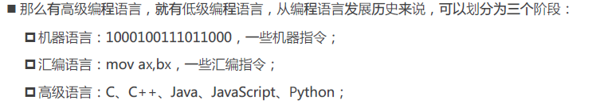

高级语言一般也分编译性语言（编译成可执行文件）和解释性语言。

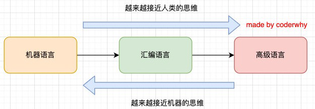

## 2. 浏览器的工作原理

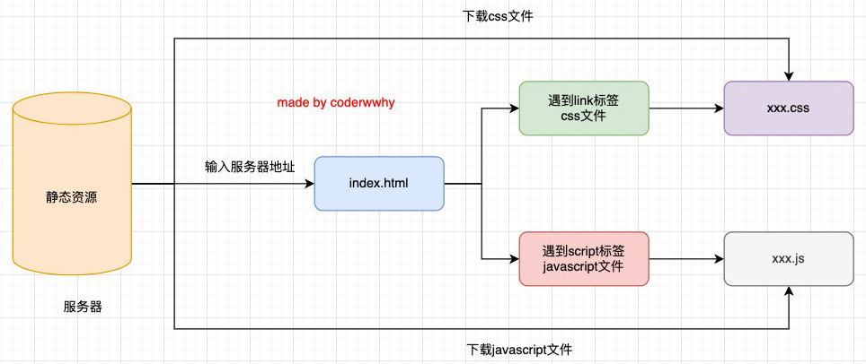

当我们输入网站域名的时候，`dns`（专门做域名解析的）会帮助我们解析成真实的IP地址，也就是服务器的地址，然后服务器会给我们返回一个`index.html`,然后浏览器会开始帮助我们解析这个html文件，然后遇到`script`和`link`标签，把相应的文件下载下来，最后浏览器渲染。

## 3. 浏览器内核

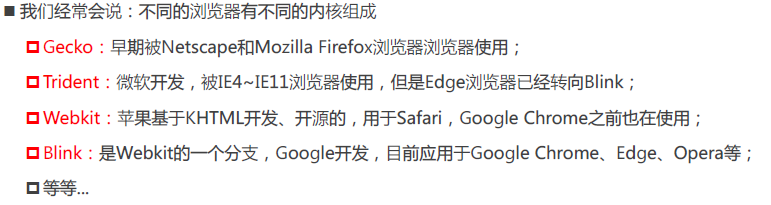

+ 事实上，我们经常说的浏览器内核指的是浏览器的排版引擎：
  + 排版引擎（layout engine），也称为浏览器引擎（browser engine）、页面渲染引擎（rendering engine）或样版引擎。

## 4. 浏览器渲染过程

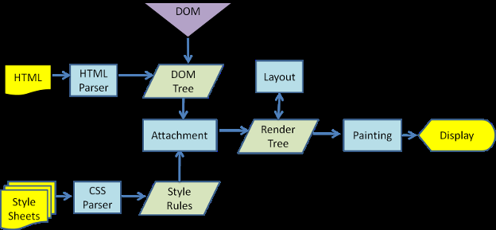

解析HTML，转成DOM树，解析CSS转成样式规则，然后合并DOM树生成一个渲染树。然后根据`Layout`布局引擎完成具体操作。然后开始绘制和展示

`Attachment`附加的意思。

## 5. JavaScript引擎

+ 高级的编程语言都是需要转成最终的机器指令来执行的；
+ 事实上我们编写的JavaScript无论你交给浏览器或者Node执行，最后都是需要被CPU执行的；
+ 但是CPU只认识自己的指令集，实际上是机器语言，才能被CPU所执行；
+ 所以我们需要JavaScript引擎帮助我们将JavaScript代码翻译成CPU指令来执行；

+ 比较常见的JavaScript引擎有哪些呢？

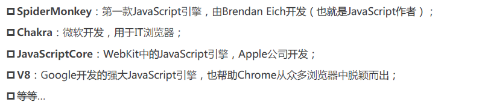

## 6. 浏览器内核和JS引擎的关系

+ 这里我们先以`WebKit`为例，`WebKit`事实上由两部分组成的：
  + `WebCore`：负责HTML解析、布局、渲染等等相关的工作；
  + `JavaScriptCore`：解析、执行JavaScript代码；

+ 小程序中编写的JavaScript代码就是被`JSCore`执行的；恰好小程序内核用的就是`pJavaScriptCore`。其渲染层就是用`IOS UIWebView`或`Andron WebView`解析wxml、wxss。

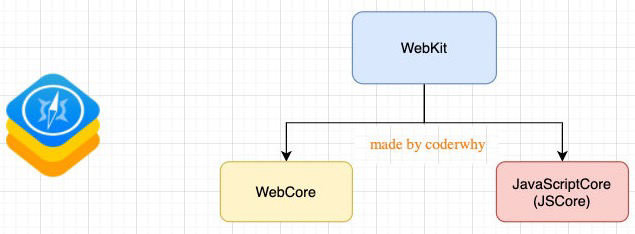

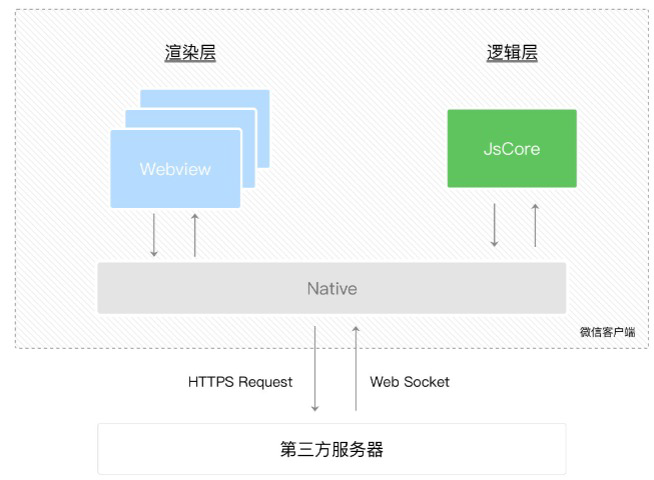

## 7. V8引擎的原理

+ V8是用C ++编写的Google开源高性能JavaScript和`WebAssembly`引擎，它用于Chrome和Node.js等。
+ 它实现ECMAScript和`WebAssembly`，并在Windows 7或更高版本，macOS 10.12+和使用x64，IA-32，ARM或MIPS处理器的Linux系统上运行。
+ V8可以独立运行，也可以嵌入到任何C ++应用程序中。

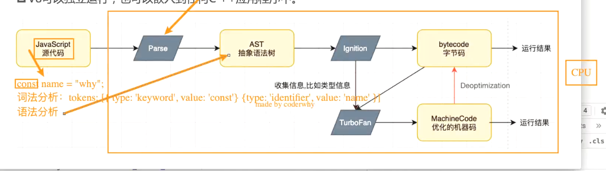

```http
asrexplorer.net
//AST 抽象语法树
```

1. parse（解析）过程
   + 词法分析：对源代码进行词法分析，生成tokens（一个对象数组）
   + 语法分析：然后根据tokens中每个对象的描述信息进行语法分析。
2. 生成抽象语法树
3. 解释器（Ignition）会将AST转换成ByteCode（字节码）
4. 字节码转成机器指令运行。


babel等也是一样，把语法生成从抽象语法树然后修改生成新的语法树，然后转义生成代码再生成`js`代码。vue中`template`也是差不多。

#### **上图为什么解释器（Ignition）最后生成字节码，而不是生成机器码?**

+ 因为我们不能保证我们的V8运行的环境（linux、mac、win等），不同环境下CPU架构执行的指令并不相同。而字节码的好处在于它是跨平台的。
+ 与AST相比，字节码更接近于机器代码，因此执行速度更快。生成字节码的过程包括对AST进行优化和转换，以生成更高效的执行代码。
+ 生成字节码而不是直接生成机器代码的好处是，字节码是一种与平台无关的中间表示形式。这意味着字节码可以在不同的平台上执行，而无需针对每个平台重新生成机器代码。这样可以提高跨平台的兼容性和灵活性。
+ 在执行阶段，V8引擎的字节码解释器会逐条解释执行字节码指令，从而完成JavaScript代码的执行。如果某个特定的代码片段被频繁执行，V8引擎还可以将其进行即时编译，将字节码转换为高效的机器代码，以进一步提高性能。

很多时候，如果不是应对面试，更多的时候JS引擎就是个黑盒子。

## 8. V8引擎的架构

+ V8引擎本身的源码非常复杂，大概有超过100w行C++代码，通过了解它的架构，我们可以知道它是如何对JavaScript执行的：
+ Parse模块会将JavaScript代码转换成AST（抽象语法树），这是因为解释器并不直接认识JavaScript代码；
  + 如果函数没有被调用，那么是不会被转换成AST的；
  + Parse的V8官方文档：https://v8.dev/blog/scanner
+ Ignition是一个解释器，会将AST转换成ByteCode（字节码）
  + 同时会收集TurboFan优化所需要的信息（比如函数参数的类型信息，有了类型才能进行真实的运算）；
  + 如果函数只调用一次，Ignition会执行解释执行ByteCode；
  + Ignition的V8官方文档：https://v8.dev/blog/ignition-interpreter
+ TurboFan是一个编译器，可以将字节码编译为CPU可以直接执行的机器码；
  + 如果一个函数被多次调用，那么就会被标记为热点函数，那么就会经过TurboFan转换成优化的机器码，提高代码的执行性能；
  + 但是，机器码实际上也会被还原为ByteCode，这是因为如果后续执行函数的过程中，类型发生了变化（比如sum函数原来执行的是number类型，后来执行变成了string类型），之前优化的机器码并不能正确的处理运算，就会逆向的转换成字节码（这一步就是Deoptimization）；
    + 从这里可以看出，我们写的ts代码由于类型不能随便变化，其执行效率会比js的高一些。
  + TurboFan的V8官方文档：https://v8.dev/blog/turbofan-jit

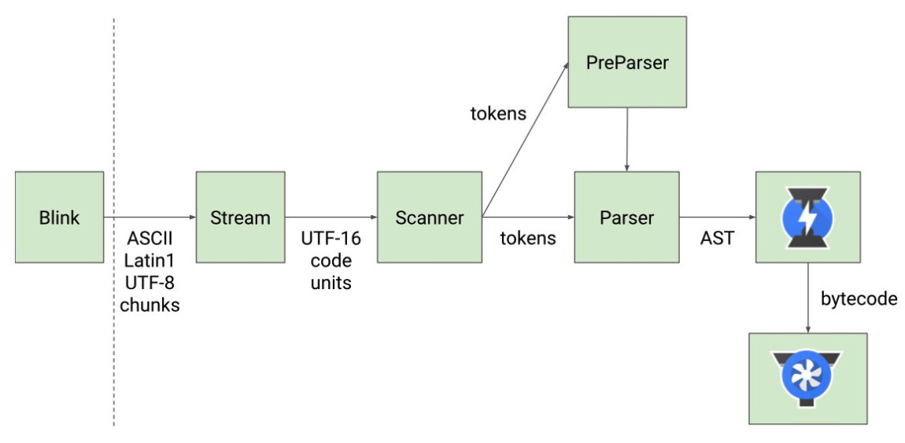

上面有小闪电其实是Ignition解析器。小风扇是CPU

Blink（内核）解析html过程中下载`js`代码，然后`js`代码以`stream`流的方式传递到V8，`Scanner`扫描器转化成许多的tokens，然后给到`Parse`模块解析转成AST树，AST再有Ignition转成字节码再交给CPU执行。

## 9. V8执行的细节

+ 那么我们的`JavaScript`源码是如何被解析（Parse过程）的呢？
+ Blink将源码交给V8引擎，Stream获取到源码并且进行编码转换
+ Scanner会进行词法分析（lexical analysis），词法分析会将代码转换成tokens；
+ 接下来tokens会被转换成AST树，经过Parser和`PreParser`：
  + Parser就是直接将tokens转成AST树架构；
  + `PreParser`称之为预解析，为什么需要预解析呢？
    + 这是因为并不是所有的JavaScript代码，在一开始时就会被执行。那么对所有的JavaScript代码进行解析，必然会影响网页的运行效率；
    + 所以V8引擎就实现了Lazy Parsing（延迟解析）的方案，它的作用是将不必要的函数进行预解析，也就是只解析暂时需要的内容，而对函数的全量解析是在函数被调用时才会进行；
    + 比如我们在一个函数outer内部定义了另外一个函数inner，那么inner函数就会进行预解析；预解析不会转成AST树，因为这里面的inner函数一开始不执行，所以没必要专门转成AST。

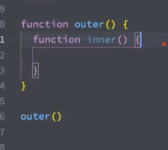

+ 生成AST树后，会被Ignition转成字节码（bytecode），之后的过程就是代码的执行过程（后续会详细分析）。 

## 10. JavaScript的执行过程

+ 假如我们有下面一段代码，它在JavaScript中是如何被执行的呢？

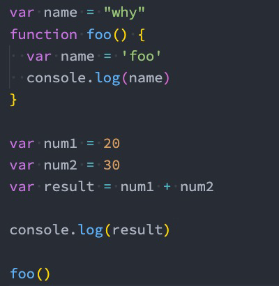

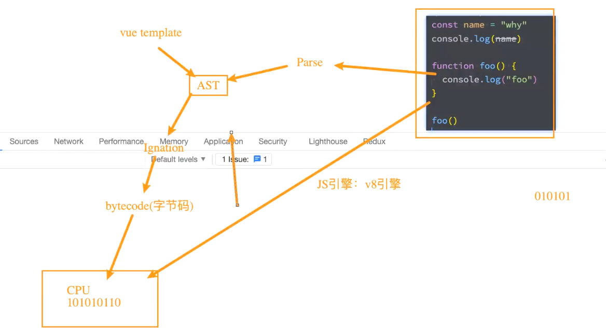

1. 在我们的代码Parse解析过程中V8引擎内部会帮助我们创建一个对象`GlobalObject`（有时叫`GO`）。这个对象包含我们浏览器或node环境下的全局对象或方法、类、函数 。其中最重要的就是全局对象的`window`属性，`window`属性的`this`指向的就是我们的当前对象本身`GlobalObject`,即指向自己。所以经常出现可以`console.log(window.window.window.window)`。其实等价于`window: globalObject`

   + 可以自己测试一下，在浏览器环境打印是一个window。在node环境下打印是一个空对象。

   + 我们执行的代码中变量也会变成各个属性被放到这个对象中。 但是这个阶段还没有赋值，此时值还是undefined。作用域提升就在`Parse`转成`AST`树的时候（代码解析成抽象树的时候产生了作用域提升）
   
   + 所以`GO`是在代码解析阶段由V8引擎创建的

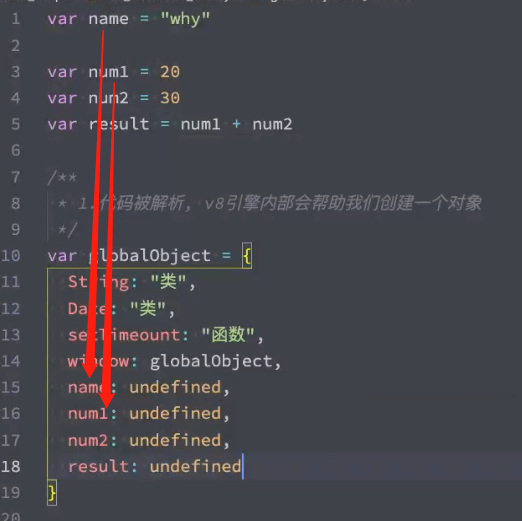

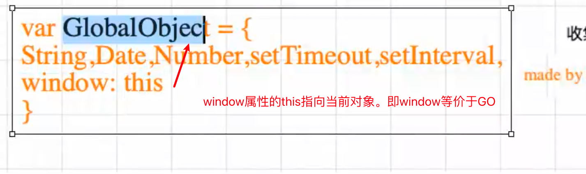

2. 运行代码
   + V8为了执行代码，V8引擎内部会有一个执行上下文栈（函数调用栈）（Excution context tasks）（ECS）
     + 其实就是把我们磁盘里的代码放入到内存中，我们的代码想要被执行之前，需要先放入到内存里面，再转成机器指令。
     + 显然能观察到执行上下文栈是用来放函数的。但是我们目前的代码没有函数。
   + 因为我们执行的是全局代码, 为了全局代码能够正常的执行, 需要创建 全局执行上下文(Global Execution Context)(全局代码需要被执行时才会创建)（一般只有一个全局执行上下文）
     + 当我们执行**全局上下文**的时候就会**放入**到我们的**执行上下文栈**里面。
     + 我们的全局上下文中维护了一个VO，不同的代码执行中可能会不一样，这里全局上下文VO则指向GO
     + 作用域提升其实就是把代码中变量函数等先放入到GO里面。

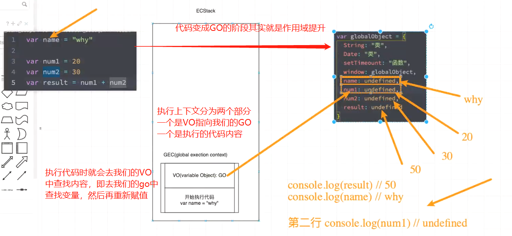

执行代码`var name = 'why'`时，到VO里查找到GO，然后找到对应变量进行赋值

#### index.html

```html
<!DOCTYPE html>
<html lang="en">
<head>
  <meta charset="UTF-8">
  <meta http-equiv="X-UA-Compatible" content="IE=edge">
  <meta name="viewport" content="width=device-width, initial-scale=1.0">
  <title>Document</title>
</head>
<body>
  <script src="./XXXX.js"></script>
</body>
</html>
```

#### 02_全局代码执行过程.js

```js
var name = "why"

console.log(num1)

var num1 = 20
var num2 = 30
var result = num1 + num2

console.log(result)

/**
 * 1.代码被解析, v8引擎内部会帮助我们创建一个对象(GlobalObject -> go)
 * 2.运行代码
 *    2.1. v8为了执行代码, v8引擎内部会有一个执行上下文栈(Execution Context Stack, ECStack)(函数调用栈)
 *    2.2. 因为我们执行的是全局代码, 为了全局代码能够正常的执行, 需要创建 全局执行上下文(Global Execution Context)(全局代码需要被执行时才会创建)
 */
var globalObject = {
  String: "类",
  Date: "类",
  setTimeount: "函数",
  window: globalObject,
  name: undefined,
  num1: undefined,
  num2: undefined,
  result: undefined
}

// console.log(window.window.window.window)
```

## 11. 初始化全局对象

+ `js`引擎会在执行代码之前，会在堆内存中创建一个全局对象：Global Object（GO）
  + 该对象所有的作用域（scope）都可以访问；
  + 里面会包含Date、Array、String、Number、setTimeout、setInterval等等；
  + 其中还有一个window属性指向自己；

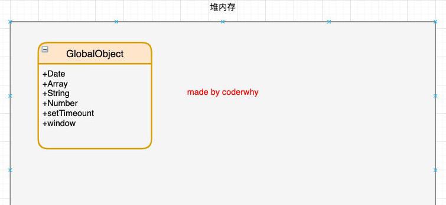

函数是一等公民

## 12. 执行上下文栈（调用栈）

+ js引擎内部有一个执行上下文栈（Execution Context Stack，简称ECS），它是用于执行代码的调用栈。
+ 那么现在它要执行谁呢？执行的是全局的代码块：
  + 全局的代码块为了执行会构建一个Global Execution Context（GEC）；
  + GEC会被放入到ECS中执行；
+ GEC被放入到ECS中里面包含两部分内容：
  + 第一部分：在代码执行前，在parser转成AST的过程中，会将全局定义的变量、函数等加入到GlobalObject中，但是并不会赋值；
    + 这个过程也称之为变量的作用域提升（hoisting）
  + 第二部分：在代码执行中，对变量赋值，或者执行其他的函数；

## 13. GEC被放入到ECS中

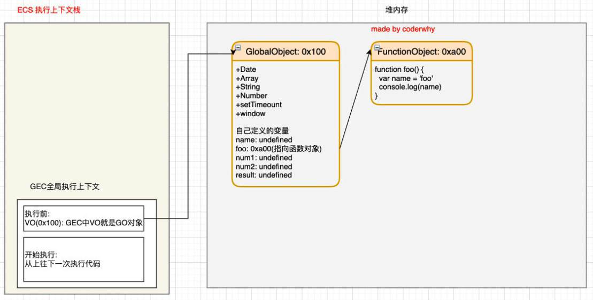

## 14. GEC开始执行代码

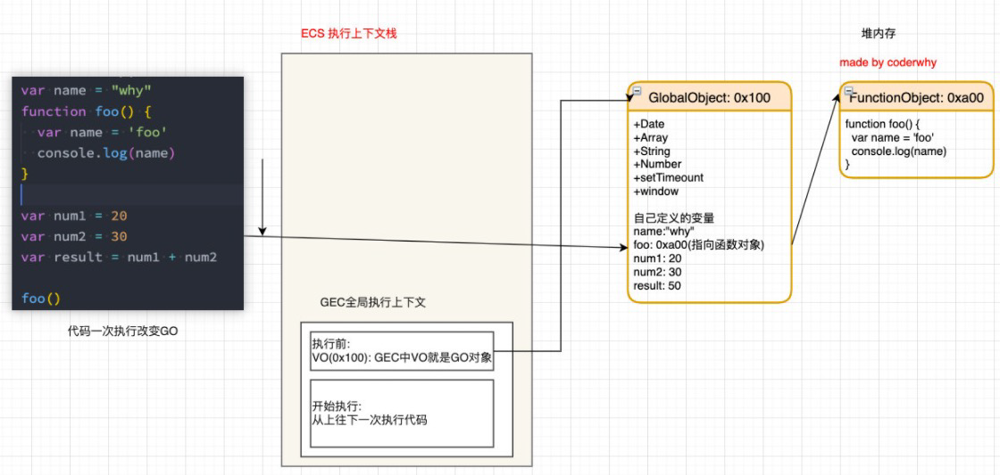

# 02. 总结

## 1. 浏览器加载网页过程？

从静态服务器下载`inde.html`然后根据`html`的`link`和`script`按顺序一点点下载其他资源。

## 2. 浏览器渲染过程？

解析HTML，转成DOM树，解析CSS转成样式规则，然后与DOM树合并生成一个渲染树。然后根据`Layout`布局引擎完成具体操作。然后开始绘制和展示

## 3. V8执行过程？


Blink（内核）解析html过程中下载`js`代码，然后`js`代码以`stream`流的方式传递到V8，`Scanner`扫描器转化成许多的tokens，然后给到`Parse`模块解析转成AST树，AST再有Ignition转成字节码再交给CPU执行。

## 4. 代码执行过程？

1. Parse解析过程，创建GO，然后把变量放入GO中。
2. 执行阶段，创建全局执行上下文（GEC），其中`GEC`属性`VO`一般指向`GO`，GEC放入到执行上下文栈（ECS）中。GEC中另一个属性保存代码，执行里面的代码。

## 4. 名词

+ 全局对象：GO

+ 执行上下文栈：ECS、ECStack，也叫函数调用栈。一般用来放函数的，

+ 全局执行上下文：GEC——项目除了函数还有其他全局代码，所以里面V8又创建了一个全局上下文栈（全局代码执行时才被创建），全局执行上下文栈会被放入到执行上下文栈，，只有一个全局执行上下文


当我们运行代码：

1. 先创建全局对象把变量名、函数名放入其中
2. 创建执行上下文栈
3. 创建全局上下文栈

## 5. 作用域提升

作用域提升往往就发生在我们把变量放入到GO里面。

## 6. 复习内容

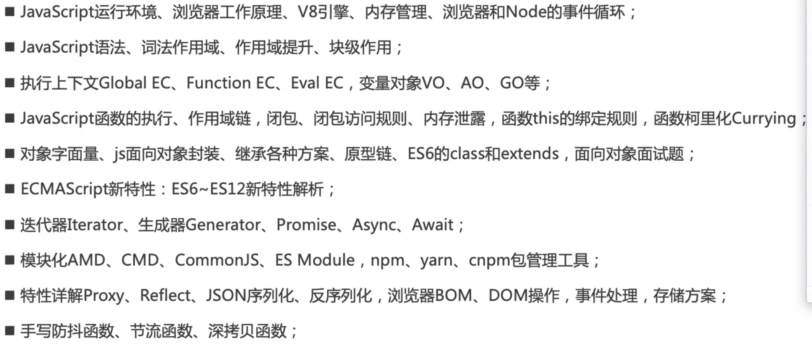


画图插件：drawio


