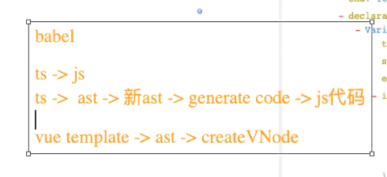

# 00. 一些概念

- **浏览器内核（Browser Engine）** 通常指 **渲染引擎（Rendering Engine）**，比如 Blink，是负责解析网页内容（HTML/CSS）并渲染可视页面的核心组件。而 **JavaScript 引擎** 是专门处理 JavaScript 代码执行的独立模块。两者共同协作，但分工明确。
  - 解析 HTML/CSS，构建 DOM/CSSOM 树，计算布局（Layout），处理渲染（Paint/Composite）
- JavaScript 引擎，常用的就是 V8
  - 编译和执行 JavaScript 代码，优化运行性能
- Blink 解析 HTML 时，遇到 `<script>` 标签会**暂停解析**，将 JavaScript 代码交给 V8 执行。
- V8 编译并执行脚本，可能修改 DOM 或样式，触发 Blink 重新渲染。

- V8 做的性能优化：
  - **JIT 编译**
    - V8 的**即时编译器**（Ignition + TurboFan）将 JavaScript 转换为高效机器码，加速脚本执行，减少 Blink 的等待时间。（相当于对已经编译的缓存）
  - **并行解析**
    - Blink 支持预加载扫描器（Preload Scanner），在 V8 执行脚本时，提前解析后续 HTML，减少阻塞。（即浏览器渲染的时候，会单独开一个线程去加载 css、js 脚本，并且在其他线程里解析 CSS，之后再合并到 DOM，以此加快解析速度）
  - **隔离上下文**
    使用 **V8 的隔离实例（Isolate）** 实现多标签页/iframe 的 JavaScript 环境隔离，确保安全性和稳定性。（SOP 同源策略，这也是为什么不能访问不同源的 iframe 内容）

# 01. 浏览器工作原理和 V8 引擎

## 1. JavaScript 是一门高级的编程语言。


高级语言一般也分编译性语言（编译成可执行文件）和解释性语言。


## 2. 浏览器的工作原理


当我们输入网站域名的时候，`dns`（专门做域名解析的）会帮助我们解析成真实的 IP 地址，也就是服务器的地址，然后服务器会给我们返回一个`index.html`,然后浏览器会开始帮助我们解析这个 html 文件，然后遇到`script`和`link`标签，把相应的文件下载下来，最后浏览器渲染。

## 3. 浏览器内核


- **事实上，我们经常说的浏览器内核指的是浏览器的排版引擎：**
  - 排版引擎（layout engine），也称为浏览器引擎（browser engine）、页面渲染引擎（rendering engine）或样版引擎。

## 4. 浏览器渲染过程


解析 HTML，转成 DOM 树，解析 CSS 转成样式规则，然后合并 DOM 树生成一个渲染树。然后根据`Layout`布局引擎完成具体操作。然后开始绘制和展示

`Attachment`附加的意思。

## 5. JavaScript 引擎

- 高级的编程语言都是需要转成最终的机器指令来执行的；
- 事实上我们编写的 JavaScript 无论你交给浏览器或者 Node 执行，最后都是需要被 CPU 执行的；
- 但是 CPU 只认识自己的指令集，实际上是机器语言，才能被 CPU 所执行；
- 所以我们需要 JavaScript 引擎帮助我们将 JavaScript 代码翻译成 CPU 指令来执行；

- 比较常见的 JavaScript 引擎有哪些呢？


## 6. 浏览器内核和 JS 引擎的关系

- 这里我们先以`WebKit`为例：

  - `WebCore（渲染引擎）`：负责 HTML 解析、布局、渲染等等相关的工作；
  - `JavaScriptCore（js引擎）`：解析、执行 JavaScript 代码；

- Blink 为例：
  - Blink：负责 HTML 解析、布局、渲染等等相关的工作；
  - V8：解析、执行 JavaScript 代码；
- 小程序中编写的 JavaScript 代码就是被`JSCore`执行的；恰好小程序内核用的就是`pJavaScriptCore`。其渲染层就是用`IOS UIWebView`或`Andron WebView`解析 wxml、wxss。


## 7. V8 引擎的原理

- V8 是用 C ++编写的 Google 开源高性能 JavaScript 和`WebAssembly`引擎，它用于 Chrome 和 Node.js 等。
- 它实现 ECMAScript 和`WebAssembly`，并在 Windows 7 或更高版本，macOS 10.12+和使用 x64，IA-32，ARM 或 MIPS 处理器的 Linux 系统上运行。（意味着 js 能够去去实现跨平台）
- V8 可以独立运行，也可以嵌入到任何 C ++应用程序中。


```http
asrexplorer.net
//AST 抽象语法树
```

1. parse（解析）过程
   - 词法分析 Scanner：对源代码进行词法分析，生成 tokens（一个对象数组）
   - 语法分析 Parse：然后根据 tokens 中每个对象的描述信息进行语法分析。
   - 这里的 Parse 指的是 Blink 传递数据、词法分析、语法分析整个阶段。
2. 生成抽象语法树（AST）
3. 解释器（Ignition）会将 AST 转换成 ByteCode（字节码）
4. 字节码转成机器指令运行。



babel 等也是一样，把语法生成从抽象语法树然后修改生成新的语法树，然后转义生成代码再生成`js`代码。vue 中`template`也是差不多。

#### **上图为什么解释器（Ignition）最后生成字节码，而不是生成机器码?**

- 因为我们不能保证我们的 V8 运行的环境（linux、mac、win 等），不同环境下 CPU 架构执行的指令并不相同。而字节码的好处在于它是跨平台的。
- 与 AST 相比，字节码更接近于机器代码，因此执行速度更快。生成字节码的过程包括对 AST 进行优化和转换，以生成更高效的执行代码。
- 生成字节码而不是直接生成机器代码的好处是，字节码是一种与平台无关的中间表示形式。这意味着字节码可以在不同的平台上执行，而无需针对每个平台重新生成机器代码。这样可以提高跨平台的兼容性和灵活性。
- 在执行阶段，V8 引擎的字节码解释器会逐条解释执行字节码指令，从而完成 JavaScript 代码的执行。如果某个特定的代码片段被频繁执行，V8 引擎还可以将其进行即时编译，将字节码转换为高效的机器代码，以进一步提高性能。

很多时候，如果不是应对面试，更多的时候 JS 引擎就是个黑盒子。

## 8. V8 引擎的架构（⾯试题：V8 引擎包括哪些部分，它们的作⽤是什么？）

- V8 引擎本身的源码非常复杂，大概有超过 100w 行 C++代码，通过了解它的架构，我们可以知道它是如何对 JavaScript 执行的：
- **Parse 模块会将 JavaScript 代码转换成 AST（抽象语法树），这是因为解释器并不直接认识 JavaScript 代码；**
  - 如果函数没有被调用，那么是不会被转换成 AST 的；
  - Parse 的 V8 官方文档：https://v8.dev/blog/scanner
- Ignition 是一个解释器，会将 AST 转换成 ByteCode（字节码）
  - 同时会收集 TurboFan 优化所需要的信息（比如函数参数的类型信息，有了类型才能进行真实的运算）；
  - 如果函数只调用一次，Ignition 会执行解释执行 ByteCode；
  - Ignition 的 V8 官方文档：https://v8.dev/blog/ignition-interpreter
- TurboFan 是一个编译器，可以将字节码编译为 CPU 可以直接执行的机器码；
  - 如果一个函数被多次调用，那么就会被标记为热点函数，那么就会经过 TurboFan 转换成优化的机器码，提高代码的执行性能；
  - 但是，机器码实际上也会被还原为 ByteCode，这是因为如果后续执行函数的过程中，类型发生了变化（比如 sum 函数原来执行的是 number 类型，后来执行变成了 string 类型），之前优化的机器码并不能正确的处理运算，就会逆向的转换成字节码（这一步就是 Deoptimization）；
    - 从这里可以看出，我们写的 ts 代码由于类型不能随便变化，其执行效率会比 js 的高一些。
  - TurboFan 的 V8 官方文档：https://v8.dev/blog/turbofan-jit


- 上面有小闪电其实是 Ignition 解析器。小风扇是 CPU

1. Blink（内核）解析 html 过程中下载`js`代码，然后`js`代码会以 chunks 的形式传给 V8 引擎中的 Stream
2. Steam 会讲不同编码的 chunks，统一专程 UTF-16 格式
3. 转化后的代码会通过 Scanner（词法分析器、扫描器） 进行词法分析，最终转成 tokens（记号化 tokenization 的缩写）
4. tokens 会进入到 Parser（语法分析器）进行语法分析（ syntactic analysis ,也叫 paring），生成 AST（抽象语法树）
5. AST 再有 Ignition 转成字节码再交给 CPU 执行。

## 9. V8 执行的细节

### 9.1 那么我们的`JavaScript`源码是如何被解析（Parse 过程）的呢？

- Blink 将源码交给 V8 引擎，Stream 获取到源码并且进行编码转换
- Scanner 会进行词法分析（lexical analysis），词法分析会将代码转换成 tokens；
- 接下来 tokens 会被转换成 AST 树，经过 Parser 和`PreParser`：
  - Parser 就是直接将 tokens 转成 AST 树架构；
  - `PreParser`称之为预解析，为什么需要预解析呢？
    - 这是因为并不是所有的 JavaScript 代码，在一开始时就会被执行。那么对所有的 JavaScript 代码进行解析，必然会影响网页的运行效率；
    - 所以 V8 引擎就实现了 Lazy Parsing（延迟解析）的方案，它的作用是将不必要的函数进行预解析，也就是只解析暂时需要的内容，而对函数的全量解析是在函数被调用时才会进行；
    - 比如我们在一个函数 outer 内部定义了另外一个函数 inner，那么 inner 函数就会进行预解析；预解析不会转成 AST 树，因为这里面的 inner 函数一开始不执行，所以没必要专门转成 AST。


- 生成 AST 树后，会被 Ignition 转成字节码（bytecode），之后的过程就是代码的执行过程（后续会详细分析）。

## 10. JavaScript 的执行过程

- 假如我们有下面一段代码，它在 JavaScript 中是如何被执行的呢？


1. 在我们的代码 Parse 解析过程中 V8 引擎内部会帮助我们创建一个对象`GlobalObject`（有时叫`GO`）。这个对象包含我们浏览器或 node 环境下的全局对象或方法、类、函数 。其中最重要的就是全局对象的`window`属性，`window`属性的`this`指向的就是我们的当前对象本身`GlobalObject`,即指向自己。所以经常出现可以`console.log(window.window.window.window)`。其实等价于`window: globalObject`

   - 可以自己测试一下，在浏览器环境打印是一个 window。在 node 环境下打印是一个空对象。

   - 我们执行的代码中变量也会变成各个属性被放到这个对象中。 但是这个阶段还没有赋值，此时值还是 undefined。作用域提升就在`Parse`转成`AST`树的时候（代码解析成抽象树的时候产生了作用域提升）

   - 所以`GO`是在代码解析阶段由 V8 引擎创建的


2. 运行代码
   - V8 为了执行代码，V8 引擎内部会有一个执行上下文栈（函数调用栈）（Excution context tasks）（ECS）
     - 其实就是把我们磁盘里的代码放入到内存中，我们的代码想要被执行之前，需要先放入到内存里面，再转成机器指令。
     - 显然能观察到执行上下文栈是用来放函数的。但是我们目前的代码没有函数。
   - 因为我们执行的是全局代码, 为了全局代码能够正常的执行, 需要创建 全局执行上下文(Global Execution Context)(全局代码需要被执行时才会创建)（一般只有一个全局执行上下文）
     - 当我们执行**全局上下文**的时候就会**放入**到我们的**执行上下文栈**里面。
     - 我们的全局上下文中维护了一个 VO，不同的代码执行中可能会不一样，这里全局上下文 VO 则指向 GO
     - 作用域提升其实就是把代码中变量函数等先放入到 GO 里面。


执行代码`var name = 'why'`时，到 VO 里查找到 GO，然后找到对应变量进行赋值

#### index.html

```html
<!DOCTYPE html>
<html lang="en">
  <head>
    <meta charset="UTF-8" />
    <meta http-equiv="X-UA-Compatible" content="IE=edge" />
    <meta name="viewport" content="width=device-width, initial-scale=1.0" />
    <title>Document</title>
  </head>
  <body>
    <script src="./XXXX.js"></script>
  </body>
</html>
```

#### 02\_全局代码执行过程.js

```js
var name = "why";

console.log(num1);

var num1 = 20;
var num2 = 30;
var result = num1 + num2;

console.log(result);

/**
 * 1.代码被解析, v8引擎内部会帮助我们创建一个对象(GlobalObject -> go)
 * 2.运行代码
 *    2.1. v8为了执行代码, v8引擎内部会有一个执行上下文栈(Execution Context Stack, ECStack)(函数调用栈)
 *    2.2. 因为我们执行的是全局代码, 为了全局代码能够正常的执行, 需要创建 全局执行上下文(Global Execution Context)(全局代码需要被执行时才会创建)
 */
var globalObject = {
  String: "类",
  Date: "类",
  setTimeount: "函数",
  window: globalObject,
  name: undefined,
  num1: undefined,
  num2: undefined,
  result: undefined,
};

// console.log(window.window.window.window)
```

## 11. 初始化全局对象

- `js`引擎会在执行代码之前，会在堆内存中创建一个全局对象：Global Object（GO）
  - 该对象所有的作用域（scope）都可以访问；
  - 里面会包含 Date、Array、String、Number、setTimeout、setInterval 等等；
  - 其中还有一个 window 属性指向自己；


函数是一等公民

```js
/**
 * 1.代码被解析, v8引擎内部会帮助我们创建一个对象(GlobalObject -> go)
 * 2.运行代码
 *    2.1. v8为了执行代码, v8引擎内部会有一个执行上下文栈(Execution Context Stack, ECStack)(函数调用栈)
 *    2.2. 因为我们执行的是全局代码, 为了全局代码能够正常的执行, 需要创建 全局执行上下文(Global Execution Context)(全局代码需要被执行时才会创建)
 */
```

## 12. 执行上下文栈（调用栈）

- js 引擎内部有一个执行上下文栈（Execution Context Stack，简称 ECS），它是用于执行代码的调用栈。
- 那么现在它要执行谁呢？执行的是全局的代码块：
  - 全局的代码块为了执行会构建一个 Global Execution Context（GEC）；
  - GEC 会被放入到 ECS 中执行；
- GEC 被放入到 ECS 中里面包含两部分内容：
  - 第一部分：在代码执行前，在 parser 转成 AST 的过程中，会将全局定义的变量、函数等加入到 GlobalObject 中，但是并不会赋值；
    - 这个过程也称之为变量的作用域提升（hoisting）
  - 第二部分：在代码执行中，对变量赋值，或者执行其他的函数；

## 13. GEC 被放入到 ECS 中


## 14. GEC 开始执行代码


# 02. 面试题

## 1. JavaScript 代码是如何被执行的？V8 引擎如何执行 JavaScript 代码？


- **解析 (Parse)：**JavaScript 代码⾸先被解析器处理，转化为抽象语法树（AST）。这是代码编译的初步阶段，主要转换代码结构为内部可进⼀步处理的格式。

- **AST：**抽象语法树（AST）是源代码的树形表示，⽤于表示程序结构。之后，AST 会被进⼀步编译成字节码。

- **Ignition：**Ignition 是 V8 的解释器，它将 AST 转换为字节码。字节码是⼀种低级的、⽐机器码更抽象的代码，它可以快速执⾏，但⽐直接的机器码慢。

- **字节码**（Bytecode）：字节码是介于源代码和机器码之间的中间表示，它为后续的优化和执⾏提供了⼀种更标准化的形式。字节码是由 Ignition ⽣成，可被直接解释执⾏，同时也是优化编译器 TurboFan 的输⼊。

- **TurboFan：**TurboFan 是 V8 的优化编译器，它接收从 Ignition ⽣成的字节码并进⾏进⼀步优化。⽐如如果⼀个函数被多次调⽤，那么就会被标记为热点函数，那么就会经过 TurboFan 转换成优化的机器码，提⾼代码的执⾏性能。当然还会包括很多其他的优化⼿段，如内联替换（Inlining）、死代码消除（Dead Code Elimination）和循环展开（Loop Unrolling）等，以提⾼代码执⾏效率。

- **机器码**：经过 TurboFan 处理后，字节码被编译成机器码，即直接运⾏在计算机硬件上的低级代码。这⼀步是将 JavaScript 代码转换成 CPU 可直接执⾏的指令，⼤⼤提⾼了执⾏速度。

- **运⾏时优化**：在代码执⾏过程中，V8 引擎会持续监控代码的执⾏情况。如果发现之前做的优化不再有效或者有更优的执⾏路径，它会触发去优化（Deoptimization）。去优化是指将已优化的代码退回到优化较少的状态，然后新编译以适应新的运⾏情况。

## 3. V8 执行过程？


Blink（内核）解析 html 过程中下载`js`代码，然后`js`代码以`stream`流的方式传递到 V8，`Scanner`扫描器转化成许多的 tokens，然后给到`Parse`模块解析转成 AST 树，AST 再有 Ignition 转成字节码再交给 CPU 执行。

## 4. 代码执行过程？

1. Parse 解析过程，创建 GO，然后把变量放入 GO 中。
2. 执行阶段，创建全局执行上下文（GEC），其中`GEC`属性`VO`一般指向`GO`，GEC 放入到执行上下文栈（ECS）中。GEC 中另一个属性保存代码，执行里面的代码。

## 4. 名词

- 全局对象：GO

- 执行上下文栈：ECS、ECStack，也叫函数调用栈。一般用来放函数的，

- 全局执行上下文：GEC——项目除了函数还有其他全局代码，所以里面 V8 又创建了一个全局上下文栈（全局代码执行时才被创建），全局执行上下文栈会被放入到执行上下文栈，，只有一个全局执行上下文

当我们运行代码：

1. 先创建全局对象把变量名、函数名放入其中
2. 创建执行上下文栈
3. 创建全局上下文栈

## 5. 作用域提升

作用域提升往往就发生在我们把变量放入到 GO 里面。

## 6. 复习内容


画图插件：drawio
