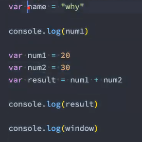
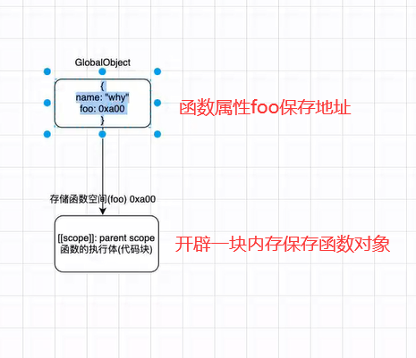
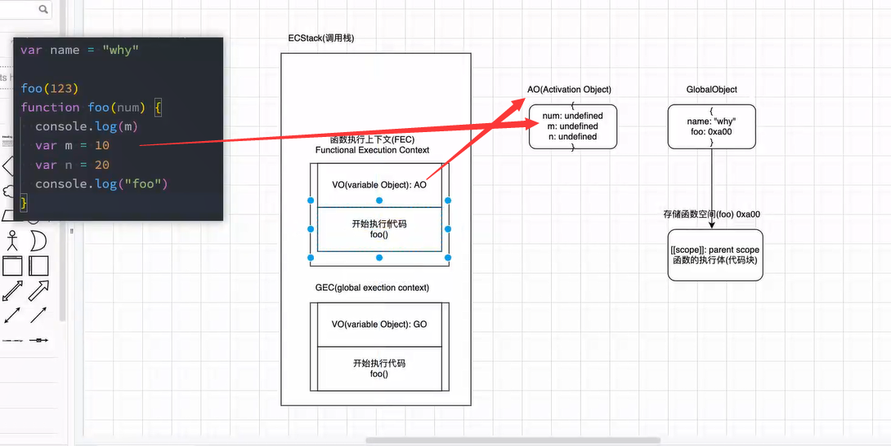

# 02. 函数执行-作用域链-面试题-内存管理



当我们打印window时，在全局上下文中会找到我们的`global object`,说明`window`指向的就是我们的`GO`,能够观察到`var`定义的变量都存放到了`window`当中。

+ 通过学习可以发现，代码在浏览器解析`Parse`成抽象语法树的过程中，变量对象等已经占据一个地址，作用域提升被存放到`GlobalObject`的过程中已经占据一个地址。在vue中data如果是一个对象，那么意味着多个组件使用同一个的时候，本身这个对象已经占据一个地址，那么多个组件修改都是修改同一个地址，会导致组件间的干扰，因此要成为一个函数，返回出不同的地址。

## 1. 遇到函数如何执行？

```js
foo()
function foo() {
    console.log("foo")
}

// 等价于
function foo() {
    console.log("foo")
}
foo()
```

在这里可以发现，函数的执行可以在任意位置，不需要在函数定义之后，区别于变量，在变量赋值之前使用打印得到的就只有`undefined`

先要注意编译和执行是两个阶段。

+ 在我们编译阶段，
  + 遇到函数的时候，会在内存中开辟一个空间（意味着会有一个地址）存放创建的函数对象。而函数的执行即`foo()`会被跳过。
  + 这个对象主要两个值，一个是父级作用域。二是函数执行体。
  + 而我们的`GlobalObject`中存放这个函数对象的地址。



+ 执行阶段

  + 当我们遇到要执行的代码时，都是在`ECStack（栈内存、调用栈、执行环境栈）`中执行，变量在全局执行上下文`GEC`中执行，函数在函数执行上下文`FEC`中执行。

  + 执行代码的时候，遇到函数执行，然后会放入到我们栈自动创建的的函数执行上下文中。
  + 此时还没有执行我们的函数，而是创建函数执行上下文的两个对象：
    + 一个是VO，指向活跃对象AO`Active Object`（执行完成后会被销毁），不同于全局上下文中VO指向的是全局对象GO。`AO`根据地址找到函数执行体，根据函数体的内容完成变量提升。`AO`主要保存函数中定义的变量，定义需要的参数。
    + 第二个对象，用于开始执行函数。
  + 当我们的函数体放入到栈的函数执行上下文中还不会马上执行，会先把我们函数体中的变量等提升到AO当中保存。
  + 最后开始执行代码
  + 执行完后函数执行上下文会弹出栈、销毁掉。
  + AO当没有东西指向的时候也会被销毁掉。
  + 如果后面又遇到`foo()`就会重复上面的操作。重新创建函数调用栈、AO...
  + 注意细节就是全局上下文是不会被销毁弹出栈的。

+ 这就是为什么函数放到定义前执行也可以顺利执行，因为函数的执行内容放到了一个单独的内存空间中。




+ 在执行的过程中执行到一个函数时，就会根据函数体创建一个函数执行上下文（Functional Execution Context，简称FEC），并且压入到EC Stack中。

+ FEC中包含三部分内容：
  + 第一部分：在解析函数成为AST树结构时，会创建一个Activation Object（AO）：
    + AO中包含形参、arguments、函数定义和指向函数对象、定义的变量；
  + 第二部分：作用域链：由VO（在函数中就是AO对象）和父级VO组成，查找时会一层层查找；
  + 第三部分：this绑定的值：这个我们后续会详细解析；


### 1. FEC被放入到ECS中


### 2. FEC开始执行代码


#### index.html

```html
<!DOCTYPE html>
<html lang="en">
<head>
  <meta charset="UTF-8">
  <meta http-equiv="X-UA-Compatible" content="IE=edge">
  <meta name="viewport" content="width=device-width, initial-scale=1.0">
  <title>Document</title>
</head>
<body>
  <script src="./XXXX.js"></script>
</body>
</html>
```

#### 03_全局代码执行过程(函数).js

```js
var name = "why"

foo(123)
function foo(num) {
  console.log(m)
  var m = 10
  var n = 20

  console.log(name)
}


console.log(aaaaaaa)


<<<<<<< HEAD
···
=======

/**
 * 1.代码被解析, v8引擎内部会帮助我们创建一个对象(GlobalObject -> go)
 * 2.运行代码
 *    2.1. v8为了执行代码, v8引擎内部会有一个执行上下文栈(Execution Context Stack, ECStack)(函数调用栈)
 *    2.2. 因为我们执行的是全局代码, 为了全局代码能够正常的执行, 需要创建 全局执行上下文(Global Execution Context)(全局代码需要被执行时才会创建)
 */
// var globalObject = {
//   String: "类",
//   Date: "类",
//   setTimeount: "函数",
//   window: globalObject,
//   name: undefined,
//   num1: undefined,
//   num2: undefined,
//   result: undefined
// }

// console.log(window.window.window.window)

// var GlobalObject = {
//   String: "类",
//   window: GlobalObject,
//   name: undefined,
//   foo: 
// }

```


## 2. 认识内存管理

+ 不管什么样的编程语言；在代码的执行过程中都是需要给它分配内存的，不同的是某些编程语言需要我们自己手动 的管理内存，某些编程语言会可以自动帮助我们管理内存：
+ 不管以什么样的方式来管理内存，内存的管理都会有如下的生命周期：
  + 第一步：分配申请你需要的内存（申请）；
  + 第二步：使用分配的内存（存放一些东西，比如对象等）；
  + 第三步：不需要使用时，对其进行释放；
+ 不同的编程语言对于第一步和第三步会有不同的实现：
  + 手动管理内存：比如C、C++，包括早期的OC，都是需要手动来管理内存的申请和释放的（malloc和free函 数）；
  + 自动管理内存：比如Java、JavaScript、Python、Swift、Dart等，它们有自动帮助我们管理内存；
+ 我们可以知道JavaScript通常情况下是不需要手动来管理的。

### 1. JS的内存管理

+ JavaScript会在定义变量时为我们分配内存。
+ JS对于基本数据类型内存的分配会在执行时， 直接在栈空间进行分配；
+ JS对于复杂数据类型内存的分配会在堆内存 中开辟一块空间，并且将这块空间的指针返 回值变量引用；


### 2. JS的垃圾回收

+ 因为内存的大小是有限的，所以当内存不再需要的时候，我们需要对其进行释放，以便腾出更多的内存空间。
+ 在手动管理内存的语言中，我们需要通过一些方式自己来释放不再需要的内存，比如free函数：
  + 但是这种管理的方式其实非常的低效，影响我们编写逻辑的代码的效率；
  + 并且这种方式对开发者的要求也很高，并且一不小心就会产生内存泄露；
+ 所以大部分现代的编程语言都是有自己的垃圾回收机制：
  + 垃圾回收的英文是Garbage Collection，简称GC；
  + 对于那些不再使用的对象，我们都称之为是垃圾，它需要被回收，以释放更多的内存空间；
  + 而我们的语言运行环境，比如Java的运行环境JVM，JavaScript的运行环境js引擎都会内存 垃圾回收器；
  + 垃圾回收器我们也会简称为GC，所以在很多地方你看到GC其实指的是垃圾回收器；
+ 但是这里又出现了另外一个很关键的问题：GC怎么知道哪些对象是不再使用的呢？
  + 这里就要用到GC的算法了

### 3. 常见的GC算法 - 引用计数

+ 引用计数：
  + 当一个对象有一个引用指向它时，那么这个对象的引用就+1，当一个对象的引用为0时，这个对象就可以被销 毁掉；
  + 这个算法有一个很大的弊端就是会产生循环引用；


### 4. 常见的GC算法 - 标记清除

+ 标记清除：
  + 这个算法是设置一个根对象（root object），垃圾回收器会定期从这个根开始，找所有从根开始有引用到的对象，对 于哪些没有引用到的对象，就认为是不可用的对象；
  + 这个算法可以很好的解决循环引用的问题；

