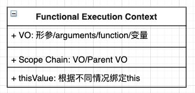
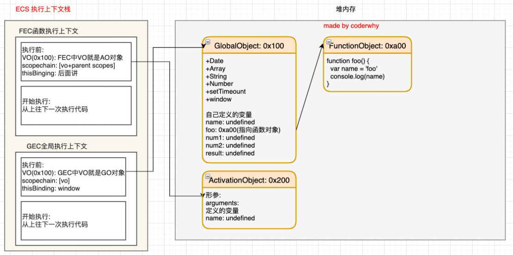

# 02. 函数执行-作用域链-面试题-内存管理

## 1. 遇到函数如何执行？

+ 在执行的过程中执行到一个函数时，就会根据函数体创建一个函数执行上下文（Functional Execution Context，简称FEC），并且压入到EC Stack中。

+ FEC中包含三部分内容：
  + 第一部分：在解析函数成为AST树结构时，会创建一个Activation Object（AO）：
    + AO中包含形参、arguments、函数定义和指向函数对象、定义的变量；
  + 第二部分：作用域链：由VO（在函数中就是AO对象）和父级VO组成，查找时会一层层查找；
  + 第三部分：this绑定的值：这个我们后续会详细解析；



### 1. FEC被放入到ECS中



### 2. FEC开始执行代码


#### index.html

```html
<!DOCTYPE html>
<html lang="en">
<head>
  <meta charset="UTF-8">
  <meta http-equiv="X-UA-Compatible" content="IE=edge">
  <meta name="viewport" content="width=device-width, initial-scale=1.0">
  <title>Document</title>
</head>
<body>
  <script src="./XXXX.js"></script>
</body>
</html>
```

#### 03_全局代码执行过程(函数).js

```js
var name = "why"

foo(123)
function foo(num) {
  console.log(m)
  var m = 10
  var n = 20

  console.log(name)
}


console.log(aaaaaaa)


<<<<<<< HEAD
···
=======

/**
 * 1.代码被解析, v8引擎内部会帮助我们创建一个对象(GlobalObject -> go)
 * 2.运行代码
 *    2.1. v8为了执行代码, v8引擎内部会有一个执行上下文栈(Execution Context Stack, ECStack)(函数调用栈)
 *    2.2. 因为我们执行的是全局代码, 为了全局代码能够正常的执行, 需要创建 全局执行上下文(Global Execution Context)(全局代码需要被执行时才会创建)
 */
// var globalObject = {
//   String: "类",
//   Date: "类",
//   setTimeount: "函数",
//   window: globalObject,
//   name: undefined,
//   num1: undefined,
//   num2: undefined,
//   result: undefined
// }

// console.log(window.window.window.window)

// var GlobalObject = {
//   String: "类",
//   window: GlobalObject,
//   name: undefined,
//   foo: 
// }

```
