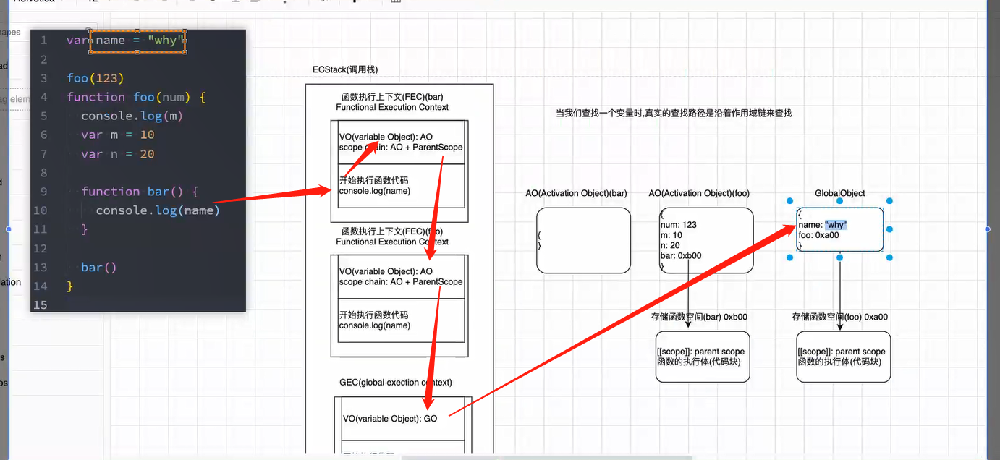
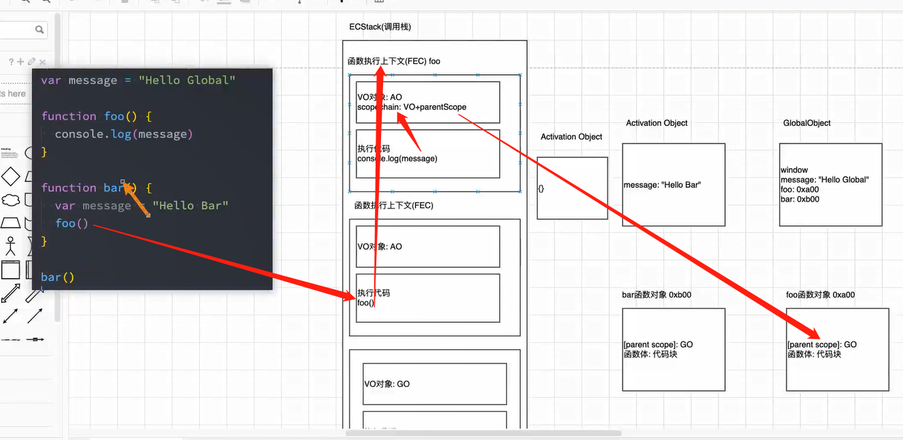
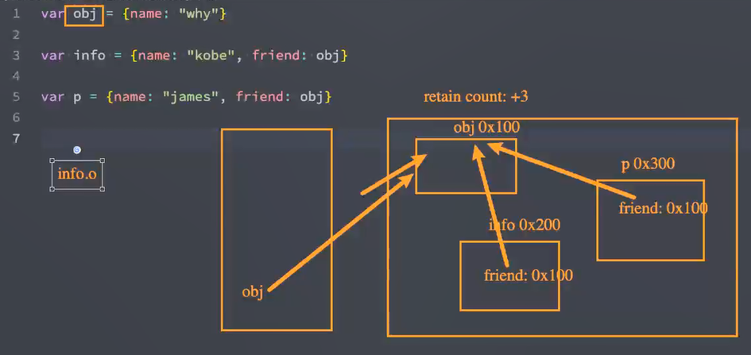
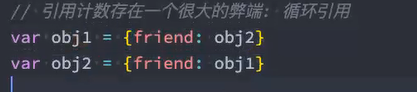

# 02. 函数执行-作用域链-面试题-内存管理


当我们打印 window 时，在全局上下文中会找到我们的`global object`,说明`window`指向的就是我们的`GO`,能够观察到`var`定义的变量都存放到了`window`当中。

- 通过学习可以发现，代码在浏览器解析`Parse`成抽象语法树的过程中，变量对象等已经占据一个地址，作用域提升被存放到`GlobalObject`的过程中已经占据一个地址。
- 在 vue2 中 data 是一个函数。 在 vue 中一个组件可能会被其他的组件引用，为了防止多个组件实例对象之间共用一个 data（即同一个地址），产生数据污染。将 data 定义成一个函数，每个组件实例都有自己的作用域，每个实例相互独立。
- vue3 的话使用 setup 本身返回的就是一个新对象

## 1. 遇到函数如何执行？

```js
foo();
function foo() {
  console.log("foo");
}

// 等价于
function foo() {
  console.log("foo");
}
foo();
```

在这里可以发现，函数的执行可以在任意位置，不需要在函数定义之后，区别于变量，在变量赋值之前使用打印得到的就只有`undefined`

要注意编译、执行前、执行是不同阶段。

- 在我们编译阶段，
  - 遇到函数的时候，会在内存中开辟一个空间（意味着会有一个地址）存放创建的函数对象。而函数的执行即`foo()`会被跳过。
  - 这个对象主要两个值，一个是父级作用域。二是函数执行体。
  - 而我们的`GlobalObject`中存放这个函数对象的地址。这就是为什么执行阶段，函数可以在任意位置执行，因为编译阶段的时候保存了函数体


- 执行阶段

  - 当我们遇到要执行的代码时，`ECStack（栈内存、调用栈、执行环境栈）`创建全局执行上下文`GEC`，函数在函数执行上下文`FEC`中执行。
  - GEC 保存 GO 和执行全局代码
  - 执行代码的时候，遇到函数执行，然后会放入到我们栈自动创建的的函数执行上下文中。
  - 此时还没有执行我们的函数，而是创建函数执行上下文的两个属性：
    - 一个是 VO，指向活跃对象 AO`Active Object`（执行完成后会被销毁），不同于全局上下文中 VO 指向的是全局对象 GO。`AO`根据地址找到函数执行体，根据函数体的内容完成变量提升。`AO`主要保存函数中定义的变量，定义需要的参数。
    - 第二个对象，用于开始执行函数。
  - 当我们的函数体放入到栈的函数执行上下文中还不会马上执行，会先把我们函数体中的变量等提升到 AO 当中保存。
  - 最后开始执行代码
  - 执行完后函数执行上下文会弹出栈、销毁掉。
  - AO 当没有东西指向的时候也会被销毁掉。
  - 如果后面又遇到`foo()`就会重复上面的操作。重新创建函数调用栈、AO...
  - 注意细节就是全局上下文是不会被销毁弹出栈的。

- 这就是为什么函数放到定义前执行也可以顺利执行，因为函数的执行内容放到了一个单独的内存空间中。


## 2. FEC 被放入到 ECS 中


```js

```

## 3. JS 变量查找规则

```js
var name = "why";

foo(123);
function foo(num) {
  console.log(m);
  var m = 10;
  var n = 20;

  console.log(name);
}

// 打印结果 undefined、why
```

当我们查找一个变量时，真实的查找路径是沿着作用域链来查找。

1. 在我们编译一个函数时，会定义到`Golbal Object`中，并且赋值上函数体存储函数空间地址。里面主要保存了函数体与`[[scope]]: parent scope`父级作用域，这==意味着函数的作用域在编译阶段就被确定了==。

2. 在执行的过程中执行到一个函数时，就会根据函数体创建一个函数执行上下文（Functional Execution Context，简称 FEC），并且压入到 EC Stack 中。

- FEC（函数执行上下文）中包含三部分内容：
  - 第一部分：在解析函数成为 AST 树结构时，会创建一个 Activation Object（AO）：
    - AO 中包含形参、arguments、函数定义和指向函数对象、定义的变量；
  - 第二部分：作用域链`Scope Chain`：由 VO（在函数中就是 AO 对象）和父级 VO 组成，查找时会一层层查找；
  - 第三部分：this 绑定的值：这个我们后续会详细解析；会在运行时绑定。


```js
var name = 'why'

foo(123)
function foo(num) {
    console.log(m)
    var m = 10
    var n =20

    function bar() {
        console.log(name) ..
    }

    bar()
}
```

当我们开始执行 foo(123)的时候就会创建函数执行上下文，然后依次创建 AO 等等，执行到`bar()`的时候，又会在调用栈中放入一个新的关于 bar 的函数执行上下文，而`foo`没有执行完并没有被销毁。这说明每一个新的函数执行都会创建自己的函数执行上下文。

查找变量的时候就会沿着作用域链一层层父级查找。



注意细节，浏览器本身有 name 属性， 而且不同版本处理不太一样。

## 4. 函数调用函数执行过程

```js
var message = "Hello Global";

function foo() {
  console.log(message);
}

function bar() {
  var message = "Hello bar";
  foo();
}

bar(); // Hello Global
```

其实注意两点就行，第一：==编译过程中就确定了函数的作用域，显然与函数定于的位置有关系，与执行的位置没有关系==。第二：编译过程总会跳过函数执行即跳过`foo()`。



执行`foo()`的时候就会创建它的函数执行上下文，然后根据作用域链找到编译阶段就创建好的父级作用域。

## 5. 函数的 AO 对象是编译阶段创建

函数编译阶段创建 AO，到了执行阶段才会知道函数体里面具体的内容。具体还是要看代码，函数也有可以是在函数体里定义的。

var 的话不会生成作用域。

## 6. 环境变量和记录

- 上面讲解都是基于早期的 ECMA 的版本规范：
  - 每一个执行上下文会被关联到一个变量对象（variable object， VO）,在源代码中的变量和函数声明会被作为属性添加到`VO`中
  - 对于函数来说， 参数也会被添加到 VO 中。
- GEC（global excution context）全局执行上下文：执行全局代码
- FEC（functional excution context）函数执行上下文：执行函数代码
- 最新的 ECMA 的版本规范中：
  - 每一个执行上下文会被关联到一个变量环境（Variable Environment）中，在执行代码中变量和函数的声明会被作为环境记录（Environment Record， VE）添加到变量环境中。
  - 对于函数来说，参数也会被作为环境记录到变量环境中。
  - 把之前的变量对象改成了变量环境，更加宽泛，意味着我们变量环境并不一定是一个对象，可以是一个 Map 对象、链表等等根据引擎来决定。
- 总结：VO 这个名称改成了 VE。

## 7. 面试题

```js
var n = 100;
function foo() {
  n = 200;
}
foo();
console.log(n); //200
```

执行`foo()`的时候，注意函数中的`n`并没有进行定义，所以会去作用域链里查找最近的定义`n`的地方，最后找到全局的`n`。所以执行`n=200`会直接改变原理的`n`。最终 打印的就是`200`

```js
function foo() {
  console.log(n); // undefiend
  var n = 200;
  console.log(n); // 200
}

var n = 100;
foo();
```

执行阶段，函数执行上下文指向的变量环境`VE`或变量对象`VO`中定义了`n`此时为 undefined ，所以一开始打印为 undefined。之后执行赋值，所以打印 200。因为函数中有定义`n`所以不会再向上查找，所以和`GO`中的`n`无关。

**注意函数执行的时候才会创建函数执行上下文。之后才会访问函数体，创建 VO。**

```js
var n = 100;

function foo1() {
  console.log(n); // 100
}

function foo2() {
  var n = 200;
  console.log(n); // 200
  foo1();
}

foo2();
console.log(n); // 100
```

```js
var a = 100;

function foo() {
  console.log(a); // undefined
  return;
  // 这里考察的就是解析阶段变量提升
  var a = 200;
}

foo();
```

我们再创建 VO 的时候是不关心定义是否在函数体后面的。所以 VO 在执行函数前就有变量`a`初始值为 undefined。

```js
function foo() {
  var m = 100;
}
foo();
console.log(m); // m is not defined
```

`m`是定义在`foo`里面，所以 GO 中找不到`m`直接报错

在函数执行完的时候函数执行上下文会被销毁掉，但不会销毁到在 GO 中定义的 foo 对象。这里就能理解为什么函数是一个对象。

```js
function foo() {
  m = 100;
}

foo();
console.log(m); // 100
```

没有直接定义就赋值比较特殊要看你的 JS 引擎怎么执行。

没有直接定义`m`则意味着定义到全局，所以打印结果是 100

```js
function foo() {
  var a = (b = 10);
  // => 转成下面的两行代码
  // var a = 10
  // b = 10
}

foo();

console.log(a); // 未定义
console.log(b); // 10
```

```js
// 加入函数和变量命名相同会怎样？
// 编译阶段JavaScript 的变量提升（hoisting）机制，函数声明会被提升到作用域顶部。所以一开始z为函数。执行代码阶段，z已经被赋值为空对象，所以执行过程中z为{}
var z = {};

function z() {
  console.log(11);
  return 1;
}

console.log(z());
```

## 8. 总结

- 编译过程中就确定了函数的作用域，显然与函数定于的位置有关系，与执行的位置没有关系
- 编译阶段完成变量提升

# 02. 认识内存管理

- 不管什么样的编程语言；在代码的执行过程中都是需要给它分配内存的，不同的是某些编程语言需要我们自己手动 的管理内存，某些编程语言会可以自动帮助我们管理内存：
- 不管以什么样的方式来管理内存，内存的管理都会有如下的生命周期：
  - 第一步：分配申请你需要的内存（申请）；
  - 第二步：使用分配的内存（存放一些东西，比如对象等）；
  - 第三步：不需要使用时，对其进行释放；
- 不同的编程语言对于第一步和第三步会有不同的实现：
  - 手动管理内存：比如 C、C++，包括早期的 OC，都是需要手动来管理内存的申请和释放的（malloc 和 free 函 数）；
  - 自动管理内存：比如 Java、JavaScript、Python、Swift、Dart 等，它们有自动帮助我们管理内存；
- 我们可以知道 JavaScript 通常情况下是不需要手动来管理的。

## 2. JS 的内存管理

- JavaScript 会在定义变量时为我们分配内存。基本的数据类型，会放入到栈空间，复杂的数据类型会放入到堆空间然后把保存地址返回给栈，让栈保存地址。（栈内存可以理解成内存条，堆内存可以理解成磁盘）
- JS 对于基本数据类型内存的分配会在执行时， 直接在栈空间进行分配；
- JS 对于复杂数据类型内存的分配会在堆内存中开辟一块空间，并且将这块空间的指针返回值给变量；（C 语言我们把堆中保存数据的地址，js 和 java 称之为引用）

## 3. JS 的垃圾回收

- 因为内存的大小是有限的，所以当内存不再需要的时候，我们需要对其进行释放，以便腾出更多的内存空间。
- 在手动管理内存的语言中，我们需要通过一些方式自己来释放不再需要的内存，比如 free 函数：
  - 但是这种管理的方式其实非常的低效，影响我们编写逻辑的代码的效率；
  - 并且这种方式对开发者的要求也很高，并且一不小心就会产生内存泄露；
- 所以大部分现代的编程语言都是有自己的垃圾回收机制：
  - **垃圾回收的英文是 Garbage Collection，简称 GC；**
  - 对于那些不再使用的对象，我们都称之为是垃圾，它需要被回收，以释放更多的内存空间；
  - 而我们的语言运行环境，比如 Java 的运行环境 JVM，JavaScript 的运行环境 js 引擎都会内存垃圾回收器；
  - 垃圾回收器我们也会简称为 GC，所以在很多地方你看到 GC 其实指的是垃圾回收器；
- ⾃动垃圾回收提⾼了开发效率，使开发者可以更多地关注业务逻辑的实现⽽⾮内存管理的细节。
- 但是这里又出现了另外一个很关键的问题：GC 怎么知道哪些对象是不再使用的呢？
  - 这里就要用到 GC 的算法了

## 4. 常见的 GC 算法 - 引用计数

- 引用计数：
  - 当一个对象有一个引用指向它时，那么这个对象的引用就+1，当一个对象的引用为 0 时，这个对象就可以被销毁掉；
  - 这个算法有一个很大的弊端就是会产生循环引用；通过⼀些⽅案，⽐如弱引⽤来解决（WeakMap 就是弱引⽤）；





上面就是循环引用，互相嵌套。

## 5. 常见的 GC 算法 - 标记清除

- 标记清除：

  - 标记清除的核⼼思路是可达性（Reachability）

  * 这个算法是设置一个根对象（root object），垃圾回收器会定期从这个根开始，找所有从根开始有引用到的对象，对 于哪些没有引用到的对象，就认为是不可用的对象；
  * 在这个阶段，垃圾回收器标记所有可达的对象，之后，垃圾回收器遍历所有的对象，收集那些在标记阶段未被标记为可达的对象。
  * 这个算法可以很好的解决循环引用的问题；

## 6. 其他算法

JS 引擎⽐较⼴泛的采⽤的就是可达性中的标记清除算法，当然类似于 V8 引擎为了进⾏更好的优化，它在算法的实现细节上也会结合⼀些其他的算法。

- 标记整理（Mark-Compact）：类似标记-清除，主要清理碎片，回收期间同时对保留的存储对象搬运且汇集到一块连续的内存空间，从而整理空闲空间，避免内存碎片化

- 分代收集（Generational collection）：本质上降低对常用的对象的检测频率。将对象进行分组，新对象出现，完成工作可能很快就没用了，而老对象可能长期存活，减少对他检测频次。

  - 对象被分成两组：“新的”和“旧的”。
  - 许多对象出现，完成它们的⼯作并很快死去，它们可以很快被清理；
  - 那些⻓期存活的对象会变得“⽼旧”，⽽且被检查的频次也会减少；

  * 在 V8 内存图里，可以看到有一个 New Space 和 Old Space 就是用作分代搜集。

- 增量搜集（Incremental collection）：

  - 如果有许多对象，并且我们试图⼀次遍历并标记整个对象集，则可能需要⼀些时间，并在执⾏过程中带来明显的延迟。

  - 所以引擎试图将垃圾收集⼯作分成⼏部分来做，然后将这⼏部分会逐⼀进⾏处理，这样会有许多微⼩的延迟⽽不是⼀个⼤的延迟；

  - 可以理解成拆分垃圾回收执行任务。

- 闲时搜集（Idle-time collection）：垃圾回收只会在 CPU 空闲尝试运行，减少对代码执行的影响。

## 7. V8 内存图


事实上，V8 引擎为了提供内存的管理效率，对内存进⾏⾮常详细的划分：

**新⽣代空间 (New Space / Young Generation)**

- 作⽤：主要⽤于存放⽣命周期短的⼩对象。这部分空间较⼩，但对象的创建和销毁都⾮常频繁。

- 组成：新⽣代内存被分为两个半空间：From Space 和 To Space。

  - 初始时，对象被分配到 From Space 中。

  - 使⽤复制算法（Copying Garbage Collection）进⾏垃圾回收。

  - 当进⾏垃圾回收时，活动的对象（即仍然被引⽤的对象）被复制到 To Space 中，⽽⾮活动的对象（不再被引⽤的对象）被丢弃。

  - 完成复制后，From Space 和 To Space 的⻆⾊互换，新的对象将分配到新的 From Space 中，原 ToSpace 成为新的 From Space。

**⽼⽣代空间 (Old Space / Old Generation)**

- 作⽤：存放⽣命周期⻓或从新⽣代晋升过来的对象。
- 当对象在新⽣代中经历了⼀定数的垃圾回收周期后（通常是⼀到两次），且仍然存活，它们被认为是⽣命周期较⻓的对象。
- 分为三个主要区域：

  - ⽼指针空间 (Old Pointer Space)：主要存放包含指向其他对象的指针的对象。

- ⽼数据空间 (Old Data Space)：⽤于存放只包含原始数据（如数值、字符串）的对象，不含指向其他对象的指针。

**⼤对象空间 (Large Object Space)：**

- ⽤于存放⼤对象，如超过新⽣代⼤⼩限制的数组或对象。

* 这些对象直接在⼤对象空间中分配，避免在新⽣代和⽼⽣代之间的复制操作。

**代码空间 (Code Space) ：**存放编译后的函数代码。

**单元空间 (Cell Space)：**⽤于存放⼩的数据结构如闭包的变环境。

**属性单元空间 (Property Cell Space)：**存放对象的属性值

- 主要针对全局变或者属性值，对于访问频繁的全局变或者属性值来说，V8 在这⾥存储是为了提⾼它的访问效率。

**映射空间 (Map Space)：**存放对象的映射（即对象的类型信息，描述对象的结构）。

- 当你定义⼀个 Person 构造函数时，可以通过它创建出来 person1 和 person2。

- 这些实例（person1 和 person2）本身存储在堆内存的相应空间中，具体是新⽣代还是⽼⽣代取决于它们的⽣命周期和⼤⼩。

- 每个实例都会持有⼀个指向其映射的指针，这个映射指明了如何访问 name 和 age 属性（⽬的是访问属性效果变⾼）。

**堆内存 (Heap Memory) 与 栈 (Stack)：**

- 堆内存：JavaScript 对象、字符串等数据存放的区域，按照上述分类进⾏管理。

- 栈：⽤于存放执⾏上下⽂中的变量、函数调⽤的返回地址（继续执⾏哪⾥的代码）等，栈有助于跟踪函数调⽤的顺序和局部变量。

## 8. 总结

- 基本的数据类型，会放入到栈空间，复杂的数据类型会放入到堆空间然后把保存地址返回给栈，让栈保存地址

- 垃圾回收算法常见引用计数和标记清除。
  - 引用计数，每次被引用到计数加一，为零清除，但是容易循环引用导致重复计数
  - 标记清除，定期从根查找，发现那些没有被用到的，就清除（JS 引擎广泛采用，同时会用其他算法配合优化）

## 9. 面试题

### 1. **什么是垃圾回收机制？并且它是如何在现代编程语⾔中管理内存的？**

虽然随着硬件的发展，⽬前计算机的内存已经⾜够⼤，但是随着任务的增多依然可能会⾯临内存紧缺的问题，因此管理内存依然⾮常要。（前提）

垃圾回收（Garbage Collection, GC）是⾃动内存管理的⼀种机制，它帮助程序⾃动释放不再使⽤的内存。在不需要⼿动释放内存的现代编程语⾔中，垃圾回收机制扮演着⾮常重要的⻆⾊，通过⾃动识别和清除“垃圾”数据来防⽌内存泄漏，从⽽管理内存资源。（作⽤）

在运⾏时，垃圾回收机制主要通过追踪每个对象的⽣命周期来⼯作。（原理）

- 对象通常在它们不再被程序的任何部分引⽤时被视为垃圾。

- ⼀旦这些对象被识别，垃圾回收器将⾃动回收它们占⽤的内存空间，使这部分内存可以新被分配和使⽤。

垃圾回收机制有⼏种不同的实现⽅法，最常⻅的包括（实现，可以先回答⼏种，表示你对 GC 的理解，等下再回答 V8 的内容）：

- **引⽤计数**：每个对象都有⼀个与之关联的计数器，记录引⽤该对象的次数。当引⽤计数变为零时，意味着没有任何引⽤指向该对象，因此可以安全地回收其内存。

- **标记-清除**：这种⽅法通过从根对象集合开始，标记所有可达的对象。所有未被标记的对象都被视为垃圾，并将被清除。

- **标记-整理**：与标记-清除相似，但在清除阶段，它还会移动存活的对象，以减少内存碎⽚。

### 2. **V8 引擎的垃圾回收机制具体是如何⼯作的？**

V8 引擎使⽤了⼀种⾼度优化的垃圾回收机制来管理内存采⽤了标记-清除、标记整理，同时⼜结合了多种策略来实现⾼效的内存管理，包括结合了分代回收（Generational Collection）和增回收（Incremental Collection）等多种策略。

- **分代回收**：V8 将对象分为“新⽣代”和“⽼⽣代”。新⽣代存放⽣命周期短的⼩对象，使⽤⾼效的复制式垃圾回收算法；⽽⽼⽣代存放⽣命周期⻓或从新⽣代晋升⽽来的对象，使⽤标记-清除或标记-整理算法。这种分代策略减少了垃圾回收的总体开销，尤其是针对短命对象的快速回收。

- **增量回收**：为了减少垃圾回收过程中的停顿时间，V8 实现了增量回收。这意味着垃圾回收过程被分解为许多⼩步骤，这些⼩步骤穿插在应⽤程序的执⾏过程中进⾏。这有助于避免⻓时间的停顿，改善了应⽤程序的响应性和性能。

- **延迟清理和空闲时间收集**：V8 还尝试在 CPU 空闲时进⾏垃圾回收，以进⼀步减少对程序执⾏的影响。

这些技术的结合使得 V8 能够在执⾏ JavaScript 代码时有效地管理内存，同时最⼩化垃圾回收对性能的影响。

（另外可以结合 V8 内存图来表现出你对 V8 内存的深⼊理解）

### 3. **JavaScript 有哪些操作可能引起内存泄漏？如何在开发中避免？（性能优化）**

在 JavaScript 中，内存泄漏通常是指程序中已经不再需要使⽤的内存，由于某些原因未被垃圾回收器回收，从⽽导致可⽤内存逐渐减少。

这些内存泄漏通常是由不当的编程实践引起的，常⻅的引起内存泄漏的操作有如下情况：

- **全局变量滥⽤**：创建的全局变量（例如，忘记使⽤ var , let , 或 const 声明变量）可能会导致这些变量不被回收。

- **未清理的定时器和回调函数**：⽐如使⽤ setInterval 在不适⽤时没有及时清除，阻⽌它们被回收。

* **闭包**：闭包可以维持对外部函数作⽤域的引⽤，如果这些闭包⼀直存活，它们引⽤的外部作⽤域（及其变量）也⽆法被回收。

* **DOM** **引⽤**：JavaScript 对象持有已从 DOM 中删除的元素的引⽤，这会阻⽌这些 DOM 元素的内存被释放。

* **监听器的回调**：在使⽤完毕后没有从 DOM 元素上移除事件监听器，这可能导致内存泄漏。

开发中如何避免呢？重要的是平时在开发中就要尽量按照规范来编写代码。

+ **使⽤局部变量**：尽量使⽤局部变量，避免⽆限制地使⽤全局变量。

+ **及时清理**：使⽤ clearInterval 或 clearTimeout 取消不再需要的定时器。

+ **优化闭包的使⽤**：理解闭包和它们的⼯作⽅式。只保留必要的数据在闭包中，避免循环引⽤。

+ **谨慎操作** **DOM** **引⽤**：当从 DOM 中移除元素时，确保删除所有相关的 JavaScript 引⽤。包括 DOM 元素监听器的移除。

+ **⼯具和检测**：利⽤浏览器的开发者⼯具进⾏性能分析和内存分析。

+ **代码审查**：定期进⾏代码审查，关注那些可能导致内存泄漏的编程实践，⽐如对全局变量的使⽤、事件监听器的添加与移除等。
