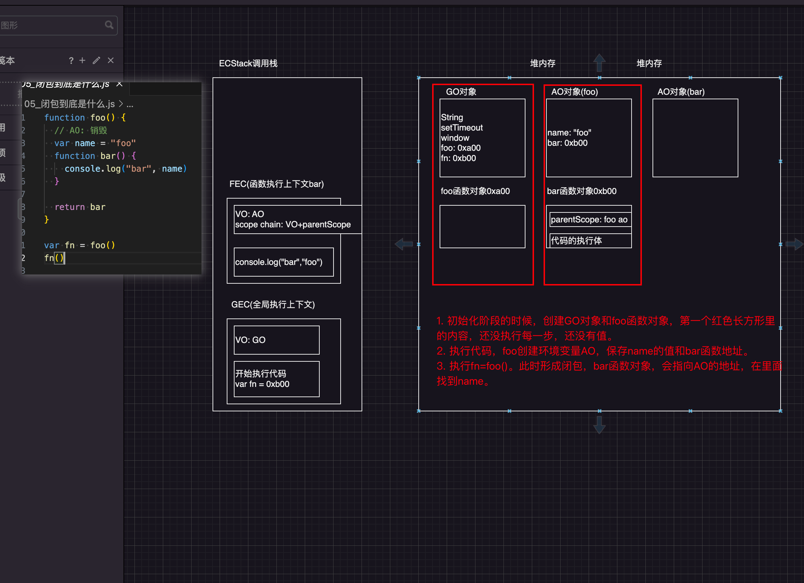
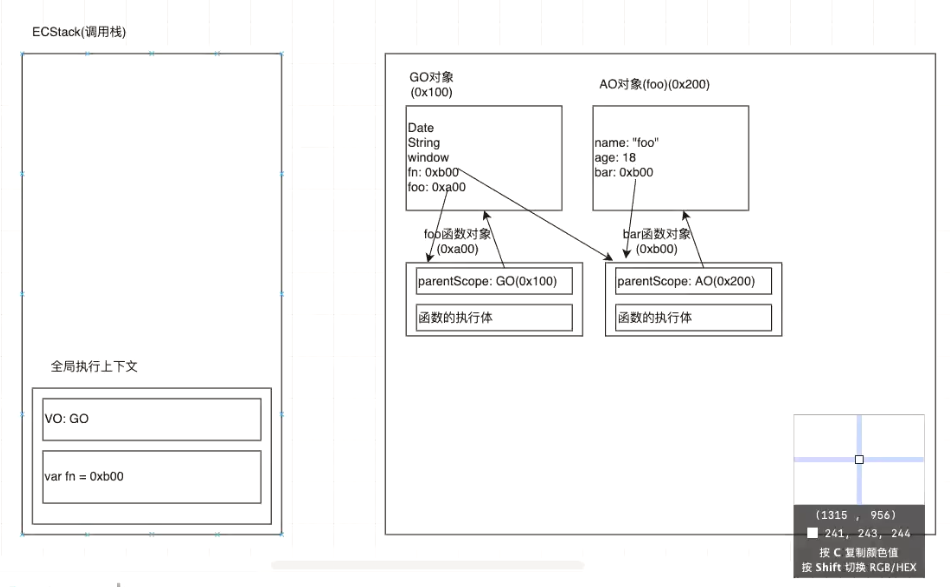

## 1. JS中函数是一等公民

+ 在JavaScript中，函数是非常重要的，并且是一等公民：
  + 那么就意味着函数的使用是非常灵活的；
  + 函数可以作为另一个函数的参数，也可以作为另一个函数的返回值来使用；
  + js语法允许函数内定义函数，像C就不允许
+ 可以编写高阶函数：==把一个函数作为另一个函数的**参数**，**或者**函数返回另一个函数作为**返回值**的函数。==
+ Tip：作为参数的函数叫做回调函数，接受函数作为参数的函数叫做高阶函数。

## 2. JS中闭包的定义

+ 闭包在其它计算机语言中也是存在的，分成两个：在计算机科学中和在JavaScript中

+ 计算机科学中对闭包的定义：
  + 闭包（Closure），又称词法闭包（Lexical Closure）或函数闭包（function closures）；
    + 词法闭包意味着我们在词法分析的时候就被确定了。
    + 词法分析就是我们的代码进入浏览器后词法分析之后生成一个个键值对然后转换成AST树。
    
  + 是在支持**头等函数**的编程语言中，实现词法绑定的一种技术；
    + 头等函数意味着函数是第一公民，我们才能在函数中定义函数，才能够形成闭包。
    + 词法绑定，在我们解析阶段我们的函数体就会确定上层作用域。
    
  + 闭包是在实现上是一个结构体，它存储了一个函数和一个关联的环境（相当于一个符号查找表）；
  
    + 闭包是一个结构体，说明是一个整体，包含当前函数以及可以访问的自由变量。
  
    + 结构体在JS中是一个对象，保存着一个函数和关联环境。
  
  + 闭包跟函数最大的区别在于，当捕捉闭包的时候，他的**自由变量**会在捕捉时被确定，这样即使脱离了捕捉时的上下文它也能照常运行。
  
+ MDN对JavaScript闭包的解释：
  + 一个函数和对其周围状态（lexical environment，词法环境）的引用捆绑在一起（或者说函数被引用包围），这样的组合就是闭包（closure）；
  + 也就是说，闭包让你可以在一个内层函数中访问到其外层函数的作用域
  + 在JavaScript中，每当创建一个函数，闭包就会在函数创建的同时被创建出来。（说明创建函数的同时闭包也被创建了）

+ 总结：
  + ==一个普通的函数function，如果它可以访问外层作用域的自由变量，那么这个函数就是一个闭包；==
  + 从广义的角度来说：JavaScript中的函数都是闭包；
  + 从狭义的角度来说：JavaScript中一个函数，如果访问了外层作用域的变量，那么它是一个闭包。

```js
// 不产生闭包
function foo() {
    function bar() {
        console.log('bar')
    }
    
    return bar
}

var fn = foo()
fn()
```

+ 代码执行前会现有调用栈和堆内存，并且堆内存会先创建好`GO`
+ 函数的函数体会保存到堆内存地址里面，把地址给到`GO`

+ 函数开始执行前会先创建AO对象，`AO`保存函数体里定义的内容，之后执行函数的时候开始赋值
+ 执行`var fn = foo()`后，`foo`函数执行上下文销毁，它的`AO`也没有其它指向它也跟着销毁。而`fn`保存`bar`函数对象地址。
+ `fn()`执行过程的中会创建函数执行上下文，然后执行完成，检查是否有指向，没有销毁。
+ 全局执行上下文不会被销毁和GO不会被销毁。解析的阶段创建的GO，执行的阶段创建的全局执行上下文。

```js
// 产生闭包
function foo() {
    var name = 'foo'
    function bar() {
        console.log("bar", name)
    }.
    return bar
}

var fn = foo()
fn()
```



+ 注意我们的函数对象中**父级作用域已经在解析阶段**已经确定。执行函数的时候，执行前解析函数体，创建AO，如果执行的函数内有函数也会保存堆内存中，并确定父级作用域。作用域链保存在函数执行上下文中，作用域链 = VO + 父级作用域。父级作用域可以堆地址中找到。
+ 我们执行完成`var fn = foo()`之后，`fn`保存`bar`的`函数对象地址`，我们的`foo函数执行上下文`没有指向会被销毁。而bar函数对象地址保存着父级作用域指向着`foo`的`AO`对象，因此执行`fn()`时能够访问到`foo中AO`里面定义赋值好的变量。
  + 为什么foo的销毁，没有使得AO被销毁？因为bar的父级作用域还指向AO
+ 这时候就形成了我们的闭包，即我们的函数本身`bar`以及能够访问到的外部自由变量。
  + 闭包是两部分组成的：函数+可以访问的自由变量。
  + 闭包和函数最大的区别在于**当捕捉闭包**的时候，它的**自由变量**会在捕捉时被确定，这样即使脱离捕捉时的上下文，它也能照常运行；
    + 在这个程序中，当我们捕捉到形成一个闭包的时候，会保存`bar`函数以及它的自由变量`name`。这是即使关于`foo`的函数执行上下文被销毁了，我们单独执行`fn`的时候，即使没有`foo`函数执行上下文，我们也能够正常执行，并且访问到外部的自由变量以及它的值。

```js
function foo(flag) {
  var name = '1';

  function bar() {
    return name;
  }

  function fgg() {
    name = '2';
    return name;
  }

  return flag ? bar : fgg;
}

var aaa = foo(true);
var bbb = foo(false);

console.log(aaa());
console.log(bbb());
console.log(aaa());


// 虽然都是指向name，但是foo每次的执行的时候，会重新创建AO，这意味着aaa和bbb中返回的函数指向的name的地址都是不一样的，互不干扰。这就是为什么很多闭包里的值一直没有发生变化的原因。
```

## 3. 闭包的内存泄漏

+ 留下一个问题，为什么`foo`的执行上下文完成后被销毁，`VO`为什么没有跟着被销毁？

```js
function foo() {
    var name = "foo"
    var age = 18
    
    function bar() {
        console.log(name)
        console.log(age)
    }
    
    returm bar 
}

var fn = foo()
fn()
```

+ 我们的对象没有引用指向的时候就会被销毁，这就意味着，只要有东西指向这个对象，我们的函数对象,`AO`对象都不会被销毁。

+ 在闭包中，我们的`bar`函数对象中父级作用域会一直指向我们的父级`foo`的`AO`对象，所以如果不销毁`bar`函数对象，`AO`会一直存在。

+ 执行完内存最终这个状态



+ 闭包会造成内存泄漏就在于，假如我们的项目代码中其实只需要执行一次`fn`，那么合理的方式应该是销毁掉里面的`bar`函数对象以及生成的`foo`的`VO`对象。但是由于我们的代码执行完成后`bar`函数对象和`foo`的`VO`对象一直都有引用指向就会导致内存泄漏。如果这个`fn`后续还会再被使用就不算内存泄漏。

+ 解决的办法很简单，将`fn = null`。一般`null`意味着指向`ox00`，相当于什么都不指向。此时`fn`之前指向的对象，没有再继续指向的时候，就会被销毁。

+ 总的来说闭包不一定有内存泄露只是用完的对象不再用到没有进行销毁的话，就会造成内存泄漏。

## 4. 总结

+ JS中函数是一等公民
+ 一个普通的函数function，如果它可以访问外层作用域的自由变量，那么这个函数就是一个闭包；
+ 闭包可能会造成内存泄漏


