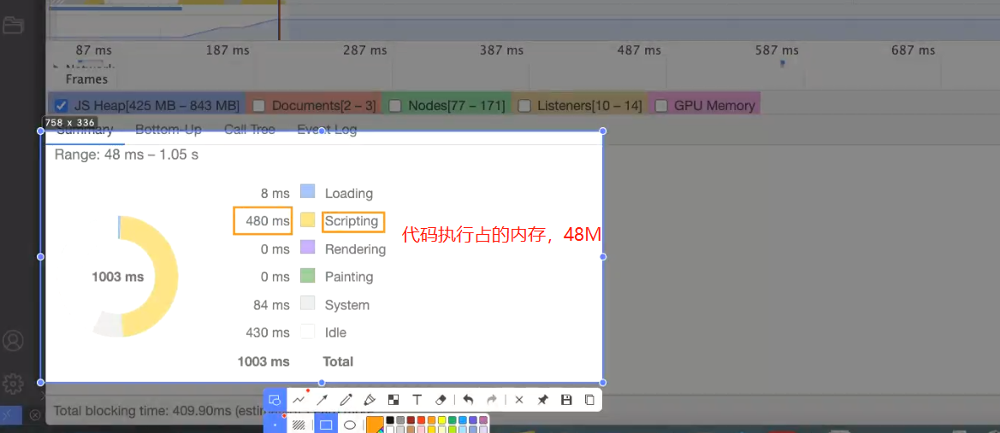
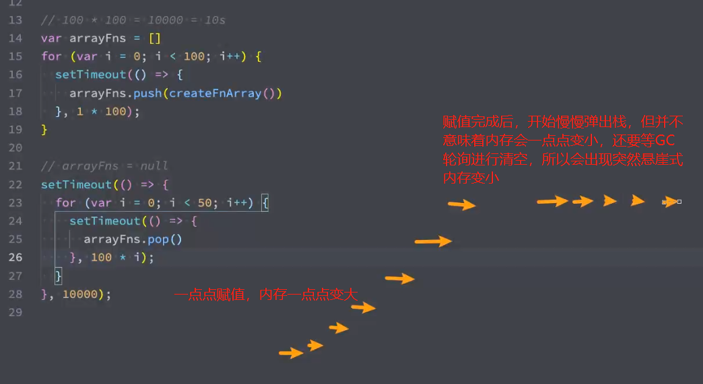
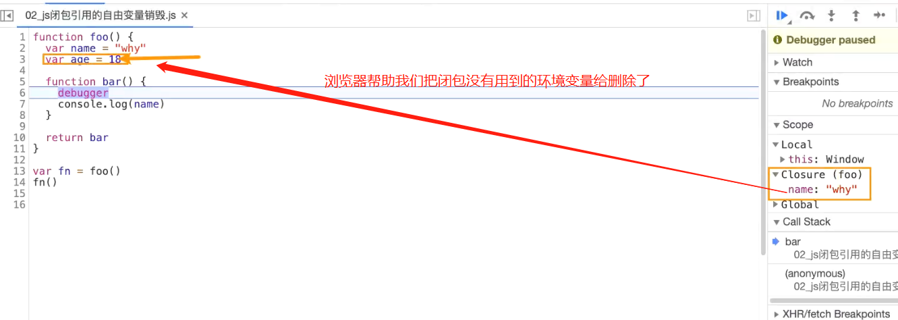
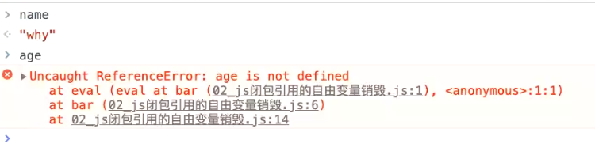
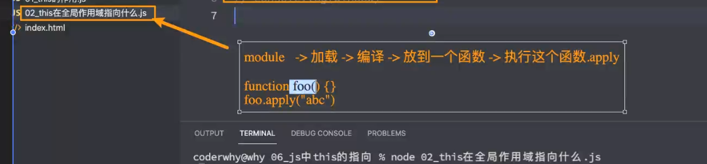
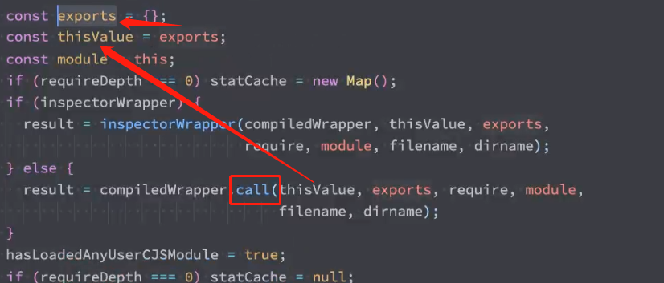
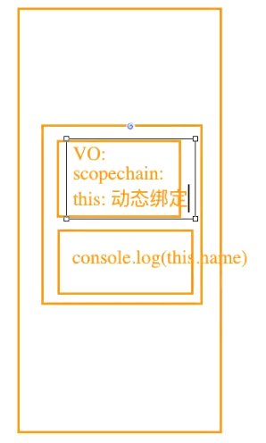

# 1. 闭包内存泄漏

## 1. 闭包内存泄漏案例

+ 一个字表示两个字节（Byte）
+ 一个字节表示8位（bit）
+ 一个字表示16位
+ 内存里1kb表示1024
+ 1024* 1024 = 1M = 1kb * 1kb

```js
function createFnArray() {
    // Array类可以传入长度，fill()用于填充
    // 这里填充的1在内存中int类型，相当于4个字节
    // 理论上 1是数据类型是number，相当于一个number类型占据8byte
    // 但是实际我们的V8js引擎为了提高空间利用率，当我们的数据很小的时候，会改成4个字节
    // 小的数字类型，在v8中成为Sim，小叔子 2的32次方 就是4字节
    var arr = new Array(1024 * 1024).fill(1) // 4M大小
    return function() {
        console.log(arr.length)
    }
}

// var arrayFn = createFnArray()
// arrayFn = null

var arrayFns = []
// 4M * 100 +  其他内存
for(var i =0; i < 100; i++) {
    arrayFns.push(createFnArray())
}

```

+ 浏览器点击`performance`和`Memory`，多刷新几次，因为刚执行的时候，浏览器还会做一些自己的JS操作，一些前期准备工作，占用一些内存，多刷新几次对比出正确的。



+ `Idle`表示闲置的内存
+ 我们代码会占据差不多480M空间，

```js
function createFnArray() {
    // Array类可以传入长度，fill()用于填充
    // 这里填充的1在内存中int类型，相当于4个字节
    var arr = new Array(1024 * 1024).fill(1) // 4M大小
    return function() {
        console.log(arr.length)
    }
}

// var arrayFn = createFnArray()
// arrayFn = null

var arrayFns = []
// 4M * 100 +  其他内存
for(var i =0; i < 100; i++) {
    arrayFns.push(createFnArray())
}

setTimeout(() => {
    arrayFns = null
}, 2000);
// 这里设置两秒后清空闭包并不会马上就会王成，两秒后会将arrayFns = null放入执行栈等待执行执行，所以实际执行不一定是两秒，其次是我们的浏览器清除多余的没有指向的对象，需要等待浏览器的GC按照算法计算的时间进行每次的轮询。也并不意味着对象等于null就会马上完成清除。
```

```js
function createFnArray() {
    // Array类可以传入长度，fill()用于填充
    // 这里填充的1在内存中int类型，相当于4个字节
    var arr = new Array(1024 * 1024).fill(1) // 4M大小
    return function() {
        console.log(arr.length)
    }
}

// var arrayFn = createFnArray()
// arrayFn = null

var arrayFns = []
for(var i =0; i < 100; i++) {
    setTimeout(() => {
        arrayFns.push(creareFnArray())
    }, 1*100)
}

setTimeout(() => {
    for(var i = 0; i < 50; i++) {
        setTimeout(() => {
            arrayFns.poop()
        }, 100 * i)
    }
}, 10000)
// 这里设置10000ms = 100ms * 100次 = 10s
// 我们必须保证上面的赋值完成之后才会执行弹出栈
```



## 2. JS闭包引用的自由变量销毁

```js
function foo() {
    var name = 'why'
    var age = 18
    
    function bar() {
        console.log(name)
        // console.log(age)
    }
    
    return bar
}

var fn = foo()
fn()
```

+ 由上面我么可以知道，我们的代码执行完成后，堆内存里会保存着`foo`的`AO`对象，理论上应该保存这`foo`里所有定义的变量，但是实际上我们的浏览器会把`AO`里不再用到的环境变量给销毁掉。这是浏览器单独做了的性能优化。



+ 我们的程序执行到debugger的时候意味着我们当前的执行环境在`function bar`里面，所以我们可以直接在控制台输入name打印结果。



### 总结：

ECMA理论上，我们闭包会把指向的上一层的`AO`对象保存下来，意味着我们`AO`对象中所有定义的变量都会被保存下来，这回造成多余的内存泄漏，但实际中我们的V8引擎会帮助我们优化，将不会使用到的环境变量给销毁掉。

# 2. 函数的this指向

## 1. 为什么需要this？

+ 常见的编程语言中，几乎都有`this`这个关键字（Objective-C中使用的是self），但是javaScript中的`this`和常见的面向对象语言中的`this`不太一样：
  + 常见面向对象的编程语言中，比如`java`、`C++`、`Swift`、`Dart`等等一系列语言中，`this`通常只会出现在类的方法中。
  + 也就是你需要有一个类，类中的方法（特别是实例方法），类中的方法（特别是实例方法）中，`this`代表的是当前调用对象。
  + 但是`javaScript`中的`this`更加灵活，无论是它出现的位置还是它代表的含义。

### 1. this的作用

```js
// this会帮助我们编写代码变得方便
var obj = {
	name: 'why',
    eating: function() {
        console.log(this.name + '在吃东西') // this的指向obj 
    },
    running: function() {
        console.log(this.name + '在跑步') // 等价于console.log(obj.name + '在跑步')
    },
    studying: function() {
        console.log(this.name + '在学习')
    }
}
```

### 2. this在全局作用域指向什么

```js
// 在大多数情况，this都是出现在函数中
// 在全局作用域下：
// 浏览器： window
// Node环境：空对象{}，
console.log(this)
console.log(window) // 在全局作用域打印都是window，两个指向的是GolbalObject
```

+ 在node环境下，会把当前这个文件当作一个模块，然后加载模块编译代码，把所有模块的代码放入到一个函数里，然后回执行这个函数的时候，执行一个fn.apply({})或者call({})绑定一个空的对象。所以this打印的是一个空对象。





+ 开发中很少直接在全局作用域下去使用`this`，通常都是在函数中使用。
  + 所有的函数在被调用时，都会创建一个执行上下文：
  + 这个上下文中记录着函数的调用栈、`AO`对象等；
  + this也是其中的一条记录；
    + 其实我们的`this`是在我们的函数执行的时候，创建函数执行上下文的时候的一个属性，所以只有在函数执行的时候才确定绑定在那里的，所以根据不同的环境会有不同的绑定规则。



## 2. this到底指向什么呢？

### 1. 同一个函数的this的不同

```js
// this在函数里面，this的指向根函数所处的位置是没有关系的
// 跟函数被调用的方式是有关系的

function foo() {
    console.log(this)
}

// 1. 直接调用这个函数
foo() // window

// 2. 创建一个对象，对象中的函数指向foo
var obj = {
    name: 'why'
    foo: foo
}

obj.foo() // obj

// 3. apply调用
foo.apply('abc') // String {'abc'}对象
```

+ 函数在调用时，`javaScript`会默认给`this`绑定一个值；
+ `this`的绑定和第一的位置（编写的位置）没有关系；
+ this的绑定和调用方式以及调用的位置有关系
+ this是在运行时被绑定的

## 3. 规则一：默认绑定

+ 什么情况下使用默认绑定呢？独立函数调用。
  + 独立的函数调用我们可以理解成函数没有被绑定到某个对象上进行调用。

```js
// 1. 
// 独立函数调用
function foo() {
    console.log(this) // 指向我们的全局对象
}

foo()

// 2.
// 变化
function foo1() {
    console.log(this)
}

function foo2() {
    console.log(this)
    foo1()
}

function foo3() {
    console.log(this)
    foo2()
}

foo3()
// window
// window
// window
// 这三个函数在被调用的时候，都是独立函数调用，那么打印的结果就是一个window

// 3. 
var obj = {
    name: 'why',
    foo: function() {
        console.log(this)
    }
}

var bar = obj.foo
obj.foo() // {name: "why", foo: ƒ}
bar() // window
// 注意this与它的定义是没有关系的，和它如何调用有关系
// 这里的bar() 是一个独立函数调用，所以指向的就是window

// 4.
function foo() {
    console.log(this)
}

var obj = {
    name: 'why',
    foo: foo
    }
}

var bar = obj.foo
bar() // window

// 5. 
function foo() {
    function bar() {
        console.log(this)
    }
    return bar
}

var fn = foo() 
fn() // 只要这里是个独立函数被调用就是window

var obj = {
    name: 'why'
    eating: fn
}

obj.eating() // {name:'why', eating: f } 这里的调用主题是obj，并不是独立调用,是隐式绑定

```

## 4. 规则二： 隐式绑定

+ 常见的调用方式通过某个对象进行调用的：
  + 也就是他的调用位置中，是通过某个对象发起的函数调用。

```js
// 隐式绑定：object.fn()
// object对象会被js引擎绑定到fn函数的this里面（js内部会自动帮助我们绑定）

function foo() {
    console.log(this)
}

// 独立函数调用
// foo()

// 1.
var obj = {
    name: 'why',
    foo: foo
}

obj.foo() // obj对象，我们使用obj点的方式发起了调用foo，js引擎会帮助我们把这个对象绑定执行上下文的this

// 2.
var obj = {
    name: 'why',
    eating: function() {
        console.log(this.name + '在吃东西') 
    },
    running: function() {
        console.log(this.name + '在跑步') 
    },
    studying: function() {
        console.log(this.name + '在学习')
    }
}
obj.eating()
obj.running()

var fn = obj.eating
fn() // 独立函数调用，这时this指向window，window里面是有name属性的

// 3.
var obj1 = {
    name: 'obj1'
    foo: function() {
        console.log(this)
    }
}

var obj2 = {
    name: 'obj2',
    bar: obj1.foo
}

obj2.bar() //obj2
```

## 5. 规则三：显示绑定

+ 隐式绑定有一个前提条件：
  + 必须在调用的对象内部有一个对函数的引用（比如一个属性）；
  + 如果没有这样的引用，在进行调用时，会报招不到该函数的错误；
  + 正是通过这个引用，简介的将this绑定到了这个对象上；

+ 如果我们不希望在对象内部包含这个函数的引用，同时又希望在这个对象上进行强制调用，该怎么做呢？
  + `JavaScript`所有的函数都可以使用`call`和`apply`方法（这个和`Prototype`有关）
    + 他们两个的区别这里不再展开；
    + 其实非常简单，第一个参数是相同的，后面的参数，apply为数组，call为参数列表；
  + 这两个函数的第一个参数都要求是一个对象，这个对象的作用是什么呢？就是给`this`准备的。
  + 在调用这个函数时，会将this绑定到这个传入的对象上。

#### apply-call

```js
function foo() {
    console.log("函数被调用了",this)
}

// foo直接调用和call/apply调用得不同在于this绑定的不同
// foo直接调用指向的是全局对象（window）
foo()

var obj = {
    name: 'onj'
}

// 1. 直接使用call,apply发起函数调用，手动指定this指向
foo.call(obj) // {name: 'obj'}
foo.apply(obj) // {name: 'obj'}
foo.apply('aaaa') // S

// 2. call和apply有什么区别？
function sum(num1, num2, num3) {
    console.log(num1 + num2 + num3, this)
}

// call第一个参数是绑定得对象，后面剩余参数是按照函数顺序传入，逗号分隔开
sum.call('call', 20, 30, 40)
// call第一个参数是绑定得对象，后面剩余参数是用数组传入
sum.apply('apply',[20, 30, 40])

// 3. callge apply在执行函数时，是可以明确得绑定this，这个就是显示绑定
```

#### bind

```js
function foo() {
    console.log(this)
}

// 假如我们每次调用foo的同时希望绑定字符串'aaa'
foo.call('aaa')
foo.call('aaa')
foo.call('aaa')
foo.call('aaa')

// 这样写显得很麻烦，可以优化
// bind会绑定this且返回一个新的函数
var newFoo = foo.bind('aaa')

newFoo() //虽然看起来像是一个独立函数调用，但是由于调用之前，已经显示bind的关系，里面的this已经绑定了'aaa'
// 这个场景可以理解成，默认绑定和bind绑定冲突的时候，优先级（显示绑定更高）
```

#### new绑定

+ JavaScript中的函数可以当做一个类的构造函数来使用，也就是使用new关键字
+ 使用new关键字来调用函数，会执行如下的操作：
  1. 创建一个全新的对象；
  2. 这个新对象会被执行prototype连接
  3. 这个新对象会绑定到函数调用的this上（this的绑定在这个步骤完成）；
  4. 如果函数没有返回其他对象，表达式会返回这个新对象。

```js
// 我们通过一个new关键字调用一个函数时间（构造器），这个时候this是在调用这个构造器时创建出来的对象
// 等价于 this = 创建出来的对象
// 这个绑定过程就是new绑定。

// 一般函数当成构造器的话写大写
function Person() {
    return this
}

// 使用new调用Person函数，会自动生成新的对象，并且赋值给Person函数中的this，等到最后，会把这个新对象返回，然后我们的p拿到这个对象
var p = new Person()


function Person(name, age) {
	this.name = name
    this.age = age
}
    
var p1 = new Person('why', 18)
var p2 = new Person('kobe', 30)
```
