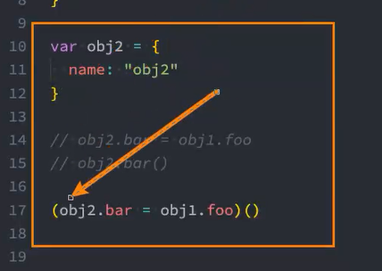
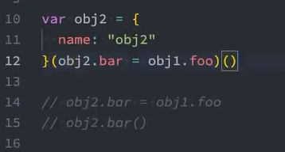
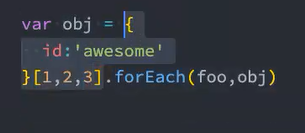

# 05. this的绑定规则、优先级和面试

## 1. 一些函数的this分析.js

```js
// 1. setTimeout
function hySetTimeout(fn, duration) {
    // 这里执行函数
    fn()
}

hySetTimeout(function() {
    console.log(this) //window
}, )

// setTimeout也是一样，内部进行了独立函数的调用
setTimeout(function() {
    console.log(this) // window
}, 2000)


// 2. 监听点击
const boxDiv = document.querySelector('.box')
// 把函数传递给boxDiv的属性onClick中，作为box的属性
boxDic.onclick = function() {
    console.log(this) // 打印结果是<div class='box'></div>
  	// 相当于内部进行了隐私调用
 		// boxDiv.onClick()。所以打印结果是 <div class='box'></div>
  
  	// 从上面的setTimeout和onClick，想要知道this的指向就要知道内部对回调函数具体是怎么调用的。
  	// 这里打印的this就和我们内部怎么调用该函数有直接关系， 将元素对象给到<div class='box'></div>
}

// 点击事件发生后，实际内部执行像这样boxDiv.onclick()。onclick属性之前被传入函数，之后执行，把boxDiv绑定上去（隐式绑定）。

boxDiv.addEventListener('click', function() { console.log(this) })
boxDiv.addEventListener('click', function() { console.log(this) })
boxDiv.addEventListener('click', function() { console.log(this) })


// 3. 数组.forEach/map/filter/find , 她们传入两个参数，第一个是回调函数，第二个就是this的绑定，不传默认window
var name = ['abc', 'cba', 'nba']
names.forEach(function() {
    console.log(item, this) // String {"abc"}
}, 'abc')

names.map(function() {
    console.log(item, this)  // String {"cba"}
}, 'cba')
```

## 2. 规则优先级

1. 默认规则的优先级最低

   + 默认规则优先级是最低的，因为存在其他规则时，就会通过其他规则的方式来绑定this

2. 显示优先级高于隐式绑定

   ```js
   var obj = {
       name: 'obj',
       foo: function() {
           console.log(this)
       }
   }
   
   obj.foo() // {name: 'obj', foo: f}
   
   // 1. call/apply的显示绑定高于隐式绑定  
   obj.foo.call('abc')  // String {'abc'}
   obj.foo.apply('abc')  // String {'abc'}
   
   // 2. bind 隐式绑定的优先级？
   var bar = obj.foo.bind('cba')
   // 这里是因为bar拿到的是一个返回值，这时里面的执行obj.foo后再执行bind里面的this已经被修改了，不太能体现bind的优先级高的特性
   // bind是返回一个新函数，所以不太能体现优先级。
   bar() // String {'cba'}
   
   // 3. 更明显的比较bind
   function foo() {
       console.log(this)
   }
   
   var obj = {
       name: 'obj',
       foo: foo.bind('aaa')
   }
   
   // 证明依然是bind优先级更高于隐式绑定
   obj.foo() // String {'aaa'}
   ```

3. new绑定优先级高于隐式绑定

   ```js
   var obj = {
       name: 'obj',
       foo: function() {
           console.log(this)
       }
   }
   
   // 将取到obj.foo函数传入到同名的构造函数obj.foo中，并返回最新的对象给到f
   var f = new obj.foo() // foo {}
   ```

4. new绑定高于显示绑定

   ```js
   // 结论: new关键字不能和apply/call一起来使用
   // 因为new和call等都是主动调用函数，所以不能一起使用
   
   // new的优先级高于bind
   function foo() {
       console.log(this)
   }
   
   var bar = foo.bind('aaa')
   
   var obj = new bar() // foo {} 说明new高于bind
   // 解析
   var obj = new foo.bind('aaa')
   
   // new绑定 > 显示绑定（apply/call/bind） > 隐式绑定(obj.foo) > 默认绑定（独立函数调用）
   
   // bind > call
   foo.bind("abc").call('def')
   ```

## 3. this规则之外（特殊绑定） - 忽略显示绑定

```js
function foo() {
    console.log(this)
}

// 一般传入什么this绑定什么
foo.apply('abc')
foo.apply({})

// apply/call/bind: 当传入null/undefined时，自动将this绑定成全局对象window
foo.apply(null)
foo.apply(undefined)

var bar = foo.bind(null)
bar()
```

## 4. this规则之外 - 间接函数引用

+ 创建一个函数的间接引用，这种情况使用默认绑定规则。
  + 赋值（obj2.foo = obj1.foo）的结果时foo函数；
  + foo函数被直接调用，那么是默认绑定

```js
var obj = {
    name: 'obj1',
    foo: function() {
    	console.log(this)
	}
}

var obj2 = {
    name: 'obj2'
}; // 注意这里要加分号

// obj2.bar = obj1.foo
// obj2.bar()  // 隐式绑定 {name: 'obj2', bar: f}

(obj2.bar = obj1.foo)()  // 独立函数调用 window  (obj2.bar = obj1.foo)返回了函数地址，然后对函数地址执行函数，相当于独立函数调用，所以是一个独立函数调用打印window。

```



假如我们的代码不写分号的时候，浏览器词法分析会把这两段代码看做一个整体一起解析



```js
// 这段代码不能运行
function foo(el) {
    console.log(el, this.id)
}

var obj = {
    id: 'awesome'
}
// 原因是把上面的代码和下面的代码浏览器看成一个整体导致的
[1, 2, 3].forEach(foo,obj)

// 第一个办法记得加分号
function foo(el) {
    console.log(el, this.id)
}

var obj = {
    id: 'awesome'
};

[1, 2, 3].forEach(foo,obj)

// 2
function foo(el) {
    console.log(el, this.id)
}

var obj = {
    id: 'awesome'
};

var name = [1, 2, 3]

name.forEach(foo,obj)

// 这里重点是浏览器怎么判断代码片段
```

报错原因



## 5. this规则之外 - ES6箭头函数

+ 箭头函数不会绑定this、arguments属性
+ 箭头函数不能作为构造函数来使用（不能和new一起来使用，会抛出错误）；

+ 箭头函数不使用this的四种标准规则（也就是不绑定this），而是根据外层作用域来决定this。

```js
// 箭头函数的一些常见的简写
var nums = [10, 20, 45, 78]

// 简写一：如果参数只有一个，（）可以省略
nums.forEach(item => {console.log(item)})

// 简写二：如果我们的函数执行体只有一行代码，那么{}也可以省略
// 强调：并且它会默认将这行代码的执行结果作为返回值
nums.forEach(item => console.log(item)) // 这里放回undefined
var newNums = nums.filter(item => item%2 === 0)
console.log(newNums) // [10,20,78]

var result = nums
				.filter(item = item%2 ===0)
				.map(item => item * 100)
				.reduce((preValue, item) =>  preValue, item )

console.log(result)// 10800

// 简写三： 如果一个箭头函数，只有一行代码，并且返回一个对象，这个时候如何编写简写
var bar = () => {
    return {name: 'why', age:18}
}
// 不可以这样简写,因为存在歧义
var bar = () => {name: 'why', age: 18}
// 用小括号包裹表示一个整体
var bar = () => ({name: 'why', age: 18})
```

```js
var foo = () => {
  // 和其他变量一样，假如函数内找不到this，就会去上层作用域找 
  console.log(this)
}

// 不管你怎么调用函数，都不会绑定this。而是会根据外层作用域决定this
foo()				// window
foo.call('abc')		// window

var obj = {foo: foo}
obj.foo()			// window


// 2. 应用场景
var obj = {
    data: [],
    // 在我们箭头函数之前的解决方案
    // 保存隐式绑定的this
    var _that = this
    getData: function() {
        // 模拟发送网络请求，将结果放到上面data属性中
      	// setTimeout对传入的普通函数是独立调用，所以回调函数的this会指向window 
        setTimeout(function() {
            var result = ["abc", "cba", "nba"]
            _this.data = result
        }, 2000)
    }
}

obj.getData()

// 箭头函数之后的解决方案
var obj = {
    data: [],
    getData: function() {
        // 虽然setTimeout传入函数是独立调用，但是箭头函数不绑定this，上层作用域找到的是obj
        setTimeout(() => {
            var result = ["abc", "cba", "nba"]
            // this会去上层作用域找，上层作用域是getData,而这个函数被下面的obj隐式调用，所以getData里的this是指向obj，所以箭头函数里的this指向obj。
            this.data = result
        }, 2000)
    }
}

obj.getData()
```

## 6. 面试题

```js
// 这里这么做是因为window里刚好有一个name属性。直接只有做，排除影响。
var name = "window";

var person = {
    name: 'person',
    sayName: function() {
        console.log(this.name);
    }
};

function sayName() {
    var sss = person.sayName;
    sss(); // window  // 直接调用
    person.sayName() // person 隐式调用
    (person.sayName)() //person 隐式调用 这个括号加不加都一样
    (b = person.sayName)() // window 赋值表达式 间接函数引用
}
sayName(); 
```


```js
var name = "window"
var person1 = {
    name: 'person1',
    foo1: function() {
        console.log(this.name)
    },
    
    foo2: () => console.log(this.name),
    
    foo3: function () {
        return function () {
            console.log(this.name)
        }
    },
    
    foo4: function () {
        return () => {
            console.log(this.name)
        }
    }
}

var person2 = {name: 'person2'}

person1.foo1() // person1 隐式调用
person1.foo1.call(person2) // person2 显式调用

person1.foo2() // window 注意对象是没有作用域的，函数才有作用域
person1.foo2().call(person2) // window 箭头函数不会被call绑定

person1.foo3()() // window 独立函数调用
person1.foo3.call(person2)() // window 独立函数调用 person1.foo3.call(person2)这一步的时候外层的函数绑定了person2,然后返回了一个新的函数，再执行，此时就是独立函数调用了
person1.foo3().call(person2) // person2 返回函数之后进行了显示绑定

person1.foo4()() // person1 箭头函数不绑定this，寻找上层作用域的时候时foo4，而foo4绑定的此时person1
person1.foo4.call(person2)()  // person2 因为再调用里面的箭头函数之前，上层作用域已经绑定了person2
person1.foo4().call(person2) // person1
```


```js
var name = 'window'
function Person (name) {
  this.name = name
  this.foo1 = function () {
    console.log(this.name)
  },
  this.foo2 = () => console.log(this.name),
  this.foo3 = function () {
    return function () {
      console.log(this.name)
    }
  },
  this.foo4 = function () {
    return () => {
      console.log(this.name)
    }
  }
}
var person1 = new Person('person1')
var person2 = new Person('person2')

person1.foo1()  // person1 
person1.foo1.call(person2) // person2 (显示绑定高于隐式绑定)

person1.foo2()  // person1
person1.foo2.call(person2) // person1 this不绑定作用域，上层作用域找到的还是person1

person1.foo3()() // window 独立函数调用
person1.foo3.call(person2)()  // window 独立函数调用
person1.foo3().call(person2)  // person2 先获取到函数，再绑定

// 注意细节，这两个不太一样，具体看代码分析，没办法直接下结论
foo().call()
foo.call()


person1.foo4()() // person1
person1.foo4.call(person2)() //person2
person1.foo4().call(person2) // person1
```


对象没有作用域名，`{}`只是它的语法。区别于直接的双括号包括代码块。引擎解析时时完全不同的东西

函数有作用域

代码块有作用域

```js
var name = 'window'
function Person (name) {
  this.name = name
  this.obj = {
    name: 'obj',
    foo1: function () {
      return function () {
        console.log(this.name)
      }
    },
    foo2: function () {
      return () => {
        console.log(this.name)
      }
    }
  }
}
var person1 = new Person('person1')
var person2 = new Person('person2')

person1.obj.foo1()() //window
person1.obj.foo1.call(person2)() // window
person1.obj.foo1().call(person2) // person2

person1.obj.foo2()() // obj 往上层找，找到的就是obj ，因为foo2时是被obj调起的，而obj是被person1调起的。可以看出作用域是 person1{ obj{ foo2( this ) } }
person1.obj.foo2.call(person2)() // person2
person1.obj.foo2().call(person2) // obj
```

## 7. 总结

+ setTimeout中是独立调用函数，所以指向window。
+ document内部的操作是隐性绑定。
+ 默认绑定优先级最低。
+ 显示优先级绑定高于隐式绑定
+ new绑定优先级高于隐式绑定和显示绑定
+ 显示绑定传入null/undefined，会默认为window
+ 箭头函数不绑定this。根据上层作用域找this

new绑定 > 显示绑定（apply/call/bind） > 隐式绑定(obj.foo) > 默认绑定（独立函数调用）


