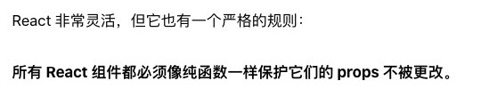

# 07. 纯函数-柯里化-组合函数

## 1. JS函数式编程

### 1. 理解javaScript纯函数

+ 在程序设计中，若一个函数符合以下条件，那么这个函数被称为纯函数：
  + 此函数在相同的输入值时，需产生相同的输出。
  + 函数的输出和输入值以外的其他隐藏信息或状态无关，也和由I/O设备产生的外部输出无关。
  + 该函数不能有语义上可观察的函数副作用，诸如“触发事件”，使输出设备输出，或更改输出值以外物件的内容等。
+ 总结：
  + 确定的输入，一定会产生确定的输出；
  + 函数在执行过程中，不能产生副作用；

### 2. 副作用的理解

+ 那么这里又有一个概念，叫做副作用，什么又是副作用呢？
  + 副作用（side effect）其实本身是医学的一个概念，比如我们经常说吃什么药本来是为了治病，可能会产生一些其他的副作用；
  + 在计算机科学中，也引用了副作用的概念，表示在执行一个函数时，除了返回函数值之外，还对调用函数产生了附加的影响，比如修改了全局变量，修改参数或者改变外部的存储

### 3. 纯函数的案例

+ `slice`：`slice`截取数组时不会对原数组进行任何操作,而是生成一个新的数组；

+ `splice`：`splice`截取数组, 会返回一个新的数组, 也会对原数组进行修改；
+ `slice`就是一个纯函数，不会修改传入的参数；

```js
var names = ["abc", "cba", "nba", "dna"]

// slice只要给它传入一个start/count, 那么对于同一个数组来说, 它会给我们返回确定的值
// slice函数本身它是不会修改原来的数组
// slice函数本身就是一个纯函数
var newNames1 = names.slice(0, 3)
console.log(newNames1)
console.log(names)

// ["abc", "cba", "nba", "dna"]
// splice在执行时, 有修改掉调用的数组对象本身, 修改的这个操作就是产生的副作用
// splice不是一个纯函数
var newNames2 = names.splice(2)
console.log(newNames2)
console.log(names)

// splice截取
const a = [0,1,2,3,4]
var b = a.splice(0,3)
a // [3,4]
b// [0,1,2]

// splice和slice两个参数，start表示开始的index，第二个表示个数

```

```js

// foo函数是否是一个纯函数?
// 1.相同的输入一定产生相同的输出
// 2.在执行的过程中不会产生任何的副作用
function foo(num1, num2) {
  return num1 * 2 + num2 * num2
}

// bar不是一个纯函数, 因为它修改了外界的变量
var name = "abc" 
function bar() {
  console.log("bar其他的代码执行")
  name = "cba"
}

bar()

console.log(name)

// baz也不是一个纯函数, 因为我们修改了传入的参数
function baz(info) {
  info.age = 100
}

var obj = {name: "why", age: 18}
baz(obj)
console.log(obj)

// test是否是一个纯函数? 是一个纯函数
function test(info) {
  return {
    ...info,
    age: 100
  }
}
var obj = {name: "why", age: 18}
test(obj)
test(obj)
test(obj)
test(obj)

// React的函数组件(类组件) 不是纯函数
function HelloWorld(props) {
  props.info = {}
  props.info.name = "why"
}

```

### 4. 纯函数的优势

+ 为什么纯函数在函数式编程中非常重要呢？
  + 你可以安心的编写和安心的使用
  + 你在写的时候保证了函数的纯度，只是单纯实现自己的业务逻辑即可，不需要关心传入的内容是如何获得的或者依赖其他的外部变量是否已经发生了修改；
  + 你在用的时候，你确定你的输入内容不会被任意篡改，并且自己确定的输入，一定会有确定的输出；
+ React中就要求我们无论是函数还是class声明一个组件，这个组件都必须像纯函数一样，保护它们的props不被修改：



## 2. JavaScript柯里化

+ 柯里化也是属于函数式编程里面一个非常重要的概念。
+ 维基百科：
  + 在计算机科学中，柯里化（英语：Currying），又译为卡瑞化或加里化；
  + 是把接收多个参数的函数，变成接受一个单一参数（最初函数的第一个参数）的函数，并且返回接受余下的参数，而且返回果的新函数的技术；
  + 柯里化声称“如果你固定某些参数，你将得到接受余下参数的一个函数”；
+ 维基百科的结束非常的抽象，我们这里做一个总结：
  + 只传递给函数一部分参数来调用它，让它返回一个函数去处理剩余的参数；
  + 这个过程就称之为柯里化；

```js
function add(x, y, z) {
  return x + y + z
}

var result = add(10, 20, 30)
console.log(result)

// 转成柯里化，返回一个接受一个参数的新函数
function sum1(x) {
  return function(y) {
    return function(z) {
      return x + y + z
    }
  }
}

var result1 = sum1(10)(20)(30)
console.log(result1)


// 简化柯里化的代码
var sum2 = x => y => z => {
  return x + y + z
}

console.log(sum2(10)(20)(30))

var sum3 = x => y => z => x + y + z
console.log(sum3(10)(20)(30))


```

### 1. 让函数的职责单一

+ 为什么需要有柯里化呢？
  + 在函数式编程中，我们其实往往希望一个函数处理的问题尽可能的单一，而不是将一大堆的处理过程交给一个函数来处理；
  + 那么我们是否就可以将每次传入的参数在单一的函数中进行处理，处理完后在下一个函数中再使用处理后的结果；
+ 缺点：
  + 进行了多次函数调用，性能不高，甚至多次堆栈导致栈溢出。

```js
function add(x, y, z) {
  x = x + 2
  y = y * 2
  z = z * z
  return x + y + z
}

console.log(add(10, 20, 30))

// 柯里化
function sum(x) {
  x = x + 2

  return function(y) {
    y = y * 2

    return function(z) {
      z = z * z

      return x + y + z
    }
  }
}

console.log(sum(10)(20)(30))


```

### 2. 柯里化的复用

+ 另外一个使用柯里化的场景是可以帮助我们可以复用参数逻辑：
  + `makeAdder`函数要求我们传入一个`num`（并且如果我们需要的话，可以在这里对`num`进行一些修改）；
  + 在之后使用返回的函数时，我们不需要再继续传入`num`了；

```js
// 假如固定加个某个数字的时候

// function sum(m, n) {
//   return m + n
// }

// // 假如在程序中,我们经常需要把5和另外一个数字进行相加
// console.log(sum(5, 10))
// console.log(sum(5, 14))
// console.log(sum(5, 1100))
// console.log(sum(5, 555))

function makeAdder(count) {
  count = count * count

  return function(num) {
    return count + num
  }
}

// var result = makeAdder(5)(10)
// console.log(result)
var adder5 = makeAdder(5)
adder5(10)
adder5(14)
adder5(1100)
adder5(555)

```

```js
function log(date, type, message) {
  console.log(`[${date.getHours()}:${date.getMinutes()}][${type}]: [${message}]`)
}

// log(new Date(), "DEBUG", "查找到轮播图的bug")
// log(new Date(), "DEBUG", "查询菜单的bug")
// log(new Date(), "DEBUG", "查询数据的bug")

// 柯里化的优化
var log = date => type => message => {
  console.log(`[${date.getHours()}:${date.getMinutes()}][${type}]: [${message}]`)
}

// 如果我现在打印的都是当前时间
var nowLog = log(new Date())
nowLog("DEBUG")("查找到轮播图的bug")
nowLog("FETURE")("新增了添加用户的功能")

var nowAndDebugLog = log(new Date())("DEBUG")
nowAndDebugLog("查找到轮播图的bug")
nowAndDebugLog("查找到轮播图的bug")
nowAndDebugLog("查找到轮播图的bug")
nowAndDebugLog("查找到轮播图的bug")


var nowAndFetureLog = log(new Date())("FETURE")
nowAndFetureLog("添加新功能~")

```

### 3. 柯里化函数的实现

```js
// 实现自动转成柯里化的函数


```

## 4. 组合函数

+ **组合(Compose)函数**是在JavaScript开发过程中一种对**函数的使用技巧、模式**:
  + 比如我们现在需要对某一个数据进行函数的调用，执行两个函数fn1和fn2，这两个函数是依次执行的; p 那么如果每次我们都需要进行两个函数的调用，操作上就会显得重复;
  + 那么是否可以将这两个函数组合起来，自动依次调用呢?
  + 这个过程就是对函数的组合，我们称之为 组合函数(Compose Function);

+ 自己实现一个通用组合函数

```js
function hyCompose(...fns) {
  var length = fns.length
  for (var i = 0; i < length; i++) {
    if (typeof fns[i] !== 'function') {
      throw new TypeError("Expected arguments are functions")
    }
  }

  function compose(...args) {
    var index = 0
    var result = length ? fns[index].apply(this, args): args
    while(++index < length) {
      result = fns[index].call(this, result)
    }
    return result
  }
  
  // 返回一个新函数
  return compose
}

function double(m) {
  return m * 2
}

function square(n) {
  return n ** 2
}

var newFn = hyCompose(double, square)
console.log(newFn(10))

```


 