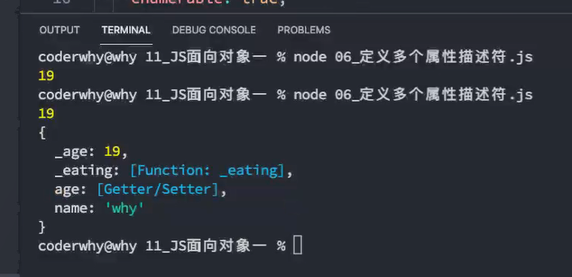
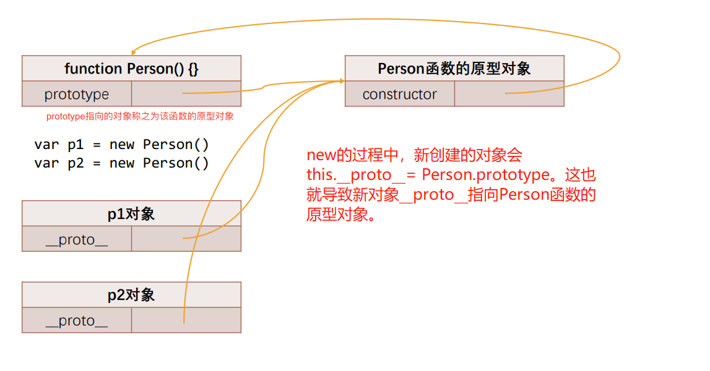
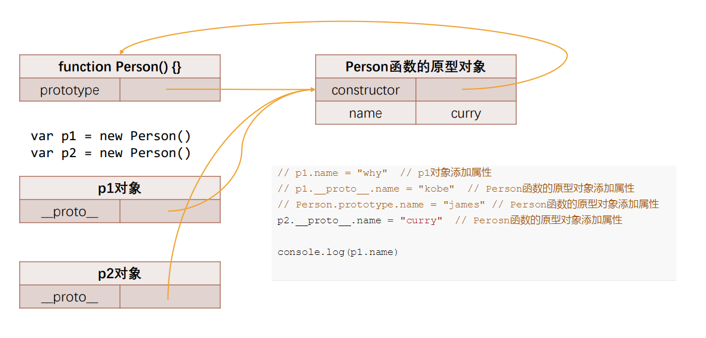
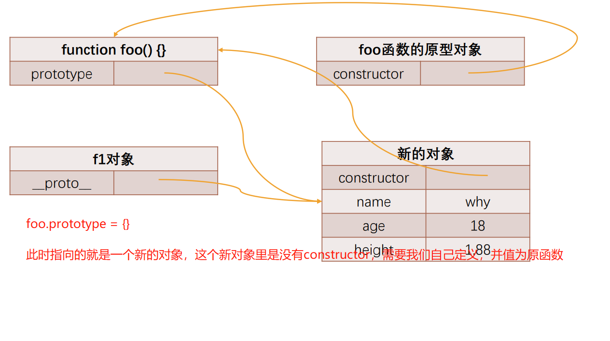

# 08. with-eval-严格模式-面向对象一

对象不产生作用域，但是大括号`{}`会产生，还有函数和全局作用域。`with`语句可以形成自己的作用域。

#### with语句

```js
// "use strict";

var message = "Hello World"
// console.log(message)

// with语句: 可以形成自己的作用域
var obj = {name: "why", age: 18, message: "obj message"}

function foo() {
  function bar() {
    // with传入一个对象，执行体可以写多行代码，执行体会先从传入的对象中查找属性，再往作用域链查找
    with(obj) {
      console.log(message)
      console.log("------")
    }
  }
  bar()
}

foo()

var info = {name: "kobe"}
with(info) {
  console.log(name)
}

// 目前开发中不推荐使用，严格模式不允许使用
```

#### eval函数

eval是一个特殊的全局函数，它可以将传入的字符串当做`javaScript`代码来运行。

```js
var jsString = 'var message = "Hello World"; console.log(message);'

var message = "Hello World"
console.log(message)

eval(jsString)

```

+ 不建议在开发中使用eval：
  + eval代码的可读性非常的差（代码的可读性是高质量代码的重要原则）；
  + eval是一个字符串，那么有可能在执行的过程中被刻意篡改，那么可能会造成被攻击的风险；
  + eval的执行必须经过JS解释器，不能被JS引擎优化；而js代码执行前会被V8引擎优化，但是如果都是字符串就不会。

#### 严格模式

+ 在ECMAScript5标准中，JavaScript提出了严格模式的概念（Strict Mode）：
  + 严格模式很好理解，是一种具有限制性的JavaScript模式，从而使代码隐式的脱离了 ”懒散（sloppy）模式“；
  + 支持严格模式的浏览器在检测到代码中有严格模式时，会以更加严格的方式对代码进行检测和执行；
+ 严格模式对正常的JavaScript语义进行了一些限制：
  + 严格模式通过 抛出错误 来消除一些原有的 静默（silent）错误；
  + 严格模式让JS引擎在执行代码时可以进行更多的优化（不需要对一些特殊的语法进行处理）；
  +   严格模式禁用了在ECMAScript未来版本中可能会定义的一些语法；
+ 一般webpack打包后会帮助我们打开严格模式

```js
// 整个文件开启严格模式
"use strict";
```

```js
// 函数体开头执行严格模式
function foo() {
  "use strict";

  true.foo = "abc"
}

foo()
```

#### 严格模式限制

+ 这里我们来说几个严格模式下的严格语法限制：
  +  JavaScript被设计为新手开发者更容易上手，所以有时候本来错误语法，被认为也是可以正常被解析的；
  + 但是这种方式可能给带来留下来安全隐患；
  +  在严格模式下，这种失误就会被当做错误，以便可以快速的发现和修正；

1. 无法意外的创建全局变量
2. 严格模式会使引起静默失败(silently fail,注:不报错也没有任何效果)的赋值操作抛出异常
3. 严格模式下试图删除不可删除的属性
4. 严格模式不允许函数参数有相同的名称
5. 不允许0的八进制语法
6. 在严格模式下，不允许使用with
7. 在严格模式下，eval不再为上层引用变量
8. 严格模式下，this绑定不会默认转成对象

```js
// "use strict"

// 1. 禁止意外创建全局变量
// message = "Hello World"
// console.log(message)

// function foo() {
    // age这样定义会成为全局变量
//   age = 20
// }

// foo()
// console.log(age)

// 2.不允许函数有相同的参数名称
// function foo(x, y, x) {
//   console.log(x, y, x)
// }

// foo(10, 20, 30)


// 3.静默错误
// true.name = "abc"
// NaN = 123
// var obj = {}
// Object.defineProperty(obj, "name", {
//   configurable: false,
//   writable: false,
//   value: "why"
// })
// console.log(obj.name)
// // obj.name = "kobe"

// delete obj.name

// 4.不允许使用原先的八进制格式 0123
// var num = 0o123 // 八进制
// var num2 = 0x123 // 十六进制
// var num3 = 0b100 // 二进制
// console.log(num, num2, num3)

// 5.with语句不允许使用

// 6.eval函数不会向上引用变量了
var jsString = '"use strict"; var message = "Hello World"; console.log(message);'
// 这里因为执行后，就会添加定义message，那么下面查找就能找到，但是严格模式禁止了这种。
eval(jsString)

console.log(message)

```

```js
"use strict"

// 在严格模式下, 自执行函数(默认绑定)会指向undefined
// 之前编写的代码中, 自执行函数我们是没有使用过this直接去引用window
function foo() {
  console.log(this)
}

var obj = {
  name: "why",
  foo: foo
}

foo()

obj.foo()
var bar = obj.foo
bar()


// setTimeout的this，严格模式和非严格下都是指向window
// 有可能内部执行fn.apply(this = window)
setTimeout(function() {
  console.log(this)
}, 1000);

```

# 深入JS面向对象

##  1. 面向对象是现实的抽象方式

+ 对象是JavaScript中一个非常重要的概念，这是因为对象可以将多个相关联的数据封装到一起，更好的描述一个事物：
+ 用对象来描述事物，更有利于我们将现实的事物，抽离成代码中某个数据结构：
  + 所以有一些编程语言就是纯面向对象的编程语言，比Java；
  + 你在实现任何现实抽象时都需要先创建一个类，根据类再去创建对象；

## 2. JavaScript的面向对象

+ JavaScript其实支持多种编程范式的，包括函数式编程和面向对象编程：
  + JavaScript中的对象被设计成一组属性的无序集合，像是一个哈希表，有key和value组成；
  + key是一个标识符名称，value可以是任意类型，也可以是其他对象或者函数类型；
  + 如果值是一个函数，那么我们可以称之为是对象的方法；
+ 如何创建一个对象？
  + 早期使用创建对象的方式最多的是使用Object类，并且使用new关键字来创建一个对象：
    + 这是因为早期很多JavaScript开发者是从Java过来的，它们也更习惯于Java中通过new的方式创建一个对象；
  + 后来很多开发者为了方便起见，都是直接通过字面量的形式来创建对象：
    + 这种形式看起来更加的简洁，并且对象和属性之间的内聚性也更强，所以这种方式后来就流行了起来；

```js
// 创建一个对象, 对某一个人进行抽象(描述)
// 1.创建方式一: 通过new Object()创建
var obj = new Object()
obj.name = "why"
obj.age = 18
obj.height = 1.88
obj.running = function() {
  console.log(this.name + "在跑步~")
}

// 2.创建方式二: 字面量形式
var info = {
  name: "kobe",
  age: 40,
  height: 1.98,
  eating: function() {
    console.log(this.name + "在吃东西~")
  }
}

```

## 3. 对属性操作的控制

+ 上面我们的属性是直接定义在对象内部，或者直接添加到对象内部的： 
  + 但是这样来做的时候我们就不能对这个属性进行一些限制：比如这个属性是否是可以通过delete删除的？这个属性是否在for-in遍历的时候被遍历出来呢？
+ 如果我们想要对一个属性进行比较精准的操作控制，那么我们就可以使用属性描述符。
  + 通过属性描述符可以精准的添加或修改对象的属性；
  + 属性描述符需要使用 Object.defineProperty 来对属性进行添加或者修改；

### 1. Object.defineProperty

+ Object.defineProperty() 方法会直接在一个对象上定义一个新属性，或者修改一个对象的现有属性，并返回此对象。

```js
Object.defineProperty(obj, prop, descriptor)

// obj 需要操作的对象
// prop 需要操作的属性
// descriptor 属性描述符，对属性进行详细描述，是一个对象

// 返回值，传入的对象，这个对象已经被修改
```

+ 可接收三个参数：
  + `obj`要定义属性的对象；
  + prop要定义或修改的属性的名称或 Symbol；
  + descriptor要定义或修改的属性描述符；

```js
var obj = {
  name: "why",
  age: 18
}

// 获取属性
console.log(obj.name)

// 给属性赋值
obj.name = "kobe"
console.log(obj.name)

// 删除属性
// delete obj.name
// console.log(obj)

// 需求: 对属性进行操作时, 进行一些限制
// 限制: 不允许某一个属性被赋值/不允许某个属性被删除/不允许某些属性在遍历时被遍历出来

// 遍历属性
for (var key in obj) {
  console.log(key)
}

```

```js
var obj = {
  name: "why",
  age: 18
}

// 属性描述符是一个对象
Object.defineProperty(obj, "height", {
  // 很多的配置
  value: 1.88
})

// 能够发现我们下面打印没有我们定义的height属性，因为我们定义的height属性是不可枚举的
console.log(obj) // {name: 'why', age: 18}

// 打印height发现是存在的
console.log(obj.height) // 1.88

```

### 2. 属性描述符分类

+ 属性描述符的类型有两种：
  + 数据属性（Data Properties）描述符（Descriptor）；
  + 存取属性（Accessor访问器 Properties）描述符（Descriptor）；
    + Accessor叫访问器或存取器

|       | configuration | enumerable | value | writable | get  | set  |
| ----- | ------------- | ---------- | ----- | -------- | ---- | ---- |
| 数据描述符 | 可以            | 可以         | 可以    | 不可以      | 不可以  | 不可以  |
| 存取描述符 | 可以            | 可以         | 不可以   | 可以       | 可以   | 可以   |

#### 1. 数据属性描述符

+ 数据属性描述符
+ `[[Configurable]]`（可配置的）：表示属性是否可以通过delete删除属性，是否可以修改它的特性，或者是否可以将它修改为存取属性描述符；
  + 当我们直接在一个对象上定义某个属性时，这个属性的[[Configurable]]为true；
  + 当我们通过属性描述符定义一个属性时，这个属性的[[Configurable]]默认为false；
+ `[[Enumerable]]`（可枚举的）：表示属性是否可以通过for-in或者Object.keys()返回该属性；
  + 当我们直接在一个对象上定义某个属性时，这个属性的[[Enumerable]]为true；
  + 当我们通过属性描述符定义一个属性时，这个属性的[[Enumerable]]默认为false；
+ `[[Writable]]`（可写入的）：表示是否可以修改属性的值；
  + 当我们直接在一个对象上定义某个属性时，这个属性的[[Writable]]为true；
  + 当我们通过属性描述符定义一个属性时，这个属性的[[Writable]]默认为false；
+ `[[value]]`：属性的value值，读取属性时会返回该值，修改属性时，会对其进行修改；
  + 默认情况下这个值是undefined；
+ 总结：数据属性描述的时候，大部分默认为false，值默认undefined。

##### 1. 数据属性描述符测试代码

```js
// name和age虽然没有使用属性描述符来定义, 但是它们也是具备对应的特性的
// value: 赋值的value
// configurable: true
// enumerable: true
// writable: true
var obj = {
  name: "why",
  age: 18
}

// 数据属性描述符
// 用了属性描述符, 那么会有默认的特性
Object.defineProperty(obj, "address", {
  // 很多配置
  // value: "北京市", // 默认值undefined
  // 该特殊不可删除/也不可以重新定义属性描述符
  // configurable: false, // 默认值false
  // // 该特殊是配置对应的属性(address)是否是可以枚举
  // enumerable: true, // 默认值false
  // // 该特性是属性是否是可以赋值(写入值) 
  // writable: false // 默认值false
})

// 测试configurable的作用
// delete obj.name
// console.log(obj.name)
// delete obj.address
// console.log(obj.address)

// Object.defineProperty(obj, "address", {
//   value: "广州市",
//   configurable: true
// })

// 测试enumerable的作用
console.log(obj)
for (var key in obj) {
  console.log(key)
}
console.log(Object.keys(obj))

// 测试Writable的作用
// obj.address = "上海市"
// console.log(obj.address)

```

#### 2. 存取属性描述符

+ 数据描述符有如下四个特性：
+ `[[Configurable]]`：表示属性是否可以通过delete删除属性，是否可以修改它的特性，或者是否可以将它修改为存取属性
  描述符；
  + 和数据属性描述符是一致的；
  + 当我们直接在一个对象上定义某个属性时，这个属性的[[Configurable]]为true；
  + 当我们通过属性描述符定义一个属性时，这个属性的[[Configurable]]默认为false；
+ `[[Enumerable]]`：表示属性是否可以通过for-in或者Object.keys()返回该属性
  + 和数据属性描述符是一致的；
  + 当我们直接在一个对象上定义某个属性时，这个属性的[[Enumerable]]为true;
  + 当我们通过属性描述符定义一个属性时，这个属性的[[Enumerable]]默认为false；
+ `[[get]]`：获取属性时会执行的函数。默认为undefined。
+ `[[set]]`：设置属性时会执行的函数。默认为undefined

##### 1. 存储属性描述符测试代码

```js
// 存取属性描述符还是数据描述符引擎会自己判断，意味着get、set属性不能和value属性共存，

var obj = {
  name: "why",
  age: 18,
  // 习惯用下划线表示私有属性
  _address: "北京市"
}

// 存取属性描述符
// 1.隐藏某一个私有属性被希望直接被外界使用和赋值
// 2.如果我们希望截获某一个属性它访问和设置值的过程时, 也会使用存储属性描述符
Object.defineProperty(obj, "address", {
  enumerable: true,
  configurable: true,
  // 当我们获取的属性的时候就会自动调用
  get: function() {
    foo()
    // this指向obj
    return this._address
  },
  set: function(value) {
    bar()
    this._address = value
  }
})

console.log(obj.address)

obj.address = "上海市"
console.log(obj.address)

function foo() {
  console.log("获取了一次address的值")
}

function bar() {
  console.log("设置了addres的值")
}


// 其实vue2就是使用了这个原理，当你试图存取属性的时候，就会调用到get、set就可以在里面回调函数中拦截并进行更新和一系列操作。
```

## 4. 同时定义多个属性

+ `Object.defineProperties()`方法直接在一个对象上定义 多个 新的属性或修改现有属性，并且返回该对象。

```js
var obj = {
  // 私有属性(js里面是没有严格意义的私有属性)
  _age: 18,
  _eating: function() {},
  set age(value) {
    this._age = value
  },
  get age() {
    return this._age
  }
}

Object.defineProperties(obj, {
  name: {
    configurable: true,
    enumerable: true,
    writable: true,
    value: "why"
  },
  // 等价于上面set age(value){}...
  age: {
    configurable: true,
    enumerable: true,
    get: function() {
      return this._age
    },
    set: function(value) {
      this._age = value
    }
  }
})

obj.age = 19
console.log(obj.age)

console.log(obj)

// 两种定义方式最大的区别在于打印对象时结果不一样。直接在对象里定义能看到age是[Getter/Setter],因为你的可枚举等等被默认为true。把后一种改成true打印结果就一样了。所以后一种更加精准控制。
```



## 11. 对象方法补充

+ 获取对象的属性描述符：
  + `getOwnPropertyDescriptor`
  + `getOwnPropertyDescriptors`
+ 禁止对象扩展新属性：`preventExtensions`
  + 给一个对象添加新的属性会失败（在严格模式下会报错）
+ 密封对象，不允许配置和删除属性：`seal`
  + 实际是调用`preventExtensions`
  + 并且将现有属性的`configurable:false`
+ 冻结对象，不允许修改现有属性：`freeze`
  + 实际上是调用`seal`
  + 并且将现有属性的`writable: false`

```js
var obj = {
  // 私有属性(js里面是没有严格意义的私有属性)
  _age: 18,
  _eating: function() {}
}

Object.defineProperties(obj, {
  name: {
    configurable: true,
    enumerable: true,
    writable: true,
    value: "why"
  },
  age: {
    configurable: true,
    enumerable: true,
    get: function() {
      return this._age
    },
    set: function(value) {
      this._age = value
    }
  }
})

// 获取某一个特性属性的属性描述符
console.log(Object.getOwnPropertyDescriptor(obj, "name"))
// {value:'why', writeable: true, enumerable:true, configurable: true}

console.log(Object.getOwnPropertyDescriptor(obj, "age"))
// {get: [Function get], set: [Function: set], enumerable: true, configurable: true}

// 获取对象的所有属性描述符
// 注意最后是否有s，有s可以获取所有属性，没有则只能获取对象某一个属性
console.log(Object.getOwnPropertyDescriptors(obj))

```

```js
var obj = {
  name: 'why',
  age: 18
}

// 1.禁止对象继续添加新的属性
// 阻止扩展
Object.preventExtensions(obj)

obj.height = 1.88
obj.address = "广州市"

console.log(obj) // {name: 'why', age: 18}.新属性无法继续被添加。
```

```js
// 2.禁止对象配置/删除里面的属性
// for (var key in obj) {
//   Object.defineProperty(obj, key, {
//     configurable: false,
//     enumerable: true,
//     writable: true,
//     value: obj[key]
//   })
// }

// 相当于所有属性被设置成不可配，即全部被改成configurable: false,
Object.seal(obj)

delete obj.name
console.log(obj.name)

// 3.让属性不可以修改(writable: false)
Object.freeze(obj)

obj.name = "kobe"
console.log(obj.name)
```

## 5. 创建多个对象的方案

+ 如果我们现在希望创建一系列的对象：比如`Person`对象:

  1. new Object方式
  2. 字面量创建的方式

  + 两种方式都有一个很大的弊端，需要编写重复的代码。
  + 下面推荐其他方法：

### 1. 创建对象的方案-工厂模式

+ 我们可以想到的一种创建对象的方式：工厂模式
  + 工厂模式其实是一种常见的设计模式；
  + 通常我们会有一个工厂方法，通过该工厂方法我们可以产生想要的对象；

```js
// 工厂模式: 工厂函数
function createPerson(name, age, height, address) {
  var p = {}
  p.name = name
  p.age = age
  p.height = height;
  p.address = address

  p.eating = function() {
    console.log(this.name + "在吃东西~")
  }

  p.running = function() {
    console.log(this.name + "在跑步~")
  }

  return p
}

var p1 = createPerson("张三", 18, 1.88, "广州市")
var p2 = createPerson("李四", 20, 1.98, "上海市")
var p3 = createPerson("王五", 30, 1.78, "北京市")

// 工厂模式的缺点(获取不到对象最真实的类型)
console.log(p1, p2, p3)

// 我们创建的p1具体类型应该是Person类型，但是工厂模式下打印的就是Object类型。获取类型的时候类型结果过于宽泛，不好。

// 工厂模式能够代码重复的问题，但是解决不了获取更具体的类型
```

### 2. 认识构造函数

+ 工厂方法创建对象有一个比较大的问题：我们在打印对象时，对象的类型都是Object类型
  + 但是从某些角度来说，这些对象应该有一个他们共同的类型；
  + 下面我们来看一下另外一种模式：构造函数的方式；
+ 我们先理解什么是构造函数？
  + 构造函数也称之为构造器（constructor），通常是我们在创建对象时会调用的函数；
  + 在其他面向的编程语言里面，构造函数是存在于类中的一个方法，称之为构造方法；
  + 但是JavaScript中的构造函数有点不太一样；
+ JavaScript中的构造函数是怎么样的？
  + 构造函数也是一个普通的函数，从表现形式来说，和千千万万个普通的函数没有任何区别；
  + 那么如果这么一个普通的函数被使用new操作符来调用了，那么这个函数就称之为是一个构造函数；
+ 那么被new调用有什么特殊的呢？

### 3. new操作符调用的作用

+ 如果一个函数被使用new操作符调用了，那么它会执行如下操作：
  1. 在内存中创建一个新的对象（空对象）；
  2. 这个对象内部的[[prototype]]属性会被赋值为该构造函数的prototype属性；（后面详细讲）；
  3. 构造函数内部的this，会指向创建出来的新对象；
  4. 执行函数的内部代码（函数体代码）；
  5. 如果构造函数没有返回非空对象，则返回创建出来的新对象；new本身会自动给你返回对象。
+ new后面携带的函数就会被我们叫做构造函数。

```js
function foo() {
  console.log("foo~, 函数体代码")
}

// foo就是一个普通的函数
// foo()

// 换一种方式来调用foo函数: 通过new关键字去调用一个函数, 那么这个函数就是一个构造函数了
var f1 = new foo
console.log(f1) // 默认创建空对象，执行完成后默认返回对象。


// 当我们通过new去调用一个函数时, 和通过的调用到底有什么区别?

// new 函数的时候，里面的函数也会被调用，
// new foo() 等价于 new foo 。里面的函数都会被调用。
// 习惯new后面函数带括号因为我们经常会需要传一些参数
```

## 6. 创建对象的方案-构造函数

+ 这个构造函数可以确保我们的对象是有Person的类型的（实际是constructor的属性，这个我们后续再探讨）；
+ 但是构造函数就没有缺点了吗？
  + 构造函数也是有缺点的，它在于我们需要为每个对象的函数去创建一个函数对象实例；以为里面的方法也要被重复创建，有点浪费空间，实际上是没有必要的。

```js
 // 规范: 构造函数的首字母一般是大写
function Person(name, age, height, address) {
  this.name = name
  this.age = age
  this.height = height
  this.address = address

  this.eating = function() {
    console.log(this.name + "在吃东西~")
  }

  this.running = function() {
    console.log(this.name + "在跑步")
  }
}


var p1 = new Person("张三", 18, 1.88, "广州市")
var p2 = new Person("李四", 20, 1.98, "北京市")

console.log(p1)
console.log(p2)
p1.eating()
p2.eating()

```

```js
function foo() {
  function bar() {

  }
  return bar
}

var fn1 = foo() // 每次返回新的对象
var fn2 = foo()

console.log(fn1 === fn2)


```

## 7. 认识对象的原型

+ JavaScript当中每个对象都有一个特殊的内置属性 [[prototype]]，这个特殊的对象可以指向另外一个对象。
+ 那么这个对象有什么用呢？
  + 当我们通过引用对象的属性key来获取一个value时，它会触发 [[Get]]的操作；
  + 这个操作会首先检查该属性是否有对应的属性，如果有的话就使用它；
  + 如果对象中没有改属性，那么会访问对象[[prototype]]内置属性指向的对象上的属性；

- 那么如果通过字面量直接创建一个对象，这个对象也会有这样的属性吗？如果有，应该如何获取这个属性呢？
  + 答案是有的，只要是对象都会有这样的一个内置属性；
- 获取的方式有两种：
  + 方式一：通过对象的 `__proto__ `属性可以获取到（但是这个是早期浏览器自己添加的，存在一定的兼容性问题）；
  + 方式二：通过 `Object.getPrototypeOf` 方法可以获取到；
- 我们进程两个中括号包裹一个属性，表示里面是一个属性，`[[属性名]]`
- 早期的ECMA没有明确标准怎么读取`[[prototype]]`的方法，所以部分浏览器提供了这个方法就叫做`__proto__`。注意两边两个下划线。

```JS
// 我们每个对象中都有一个 [[prototype]], 这个属性可以称之为对象的原型(隐式原型)

var obj = { name: "why" } // [[prototype]]
var info = {} // [[prototype]]

// 1.解释原型的概念和看一下原型
// 早期的ECMA是没有规范如何去查看 [[prototype]]

// 给对象中提供了一个属性, 可以让我们查看一下这个原型对象(浏览器提供，node也实现了)
// __proto__
// console.log(obj.__proto__) // [Object: null prototype] {}  // [Object: null prototype]是因为浏览器使用了toString()方法导致的
// console.log(info.__proto__) // [Object: null prototype] {}

// 定义obj的时候等价于
// var obj = {name: "why", __proto__: {} }

// // ES5之后提供的Object.getPrototypeOf
// console.log(Object.getPrototypeOf(obj)) // {}


// 2.原型有什么用呢?
// 当我们从一个对象中获取某一个属性时, 它会触发 [[get]] 操作
// 1. 在当前对象中去查找对应的属性, 如果找到就直接使用
// 2. 如果没有找到, 那么会沿着它的原型去查找 [[prototype]]
// obj.age = 18
obj.__proto__.age = 18

console.log(obj.age)

```

### 1. 函数的原型 prototype

+ 这里我们又要引入一个新的概念：所有的函数都有一个prototype的属性：

```js
function foo() {}
// 所有的函数都有一个属性，名字是prototype
console.log(foo.prototype)
```

+ 你可能会问题，老师是不是因为函数是一个对象，所以它有prototype的属性呢？
  + 不是的，因为它是一个函数，才有了这个特殊的属性；
  + 而不是它是一个对象，所以有这个特殊的属性；
+ 函数本身自带prototype属性，并且因为函数属于对象，拥有可以使用`__proto__`

#### 1. 再看new操作符

- 我们前面讲过new关键字的步骤如下：
  1. 在内存中创建一个新的对象（空对象）；
  2. .这个对象内部的[[prototype]]属性会被赋值为该构造函数的prototype属性；（后面详细讲）；
-  那么也就意味着我们通过Person构造函数创建出来的所有对象的[[prototype]]属性都指向`Person.prototype`

```js
function foo() {
}

// 函数也是一个对象
// 下面的实现本质是 new Function
// console.log(foo.__proto__) // 函数作为对象来说, 它也是有[[prototype]] 隐式原型  // {}

// 函数它因为是一个函数, 所以它还会多出来一个显示原型属性: prototype，这是函数自带的属性。不同于__proto__浏览器提供的
console.log(foo.prototype)

// new的过程中自动实现this.__proto__  = foo.prototype，使得new出来的对象的__porto__指向函数foo的prototype 
var f1 = new foo()
var f2 = new foo()

console.log(f1.__proto__ === foo.prototype) // true
console.log(f2.__proto__ === foo.prototype) // true

```



+ 函数`prototype`保存的其实是地址，这个地址指向的就是`Person`函数的原型对象，new的过程`__proto__`得到了这个地址。

```js
function Person() {

}

var p1 = new Person()
var p2 = new Person()

// 都是为true
// console.log(p1.__proto__ === Person.prototype)
// console.log(p2.__proto__ === Person.prototype)

// 
// p1.name = "why"  // p1对象添加属性
// p1.__proto__.name = "kobe"  // Person函数的原型对象添加属性
// Person.prototype.name = "james" // Person函数的原型对象添加属性
p2.__proto__.name = "curry"  // Perosn函数的原型对象添加属性

console.log(p1.name)

```



+ js的机制设置就是函数`prototype`指向函数的原型对象，目的是为了实现继承。
+ 我们打印`__proto__`和`prototype`属性的时候，往往结果都是`{}`，因为它里面的可枚举被设置成了`false`。我们可以使用我们获取所有属性描述器`Object.getOwnPropertyDescriptors(foo.prototype)`

```js
function foo() {

}

// 1.constructor属性
// foo.prototype这个对象中有一个constructor属性
console.log(foo.prototype)  // {}
console.log(Object.getOwnPropertyDescriptors(foo.prototype))
// 打印结果
// {
//   constructor: {
//     value: [Function: foo],
//     writable: true,
//     enumerable: false,
//     configurable: true
//   }
// }

```

```js
function foo() {}

// 我们自己也可以配置一下constructor
Object.defineProperty(foo.prototype, "constructor", {
  enumerable: true,
  configurable: true,
  writable: true,
  value: "哈哈哈哈"
})

console.log(foo.prototype)
console.log(foo.prototype.constructor)
// ECMA 要求我们再prototype属性中添加constructor

// prototype.constructor = 构造函数本身
console.log(foo.prototype.constructor) // [Function: foo] 打印结果是自己本身
console.log(foo.prototype.constructor.name) // name属性表示我们的函数名，

// 循环引用
console.log(foo.prototype.constructor.prototype.constructor.prototype.constructor)
```

```js
function foo() {}


// 2. 我们也可以添加自己的属性
// foo.prototype.name = "why"
// foo.prototype.age = 18
// foo.prototype.height = 18
// foo.prototype.eating = function() {

// }


// 如果添加属性很多
// 3.直接修改整个prototype对象

// 内存里新增加一个对象，然后赋值给prototype。注意对象赋值，给的是引用。
foo.prototype = {
  // 默认规范里应该有constructor，并且指向自己本身，但是这个案例中如果只是打印属性，也可以没有
  // constructor: foo,
  name: "why",
  age: 18,
  height: 1.88
}

var f1 = new foo()

console.log(f1.name, f1.age, f1.height)

// 真实开发中我们可以通过Object.defineProperty方式添加constructor,这样可以更精准描述，上面的方式不够严谨，因为上面enumerable: true,但是默认应该为false
Object.defineProperty(foo.prototype, "constructor", {
  enumerable: false,
  configurable: true,
  writable: true,
  value: foo
})
```



#### 2. 创建对象方案优化，原型和构造函数组合

```js
function Person(name, age, height, address) {
  this.name = name
  this.age = age
  this.height = height
  this.address = address
}

Person.prototype.eating = function() {
  // 注意this和定义使用的位置没啥关系，和调用的方式有关系
  // this是动态绑定的，是在运行时绑定。
  console.log(this.name + "在吃东西~")
}

Person.prototype.running = function() {
  console.log(this.name + "在跑步~")
}

var p1 = new Person("why", 18, 1.88, "北京市")
var p2 = new Person("kobe", 20, 1.98, "洛杉矶市")

p1.eating()
p2.eating()

```

### 2. constructor属性

+ 事实上原型对象上面是有一个属性的：constructor
  + 默认情况下原型上都会添加一个属性叫做constructor，这个`constructor`指向当前的函数对象；

```js
function Person() {}

console.log(Person.prototype.constructor) // [Function: Person]
console.log(p1.__proto__.constructor) // [Function: Person]
console.log(p1.__proto__.constructor.name) // Person
```

### 3. 重写原型对象

+ 如果我们需要在原型上添加过多的属性，通常我们会重新整个原型对象：

```js
function Person() {}

Person.prototype = {
    // 重新写一个对象，然后赋值给到
}
```

+ 前面我们说过, 每创建一个函数, 就会同时创建它的prototype对象, 这个对象也会自动获取constructor属性；
  + 而我们这里相当于给prototype重新赋值了一个对象, 那么这个新对象的constructor属性, 会指向Object构造函数, 而不是Person构造函数了

+ 如果希望constructor指向Person，那么可以手动修改：`constructor: Person`
  + 原生的constructor属性是不可枚举的。但是对象中定义的constructor的[[Enumerable]]特性被设置了true。
  + 如果希望解决这个问题, 就可以使用我们前面介绍的Object.defineProperty()函数了.

```js
Object.defineProperty(Person.prototype, "constructor", {
    enumerable: false,
    value: Person
})
```


