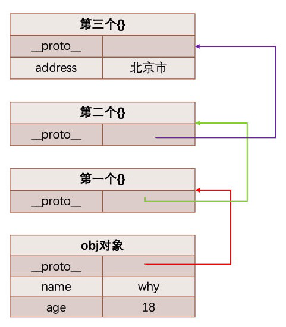
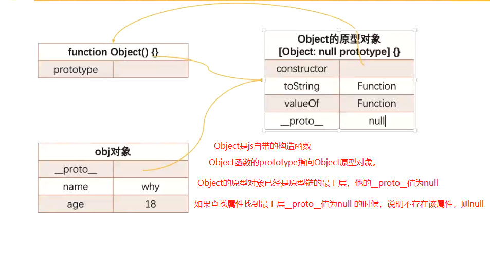
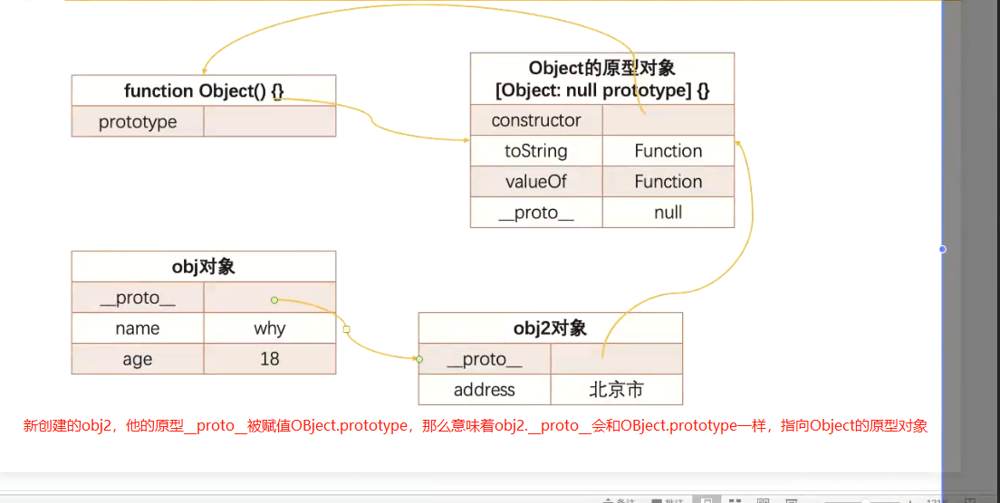
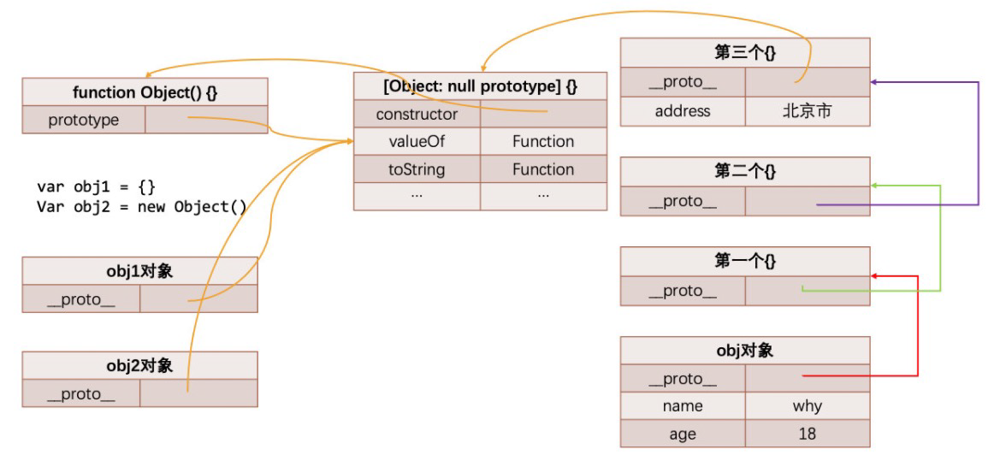
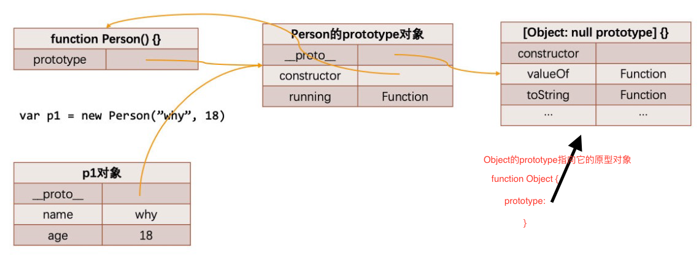

# 10. 面向对象的原型链和继承实现

通过`Object.defineProperty`定义的属性，默认不可枚举的，所以打印不会显示的，但是浏览器为了方便我们更好的调试，一般会用很浅的颜色表示这是一个不可枚举的属性，并显示出来。

## 1. JavaScript中的类和对象

+ 当我们编写如下代码的时候，我们会如何来称呼这个Person呢？
  + 在JS中Person应该被称之为是一个构造函数；
  + 从很多面向对象语言过来的开发者，也习惯称之为类，因为类可以帮助我们创建出来对象p1、p2；
  + 如果从面向对象的编程范式角度来看，Person确实是可以称之为类的；

```js
function Person() {}

var p1 = new Person()
var P2 = new Person()
```

## 2. 面向对象的特性-继承

+ 面向对象有三大特性：封装、继承、多态、（有的人也把抽象算作一大特性）
  + 封装：我们前面将属性和方法封装到一个类中，可以称之为封装的过程；(编写类的过程就是一个封装的过程)
  + 继承：继承是面向对象中非常重要的，不仅仅可以减少重复代码的数量，继承是多态前提（纯面向对象中）；
  + 多态：不同的对象在执行时表现出不同的形态；

+ 那么继承是做什么呢？
  + 继承可以帮助我们将重复的代码和逻辑抽取到父类中，子类只需要直接继承过来使用即可。

## 3. JavaScript原型链

+ 我们知道，从一个对象上获取属性，如果在当前对象中没有获取到就会去它的原型上面获取：

```js
var obj = {
  name: "why",
  age: 18
}

// 读属性时，执行[[get]]操作
// 1.在当前的对象中查找属性
// 2.如果没有找到, 这个时候会去原型链(__proto__)对象上查找
// 开发中不建议使用__proto__，存在兼容性问题
// 可以使用函数的prototype，因为是ECMA统一的标准

obj.__proto__ = {
}

// 原型链
obj.__proto__.__proto__ = {
  
}

// 形成原型链
obj.__proto__.__proto__.__proto__ = {
  address: "上海市"
}

console.log(obj.address)

// 原型对象也是一个对象，也会有自己的原型对象
// 可以理解原型对象是一个相对概念
// 原型对象中__proto__保存一个指向原型对象的地址

```



### 1. Object的原型

+ 那么什么地方是原型链的尽头呢？比如第三个对象是否也是有原型`__proto__`属性呢？

```js
console.log(obj.__proto__.__proto__.__proto__.__proto__) // [Object: null prototype] {}
```

+ 我们会发现它打印的是[Object: null prototype] {}
  + 事实上这个原型就是我们最顶层的原型了
  + 翻译过来原型链就是最顶层的对象就是 `[Object: null prototype] {}`可以管他叫Object的原型对象。或者叫顶层原型
  + 从Object直接创建出来的对象的原型都是[Object: null prototype] {}。
+ 那么我们可能会问题： [Object: null prototype] {} 原型有什么特殊吗？
  + 特殊一：该对象有原型属性，但是它的原型属性已经指向的是null，也就是已经是顶层原型了；
  + 特殊二：该对象上有很多默认的属性和方法；

```js
var obj = { name: "why" }

// console.log(obj.address)

// 到底是找到哪一层对象之后停止继续查找了呢?
// 字面对象obj的原型是 [Object: null prototype] {}
// [Object: null prototype] {} 就是顶层的原型
console.log(obj.__proto__)

// obj.__proto__ => [Object: null prototype] {}
console.log(obj.__proto__.__proto__) // null

```

```js
// 两种定义方式本质是一样的
var obj1 = {} // 创建了一个对象
var obj2 = new Object() // 创建了一个对象

// 1. 创建对象，
// 2. this赋值
// 3. obj2.__proto__ = Object.prototype
// Object.prototype是最顶层的原型，就不再有其他原型了
```

```js
function Person() {}

var p = new Person()
// 1. 内存中创建一个对象
// 2. this 的赋值
// 3. 将Person函数的显示原型prototype赋值给前面创建出来的对象的隐式原型 => p.__proto__ = Person.prototype
// 4. 执行函数体
// 5. 返回对象被接受
```

```js
var obj = {
  name: "why",
  age: 18
}

// Object.prototype
// console.log(obj.__proto__) // [Object: null prototypr] {}
// console.log(Object.prototype) // [Object: null prototype] {}
// console.log(obj.__proto__ === Object.prototype) true
```

+ Object本身是一个函数，一个构造函数

```js
var obj = {
  name: "why",
  age: 18
}

// Object.prototype
// console.log(obj.__proto__)
// console.log(Object.prototype)
// console.log(obj.__proto__ === Object.prototype)

console.log(Object);  // [Function: Object] Object是系统定义好的函数

console.log(Object.prototype) // [Object:null prototype] {} 打印是一个空对象，是因为里面的属性都是不可枚举的
console.log(Object.prototype.constructor) // [Function: Object]
console.log(Object.prototype.__proto__) // null

console.log(Object.getOwnPropertyDescriptors(Object.prototype))
```



```js
var obj = {
  name: "why",
  age: 18
}

var obj2 = {
  // address: "北京市"
}
obj.__proto__ = obj2

```





### 2. Object是所有类的父类

+ 从我们上面的Object原型我们可以得出一个结论：原型链最顶层的原型对象就是Object的原型对象，即`[Object: null prototypr] {}`

+ `Function.prototype === Obejct.__proto__`
+ `Function.__proto__ === Function.prototype`
+ JS 所有的函数都是`Function()`的实例对象



+ Person继承自Object

### 3. 通过原型链实现继承

+ 如果我们现在需要实现继承，那么就可以利用原型链来实现了：
  + 目前`stu`的原型是p对象，而p对象的原型是Person默认的原型，里面包含running等函数；
  + 注意：步骤4和步骤5不可以调整顺序，否则会有问题

```js
// 父类: 公共属性和方法
function Person() {
  this.name = "why"
  this.friends = []
}

Person.prototype.eating = function() {
  console.log(this.name + " eating~")
}

// 子类: 特有属性和方法
function Student() {
  this.sno = 111
}

// 注意这里, 前后顺序问题
// new Person() 返回一个匿名的对象，如果想要更清晰点，可以改成
// Student.prototype = new Person()

var p = new Person()
Student.prototype = p

Student.prototype.studying = function() {
  console.log(this.name + " studying~")
}

var stu = new Student()
// console.log(stu.name)
// stu.eating()


```

+ 注意表达，`var p = new Perosn()`的时候，`Person.prototype`赋值给`p.__proto__`，此时`p`的`__proto__`指向的不是`Person`，而是和`Perosn.prototype`一样指向`Person的原型对象`
+ 注意原型对象是一个相对概念。谁的原型对象。(个人理解)

#### 1. 原型链继承的弊端

+ 目前有一个很大的弊端：某些属性其实是保存在p对象上的；
  + 第一，我们通过直接打印对象是看不到这个属性的；
  + 第二，这个属性会被多个对象共享，如果这个对象是一个引用类型，那么就会造成问题；
  + 第三，不能给Person传递参数，因为这个对象是一次性创建的（没办法定制化）；

```js
// 父类: 公共属性和方法
function Person() {
  this.name = "why"
  this.friends = []
}

Person.prototype.eating = function() {
  console.log(this.name + " eating~")
}

// 子类: 特有属性和方法
function Student() {
  this.sno = 111
}

var p = new Person()
Student.prototype = p

Student.prototype.studying = function() {
  console.log(this.name + " studying~")
}


// name/sno
var stu = new Student()

// console.log(stu.name)
// stu.eating()

// stu.studying()


// 原型链实现继承的弊端:
// 1.第一个弊端: 打印stu对象, 继承的属性是看不到的
// 原型继承父类属性看不到
// console.log(stu.name)

// 2.第二个弊端: 创建出来两个stu的对象
var stu1 = new Student()
var stu2 = new Student()

// 直接修改对象上的属性, 是给本对象添加了一个新属性
// js的语法中，像这种优先添加属性，而不是先去找属性,没有这个属性，就直接使用了[[set]]，不会调用[[get]]
stu1.name = "kobe"
console.log(stu2.name)

// 获取引用, 修改引用中的值, 会相互影响
// 因为这里要使用push方法，所以先要查找使用[[get]]方法往原型链查找是否有这个属性
stu1.friends.push("kobe")

console.log(stu1.friends)
console.log(stu2.friends)

// 假如换成
// stu1.friends = 'sen'
// console.log(stu2.friends);  // []

// 3.第三个弊端: 在前面实现类的过程中都没有传递参数
var stu3 = new Student("lilei", 112)

```

#### 2. 借用构造函数继承

+ 为了解决原型链继承中存在的问题，开发人员提供了一种新的技术: constructor stealing(有很多名称: 借用构造函数或者称之为经典继承或者称之为伪造对象)：
  + steal是偷窃、剽窃的意思，但是这里可以翻译成借用；
+ 借用继承的做法非常简单：在子类型构造函数的内部调用父类型构造函数.
  + 因为函数可以在任意的时刻被调用；
  + 因此通过apply()和call()方法也可以在新创建的对象上执行构造函数；

```js
// 父类: 公共属性和方法
function Person(name, age, friends) {
  // this = stu
  this.name = name
  this.age = age
  this.friends = friends
}

Person.prototype.eating = function() {
  console.log(this.name + " eating~")
}

// 子类: 特有属性和方法
function Student(name, age, friends, sno) {
  Person.call(this, name, age, friends)
  // this.name = name
  // this.age = age
  // this.friends = friends
  this.sno = 111
}

var p = new Person()
Student.prototype = p

Student.prototype.studying = function() {
  console.log(this.name + " studying~")
}


// name/sno
var stu = new Student("why", 18, ["kobe"], 111)

// console.log(stu.name)
// stu.eating()

// stu.studying()


// 原型链实现继承已经解决的弊端
// 1.第一个弊端: 打印stu对象, 继承的属性是看不到的
console.log(stu)

// 2.第二个弊端: 创建出来两个stu的对象
var stu1 = new Student("why", 18, ["lilei"], 111)
var stu2 = new Student("kobe", 30, ["james"], 112)

// // 直接修改对象上的属性, 是给本对象添加了一个新属性
// stu1.name = "kobe"
// console.log(stu2.name)

// // 获取引用, 修改引用中的值, 会相互影响
stu1.friends.push("lucy")

console.log(stu1.friends)
console.log(stu2.friends)

// // 3.第三个弊端: 在前面实现类的过程中都没有传递参数
// var stu3 = new Student("lilei", 112)


// 强调: 借用构造函数也是有弊端:
// 1.第一个弊端: Person函数至少被调用了两次
// new Person() 和 Person.call

// 2.第二个弊端: stu的原型对象上会多出一些属性, 但是这些属性是没有存在的必要
// 比如我的stu2中的属性和p对象的属性有重复的属性

```

#### 3. 组合借用继承的问题

+ 组合继承是JavaScript最常用的继承模式之一：
  + 组合继承最大的问题就是无论在什么情况下，都会调用两次父类构造函数。
    + 一次在创建子类原型的时候；
    + 另一次在子类构造函数内部(也就是每次创建子类实例的时候)；
  + 另外，如果你仔细按照我的流程走了上面的每一个步骤，你会发现：所有的子类实例事实上会拥有两份父类的属性
    + 一份在当前的实例自己里面(也就是person本身的)，另一份在子类对应的原型对象中(也就是`person.__proto__`里面)；
    + 当然，这两份属性我们无需担心访问出现问题，因为默认一定是访问实例本身这一部分的；


