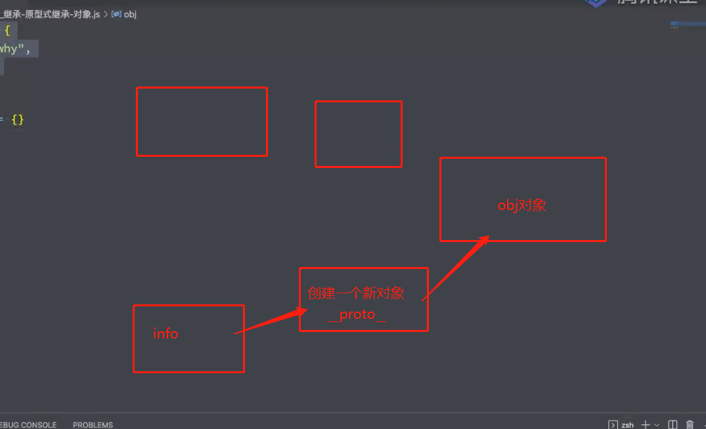
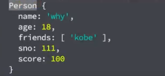
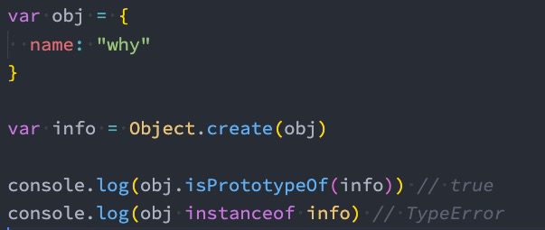
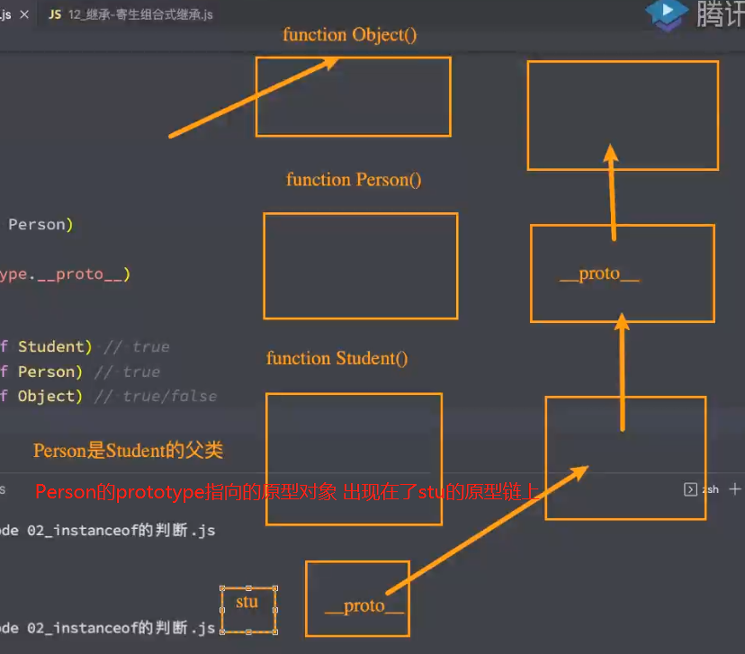
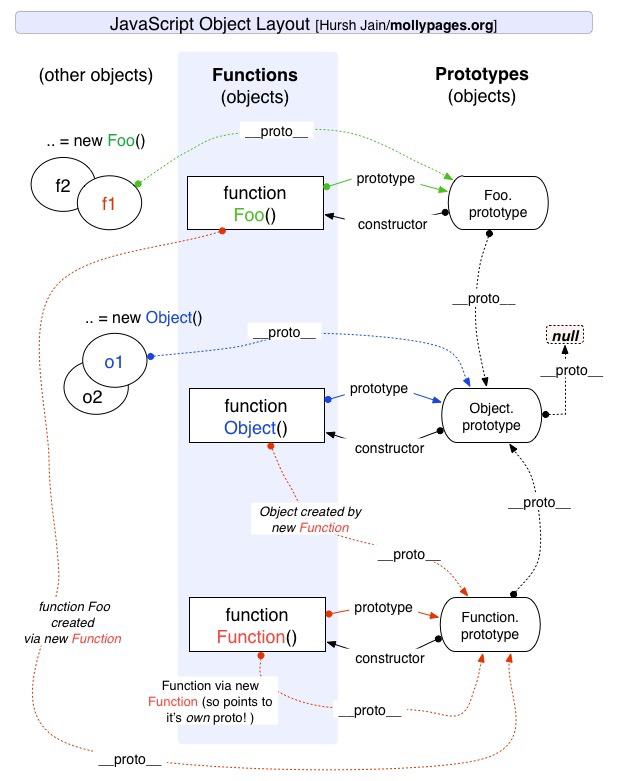
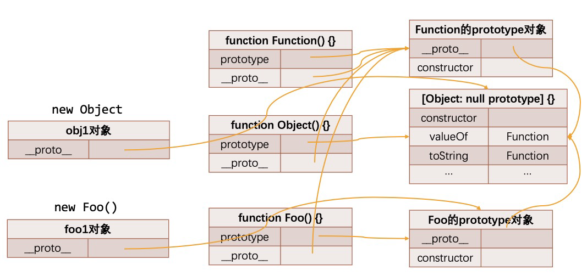
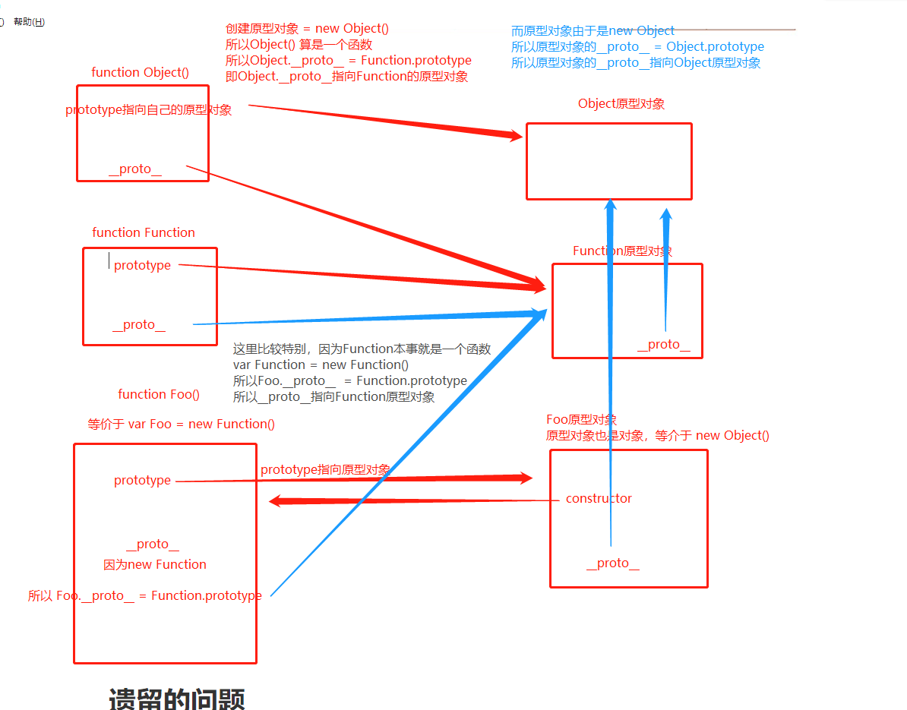

# 11. 继承的实现-对象-函数-原型的关系

## 1. 原型式继承函数

+ 原型式继承：目标是在继承`obj`和`info`之间继承增加一个新对象，我们可以通过对这个新对象增加属性，而不会导致修改`obj`对象中属性一些默认值或默认方法被修改，添加无重复的属性。



+ 实现方法：

```js
// 现在实现的方法
var obj = {
  name: "why",
  age: 18
}

function createObject1(o) {
  var newObj = {}
  // 给newObj原型设置为传入参数的原型
  Object.setPrototypeOf(newObj, o)
  return newObj
}

var info = createObject1(obj)

console.log(info)
console.log(info.__proto__)

```

```js
// 过去实现方法
var obj = {
  name: "why",
  age: 18
}

function createObject2(o) {
  function Fn() {}
  Fn.prototype = o
  var newObj = new Fn()
  return newObj
}

var info = createObject2(obj)

console.log(info)
console.log(info.__proto__)
```

```js
// 最新ECMA提供的方法

var info = Object.create(obj)
// 这个方法实现的就是createObject1和createObject2
```

+ 实现的目的都是新创建的对象作为我们目标对象`info`的原型。并且新创建的对象指向的是我们的`Person`
+ 上面的实现方式都是基于对象。

## 2. 寄生式继承函数

+ 寄生式(Parasitic)继承
  + 寄生式(Parasitic)继承是与原型式继承紧密相关的一种思想, 并且同样由道格拉斯·克罗克福德(Douglas Crockford)提出和推广的；
  + 寄生式继承的思路是结合原型类继承和工厂模式的一种方式；
  + 即创建一个封装继承过程的函数, 该函数在内部以某种方式来增强对象，最后再将这个对象返回；

```js

var personObj = {
  running: function() {
    console.log("running")
  }
}

// 这里相当于一个工厂函数
function createStudent(name) {
  var stu = Object.create(personObj)
  stu.name = name
  stu.studying = function() {
    console.log("studying~")
  }
  return stu
}

var stuObj = createStudent("why")
var stuObj1 = createStudent("kobe")
var stuObj2 = createStudent("james")
```

+ 回顾组合式继承

  + 组合继承是比较理想的继承方式, 但是存在两个问题:

  + 问题一: 构造函数会被调用两次: 一次在创建子类型原型对象的时候, 一次在创建子类型实例的时候.
  + 问题二: 父类型中的属性会有两份: 一份在原型对象中, 一份在子类型实例中.

+ 事实上, 我们现在可以利用寄生式继承将这两个问题给解决掉.

  + 你需要先明确一点: 当我们在子类型的构造函数中调用父类型.call(this, 参数)这个函数的时候, 就会将父类型中的属性和方法复制一份到了子类型中. 所以父类型本身里面的内容, 我们不再需要.
  + 这个时候, 我们还需要获取到一份父类型的原型对象中的属性和方法.

+ 能不能直接让子类型的原型对象= 父类型的原型对象呢?

```js
// 父类: 公共属性和方法
function Person(name, age, friends) {
  // this = stu
  this.name = name
  this.age = age
  this.friends = friends
}

Person.prototype.eating = function() {
  console.log(this.name + " eating~")
}

// 子类: 特有属性和方法
function Student(name, age, friends, sno) {
  Person.call(this, name, age, friends)
  // this.name = name
  // this.age = age
  // this.friends = friends
  this.sno = 111
}

// 这里这里看这里
// 直接将父类的原型赋值给子类, 作为子类的原型
Student.prototype = Person.prototype

// 如果我们给Student的prototype添加属性，会导致Person.prototype发送变化。简介导致继承Person的对象读取原型链时，内容变化。甚至添加多余的属性

Student.prototype.studying = function() {
  console.log(this.name + " studying~")
}


// name/sno
var stu = new Student("why", 18, ["kobe"], 111)
console.log(stu)
stu.eating()

```

+ 不要这么做, 因为这么做意味着以后修改了子类型原型对象的某个引用类型的时候, 父类型原生对象的引用类型也会被修改.

## 3. 寄生组合继承的代码

```js
function Person(name, age, friends) {
  this.name = name
  this.age = age
  this.friends = friends
}

Person.prototype.running = function() {
  console.log("running~")
}

Person.prototype.eating = function() {
  console.log("eating~")
}

function Student(name, age, friends, sno, score) {
  Person.call(this, name, age, friends)
  this.sno = sno
  this.score = score
}

// 实现赋值
Student.prototype = Object.create(Person.prototype)

Student.prototype.studying = function() {
  console.log("studying~")
}

var stu = new Student("why", 18, ["kobe"], 111, 100)
console.log(stu)
stu.studying()
stu.running()
stu.eating()

console.log(stu.constructor.name)
```

答应结果：



这个Person类型式怎么来的？

这个名字来源于我们对象中`stu.constructor.name`

由于我们指向了`Student.prototype = Object.create(Person.prototype)`使得我们的原型对象指向一个新的对象，并且这个对象上式没有`constructor`，那么就会去原型链上找，最终找到`Person`的原型对象中`constructor`，而`constructor`指向的就是`Person`自己。

如果我们想自定义要假如

```js
Object.defineProperty(SubType.prototype, "constructor", {
    enumerable: false,
    configurable: true,
    writable: true,
    value: SubType
})
```

```js 

function createObject(o) {
  function Fn() {}
  Fn.prototype = o
  return new Fn()
}

// 实现一个工具函数
function inheritPrototype(SubType, SuperType) {
  
  // SubType.prototype = createObject(SuperType.prototype)
  // 改成使用ECMA最新的方法  
  SubType.prototype = Objec.create(SuperType.prototype)
    
  Object.defineProperty(SubType.prototype, "constructor", {
    enumerable: false,
    configurable: true,
    writable: true,
    value: SubType
  })
}

function Person(name, age, friends) {
  this.name = name
  this.age = age
  this.friends = friends
}

Person.prototype.running = function() {
  console.log("running~")
}

Person.prototype.eating = function() {
  console.log("eating~")
}


function Student(name, age, friends, sno, score) {
  Person.call(this, name, age, friends)
  this.sno = sno
  this.score = score
}

inheritPrototype(Student, Person)

Student.prototype.studying = function() {
  console.log("studying~")
}

var stu = new Student("why", 18, ["kobe"], 111, 100)
console.log(stu)
stu.studying()
stu.running()
stu.eating()

console.log(stu.constructor.name)

```

## 4. 对象的方法补充

+ hasOwnProperty
  + 对象是否有某一个属于自己的属性（不是在原型上的属性）

+ in/for in 操作符
  + 判断某个属性是否在某个对象或者对象的原型上
+ instanceof
  + 用于检测构造函数的pototype，是否出现在某个实例对象的原型链上
+ isPrototypeOf
  + 用于检测某个对象，是否出现在某个实例对象的原型链上



```js
var obj = {
  name: "why",
  age: 18
}

// Object.create内部创建一个对象，然后原型指向obj，并且给这个空对象加入address,然后返回这个新对象
var info = Object.create(obj, {
  address: {
    value: "北京市",
    enumerable: true
  }
})

console.log(info) // {address: '北京市'}
console.log(info.__proto__) // {name: 'why', age: 18}

// hasOwnProperty方法判断是不是自己的属性
console.log(info.hasOwnProperty("address")) // true
console.log(info.hasOwnProperty("name")) // false

// in 操作符: 不管在当前对象还是原型中返回的都是true
console.log("address" in info) // true
console.log("name" in info) // true

// // for in 不管在当前对象还是原型中返回的都是true
for (var key in info) {
  console.log(key) // 
}

```

```js
// instanceof用于检查构造函数的prototype， 是否出现在某个实例对象的原型链上
// 注意是构造函数的prototype

function createObject(o) {
  function Fn() {}
  Fn.prototype = o
  return new Fn()
}

function inheritPrototype(SubType, SuperType) {
  SubType.prototype = createObject(SuperType.prototype)
  Object.defineProperty(SubType.prototype, "constructor", {
    enumerable: false,
    configurable: true,
    writable: true,
    value: SubType
  })
}


function Person() {

}

function Student() {

}

inheritPrototype(Student, Person)

console.log(Person.prototype.__proto__)

var stu = new Student()
// 判断stu的原型上是否有Student
console.log(stu instanceof Student) // true
// 判断stu的原型上是否有Person
console.log(stu instanceof Person) // true
console.log(stu instanceof Object) // true

```



```js
function Person() {

}

var p = new Person()

console.log(p instanceof Person)
// 等价于 info 去找obj.prototype
// instanceof传入构造函数，让对象在函数的prototype上找

console.log(Person.prototype.isPrototypeOf(p))

// 
var obj = {
  name: "why",
  age: 18
}

var info = Object.create(obj)

// console.log(info instanceof obj)


// 检查对象是否出现在这原型链上
// isPrototypeOf传入对象
console.log(Person.prototype.isPrototypeOf(p))
// 判断obj是否出现在info原型链上面。被判断的在前面
// instanceof被判断的作为参数传入
console.log(obj.isPrototypeOf(info))

```

## 5. 原型继承关系



```js
var obj = {
  name: "why"
}

// var obj ={} 等价于new Object()
// 所以
// console.log( obj.__proto__ === Object.prototype )
console.log(obj.__proto__)

// 对象里面是有一个__proto__对象: 隐式原型对象

// Foo是一个函数, 那么它会有一个显示原型对象: Foo.prototype
// Foo.prototype来自哪里?
// 答案:  一旦你创建了一个函数, Foo.prototype = { constructor: Foo }
// js引擎就会自动创建{ constructor: Foo }，并完成Foo.prototype指向{ constructor: Foo }

// Foo是一个对象, 那么它会有一个隐式原型对象: Foo.__proto__
// Foo.__proto__来自哪里?
// 答案: new Function()的时候。指向  Foo.__proto__ = Function.prototype
// 而Function.prototype = { constructor: Function }
// 所以Foo中的__proto__和prototype指向是不一样的

// var Foo = new Function()
// 等价于
function Foo() {

}

console.log(Foo.prototype === Foo.__proto__) // false
console.log(Foo.prototype.constructor) // [Function: Foo]
console.log(Foo.__proto__.constructor) // [Function: Function]


var foo1 = new Foo()
var obj1 = new Object()

console.log(Object.getOwnPropertyDescriptors(Function.__proto__))


```






谁被谁创建的指向谁的原型对象。

比较奇妙的是

Object()是我们Function创建出来的，但是Function继承自Obejct。

Object的原型对象的`__proto__`指向null


# 遗留的问题

```js
console.log(Object.constructor)
```


