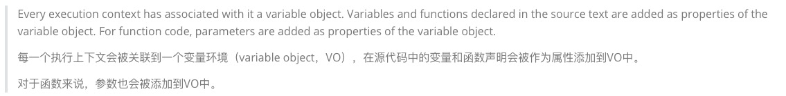
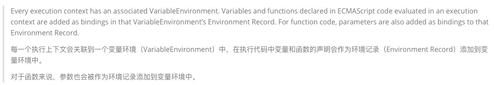

# 13. ES6语法

## 1. 字面量增强

+ ES6中对 对象字面量 进行了增强，称之为 Enhanced object literals（增强对象字面量）
+ 字面量的增强主要包括下面几部分：
  + 属性的简写：Property Shorthand
  + 方法的简写：Method Shorthand
  + 计算属性名：Computed Property Names

```js
const a = {
    b: () => {
        console.log(this)
    },
    c() {
        console.log(this)
    }
}

a.b() // 箭头函数不绑定this，向上作用域查找
a.c() // 隐式绑定

// Window {0: Window, window: Window, self: Window, document: document, name: '', location: Location, …}
// {b: ƒ, c: ƒ}
```

```js
// {}就是对象的字面量
var bar = {}

var name = "why"
var age = 18

var obj = {
  
  // name: name,
  // age: age,
  //当我们的key和value的标识符完全一样的时候，ES6中可以对象的字面量增强写成同一个，比如下面的
  // 算是一种语法糖，简写

  // 1.property shorthand(属性的简写)
  name,
  age,


  // 2.method shorthand(方法的简写)
  foo: function() {
    console.log(this)
  },
  // ES6简写
  bar() {
    console.log(this)
  },
  // 和下面不同，箭头函数不绑定this，这种表示给baz绑定箭头函数
  baz: () => {
    // 
    console.log(this)
  },

  // 3.computed property name(计算属性名)
  [name + 123]: 'hehehehe'
}

obj.baz() // {}
obj.bar()
obj.foo()

// obj[name + 123] = "hahaha"
console.log(obj)

```

## 2. 解构

+ ES6中新增了一个从数组或对象中方便获取数据的方法，称之为解构Destructuring。
+ 我们可以划分为：数组的解构和对象的解构。
+ 数组的解构：
  + 基本解构过程
  + 顺序解构
  + 解构出数组
  + 默认值

```js
var names = ["abc", "cba", "nba"]
// var item1 = names[0]
// var item2 = names[1]
// var item3 = names[2]

// 对数组的解构: []
// 数组是按照顺序解构的
var [item1, item2, item3] = names
console.log(item1, item2, item3)

// 解构后面的元素
var [, , itemz] = names
console.log(itemz)

// 解构出一个元素,后面的元素放到一个新数组中
// ...newNames类似剩余参数的写法，把剩下的放到一起
var [itemx, ...newNames] = names
console.log(itemx, newNames)

// 解构的默认值
// 没有传入'aaa'就是undefined
var [itema, i1temb, itemc, itemd = "aaa"] = names
console.log(itemd)

```

+ 对象的解构：
  + 基本解构过程
  + 任意顺序
  + 重命名
  + 默认值

```js
var obj = {
  name: "why",
  age: 18,
  height: 1.88
}

// 对象的解构: {}
// 对象根据key拿到解构值，所以没有顺序，对象本身也是无序的
var { name, age, height } = obj
console.log(name, age, height)

var { age } = obj
console.log(age)

var { name: newName } = obj
console.log(newName)

// 重命名，默认值
var { address: newAddress = "广州市" } = obj
console.log(newAddress)


function foo(info) {
  console.log(info.name, info.age)
}

foo(obj)

// 传入的参数对象，在参数里面用大括号里解构
function bar({name, age}) {
  console.log(name, age)
}

bar(obj)

```

## 3. let/const基本使用

+ 在ES5中我们声明变量都是使用的var关键字，从ES6开始新增了两个关键字可以声明变量：let、const
  + let、const在其他编程语言中都是有的，所以也并不是新鲜的关键字；
  + 但是let、const确确实实给JavaScript带来一些不一样的东西；
+ let关键字：
  + 从直观的角度来说，let和var是没有太大的区别的，都是用于声明一个变量
+ const关键字：
  + const关键字是constant的单词的缩写，表示常量、衡量的意思；
  + 它表示保存的数据一旦被赋值，就不能被修改；
  + 但是如果赋值的是引用类型，那么可以通过引用找到对应的对象，修改对象的内容；
+ 注意：另外let、const不允许重复声明变量；

```js
// const constant(常量/衡量) 不可以修改
// const name = "abc"
// name = "cba"

// 注意事项一: const本质上是传递的值不可以修改
// 但是如果传递的是一个引用类型(常量保存的则是内存地址), 可以通过引用找到对应的对象, 去修改对象内部的属性, 这个是可以的
const obj = {
  foo: "foo"
}

// obj = {} 这个不行，修改了保存的地址
obj.foo = "aaa" // 并没有修改保存的地址，而是根据地址修改内存里保存的内容
console.log(obj.foo)

```

```js
// 注意事项二: 通过let/const定义的变量名是不可以重复定义
// var foo = "abc" // var可以重复定义
// var foo = "cba"

let foo = "abc"
// SyntaxError: Identifier 'foo' has already been declared
let foo = "cba"

console.log(foo)

```

## 4. let/const作用域提升

+ n let、const和var的另一个重要区别是作用域提升：
  + 我们知道var声明的变量是会进行作用域提升的；
  + 但是如果我们使用let声明的变量，在声明之前访问会报错；

```js
// var会进行作用域提升
// console.log(foo)
// var foo = "foo"

// Reference(引用)Error: Cannot access 'foo' before initialization(初始化)
// let/const他们是没有作用域提升,本质上是因为ECMA规定这些变量会被创建在包含他们的词法环境被实例化时，但是是不可以访问它们的，直到词法绑定被求值；

// foo被创建出来了, 但是不能被访问
// 作用域提升: 能提前被访问
console.log(foo)
let foo = "foo"

```

+ 那么是不是意味着foo变量只有在代码执行阶段才会创建的呢？
  + 事实上并不是这样的，我们可以看一下ECMA262对let和const的描述；
  + 这些变量会被创建在包含他们的词法环境被实例化时，但是是不可以访问它们的，直到词法绑定被求值

## 5. let/const有没有作用域提升呢？

+ 从上面我们可以看出，在执行上下文的词法环境创建出来的时候，变量事实上已经被创建了，只是这个变量是不能被访问的。
  + 那么变量已经有了，但是不能被访问，是不是一种作用域的提升呢？..
+ 事实上维基百科并没有对作用域提升有严格的概念解释，那么我们自己从字面量上理解；
  + 作用域提升：在声明变量的作用域中，如果这个变量可以在声明之前被访问，那么我们可以称之为作用域提升；
  + 在这里，它虽然被创建出来了，但是不能被访问，我认为不能称之为作用域提升；
+ 所以我的观点是let、const没有进行作用域提升，但是会在解析阶段被创建出来。





## 6. Window对象添加属性

+ 我们知道，在全局通过var来声明一个变量，事实上会在window上添加一个属性：
  + 但是let、const是不会给window上添加任何属性的。
+ 那么我们可能会想这个变量是保存在哪里呢？
+ n 我们先回顾一下最新的ECMA标准中对执行上下文的描述


