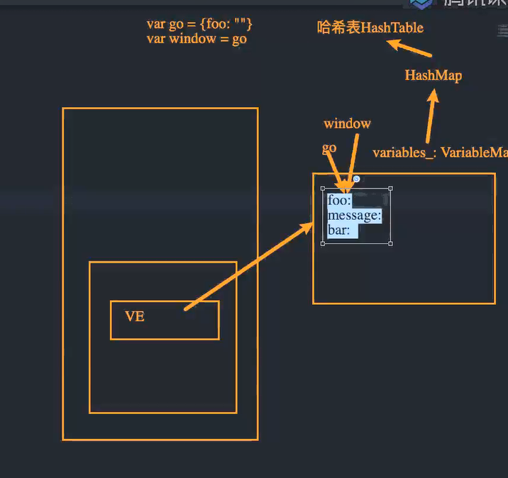
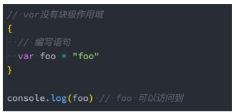

# 13. ES6语法

## 1. 字面量增强

+ ES6中对 对象字面量 进行了增强，称之为 Enhanced object literals（增强对象字面量）
+ 字面量的增强主要包括下面几部分：
  + 属性的简写：Property Shorthand
  + 方法的简写：Method Shorthand
  + 计算属性名：Computed Property Names

```js
const a = {
    b: () => {
        console.log(this)
    },
    c() {
        console.log(this)
    }
}

a.b() // 箭头函数不绑定this，向上作用域查找
a.c() // 隐式绑定

// Window {0: Window, window: Window, self: Window, document: document, name: '', location: Location, …}
// {b: ƒ, c: ƒ}
```

```js
// {}就是对象的字面量
var bar = {}

var name = "why"
var age = 18

var obj = {
  
  // name: name,
  // age: age,
  //当我们的key和value的标识符完全一样的时候，ES6中可以对象的字面量增强写成同一个，比如下面的
  // 算是一种语法糖，简写

  // 1.property shorthand(属性的简写)
  name,
  age,


  // 2.method shorthand(方法的简写)
  foo: function() {
    console.log(this)
  },
  // ES6简写
  bar() {
    console.log(this)
  },
  // 和下面不同，箭头函数不绑定this，这种表示给baz绑定箭头函数
  baz: () => {
    // 
    console.log(this)
  },

  // 3.computed property name(计算属性名)
  [name + 123]: 'hehehehe'
}

obj.baz() // {}
obj.bar()
obj.foo()

// obj[name + 123] = "hahaha"
console.log(obj)

```

## 2. 解构

+ ES6中新增了一个从数组或对象中方便获取数据的方法，称之为解构Destructuring。
+ 我们可以划分为：数组的解构和对象的解构。
+ 数组的解构：
  + 基本解构过程
  + 顺序解构
  + 解构出数组
  + 默认值

```js
var names = ["abc", "cba", "nba"]
// var item1 = names[0]
// var item2 = names[1]
// var item3 = names[2]

// 对数组的解构: []
// 数组是按照顺序解构的
var [item1, item2, item3] = names
console.log(item1, item2, item3)

// 解构后面的元素
var [, , itemz] = names
console.log(itemz)

// 解构出一个元素,后面的元素放到一个新数组中
// ...newNames类似剩余参数的写法，把剩下的放到一起
var [itemx, ...newNames] = names
console.log(itemx, newNames)

// 解构的默认值
// 没有传入'aaa'就是undefined
var [itema, i1temb, itemc, itemd = "aaa"] = names
console.log(itemd)

```

+ 对象的解构：
  + 基本解构过程
  + 任意顺序
  + 重命名
  + 默认值

```js
var obj = {
  name: "why",
  age: 18,
  height: 1.88
}

// 对象的解构: {}
// 对象根据key拿到解构值，所以没有顺序，对象本身也是无序的
var { name, age, height } = obj
console.log(name, age, height)

var { age } = obj
console.log(age)

var { name: newName } = obj
console.log(newName)

// 重命名，默认值
var { address: newAddress = "广州市" } = obj
console.log(newAddress)


function foo(info) {
  console.log(info.name, info.age)
}

foo(obj)

// 传入的参数对象，在参数里面用大括号里解构
function bar({name, age}) {
  console.log(name, age)
}

bar(obj)

```

## 3. let/const基本使用

+ 在ES5中我们声明变量都是使用的var关键字，从ES6开始新增了两个关键字可以声明变量：let、const
  + let、const在其他编程语言中都是有的，所以也并不是新鲜的关键字；
  + 但是let、const确确实实给JavaScript带来一些不一样的东西；
+ let关键字：
  + 从直观的角度来说，let和var是没有太大的区别的，都是用于声明一个变量
+ const关键字：
  + const关键字是constant的单词的缩写，表示常量、衡量的意思；
  + 它表示保存的数据一旦被赋值，就不能被修改；
  + 但是如果赋值的是引用类型，那么可以通过引用找到对应的对象，修改对象的内容；
+ 注意：另外let、const不允许重复声明变量；

```js
// const constant(常量/衡量) 不可以修改
// const name = "abc"
// name = "cba"

// 注意事项一: const本质上是传递的值不可以修改
// 但是如果传递的是一个引用类型(常量保存的则是内存地址), 可以通过引用找到对应的对象, 去修改对象内部的属性, 这个是可以的
const obj = {
  foo: "foo"
}

// obj = {} 这个不行，修改了保存的地址
obj.foo = "aaa" // 并没有修改保存的地址，而是根据地址修改内存里保存的内容
console.log(obj.foo)

```

```js
// 注意事项二: 通过let/const定义的变量名是不可以重复定义
// var foo = "abc" // var可以重复定义
// var foo = "cba"

let foo = "abc"
// SyntaxError: Identifier 'foo' has already been declared
let foo = "cba"

console.log(foo)

```

## 4. let/const作用域提升

+ n let、const和var的另一个重要区别是作用域提升：
  + 我们知道var声明的变量是会进行作用域提升的；
  + 但是如果我们使用let声明的变量，在声明之前访问会报错；

```js
// var会进行作用域提升
// console.log(foo)
// var foo = "foo"

// Reference(引用)Error: Cannot access 'foo' before initialization(初始化)
// let/const他们是没有作用域提升,本质上是因为ECMA规定这些变量会被创建在包含他们的词法环境被实例化时，但是是不可以访问它们的，直到词法绑定被求值；

// foo被创建出来了, 但是不能被访问
// 作用域提升: 能提前被访问
console.log(foo)
let foo = "foo"

```

+ 那么是不是意味着foo变量只有在代码执行阶段才会创建的呢？
  + 事实上并不是这样的，我们可以看一下ECMA262对let和const的描述；
  + 这些变量会被创建在包含他们的词法环境被实例化时，但是是不可以访问它们的，直到词法绑定被求值

## 5. let/const有没有作用域提升呢？

+ 从上面我们可以看出，在执行上下文的词法环境创建出来的时候，变量事实上已经被创建了，只是这个变量是不能被访问的。
  + 那么变量已经有了，但是不能被访问，是不是一种作用域的提升呢？..
+ 事实上维基百科并没有对作用域提升有严格的概念解释，那么我们自己从字面量上理解；
  + 作用域提升：在声明变量的作用域中，如果这个变量可以在声明之前被访问，那么我们可以称之为作用域提升；
  + 在这里，它虽然被创建出来了，但是不能被访问，我认为不能称之为作用域提升；
+ 所以我的观点是let、const没有进行作用域提升，但是会在解析阶段被创建出来。

## 6. Window对象添加属性

+ 我们知道，在全局通过var来声明一个变量，事实上会在window上添加一个属性：
  + 但是let、const是不会给window上添加任何属性的。
+ 那么我们可能会想这个变量是保存在哪里呢？
+ n 我们先回顾一下最新的ECMA标准中对执行上下文的描述
  + 旧的


+ + 新的


在新的ECMA规范下：执行js代码的时候会创建上下文，里面就会有VE，在v8引擎里，VE指向的就是一个对象`variables_`，类型是`VariableMap`。本质是由C++的HashMap数据结构实现（内部就是哈希表）。



事实上window不属于V8实现的，而是交由包含V8引擎的浏览器实现的。所以variables和window肯定不是同一个

## 7. 变量被保存到VariableMap中

+ 也就是说我们声明的变量和环境记录是被添加到变量环境中的：
  + 但是标准有没有规定这个对象是window对象或者其他对象呢？
  + 其实并没有，那么JS引擎在解析的时候，其实会有自己的实现；
  + 比如v8中其实是通过VariableMap的一个hashmap来实现它们的存储的。
  + 那么window对象呢？而window对象是早期的GO对象，在最新的实现中其实是浏览器添加的全局对象，并且一直保持了window和var之间值的相等性；

## 8. var的块作用域

+ 在ES6之前，JavaScript只会形成两个作用域：全局作用域和函数作用域。

```js
// ES5
// 块代码(block code)
{
  // 里面写代码表达式
}

// 声明对象字面量,和上面的大括号作用完全不一样
var obj = {} 

```


+ ES5中放到一个代码中定义的变量，外面是可以访问的：



```js
// 在ES5中只有两个东西会形成作用域
// 1.全局作用域
// 2.函数作用域
// function foo() {
//   var bar = "bar"
// }

// console.log(bar)
```

## 9. let/const的块级作用域

+ 在ES6中新增了块级作用域，并且通过let、const、function、class声明的标识符是具备块级作用域的限制的：

```js
{
    let foo = "foo"
    function bar() {
        console.log("bar")
    }
    class Person {}
}

console.log(foo) // ReferenceError: foo is not defined
bar() // 可以访问
var p = new Person() // ReferenceError: foo is not defined
```

+ 但是我们会发现函数拥有块级作用域，但是外面依然是可以访问的：
  + 这是因为引擎会对函数的声明进行特殊的处理，允许像var那样进行提升；

```JS

// ES6的代码块级作用域
// 对let/const/function/class声明的类型是有效
// 对var声明无效
{
  let foo = "why"
  function demo() {
    console.log("demo function")
  }
  class Person {}
}

// console.log(foo) // foo is not defined
// 不同的浏览器有不同实现的(大部分浏览器为了兼容以前的代码, 让function是没有块级作用域)
// demo()
var p = new Person() // Person is not defined

```

if-switch-for也是块级作用域

```js
// if语句的代码就是块级作用域
if (true) {
  var foo = "foo"
  let bar = "bar"
}

// 可以访问
console.log(foo)
// 不能访问
console.log(bar)

```

```js
// switch语句的代码也是块级作用域
var color = "red"

switch (color) {
  case "red":
    var foo = "foo"
    let bar = "bar"
}

console.log(foo)
console.log(bar)

```

```js
// for语句的代码也是块级作用域
for (var i = 0; i < 10; i++) {
  // console.log("Hello World" + i)
}

console.log(i)

for (let i = 0; i < 10; i++) {
}

console.log(i)

```

```js
for(let i = 0; i<1; i++) {}

console.log(i)
访问不到i
```

## 10. 块级作用域的应用

```html
<button>按钮1</button>
<button>按钮2</button>
<button>按钮3</button>
<button>按钮4</button>
```

```js
const btns = document.getElementsByTagName('button')

// var i ，导致i定义在全局，所以i++以后，i其实已经变成4了，且没有重新计算赋值的画，访问结果都是4
// 因为var没有定义作用域，所以函数在被执行的时候找i的时候会一直向上找，直到在全局作用域下找到var i
for (var i = 0; i <btns.length; i++) {
    btns[i].onclick = function() {
        console.log("第"+ i + "个按钮被点击")
    }
}

console.log(i) //4

// 可以理解成，for执行完成后
// var是没有块级作用域的
var i

{
    btns[0].onclick = function() {console.log("第"+ i + "个按钮被点击")}
}
{
    btns[1].onclick = function() {console.log("第"+ i + "个按钮被点击")}
}
{
    btns[2].onclick = function() {console.log("第"+ i + "个按钮被点击")}
} 
{
    btns[3].onclick = function() {console.log("第"+ i + "个按钮被点击")}
}
// 最后的i++,此时i=4

// 当单击触发函数，开始查找i的时候，结果都为4
```

```js
// 解决办法，使用立即执行
for(var i = 0; i < btns.length; i++) {
    (function(n) {
        // 下面的函数与n形成闭包
        // 里面的i
         btns[i].onclick = function() {
        console.log("第"+ n + "个按钮被点击")
    }
    })(i) // 每一次立即执行，把当前i传进去
}

// 等价于
{
    // 形成一个闭包，n被限制在function作用域里
    n = 0 
    btns[1].onclick = function() {console.log("第"+ n + "个按钮被点击")}
}
....

```

```js
for (let i = 0; i <btns.length; i++) {
    btns[i].onclick = function() {
        console.log("第"+ i + "个按钮被点击")
    }
}

// 因为let可以形成块级作用域
{
 let i = 0 
 btns[0].onclick = function() {console.log("第"+ i + "个按钮被点击")}
}

{
 let i = 1 
 btns[1].onclick = function() {console.log("第"+ i + "个按钮被点击")}
}
...

// i is not defined。因为let i 是有块级作用域的限制
console.log(i)

```

```js
const names = ["abc", "cba", "nba"]

// 不可以使用const
// for (let i = 0; i < names.length; i++) {
//   console.log(names[i])
// }

// {
//   let i = 0
//   console.log(names[i])
// }

// {
//   这里会执行把上一个值进行++ ，燃赋值给i的操作。
//   由于我们的const定义的常量，是i++，先定义再计算赋值，然后返回赋值，所以会报错
//   let i = 1
//   console.log(names[i])
// }

// {
//   let i = 2
//   console.log(names[i])
// }

// for...of: ES6新增的遍历数组(对象)
for (const item of names) {
  console.log(item)
}

// {
//   这里可以是因为这是块级作用域，不会和下面的const item重复定义
//   const item = "abc"
//   console.log(item)
// }

// {
//   const item = "cba"
//   console.log(item)
// }

// console.log(item)
  
```

## 11. 暂时性死区

+ 在ES6中，我们还有一个概念称之为暂时性死区：
  + 它表达的意思是在一个代码中，使用let、const声明的变量，在声明之前，变量都是不可以访问的；
  + 我们将这种现象称之为 temporal dead zone（暂时性死区，TDZ）；

```js
var foo = "foo"

if(true) {
    console.log(foo) // ReferenceError: Cannot access 'foo' before initialization
    
    let foo = "bar"
}

function bar() {
    console.log(foo)// ReferenceError: Cannot access 'foo' before initialization
    
    let foo = "abc"
}
bar()

```

## 12. var、let、const的选择

+ 那么在开发中，我们到底应该选择使用哪一种方式来定义我们的变量呢？
+ 对于var的使用：
  + 我们需要明白一个事实，var所表现出来的特殊性：比如作用域提升、window全局对象、没有块级作用域等都是一些 历史遗留问题；
  + 其实是JavaScript在设计之初的一种语言缺陷； 
  + 当然目前市场上也在利用这种缺陷出一系列的面试题，来考察大家对JavaScript语言本身以及底层的理解； 
  +  但是在实际工作中，我们可以使用最新的规范来编写，也就是不再使用var来定义变量了； 
+ 对于let、const： 
  + 对于let和const来说，是目前开发中推荐使用的；
  + 我们会有限推荐使用const，这样可以保证数据的安全性不会被随意的篡改； 
  + 只有当我们明确知道一个变量后续会需要被重新赋值时，这个时候再使用let； 
  + 这种在很多其他语言里面也都是一种约定俗成的规范，尽量我们也遵守这种规范；


