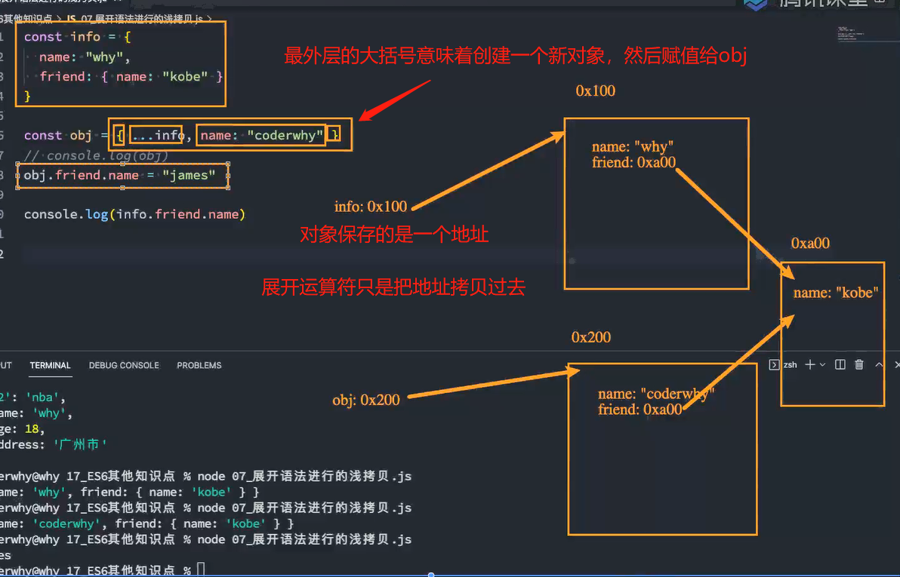

# 14. ES6知识点详细解析

## 1. 字符串模板基本使用

+ 在ES6之前，如果我们想要将字符串和一些动态的变量（标识符）拼接到一起，是非常麻烦和丑陋的（ugly）。

+ ES6允许我们使用字符串模板来嵌入JS的变量或者表达式来进行拼接：

  + 首先，我们会使用 `` 符号来编写字符串，称之为模板字符串；

  + 其次，在模板字符串中，我们可以通过 ${expression} 来嵌入动态的内容；

```js
// ES6之前拼接字符串和其他标识符
const name = "why"
const age = 18
const height = 1.88

// console.log("my name is " + name + ", age is " + age + ", height is " + height)

// ES6提供模板字符串 ``
const message = `my name is ${name}, age is ${age}, height is ${height}`
console.log(message)

const info = `age double is ${age * 2}`
console.log(info)

function doubleAge() {
  return age * 2
}

const info2 = `double age is ${doubleAge()}`
console.log(info2)

```

## 2. 标签模板字符串使用

+ 模板字符串还有另外一种用法：标签模板字符串（Tagged Template Literals）。
+ 如果我们使用标签模板字符串，并且在调用的时候插入其他的变量：
  + 模板字符串被拆分了；
  + 第一个元素是数组，是被模块字符串拆分的字符串组合；
  + 后面的元素是一个个模块字符串传入的内容；按顺序传入从第二个开始的参数

```js
// 第一个参数依然是模块字符串中整个字符串, 只是被切成多块,放到了一个数组中， 所以['Hello', 'Wo', 'rld']
// 第二个参数是模块字符串中, 第一个 ${}，即我们定义的name，值为why
// 第三个参数是模块字符串中, 第二个 ${}
function foo(m, n, x) {
  console.log(m, n, x, '---------')
}

// foo("Hello", "World")

// 另外调用函数的方式: 标签模块字符串
// foo``

// foo`Hello World`
const name = "why"
const age = 18
// ['Hello', 'Wo', 'rld']  why
foo`Hello${name}Wo${age}rld`

// react中的css in js使用的就是这种方式
```

## 3. 函数的默认参数

+ 在ES6之前，我们编写的函数参数是没有默认值的，所以我们在编写函数时，如果有下面的需求：
  + 传入了参数，那么使用传入的参数；
  + 没有传入参数，那么使用一个默认值；
+ 而在ES6中，我们允许给函数一个默认值：

## 4. 函数默认值的补充

+ 默认值也可以和解构一起来使用：

+ 另外参数的默认值我们通常会将其放到最后（在很多语言中，如果不放到最后其实会报错的）：
  + 但是JavaScript允许不将其放到最后，但是意味着还是会按照顺序来匹配；
+ 另外默认值会改变函数的length的个数，默认值以及后面的参数都不计算在length之内了。

```js
// ES5以及之前给参数默认值
/**
 * 缺点:
 *  1.写起来很麻烦, 并且代码的阅读性是比较差
 *  2.这种写法是有bug
 */
// function foo(m, n) {
//   假如m传入0被认为是false
//   m = m || "aaa"
//   n = n || "bbb"

//   console.log(m, n)
// }

// 1.ES6可以给函数参数提供默认值
function foo(m = "aaa", n = "bbb") {
  console.log(m, n)
}

// foo()
foo(0, "")

// 2.对象参数和默认值以及解构
function printInfo({name, age} = {name: "why", age: 18}) {
  console.log(name, age)
}

printInfo({name: "kobe", age: 40})

// 另外一种写法
// 解构的时候也可以给到默认值，假如解构没有这个key，就使用默认值
function printInfo1({name = "why", age = 18} = {}) {
  console.log(name, age)
}

printInfo1()

// 3.有默认值的形参最好放到最后，这样写传入参数的时候，想要使用最后一个默认值可以不传
function bar(x, y, z = 30) {
  console.log(x, y, z)
}

// bar(10, 20)
// 使用undefined表示使用默认值
bar(undefined, 10, 20)

// 4.有默认值的函数的length属性
// 函数有length属性，表示参数个数，但是有默认的参数，不计入length属性中，并且有默认值参数后面的参数也不算在里面。
function baz(x, y, z, m, n = 30) {
  console.log(x, y, z, m, n)
}

console.log(baz.length) // 4

function baz(x, y= 30, z, m, n) {
  console.log(x, y, z, m, n)
}

console.log(baz.length) // 1

```

## 5. 函数的剩余参数

+ ES6中引用了rest parameter，可以将不定数量的参数放入到一个数组中：
  + 如果最后一个参数是 ... 为前缀的（所以它并不是展开运算符，两者只是凑巧用...），那么它会将剩余的参数放到该参数中，并且形成一个数组；
  + 在解构那里，三个点叫做展开运算符，函数这里表示剩余参数的前缀

```js
function foo(m, n,...args) {
  console.log(m, n)
  console.log(args) // [ 40, 50, 60 ]

  // arguments包含传入的所有参数
  // [Arguments] { '0': 20, '1': 30, '2': 40, '3': 50, '4': 60 }
  console.log(arguments)
}

foo(20, 30, 40, 50, 60)

// rest paramaters必须放到最后
// Rest parameter must be last formal parameter

```

+ 那么剩余参数和arguments有什么区别呢？
  + 剩余参数只包含那些没有对应形参的实参，而 arguments 对象包含了传给函数的所有实参；
  + arguments对象不是一个真正的数组，而rest参数（rest parameter）是一个真正的数组，可以进行数组的所有操作；
  + arguments是早期的ECMAScript中为了方便去获取所有的参数提供的一个数据结构，而rest参数是ES6中提供 并且希望以此来替代arguments的；
+ 剩余参数必须放到最后一个位置，否则会报错。
+ arguments是包涵所有参数。

## 6. 函数箭头函数的补充

+ 箭头函数是没有显式原型(prototype)的，所以不能作为构造函数，使用new来创建对象；
+ 箭头函数没有this，会去上层作用域找
+ 箭头函数没有arguments，回去我们的上层作用域找
+ 大白话：箭头函数啥也没有。

```js
// function foo() {

// }

// console.log(foo.prototype)
// const f = new foo()
// f.__proto__ = foo.prototype

var bar = () => {
  console.log(this, arguments)
}

console.log(bar.prototype) // undefined

// bar is not a constructor
const b = new bar()

```

## 7. 展开语法

+ 展开语法(Spread syntax)：
  + 可以在函数调用/数组构造时，将数组表达式或者string在语法层面展开；
  + 还可以在构造字面量对象时, 将对象表达式按key-value的方式展开；
+ 展开语法的场景：
  + 在函数调用时使用；
  + 在数组构造时使用；
  + 在构建对象字面量时，也可以使用展开运算符，这个是在ES2018（ES9）中添加的新特性;
+ 注意：**展开运算符其实是一种浅拷贝**；

```js
const names = ["abc", "cba", "nba"]
const name = "why"
const info = {name: "why", age: 18}

// 1.函数调用时
function foo(x, y, z) {
  console.log(x, y, z)
}

// foo.apply(null, names) // 绑定null，然后传入数组，按顺序传入数组每一项
foo(...names) // 展开数组每一项
foo(...name) // 展开字符串每一个单词

// 2.构造数组时
const newNames = [...names, ...name]
console.log(newNames)

// 3.构建对象字面量时ES2018(ES9)
const obj = { ...info, address: "广州市", ...names }
console.log(obj)
// {
//   '0': 'abc',
//   '1': 'cba',
//   '2': 'nba',
//   name: 'why',
//   age: 18,
//   address: '广州市'
// }


```

```js
const info = {
  name: "why",
  friend: { name: "kobe" }
}

const obj = { ...info, name: "coderwhy" }
// console.log(obj)
obj.friend.name = "james"

console.log(info.friend.name) // james

```



如果改变friend保存地址的内容会导致所有指向它的内容都发生变化

## 8. 数值的表示

+ 在ES6中规范了二进制和八进制的写法：
+ 另外在ES2021新增特性：数字过长时，可以使用_作为连接符

```js
const num1 = 100 // 十进制

// b -> binary
const num2 = 0b100 // 二进制
// o -> octonary
const num3 = 0o100 // 八进制
// x -> hexadecimal
const num4 = 0x100 // 十六进制

console.log(num1, num2, num3, num4)

// 大的数值的连接符(ES2021 ES12)
const num = 10_000_000_000_000_000
console.log(num)

```

## 9. Symbol的基本使用

+ Symbol是什么呢？Symbol是ES6中新增的一个基本数据类型，翻译为符号。
+ 那么为什么需要Symbol呢？
  + 在ES6之前，**对象的属性名都是字符串形式**，那么很容易造成属性名的冲突；
  + 比如原来有一个对象，我们希望在其中添加一个新的属性和值，但是我们在不确定它原来内部有什么内容的情况下，很容易造成冲突，从而覆盖掉它内部的某个属性；
  + 比如我们前面在讲apply、call、bind实现时，我们有给其中添加一个fn属性，那么如果它内部原来已经有了fn属性了呢？
  + 比如开发中我们使用混入，那么混入中出现了同名的属性，必然有一个会被覆盖掉；
+ Symbol就是为了解决上面的问题，用来生成一个独一无二的值。
  + Symbol值是通过Symbol函数来生成的，生成后可以作为属性名；
  + 也就是在ES6中，对象的属性名可以使用字符串，也可以使用Symbol值；
+ Symbol即使多次创建值，它们也是不同的：Symbol函数执行后每次创建出来的值都是独一无二的；
+ 我们也可以在创建Symbol值的时候传入一个描述description：这个是ES2019（ES10）新增的特性；

### 1. 相同值得Symbol

+ 前面我们讲Symbol的目的是为了创建一个独一无二的值，那么如果我们现在就是想创建相同的Symbol应该怎么来做呢？
  + 我们可以使用`Symbol.for`方法来做到这一点；
  + 并且我们可以通过`Symbol.keyFor`方法来获取对应的key；

### 2. Symbol作为属性名

+ 我们通常会使用Symbol在对象中表示唯一的属性名：

```js
// ES6之前，对象得属性名（key）一般是字符串,虽然没有用双引号
// key是不能重复的，重复会被覆盖
var obj = {
    name: 'why',
    friend: {name: 'kobe'}
}

// Symbol是一个函数，但是不是构造函数，不可以用new
// 调用这个函数，生成唯一的值
const s1 = Symbol()
const s2 = Symbol()

console.log(s1 === s2) // false

// ES2019(ES10)中，Symbol可以传入一个描述（descripion），可以是一个String或Number
const s3 = Symbol('aaaa')
// 可以拿到这个描述
console.log(s3.description)

// 注意描述与最终符号的定义和标识无关，只是方便我们调试而已
const a1 = Symbol('aaa')
const a2 = Symbol('aaa')
console.log(a1 === a2) // false，即使传入一样的标志符aaa，但是分别调用返回的仍然是不同的唯一值


// 3. Symbol值作为key
// 3.1 在定义对象字面量时使用
const obj = {
    [s1]: "abc",
    [s2]: "cba"
}

// 3.2 新增属性
obj[s3] = 'nba'

// 3.3 Object.defineProperty方式,Object.defineProperty(obj, "名", {配置})
const s4 = Sybmol()
Object.defineProperty(obj, s4, {
    enumerable: true,
    configurable: true,
    writable: true,
    value: 'mba'
})

// 读取
console.log(obj[s1], obj[s2], obj[s3], obj[s4])
// 注意：不能通过点语法获取。Sybmol创建的属性，点语法是拿不到key值的，所以value结果只会是undefined
console.log(obj.s1) // undefined
console.log(Object.keys(obj)) // [] 获取不到key值

// 4. 使用Symbol作为key的属性名，在遍历或Object.keys等中式获取不到这些Symbol值
// 需要Object.getOWnPropertySymbols来获取所有Symbol的key
console.log(Object.keys(obj)) // [] 获取不到
console.log(Object.getOwnPropertyNames(obj)) // []

// 获取Symbol值得方法
console.log(Object.getOWnPropertySymbols(obj)) // [ Symbol(), Symbol(), Symbol(aaa), Symbol() ]

// 获取到Symbol的值，在作为key去遍历得到value
// 遍历Symbol的key里对应的值
const sKeys = Object.getOWnPropertySymbols(obj)
for(cosnt sKey of sKeys) {
    cosnole.log(obj[sKey])
}
// abc
// cba
// nba
// mba


// 5. Symbol.for(key) 相同的key实现得到的Symbol值一样。 Symbol的话每次都是不一样，但是for可以保证同样的key，返回一样的值。
const sa = Symbol.for('aaa')
const sb = Symbol.for('aaa')
console.log(sa === sb)  // true
// 获取里面key,Symbol.keyFor
const key = Symbol.keyFor(sa)
console.log(key) //aaa
const sc = Symbol.for(key)
console.log(sa === sc) // true

```
