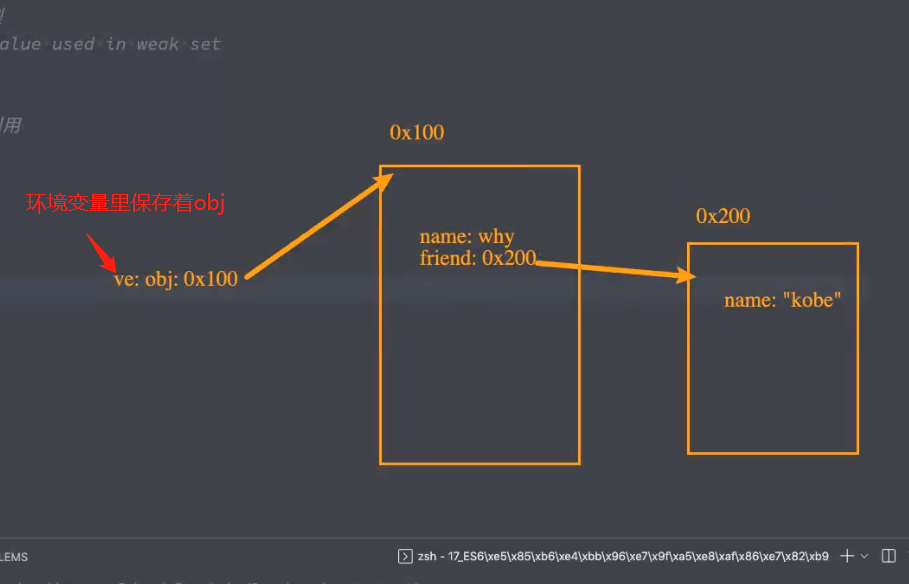
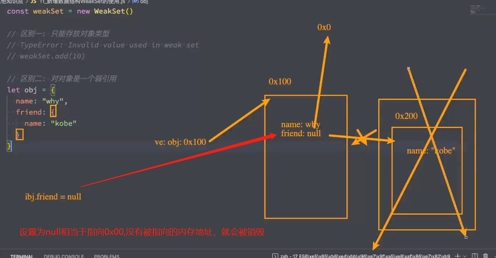
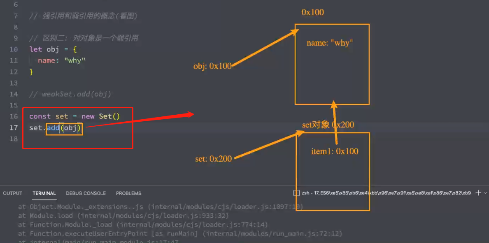
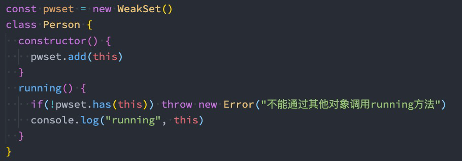
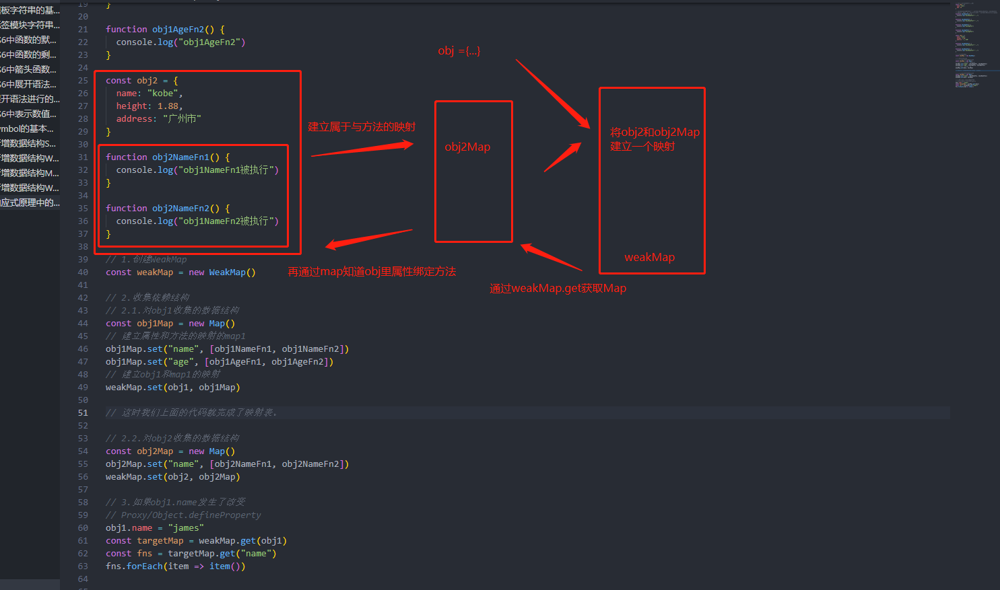
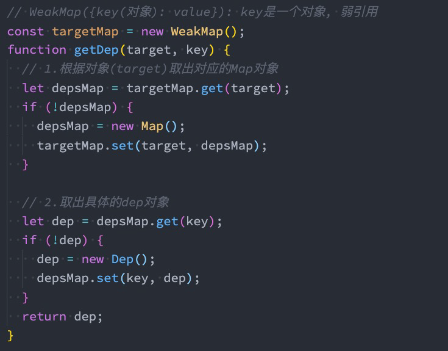

# 15. ES6-7知识点解析和应用

## 1. Set的基本使用

+ 在ES6之前，我们存储数据的结构主要有两种：数组、对象。
  + 在ES6中新增了另外两种数据结构：Set、Map，以及它们的另外形式`WeakSet`、`WeakMap`。

+ Set是一个新增的数据结构，可以用来保存数据，类似于数组，但是和数组的区别是元素不能重复。
  + 创建Set我们需要通过Set构造函数（暂时没有字面量创建的方式）：
+ n 我们可以发现Set中存放的元素是不会重复的，那么Set有一个非常常用的功能就是给数组去重。

```js
// 10, 20, 40, 333
// 1.创建Set结构
const set = new Set()
// 数组.push
set.add(10)
set.add(20)
set.add(40)
set.add(333)

console.log(set); // Set(4) {10, 20, 40, 333}

// 元素不能重复的
set.add(10)

console.log(set); // Set(4) {10, 20, 40, 333}
```

```js
// 2.添加对象时特别注意:
// 使用大括号意味着创建一个新对象
set.add({})
set.add({})

console.log(set); // Set(4) {10, 20, 40, 333, {}, {}}

// 上面代码换成下面的
const obj = {}
set.add(obj)
set.add(obj)

console.log(set) // {10, 20, 40, 333,{}}

```

```js
// 3.对数组去重(去除重复的元素)
const arr = [33, 10, 26, 30, 33, 26]
// const newArr = []
// for (const item of arr) {
//   if (newArr.indexOf(item) !== -1) {
//     newArr.push(item)
//   }
// }

// 传入可迭代对象，然后会自动去重
const arrSet = new Set(arr)
// 方法一
// const newArr = Array.from(arrSet)
// 方法二：set支持展开运算符
const newArr = [...arrSet]
console.log(newArr)

```

## 2. Set的常见方法

+ Set常见的属性： 
  + size：返回Set中元素的个数；
+ Set常用的方法： 
  + add(value)：添加某个元素，返回Set对象本身； 
  + delete(value)：从set中删除和这个值相等的元素，返回boolean类型； 
  + has(value)：判断set中是否存在在某个元素，返回boolean类型；
  + clear()：清空set中所有的元素，没有返回值； 
  + forEach(callback, [, thisArg])：通过forEach遍历set； 
+ 另外Set是支持for of的遍历的。

```js
// 4.size属性
console.log(arrSet.size)

// 5.Set的方法
// add
arrSet.add(100)
console.log(arrSet)

// delete
arrSet.delete(33)
console.log(arrSet)

// has
console.log(arrSet.has(100))

// clear
// arrSet.clear()
console.log(arrSet)

// 6.对Set进行遍历
arrSet.forEach(item => {
  console.log(item)
})

for (const item of arrSet) {
  console.log(item)
}

```

## 12. WeakSet使用

+ 和Set类似的另外一个数据结构称之为WeakSet，也是内部元素不能重复的数据结构。
+ 那么和Set有什么区别呢？
  + 区别一：WeakSet中只能存放对象类型，不能存放基本数据类型；（因为我们建立弱引用指向地址，所以不能存放基本数据类型） 
  + 区别二：WeakSet对元素的引用是弱引用，如果没有其他引用对某个对象进行引用，那么GC可以对该对象进行回收；

```js
const wset = new WeakSet()

// TypeError: Invalid value used in weak set
wset.add(10)

// weakSet对对象是一个弱引用
let obj = {
    name: 'why'
}

const set = new Set()
// 建立强引用
set.add(obj)

// 建立弱引用
weakSet.add(obj)

```

下面`obj`指向内存0x100以及friend指向0x200的指针表示强引用

弱引用可以帮助我们指向地址，继续查找，但是弱引用指向的内存地址没有其他强引用指向，就会被浏览器GC销毁。





set的引用是一种强引用



+ WeakSet常见的方法：
  + add(value)：添加某个元素，返回WeakSet对象本身；
  + delete(value)：从WeakSet中删除和这个值相等的元素，返回boolean类型；
  + has(value)：判断WeakSet中是否存在某个元素，返回boolean类型；

## 13. WeakSet的应用

+ 注意：WeakSet不能遍历
  + 因为WeakSet只是对对象的弱引用，如果我们遍历获取到其中的元素，那么有可能造成对象不能正常的销毁。
  + **所以存储到WeakSet中的对象是没办法获取的；**只能存不能读
+ 那么这个东西有什么用呢？
  + 事实上这个问题并不好回答，我们来使用一个Stack Overflow上的答案；

```js
// 3. WeakSet的应用场景

const personSet = new WeakSet()

class Person {
    
    constructor() {
        personSet.add(this)
    }
    
    running() {
        if(!personSet.has(this)) {
            throw new Error('不能通过非构造方法对象调用running方法')
        }
        
        console.log('running')
    }
}

const p = new Person()

// 当call绑定的时候，this指向的和我们personSet里面存的this不一样就会报错，这就意味着，只用使用过new，才能把相应this存进去
p.running.call({name: 'why'})

```



## 14. Map的基本使用

+ 另外一个新增的数据结构是Map，用于存储映射关系。（可以理解成存储键值对）
+ 但是我们可能会想，在之前我们可以使用对象来存储映射关系，他们有什么区别呢？
  + 事实上我们对象存储映射关系只能用字符串（ES6新增了Symbol）作为属性名（key）；（对象中key不是字符串也会转成字符串）
  + 某些情况下我们可能希望通过其他类型作为key，比如对象，这个时候会自动将对象转成字符串来作为key；
+ 那么我们就可以使用Map：

```js
// 1.JavaScript中对象中是不能使用对象来作为key的
const obj1 = {name: 'why'}
const obj2 = {name: 'kobe'}

const info = {
    [obj1]: 'aaa'
    [obj2]: 'bbb'
}

console.log(info) // {'[object Obejct]': 'bbb'}

// 1. []中括号计算属性，然后可以传入对象，然后对象中会把得到的结果转成字符串，也就是obj转成字符串，调用内部的toString(),结果为'[object Obejct]'。
// 并且obj1和obj2转成的结果是一样的

```

## 15. Map的常用方法

+ Map常见的属性：
  + size：返回Map中元素的个数；
+ Map常见的方法：
  + set(key, value)：在Map中添加key、value，并且返回整个Map对象；
  + get(key)：根据key获取Map中的value；
  + has(key)：判断是否包括某一个key，返回Boolean类型
  + delete(key)：根据key删除一个键值对，返回Boolean类型；
  + clear()：清空所有的元素； pforEach(callback, [, thisArg])：通过forEach遍历Map；
+ Map也可以通过for of进行遍历。

```js
// 2.Map就是允许我们对象类型来作为key的
// 构造方法的使用
const map = new Map()
map.set(obj1, "aaa")
map.set(obj2, "bbb")
map.set(1, "ccc")
console.log(map) // Map(2) { { name: 'why} => 'aaa', {name:'kobe'} => 'bbb }

// 可以传入一个数组，数组要求里面依然存放数组，然后格式[key, value]
const map2 = new Map([[obj1, "aaa"], [obj2, "bbb"], [2, "ddd"]])
console.log(map2) //  Map(3) { { name: 'why} => 'aaa', {name:'kobe'} => 'bbb , 2 => 'ccc'}

```

```js
// 3.常见的属性和方法
console.log(map2.size)

// set(key, value)
map2.set("why", "eee")
console.log(map2)

// get(key)
console.log(map2.get("why"))

// has(key)
console.log(map2.has("why"))

// delete(key)
map2.delete("why")
console.log(map2)

// clear
// map2.clear()
// console.log(map2)

// 4.遍历map
map2.forEach((item, key) => {
  console.log(item, key)
})

for (const item of map2) {
  console.log(item[0], item[1])
}

for (const [key, value] of map2) {
  console.log(key, value)
}


```

## 16. WeakMap的使用

+ 和Map类型的另外一个数据结构称之为WeakMap，也是以键值对的形式存在的。
+ 那么和Map有什么区别呢？
  +  区别一：WeakMap的key只能使用对象，不接受其他的类型作为key；
  +  区别二：WeakMap的key对对象想的引用是弱引用，如果没有其他引用引用这个对象，那么GC可以回收该对象；

```js
const weakMap = new WeaMap()

// Invald value used as weak map key
weakMap.set(1, "abc")
// Invalid value used as weak mapp key
wwakMap.set("aaa", "cba")

```

+ WeakMap常见的方法有四个：
  + set(key, value)：在Map中添加key、value，并且返回整个Map对象；
  + get(key)：根据key获取Map中的value；
  + has(key)：判断是否包括某一个key，返回Boolean类型；
  + delete(key)：根据key删除一个键值对，返回Boolean类型；

```js

const obj = {name: "obj1"}
// 1.WeakMap和Map的区别二:
const map = new Map()
map.set(obj, "aaa")

const weakMap = new WeakMap()
weakMap.set(obj, "aaa")

// 2.区别一: 不能使用基本数据类型
// weakMap.set(1, "ccc")

// 没有size属性

// 3.常见方法
// get方法
console.log(weakMap.get(obj))

// has方法
console.log(weakMap.has(obj))

// delete方法
console.log(weakMap.delete(obj))

// 打印结果大括号里面{}之所以会这样是因为我们调用toString里面的内容，由于不能够遍历所导致的
console.log(weakMap)// WeakMap { <items unknown> } 

// 试着随便打印里面的方法，不存在的就是undefined，存在就是function
```

## 17. WeakMap的应用

```js
// 需求我们希望指定某一个obj对象的某一个属性发生变化的时候，触发对应的函数。模拟vue3响应式原理
// 我们的函数，需要监听（根据）属性变化触发执行
// 响应式就是data更新触发对应的render


// 应用场景(vue3响应式原理)
const obj1 = {
  name: "why",
  age: 18
}

// obj1的name发生改变，执行对应的函数obj1NameFn1和obj1NameFn2
// 因此我们需要简历映射关系，保存属性对应的函数关系，利用到map
function obj1NameFn1() {
  console.log("obj1NameFn1被执行")
}

function obj1NameFn2() {
  console.log("obj1NameFn2被执行")
}

function obj1AgeFn1() {
  console.log("obj1AgeFn1")
}

function obj1AgeFn2() {
  console.log("obj1AgeFn2")
}

const obj2 = {
  name: "kobe",
  height: 1.88,
  address: "广州市"
}

function obj2NameFn1() {
  console.log("obj1NameFn1被执行")
}

function obj2NameFn2() {
  console.log("obj1NameFn2被执行")
}

// 1.创建WeakMap，这里使用weakMap是为了保存映射，但是不对obj强引用，方便销毁,而且保存对象对销毁以后，对应的映射关系value也会销毁
const weakMap = new WeakMap()

// 2.收集依赖结构
// 2.1.对obj1收集的数据结构
const obj1Map = new Map()
// 建立属性和方法的映射的map1
obj1Map.set("name", [obj1NameFn1, obj1NameFn2])
obj1Map.set("age", [obj1AgeFn1, obj1AgeFn2])
// 建立obj1和map1的映射
weakMap.set(obj1, obj1Map)

// 这时我们上面的代码就完成了映射表。

// 2.2.对obj2收集的数据结构
const obj2Map = new Map()
obj2Map.set("name", [obj2NameFn1, obj2NameFn2])
weakMap.set(obj2, obj2Map)

// 3.如果obj1.name发生了改变，执行对应函数
// Proxy/Object.defineProperty
obj1.name = "james"
const targetMap = weakMap.get(obj1)
const fns = targetMap.get("name")
fns.forEach(item => item())

```



+ 注意：WeakMap也是不能遍历的
  + 因为没有forEach方法，也不支持通过for of的方式进行遍历；



## 18. ES7-Array Includes

+ 在ES7之前，如果我们想判断一个数组中是否包含某个元素，需要通过indexOf 获取结果，并且判断是否为-1。
+ 在ES7中，我们可以通过includes来判断一个数组中是否包含一个指定的元素，根据情况，如果包含则返回true，否则返回false。

```js
arr.includes(valueToFind[,fromIndex])
```

```js
const names = ["abc", "cba", "nba", "mba", NaN]

// indexOf不能判断NaN
// incluedes可以

// 当他不-1的时候说明包含了，通过indexof的索引值来判断是否包含
if (names.indexOf("cba") !== -1) {
  console.log("包含abc元素")
}

// ES7 ES2016
// 第二个参数，用于指定从第几个索引值开始包含
if (names.includes("cba", 2)) {
  console.log("包含abc元素")
}

if (names.indexOf(NaN) !== -1) {
  console.log("包含NaN")
}

if (names.includes(NaN)) {
  console.log("包含NaN")
}

```

## 19. ES7 - 指数（乘方）exponentiation运算符

+ 在ES7之前，计算数字的乘方需要通过 Math.pow 方法来完成。
+ 在ES7中，增加了 ** 运算符，可以对数字来计算乘方。

```js
const result1 = Math.pow(3, 3)
const result2 = 3 ** 3

console.log(result1, result2)
```

```js
const result1 = Math.pow(3, 3)
// ES7: **
const result2 = 3 ** 3
console.log(result1, result2)

```


