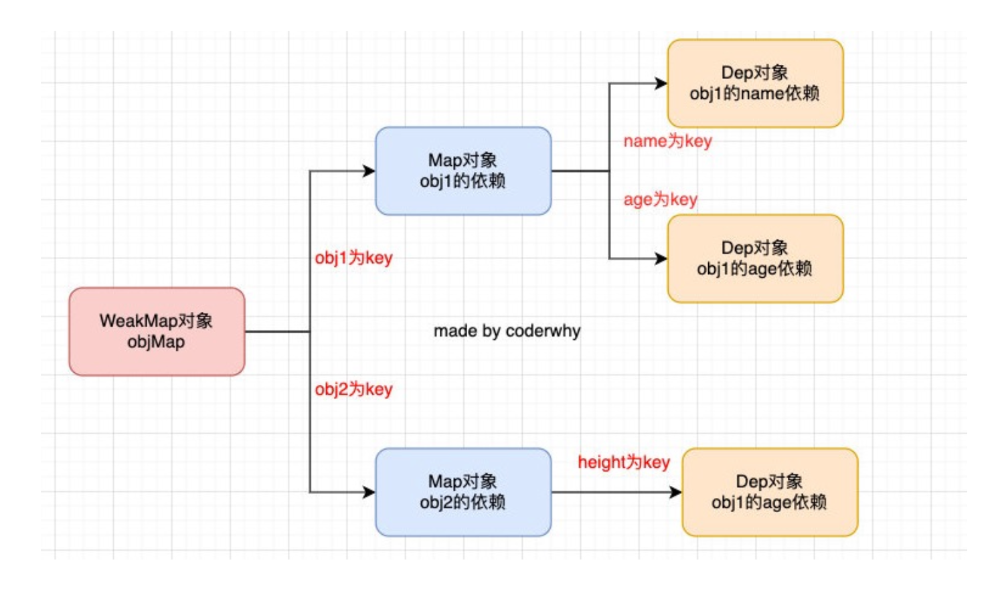
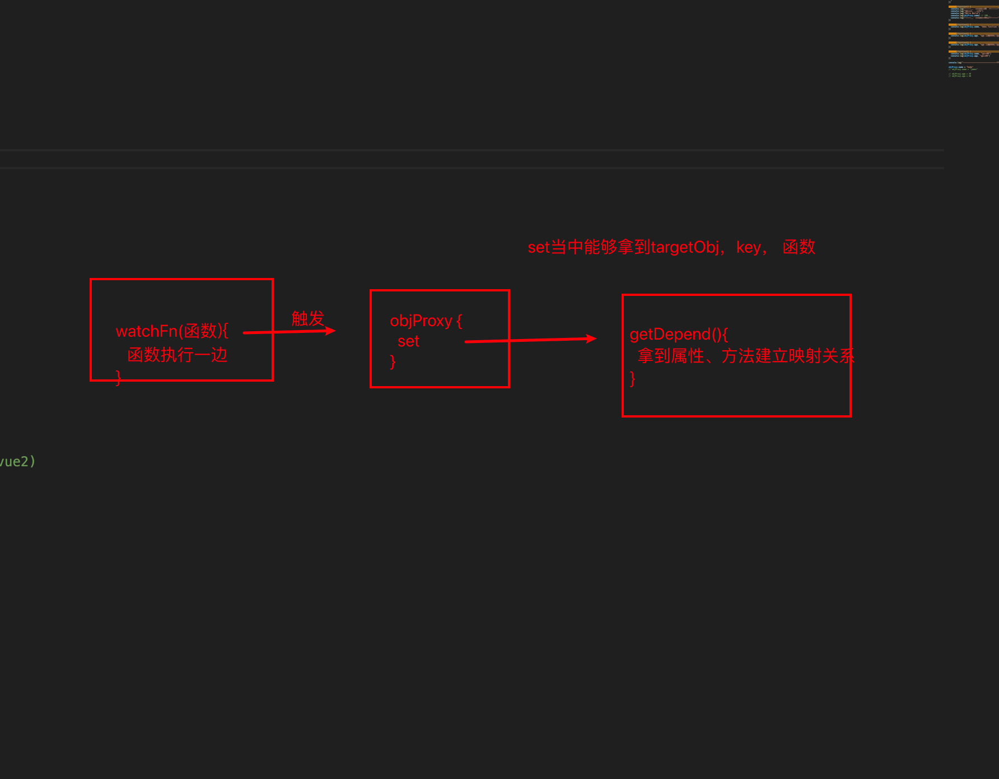

# 16. ES8-ES12知识点解析和应用

## 1. ES8 Object values

之前我们可以通过`Object.keys`获取一个对象所有的key，在ES8中提供了 `Object.values`来获取所有的value值：

```js
const obj = {
  name: "why",
  age: 18
}

console.log(Object.keys(obj))
console.log(Object.values(obj))  // ['why', 18]

// 用的非常少
// 可以传入数组，然后就会返回传入的数组
console.log(Object.values(["abc", "cba", "nba"]))  // ['abc', 'cba', 'nba']
// 传入字符串的话，就会把每个字母串解构出来，然后返回一个数组
console.log(Object.values("abc")) // ['a', 'b', 'c']

```

## 2. ES8 Object entries

+ 通过`Object.entries`可以获取到一个数组，数组中会存放可枚举属性的键值对数组。
+ entries：记录

```js
const obj = {
  name: "why",
  age: 18
}

console.log(Object.entries(obj)) // [ [ 'name', 'why' ], [ 'age', 18 ] ]
const objEntries = Object.entries(obj)
objEntries.forEach(item => {
  console.log(item[0], item[1])
})

console.log(Object.entries(["abc", "cba", "nba"])) // [ [ '0', 'abc' ], [ '1', 'cba' ], [ '2', 'nba' ] ]
console.log(Object.entries("abc")) // [ [ '0', 'a' ], [ '1', 'b' ], [ '2', 'c' ] ]


// 可以当作是Object.keys和Object.values的合并使用
```

## 3. ES8 String Padding

+ 某些字符串我们需要对其进行前后的填充，来实现某种格式化效果，ES8中增加了 `padStart` 和 `padEnd` 方法，分 别是对字符串的首尾进行填充的。
+ Pad：编程中叫填充

```js
const message = "Hello World"

// 字符15个，不够了在前面填充****,发面计算字符串长度有20，不够在后面填充---
const newMessage = message.padStart(15, "*").padEnd(20, "-")
console.log(newMessage)

// 案例
const cardNumber = "321324234242342342341312"
const lastFourCard = cardNumber.slice(-4) // 截取后四位
const finalCard = lastFourCard.padStart(cardNumber.length, "*") // 前面填充*
console.log(finalCard)

```

## 4. ES8 Trailing Commas

+ 在ES8中，我们允许在函数定义和调用时多加一个逗号：
+ Trailing：结尾
+ Commas：逗号

```js
function foo(m, n,){}

foo(20,30,)
// 参数最后可以加个逗号。加不加都一样

```

## 5. ES8 Object Descriptors

+ ES8中增加了另一个对对象的操作是Object.getOwnPropertyDescriptors ，这个在之前已经讲过了，这里不再重复。
+ Object Descriptors：获取到对象的所有属性描述符

+ ES8其他知识点：async和await相当于迭代器和Promise的结合体


## 6. ES9新增知识点

+ Async iterators：后续迭代器讲解
+ Object spread operators：前面讲过了
+ Promise finally：后续讲Promise讲解


## 7. ES10 flat flatMap

+ flat() 方法会按照一个可指定的深度递归遍历数组，并将所有元素与遍历到的子数组中的元素合并为一个新数组返回。
+ flatMap() 方法首先使用映射函数映射每个元素，然后将结果压缩成一个新数组。
  + 注意一：flatMap是先进行map操作，再做flat的操作；
  + 注意二：flatMap中的flat相当于深度为1；
+ flat：降维的意思

```js
const nums = [10, 20, [2, 9], [[30, 40], [10, 45]], 78, [55, 88]]

const newNums = nums.flat() // 默认降维一次
console.log(newNums) // [10, 20, 2, 9, [30,40], [10, 45], 78,55,88]

const newNums = nums.flat(2) //[10, 20, 2, 9, 30, 40, 10, 45, 78, 55, 88]

// 2.flatMap的使用
// 先map，然后再flat
const nums2 = [10, 20, 30]
const newNums3 = nums2.flatMap(item => {
  return item * 2
})
const newNums4 = nums2.map(item => {
  return item * 2
})

console.log(newNums3) // [ 20, 40, 60 ]
console.log(newNums4) // [ 20, 40, 60 ]

// 3.flatMap的应用场景
const messages = ["Hello World", "hello lyh", "my name is coderwhy"]
const words = messages.flatMap(item => {
  // 先map得到的就是字符串，然后分割得到一个数组 "Hello World".split -> ['Hello', 'World']。然后再执行flat
  return item.split(" ")
})

console.log(words)
// [
//   'Hello', 'World',
//   'hello', 'lyh',
//   'my',    'name',
//   'is',    'coderwhy'
// ]

```

## 8. ES10 Obejct fromEntries

+ 在前面，我们可以通过Object.entries 将一个对象转换成entries（格式[[key, value], [...], ...]），那么如果我们有一个entries了，如何将其转换成对象呢？
  + ES10提供了Object.formEntries来完成转换。from Entries to Object
+ 那么这个方法有什么应用场景呢？

```js
const obj = {
  name: "why",
  age: 18,
  height: 1.88
}

const entries = Object.entries(obj)
// console.log(entries) // [ [ 'name', 'why' ], [ 'age', 18 ], [ 'height', 1.88 ] ]

const newObj = {}
for (const entry of entries) {
  newObj[entry[0]] = entry[1]
}
console.log(newObj) // { name: 'why', age: 18, height: 1.88 }

// 1.ES10中新增了Object.fromEntries方法
const newObj = Object.fromEntries(entries)

console.log(newObj)

// 2.Object.fromEntries的应用场景
const queryString = 'name=why&age=18&height=1.88'
const queryParams = new URLSearchParams(queryString)
console.log(queryParams) // URLSearchParams { 'name' => 'why', 'age' => '18', 'height' => '1.88' }
for (const param of queryParams) {
  console.log(param)
  // [ 'name', 'why' ]
  // [ 'age', '18' ]
  // [ 'height', '1.88' ]
}

const paramObj = Object.fromEntries(queryParams)
console.log(paramObj)  // { name: 'why', age: '18', height: '1.88' }

```

## 9. ES10 trimStart trimEnd

+ 去除一个字符串首尾的空格，我们可以通过trim方法，如果单独去除前面或者后面呢？
  + ES10中给我们提供了trimStart和trimEnd；

```js
const message = "    Hello World    "

console.log(message.trim())  // 去掉首位空格
console.log(message.trimStart()) // 去掉头部空格
console.log(message.trimEnd()) // 去除尾部的空格
```

## 10. ES10 其他知识点

+ Symbol description：已经讲过了

```js
const s = Symbol('aaaa')
s.description // 'aaaa' 表示传入的描述

```

+ Optional catch binding：后面讲解try cach讲解


## 11. ES11 BigInt

+ 在早期的JavaScript中，我们不能正确的表示过大的数字：
  + 大于MAX_SAFE_INTEGER的数值，表示的可能是不正确的。

+ 那么ES11中，引入了新的数据类型BigInt，用于表示大的整数：
  + BitInt的表示方法是在数值的后面加上n
+ 注意现在还不支持Number类型和BigInt相加

```js
// ES11之前 max_safe_integer
const maxInt = Number.MAX_SAFE_INTEGER
console.log(maxInt) // 9007199254740991
console.log(maxInt + 1) // 9007199254740992 
console.log(maxInt + 2) // 9007199254740992 超过最大表示的数字的时候就可能存在错误的隐患

// ES11之后: BigInt
const bigInt = 900719925474099100n  // 必须在后面加个n表示bigInt
// console.log(bigInt + 10) 暂时不支持bigInt和number类型相加，不存在隐式转换
console.log(bigInt + 10n) // 结果最后带个n表示大整数。 类似123123123123n

const num = 100
console.log(bigInt + BigInt(num))

const smallNum = Number(bigInt)
console.log(smallNum) // bigInt转成Number不能保证正确性。

```

## 12. ES11 Nullish Coalescing Operator

+ ES11，Nullish Coalescing Operator增加了空值合并操作符：
  + Nullish : 空值
  + Coalescing ：操作

```js
// ES11: 空值合并运算 ??

const foo = undefined
// const bar = foo || "default value"
const bar = foo ?? "defualt value"

// 两者之间的区别在于，假如我想要的是foo=0，或者foo为一个空字符串的时候，||会认为0和空字串是false，任然给我"defualt value"，显然不是我们想要的
// ?? 则只会判断值为null或undefined的时候，认为是false的

console.log(bar)

// ts 是 js 的超集

```

## 13. ES11 - Optional Chaining

+ 可选链也是ES11中新增一个特性，主要作用是让我们的代码在进行null和undefined判断时更加清晰和简洁：

```js
const info = {}

console.log(info?.name.age) // 直接返回undefined。后面的代码不执行了
```

## 14. Global This

+ 不同环境下，获取全局对象的方式是不一样的
  + 浏览器通过this、window
  + Node通过global
+ 通过globalThis在不同环境下获取全局对象。

```js
// 获取某一个环境下的全局对象(Global Object)

// 在浏览器下
// console.log(window)
// console.log(this)

// 在node下
// console.log(global)

// ES11
console.log(globalThis)
```

## 15. for...in

+ for...in和for...of的区别
  + for...in可以遍历对象，拿到的是key的值。
    + for in可以遍历字符串、数组、set、map等，可以理解成实现了iterator接口的都可以用。并且没实现的对象也可以。
    + for of只能对实现iterator接口有用。
  + for...of无法遍历一般的对象，一般对象没有实现iterable。拿到的是可迭代对象的value
  + 一个数据结构只要部署了 Symbol.iterator 属性, 就被视为具有 iterator接口, 就可以使用 for of循环。
  + for of 不同与 forEach, 它可以与 break、continue和return 配合使用,也就是说 for of 循环可以随时退出循环。

```js
// for...in 标准化: ECMA
const obj = {
  name: 'why',
  age: 18,
};

for (const item in obj) {
  console.log(item);
}

// 下面会报错
// TypeError: obj is not iterable
for (const item of obj) {
  console.log(item);
}

```

## 16. ES11其他知识点

+ **Dynamic Import:**后续ES Module模块化中讲解。
+ **Promise.allSettled:**后续讲Promise的时候讲解。 
+ **import meta:**后续ES Module模块化中讲解。

## 17. ES12-FinalizationRegistry

+ FinalizationRegistry 对象可以让你在对象被垃圾回收时请求一个回调。
+ FinalizationRegistry 提供了这样的一种方法:当一个在注册表中注册的对象被回收时，请求在某个时间点上调用一个清理回调。(清理回调有时被称为 finalizer );
+ 你可以通过调用register方法，注册任何你想要清理回调的对象，传入该对象和所含的值;

```js
// ES12: FinalizationRegistry类

// new FinalizationRegistry传入一个回调函数。当发生回收的时候触发。
// 这里需要在浏览器进行测试，因为node执行完成js代码会关闭进程，所以不会执行回调。浏览器打开直到关闭会一直执行进程。
// GC的时间是不定时的，所以不知道什么时候执行回调
const finalRegistry = new FinalizationRegistry((value) => {
  console.log('注册在finalRegistry的对象, 某一个被销毁', value);
});

let obj = { name: 'why' };
let info = { age: 18 };

// 注册。第二个参数是回调函数的参数
finalRegistry.register(obj, 'obj');
finalRegistry.register(info, 'value');

obj = null;
info = null;

```

## 18. ES12-WeakRefs

+ 如果我们默认将一个对象赋值给另外一个引用，那么这个引用是一个强引用:
+ 如果我们希望是一个弱引用的话，可以使用WeakRef;

```js
let obj = { name: 'why' };
let info = obj;
obj = null;

console.log(info); // { name: 'why' }

// 虽然obj变了，但是info还指向原来的地址，所以原来地址保存的数据不会被回收

// ES12: WeakRef类
// WeakRef.prototype.deref:
// > 如果原对象没有销毁, 那么可以获取到原对象
// > 如果原对象已经销毁, 那么获取到的是undefined
const finalRegistry = new FinalizationRegistry((value) => {
  console.log('注册在finalRegistry的对象, 某一个被销毁', value);
});

let obj = { name: 'why' };
let info = new WeakRef(obj); // 细节：返回的是一个WeakRef类型的对象。里面有一个方法deref获取数据。因此使用info.deref()得到保存的数据

finalRegistry.register(obj, 'obj');

obj = null;

// obj被GC回收后，info的指向的对象是弱引用，也被回收了，所以一段时间后打印undefined
setTimeout(() => {
  console.log(info.deref()?.name);
  console.log(info.deref() && info.deref().name);
}, 10000);

```

## 19. ES12 - logical assignment operators

+ 逻辑赋值运算

```js
// 1. ||= 逻辑或赋值运算
let message = "hello world"
message = message || "default value"
// 可以简写成下面
message ||= "default value"
console.log(message)

// 类似的
let n = 1
n= n + 1
// 等价
n += 1
```

```js
// 2. &&= 逻辑与赋值运算
let info = {
  name: 'xps'
}

// info.name存在的话，info.name赋值给info
info = info.name && info.name
// 等价于
info &&= info.name

// 用的比较少。略抽象
```

```js
// 3. ??= 逻辑空赋值运算
let message = 0
message = message ?? "default value"
// 等价于
// ??针对null undefined
message ??= "default value"
console.log(message)

// 区别上面 空字符串 0 在逻辑或运算中被当成false 
// [] {} 逻辑或 为 true

// 注意
'' || 'a' // 结果为a。空字符串被认为是false

```

```js
const value1 = false;
const value2 = null;
const value3 = undefined;
const value4 = 0;
const value5 = NaN;
const value6 = '';  // 注意这个
const value7 = [];
const value8 = {};

console.log(value1 || 'Default'); // 输出: 'Default'
console.log(value2 || 'Default'); // 输出: 'Default'
console.log(value3 || 'Default'); // 输出: 'Default'
console.log(value4 || 'Default'); // 输出: 'Default'
console.log(value5 || 'Default'); // 输出: 'Default'
console.log(value6 || 'Default'); // 输出: 'Default'
console.log(value7 || 'Default'); // 输出: []
console.log(value8 || 'Default'); // 输出: {}

```

# 响应式原理

## 1. 响应式函数的实现watchFn

```js
// 自己是想一个响应式函数
// 手动将需要响应式的函数传入进去，当对象发生改变时，手动调用watchFn执行对应的函数。

// 缺点：reactiveFns保存所有的函数，意味着，你不知道这个函数对应的是哪个属性被修改。我们希望的是属性修改，对应的函数执行，而不是所有。
// 因此我们可以给每个属性增加一个对应的类

// 封装一个响应式的函数
let reactiveFns = [];
function watchFn(fn) {
  reactiveFns.push(fn);
}

// 对象的响应式
const obj = {
  name: 'why',
  age: 18,
};

// 手动需要响应式的函数传入watchFn
watchFn(function () {
  const newName = obj.name;
  console.log('你好啊, 李银河');
  console.log('Hello World');
  console.log(obj.name); // 100行
});

watchFn(function () {
  console.log(obj.name, 'demo function -------');
});

// 不需要不传入
function bar() {
  console.log('普通的其他函数');
  console.log('这个函数不需要有任何响应式');
}

obj.name = 'kobe';
reactiveFns.forEach((fn) => {
  fn();
});

```

## 2. 响应式依赖的收集 class Depend

```js
// 将原来简单的reactiveFns，改成了一个类Depend
// 这样子，我们可以根据每一个属性创建一个Depend实例

// 后续我们通过每个不同的对象，保存进WeakMap中，每个对象的值是一个Map结构，里面Map结构里每个属性对应一个数组，数组里就是属性对应的响应式函数

class Depend {
  constructor() {
    this.reactiveFns = []
  }

  addDepend(reactiveFn) {
    this.reactiveFns.push(reactiveFn)
  }

  notify() {
    this.reactiveFns.forEach(fn => {
      fn()
    })
  }
}

// 封装一个响应式的函数
const depend = new Depend()
function watchFn(fn) {
  depend.addDepend(fn)
}

// 对象的响应式
const obj = {
  name: "why", // depend对象
  age: 18 // depend对象
}

watchFn(function() {
  const newName = obj.name
  console.log("你好啊, 李银河")
  console.log("Hello World")
  console.log(obj.name) // 100行
})

watchFn(function() {
  console.log(obj.name, "demo function -------")
})

obj.name = "kobe"
depend.notify()
```

## 3. 监听对象的变化 Proxy

```js
class Depend {
  constructor() {
    this.reactiveFns = [];
  }

  addDepend(reactiveFn) {
    this.reactiveFns.push(reactiveFn);
  }

  notify() {
    this.reactiveFns.forEach((fn) => {
      fn();
    });
  }
}

// 封装一个响应式的函数
const depend = new Depend();
function watchFn(fn) {
  depend.addDepend(fn);
}

// 对象的响应式
const obj = {
  name: 'why', // depend对象
  age: 18, // depend对象
};

// 监听对象的属性变量: Proxy(vue3)/Object.defineProperty(vue2)
// 在objProxy中批量对obj的属性变化监听
const objProxy = new Proxy(obj, {
  get: function (target, key, receiver) {
    return Reflect.get(target, key, receiver);
  },
  set: function (target, key, newValue, receiver) {
    Reflect.set(target, key, newValue, receiver);
    depend.notify();
  },
});

watchFn(function () {
  const newName = objProxy.name;
  console.log('你好啊, 李银河');
  console.log('Hello World');
  console.log(objProxy.name); // 100行
});

watchFn(function () {
  console.log(objProxy.name, 'demo function -------');
});

watchFn(function () {
  console.log(objProxy.age, 'age 发生变化是需要执行的----1');
});

watchFn(function () {
  console.log(objProxy.age, 'age 发生变化是需要执行的----2');
});

objProxy.name = 'kobe';
objProxy.name = 'james';
objProxy.name = 'curry';

// 缺陷：无论objProxy修改了哪个属性，所有方法都会执行
// 这是因为我们还没雨哦将对象中的属性进行分类保存进不同的map中
objProxy.age = 100;

```

## 4. 对象的依赖管理 WeakMap、Map



+ 这一步的意义在于，不同的对象中不同的属性发生变化时，执行对应的函数。因此需要做两次分类

```js
// 实际上我么要做的事情
const obj = {
  name: 'xps',
  info: 'xxx'
}

// 不同的属性对应不同的响应式函数的合集
const objMap = new Map()
objMap.set('name', nameDepend)
objMap.set('name', nameDepend)

// targetMap 保存不同的对象
const targetMap = new WeakMap()
targetMap.set(obj, objMap)
// 以此类推
targetMap.set(其他对象, otherMap)

```

```js
// 每个对象都会执行一次这个流程，我们可以用getDepend函数封装这一系列流程。
// getDepend函数专门来管理这种依赖关系

function getDepend(target, key) {
  // 根据target对象获取map的过程
  let map = targetMap.get(target)
  // 因为我们是在set里面完成分类和依赖收集的
  
  // 一个新对象，新属性第一次进入该函数的时候，WeakMap、Map都没存进去，包裹depend的创建也还没有。如果有就保存，没有就要创建
  
  if (!map) {
    map = new Map()
    targetMap.set(target, map)
  }

  // 根据key获取depend对象
  let depend = map.get(key)
  if (!depend) {
    depend = new Depend()
    map.set(key, depend)
  }
  return depend
}

```

```js
class Depend {
  constructor() {
    this.reactiveFns = []
  }

  addDepend(reactiveFn) {
    this.reactiveFns.push(reactiveFn)
  }

  notify() {
    this.reactiveFns.forEach(fn => {
      fn()
    })
  }
}

// 封装一个响应式的函数
const depend = new Depend()
function watchFn(fn) {
  depend.addDepend(fn)
}

// 封装一个获取depend函数
const targetMap = new WeakMap()
function getDepend(target, key) {
  // 根据target对象获取map的过程
  let map = targetMap.get(target)
  if (!map) {
    map = new Map()
    targetMap.set(target, map)
  }

  // 根据key获取depend对象
  let depend = map.get(key)
  if (!depend) {
    depend = new Depend()
    map.set(key, depend)
  }
  return depend
}

// 对象的响应式
const obj = {
  name: "why", // depend对象
  age: 18 // depend对象
}

// 监听对象的属性变量: Proxy(vue3)/Object.defineProperty(vue2)
const objProxy = new Proxy(obj, {
  get: function(target, key, receiver) {
    return Reflect.get(target, key, receiver)
  },
  set: function(target, key, newValue, receiver) {
    Reflect.set(target, key, newValue, receiver)
    // depend.notify()
    // 这个时候我们的set就可以根据正确的属性，执行正确的响应式函数
    const depend = getDepend(target, key)
    depend.notify()
  }
})

watchFn(function() {
  const newName = objProxy.name
  console.log("你好啊, 李银河")
  console.log("Hello World")
  console.log(objProxy.name) // 100行
})

watchFn(function() {
  console.log(objProxy.name, "demo function -------")
})

watchFn(function() {
  console.log(objProxy.age, "age 发生变化是需要执行的----1")
})

watchFn(function() {
  console.log(objProxy.age, "age 发生变化是需要执行的----2")
})

objProxy.name = "kobe"
objProxy.name = "james"
objProxy.name = "curry"

objProxy.age = 100


const info = {
  name: "kobe",
  address: "广州市"
}

watchFn(function() {
  console.log(info.address, "监听address变化+++++++++1")
})

watchFn(function() {
  console.log(info.address, "监听address变化+++++++++2")
})
```

## 5. 正确的收集依赖

+ 在上面我们的set已经能够根据正确的属性，找到对应的函数，进行执行了。
+ 但是打印结果都是空[]。
+ 虽然我么能够完成正确的获取，但是却没有完成正确的存入
+ 目前存在的问题是什么？怎么知道函数用了哪些属性？
  + 我么可以通过执行一次函数，触发objProxy.set捕获器。从而触发getDepend方法，构建依赖关系。



```js
// 1.执行函数
// activeReactiveFn作用是临时的全局变量，保存当前执行的函数，让objPorxy查得到当前是哪个函数被执行

let activeReactiveFn = null
function watchFn(fn) {
  activeReactiveFn = fn
  fn()
  activeReactiveFn = null
}
```

```js
// 2. 函数执行进入get。在这里建立映射关系

const objProxy = new Proxy(obj, {
  get: function(target, key, receiver) {
    // 根据target.key获取对应的depend
    const depend = getDepend(target, key)
    // 给depend对象中添加响应函数
    depend.addDepend(activeReactiveFn)

    return Reflect.get(target, key, receiver)
  },
})
```

```js
// 完整代码
class Depend {
  constructor() {
    this.reactiveFns = []
  }

  addDepend(reactiveFn) {
    this.reactiveFns.push(reactiveFn)
  }

  notify() {
    console.log(this.reactiveFns)
    this.reactiveFns.forEach(fn => {
      fn()
    })
  }
}

// 封装一个响应式的函数
let activeReactiveFn = null
function watchFn(fn) {
  activeReactiveFn = fn
  fn()
  activeReactiveFn = null
}

// 封装一个获取depend函数
const targetMap = new WeakMap()
function getDepend(target, key) {
  // 根据target对象获取map的过程
  let map = targetMap.get(target)
  if (!map) {
    map = new Map()
    targetMap.set(target, map)
  }

  // 根据key获取depend对象
  let depend = map.get(key)
  if (!depend) {
    depend = new Depend()
    map.set(key, depend)
  }
  return depend
}

// 对象的响应式
const obj = {
  name: "why", // depend对象
  age: 18 // depend对象
}

// 监听对象的属性变量: Proxy(vue3)/Object.defineProperty(vue2)
const objProxy = new Proxy(obj, {
  get: function(target, key, receiver) {
    // 根据target.key获取对应的depend
    const depend = getDepend(target, key)
    // 给depend对象中添加响应函数
    depend.addDepend(activeReactiveFn)

    return Reflect.get(target, key, receiver)
  },
  set: function(target, key, newValue, receiver) {
    Reflect.set(target, key, newValue, receiver)
    // depend.notify()
    const depend = getDepend(target, key)
    depend.notify()
  }
})

watchFn(function() {
  console.log("-----第一个name函数开始------")
  console.log("你好啊, 李银河")
  console.log("Hello World")
  console.log(objProxy.name) // 100行
  console.log("-----第一个name函数结束------")
})

watchFn(function() {
  console.log(objProxy.name, "demo function -------")
})

watchFn(function() {
  console.log(objProxy.age, "age 发生变化是需要执行的----1")
})

watchFn(function() {
  console.log(objProxy.age, "age 发生变化是需要执行的----2")
})

watchFn(function() {
  console.log(objProxy.name, "新函数")
  console.log(objProxy.age, "新函数")
})

console.log("------------------------------改变obj的name值")

objProxy.name = "kobe"
// objProxy.name = "james"

// objProxy.age = 20
// objProxy.age = 30

```

## 6. 对Depend重构

+ 问题一：如果一个函数重复用了多次相同的key，那么意味着这个函数会被重复收集。
  + 通过set的方法，解决重复函数的问题
+ 问题二：不希望将添加reactiveFn放到get中，以为它是属于Dep的行为;大白话就是不希望Proxy中get耦合其他的参数。
  + 将reactiveFn转移到类Depend的操作中，添加一个新的方法，用于收集依赖;

```js
let activeReactiveFn = null
class Depend {
  constructor() {
    this.reactiveFns = new Set()
  }

  // addDepend(reactiveFn) {
  //   this.reactiveFns.add(reactiveFn)
  // }
  
  // 原本depend.addDepend(activeReactiveFn)
  // 改成depend.depend()，减少了函数作为参数传递的过程

  depend() {
    if (activeReactiveFn) {
      this.reactiveFns.add(activeReactiveFn)
    }
  }

  notify() {
    this.reactiveFns.forEach(fn => {
      fn()
    })
  }
}

```

```js
// 完整代码
// 保存当前需要收集的响应式函数
let activeReactiveFn = null

/**
 * Depend优化:
 *  1> depend方法
 *  2> 使用Set来保存依赖函数, 而不是数组[]
 */

class Depend {
  constructor() {
    this.reactiveFns = new Set()
  }

  // addDepend(reactiveFn) {
  //   this.reactiveFns.add(reactiveFn)
  // }

  depend() {
    if (activeReactiveFn) {
      this.reactiveFns.add(activeReactiveFn)
    }
  }

  notify() {
    this.reactiveFns.forEach(fn => {
      fn()
    })
  }
}

// 封装一个响应式的函数
function watchFn(fn) {
  activeReactiveFn = fn
  fn()
  activeReactiveFn = null
}

// 封装一个获取depend函数
const targetMap = new WeakMap()
function getDepend(target, key) {
  // 根据target对象获取map的过程
  let map = targetMap.get(target)
  if (!map) {
    map = new Map()
    targetMap.set(target, map)
  }

  // 根据key获取depend对象
  let depend = map.get(key)
  if (!depend) {
    depend = new Depend()
    map.set(key, depend)
  }
  return depend
}

// 对象的响应式
const obj = {
  name: "why", // depend对象
  age: 18 // depend对象
}

// 监听对象的属性变量: Proxy(vue3)/Object.defineProperty(vue2)
const objProxy = new Proxy(obj, {
  get: function(target, key, receiver) {
    // 根据target.key获取对应的depend
    const depend = getDepend(target, key)
    // 给depend对象中添加响应函数
    // depend.addDepend(activeReactiveFn)
    depend.depend()

    return Reflect.get(target, key, receiver)
  },
  set: function(target, key, newValue, receiver) {
    Reflect.set(target, key, newValue, receiver)
    // depend.notify()
    const depend = getDepend(target, key)
    depend.notify()
  }
})

// watchFn
watchFn(() => {
  console.log(objProxy.name, "-------")
  console.log(objProxy.name, "+++++++")
})

objProxy.name = "kobe"
```

## 7. 创建响应式对象

+ 我们目前的响应式是针对于obj一个对象的，我们可以创建出来一个函数，针对所有的对象都可以变成响应式对象

```js
function reactive(obj) {
  return new Proxy(obj, {
    get: function(target, key, receiver) {

      const depend = getDepend(target, key)

      depend.depend()
  
      return Reflect.get(target, key, receiver)
    },
    set: function(target, key, newValue, receiver) {
      Reflect.set(target, key, newValue, receiver)

      const depend = getDepend(target, key)
      depend.notify()
    }
  })
}


// 使用
const obj = reactive({
  name: 'xps'
})
```

```js
// 完整代码
// 保存当前需要收集的响应式函数
let activeReactiveFn = null

/**
 * Depend优化:
 *  1> depend方法
 *  2> 使用Set来保存依赖函数, 而不是数组[]
 */

class Depend {
  constructor() {
    this.reactiveFns = new Set()
  }

  // addDepend(reactiveFn) {
  //   this.reactiveFns.add(reactiveFn)
  // }

  depend() {
    if (activeReactiveFn) {
      this.reactiveFns.add(activeReactiveFn)
    }
  }

  notify() {
    this.reactiveFns.forEach(fn => {
      fn()
    })
  }
}

// 封装一个响应式的函数
function watchFn(fn) {
  activeReactiveFn = fn
  fn()
  activeReactiveFn = null
}

// 封装一个获取depend函数
const targetMap = new WeakMap()
function getDepend(target, key) {
  // 根据target对象获取map的过程
  let map = targetMap.get(target)
  if (!map) {
    map = new Map()
    targetMap.set(target, map)
  }

  // 根据key获取depend对象
  let depend = map.get(key)
  if (!depend) {
    depend = new Depend()
    map.set(key, depend)
  }
  return depend
}

function reactive(obj) {
  return new Proxy(obj, {
    get: function(target, key, receiver) {
      // 根据target.key获取对应的depend
      const depend = getDepend(target, key)
      // 给depend对象中添加响应函数
      // depend.addDepend(activeReactiveFn)
      depend.depend()
  
      return Reflect.get(target, key, receiver)
    },
    set: function(target, key, newValue, receiver) {
      Reflect.set(target, key, newValue, receiver)
      // depend.notify()
      const depend = getDepend(target, key)
      depend.notify()
    }
  })
}

// 监听对象的属性变量: Proxy(vue3)/Object.defineProperty(vue2)
const objProxy = reactive({
  name: "why", // depend对象
  age: 18 // depend对象
})

const infoProxy = reactive({
  address: "广州市",
  height: 1.88
})

watchFn(() => {
  console.log(infoProxy.address)
})

infoProxy.address = "北京市"

const foo = reactive({
  name: "foo"
})

watchFn(() => {
  console.log(foo.name)
})

foo.name = "bar"

```

## 8. 总结

1. 使用reactive的时候会创建一个Proxy实例，并返回
2. 函数第一次执行的时候，进入到Proxy中get捕获器，在这里会进入Depend创建收集依赖，创建映射关系
3. 当我改变属性值的时候，进入Proxy中set捕获去，通过映射关系找到依赖的函数，执行。

+ 这就是基本的响应式流程

## 9. vue2响应式原理

+ vue用的是Object.defineProerty
+ Object.defineProerty每次只能对一个属性进行修改描述符，因此需要对对象进行遍历，进行每一个修改
+ 在setter和getter方法中的逻辑和前面的Proxy是一致 的

```js
function reactive(obj) {
  // ES6之前, 使用Object.defineProperty
  Object.keys(obj).forEach(key => {
    let value = obj[key]
    Object.defineProperty(obj, key, {
      get: function() {
        const depend = getDepend(obj, key)
        depend.depend()
        return value
      },
      set: function(newValue) {
        value = newValue
        const depend = getDepend(obj, key)
        depend.notify()
      }
    })
  })
  return obj
}

```

```js
// 完整代码
// 保存当前需要收集的响应式函数
let activeReactiveFn = null

/**
 * Depend优化:
 *  1> depend方法
 *  2> 使用Set来保存依赖函数, 而不是数组[]
 */

class Depend {
  constructor() {
    this.reactiveFns = new Set()
  }

  // addDepend(reactiveFn) {
  //   this.reactiveFns.add(reactiveFn)
  // }

  depend() {
    if (activeReactiveFn) {
      this.reactiveFns.add(activeReactiveFn)
    }
  }

  notify() {
    this.reactiveFns.forEach(fn => {
      fn()
    })
  }
}

// 封装一个响应式的函数
function watchFn(fn) {
  activeReactiveFn = fn
  fn()
  activeReactiveFn = null
}

// 封装一个获取depend函数
const targetMap = new WeakMap()
function getDepend(target, key) {
  // 根据target对象获取map的过程
  let map = targetMap.get(target)
  if (!map) {
    map = new Map()
    targetMap.set(target, map)
  }

  // 根据key获取depend对象
  let depend = map.get(key)
  if (!depend) {
    depend = new Depend()
    map.set(key, depend)
  }
  return depend
}

function reactive(obj) {
  // {name: "why", age: 18}
  // ES6之前, 使用Object.defineProperty
  Object.keys(obj).forEach(key => {
    let value = obj[key]
    Object.defineProperty(obj, key, {
      get: function() {
        const depend = getDepend(obj, key)
        depend.depend()
        return value
      },
      set: function(newValue) {
        value = newValue
        const depend = getDepend(obj, key)
        depend.notify()
      }
    })
  })
  return obj
}

// 监听对象的属性变量: Proxy(vue3)/Object.defineProperty(vue2)
const objProxy = reactive({
  name: "why", // depend对象
  age: 18 // depend对象
})

const infoProxy = reactive({
  address: "广州市",
  height: 1.88
})

watchFn(() => {
  console.log(infoProxy.address)
})

infoProxy.address = "北京市"

const foo = reactive({
  name: "foo"
})

watchFn(() => {
  console.log(foo.name)
})

foo.name = "bar"
foo.name = "hhh"

```

