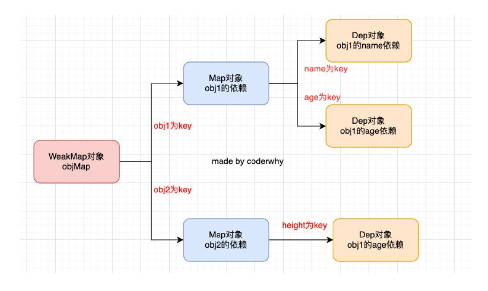
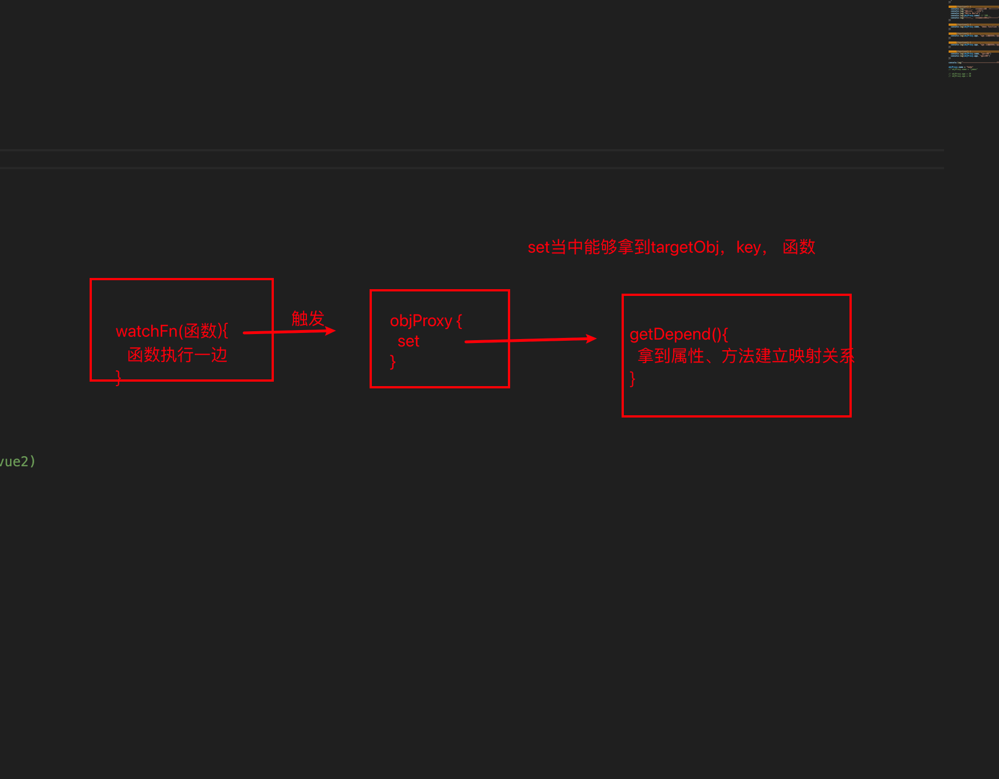

# 17. Proxy-Reflect-响应式原理（一）

## 1. 监听对象的操作

+ 需求：有一个对象，我们希望监听这个对象中的属性被设置或获取的过程？
  + 可以通过属性描述符实现。

+ **`Object.defineProperty()`**给传入的对象修改或新增属性，返回该对象。

```js
const obj = {};

// Object.defineProperty(obj, prop, descriptor)
// 传入三个参数
// 参数一：修改的对象
// 参数二：修改或新增的属性名称
// 参数三：对属性的相关配置(属性描述符),value属性的值，writable是否可以写
// 返回值：传入的obj
Object.defineProperty(object, 'prop', {
  value: 42,
  writable: false
});

obj.prop = 77;

console.log(obj.prop); // 42

```

+ descriptor 属性描述符主要两种形式：
  + 数据描述符合存取描述符，数据描述符是一个具有值的属性，该值可以是可写/不可写的。例如上面就是.
  + 存取描述符是由 getter 函数和 setter 函数所描述的属性

+ **`object,defineProperties()`**就是定义多个属性。

```js
// 01_监听对象的操作方式一.js

const obj = {
  name: "why",
  age: 18
}

// 这种方式针对的是一个对象。
Object.defineProperty(obj, 'name', {
  get: function () {
    console.log("监听到obj对象的name属性被访问了")
    // 如果没有设置返回值，默认就是
    // return undefined
  },
  set: function () {
    console.log("监听到obj对象的name属性被设置值")
  }

})

console.log(obj.name) // 获取值的时候触发get
obj.name = "Kobe" // 重新赋值 触发set

```

```js
const obj = {
  name: "why",
  age: 18
}

// Object.defineProperty对对象中指定的key进行get、set拦截

// Object.defineProperty(obj, 'name', {
//   get: function () {
//     console.log("监听到obj对象的name属性被访问了")
//     // 如果没有设置返回值，默认就是
//     // return undefined
//   },
//   set: function () {
//     console.log("监听到obj对象的name属性被设置值")
//   }
// })


// 假如我们要对所有的key进行监听的话，就需要遍历一遍，都执行一次Object.defineProperty
Object.keys(obj).forEach(key => {
  let value = obj[key]

  Object.defineProperty(obj, key, {
    get: function() {
      console.log(`监听到obj对象的${key}属性被访问了`)
      // 如果没有返回值，默认返回undefined
      return value
    },
    set: function(newValue) {
      console.log(`监听到obj对象的${key}属性被设置值`)
      // 产生了闭包，value与当前的Object.defineProperty绑定。所以get会拿到newValue的值，不用担心let value = obj[key]。在这个代码中，只会执行一次。
      value = newValue
    }
  })
});

obj.name = "kobe"
obj.age = 30

// 新增属性，但是Object.defineProperty监听不到
obj.height = '1.88'

console.log(obj.name)
console.log(obj.age)
console.log(obj.height)

```

+ **这样做有什么缺点？**
+ 首先，`Object.defineProperty`设计的初衷，不是为了去监听一个对象中的所有属性的。
  + 我们在定义某些属性的时候，初衷其实就是定义普通的属性，但是后面强行将它变成存取描述符。
  + 其次，我们想监听更加丰富的操作，比如删除属性，新增属性等，`Object.defineProperty`是无能为力的。
  + 所以存取数据描述符设计的初衷并不是为了监听一个完整的对象。

## 2. Proxy基本使用

+ ES6，新增一个`Proxy`类，这个类从名字就可以看出来，是用于帮助我们创建一个代理的：
  + 即，如果我们希望监听一个对象的相关操作，那么我们可以先创建一个代理对象（Proxy对象）
  + 之后对该对象的所有操作，都是通过代理对象来完成，代理对象可以监听我们想要对原对象就那些哪些操作；
+ Proxy本身就是创建一个新的代理对象，然后我们访问代理对象，就可以重写它的捕获器，从而对捕获到对代理对象的操作。
+ 大白话：**通过修改代理对象去修改原对象**。这样的话，代理对象在修改原对象的时候，可以增加一些额外操作。

```js
const obj = {
  name: '1',
  age: 18,
};

const objProxy = new Proxy(obj, {});
console.log(objProxy); // { name: '1', age: 18 }
console.log(objProxy === obj); // false

```

```js
const obj = {
    name: "why",
    age: 18
}

// 两个参数：
// 参数一：目标对象（对象，数组，函数，甚至是另一个代理）
// 参数二：handler捕获器对象，也可以叫处理器对象。
//       捕获器对象定义了各种捕获器方法(Trap)，这些方法在对应场景下会自动调用，具体实现需要我们去重写，
// 			 例如重写get，在我们获取属性的值的时候，会自动调用捕获器get，执行我们重写的get方法。
const objProxy = new Proxy(obj, {
    // 获取值时的捕获器
    // get被调用的时候会传入一些参数：
    // target：代理的对象 -> obj
    // key：操作的属性名
    // receiver: 
    get: function(target, key, receiver) {
        console.log(`监听到对象的${key}属性被访问了`, target)
        return target[key]
    },

    // 设置值时的捕获器
    set: function(target, key, newValue, receiver) {
        console.log(`监听到对象的${key}属性被设置值`, target)
        target[key] = newValue
    }
})

console.log(objProxy.name);
console.log(objProxy.age);

objProxy.name = "kobe"
objProxy.age = 30

// console.log(objProxy.name);
// console.log(objProxy.age);

```

## 3. Proxy的set和get捕获器

+ 如果我们想要侦听某些具体的操作，那么就可以在handler中添加对应的捕捉器（Trap）
+ set和get分别对应的是函数类型；
  + set函数会自动传入四个参数：
    + target：目标对象（侦听对象）
    + property：将被设置的属性key
    + value：新属性值
    + receiver：调用的代理对象
  + get函数三个参数：
    + target：目标对象（侦听对象）
    + property：被获取的属性key
    + receiver：调用的代理对象

## 4. Proxy所有捕获器

+ Proxy设计的目的主要就是为了给我们的对象创建一个代理，对这个对象所有操作都转成对这个代理对象进行操作，这样我们就不需要直接去修改原来的对象。
+ 一共有13种捕获器:
+ **`handler.getPrototypeOf()`**是一个代理（Proxy）方法，当读取代理对象的原型时，该方法就会被调用。
  + `Object.getPrototypeOf`方法的捕捉器。
  + `obj.__proto__`存在浏览器兼容性问题，所以使用`Object.getPrototypeOf`更合理。

+ **`handler.setPrototypeOf()`** 方法主要用来拦截 [`Object.setPrototypeOf()`](https://developer.mozilla.org/zh-CN/docs/Web/JavaScript/Reference/Global_Objects/Object/setPrototypeOf).
  + 设置对象的原型的时候会被调用。
+ **`handler.isExtensible()`** 方法用于拦截对对象的 `Object.isExtensible()`。
  + 判断对象能否扩展（即添加新的属性）。
+ **`handler.preventExtensions()`** 方法用于设置对[`Object.preventExtensions()`](https://developer.mozilla.org/zh-CN/docs/Web/JavaScript/Reference/Global_Objects/Object/preventExtensions)的拦截
  + 阻止它扩展新的对象的时候拦截。

+ **`handler.getOwnPropertyDescriptor()`** 方法是 [`Object.getOwnPropertyDescriptor()`](https://developer.mozilla.org/zh-CN/docs/Web/JavaScript/Reference/Global_Objects/Object/getOwnPropertyDescriptor) 的钩子。
  + 获取对象的属性描述符的时候拦截。

+ **`handler.defineProperty()`** 用于拦截对对象的 [`Object.defineProperty()`](https://developer.mozilla.org/zh-CN/docs/Web/JavaScript/Reference/Global_Objects/Object/defineProperty) 操作。

  + 定义新属性的时候捕获。

+ **`handler.ownKeys()`** 方法用于拦截 [`Reflect.ownKeys()`](https://developer.mozilla.org/zh-CN/docs/Web/JavaScript/Reference/Global_Objects/Reflect/ownKeys).

  + 还可以拦截：

    + [`Object.getOwnPropertyNames()`](https://developer.mozilla.org/zh-CN/docs/Web/JavaScript/Reference/Global_Objects/Object/getOwnPropertyNames)

    + [`Object.getOwnPropertySymbols()`](https://developer.mozilla.org/zh-CN/docs/Web/JavaScript/Reference/Global_Objects/Object/getOwnPropertySymbols)

    + [`Object.keys()`](https://developer.mozilla.org/zh-CN/docs/Web/JavaScript/Reference/Global_Objects/Object/keys)

    + [`Reflect.ownKeys()`](https://developer.mozilla.org/zh-CN/docs/Web/JavaScript/Reference/Global_Objects/Reflect/ownKeys)

  + 获取返回一个由指定对象的所有自身属性的属性名的时候捕获

+ **`handler.has()`** 方法是针对 [`in`](https://developer.mozilla.org/zh-CN/docs/Web/JavaScript/Reference/Operators/in) 操作符的代理方法。

  + 属性查询：属性 in Proxy 的时候调用

+ **`handler.set()`** 方法是设置属性值操作的捕获器。

+ **`handler.get()`** 方法用于拦截对象的读取属性操作。

+ **`handler.apply()`** 方法用于拦截函数的调用。
  + 用于函数对象（函数本身是一个对象）。函数.apply() 调用。
+ **`handler.construct()`** 方法用于拦截 [`new`](https://developer.mozilla.org/zh-CN/docs/Web/JavaScript/Reference/Operators/new) 操作符。
  + 用于函数对象（函数本身是一个对象）

+ 上面的捕获器有一些可以拦截的内容实际更多，参考MDN文档下面的拦截。上面的捕获器其实就是调用Object的方法前进行捕获之后操作而已。

```js
const obj = {
  name: "why", // 数据属性描述符
  age: 18
}

// 直接定义obj的属性是一个数据属性描述符，但是使用Object.defineProperty对该属性操作则最终会变成一个访问属性描述符,

// 而Proxy并不修改描述符

// 变成一个访问属性描述符
// Object.defineProperty(obj, "name", {

// })

const objProxy = new Proxy(obj, {
  // 获取值时的捕获器
  get: function(target, key) {
    console.log(`监听到对象的${key}属性被访问了`, target)
    return target[key]
  },

  // 设置值时的捕获器
  set: function(target, key, newValue) {
    console.log(`监听到对象的${key}属性被设置值`, target)
    target[key] = newValue
  },

  // 监听in的捕获器 -> 判断属性是否在代理对象里面
  has: function(target, key) {
    console.log(`监听到对象的${key}属性in操作`, target)
    return key in target // 在里面则返回true反之false
  },
  // 利用语法糖可以写成
  // has() {...}

  // 监听delete的捕获器
  deleteProperty: function(target, key) {
    console.log(`监听到对象的${key}属性in操作`, target)
    delete target[key]
  }
})


// in操作符
// 当我们使用in操作符查询是否存在属性的时候，会在代理对象中触发has捕获器
// console.log("name" in objProxy)

// delete操作 -> deleteProperty
delete objProxy.name

// 对objProxy的操作会影响到obj
// console.log(objProxy);
// console.log(obj);

```

## 5. Proxy的construct和apply

```js
function foo() {

}

// 对函数常用的调用方式,这些方式监听不到对函数进行了什么调用
// foo()
// foo.apply({}, ['abc', 'cba'])
// new foo()

const fooProxy = new Proxy(foo, {
  // target：函数对象，即foo
  // thisArg：绑定的this
  // argArray：额外参数
  apply: function(target, thisArg, argArray) {
    // 捕获到apply之后进行一系列的操作
    console.log("对foo函数进行了apply调用")
    // 调用实际的apply
    return target.apply(thisArg, argArray)
  },

  // newTarget用的少，一般new会创建一个新的对象，之后返回，但是也会存在我们自己return一个新对象的可能性。（
  // 大部分时候target和newTarget应该是同一个
  construct: function(target, argArray, newTarget) {
    console.log("对foo函数进行了new调用")
    return new target(...argArray)
  }
})

// 函数被apply调用
fooProxy.apply({}, ["abc", "cba"])
// new 代理函数
new fooProxy("abc", "cba")

```

## 6. Reflect的作用

+ Reflect也是ES6新增的一个API，它是一个**对象**，字面的意思是反射。

  + **这是一个对象，不是一个类**。所以`new Reflect` 是不行的
+ **那么Reflect有什么用？**
  + 它主要提供了很多**拦截（操作） JavaScript 操作的方法**，有点像Object中操作对象的方法；这些方法与`Proxy`中的`handler`的方法相同。
  + `Reflect`不是一个函数对象，因此它是不可构造的（不能new）。`Object`是一个构造函数。
  
  + 静态方法 **`Reflect.getPrototypeOf()`** 与 [`Object.getPrototypeOf()`](https://developer.mozilla.org/zh-CN/docs/Web/JavaScript/Reference/Global_Objects/Object/GetPrototypeOf) 方法几乎是一样的。都是返回指定对象的原型（即内部的 `[[Prototype]]` 属性的值）。
  + 静态方法 **`Reflect.defineProperty()`** 基本等同于 [`Object.defineProperty()`](https://developer.mozilla.org/zh-CN/docs/Web/JavaScript/Reference/Global_Objects/Object/defineProperty) 方法，唯一不同是返回Boolean值。
+ **如果Object可以实现，为什么还需要Reflect?**
  +  这是因为在早期的ECMA规范中没有考虑到这种对 对象本身 的操作如何设计会更加规范，所以将这些API放到了Object上面；
  + 但是Object作为一个构造函数，这些操作实际上放到它身上并不合适；
  + 另外还包含一些类似于 in、delete操作符，让JS看起来是会有一些奇怪的；
  + 所以在ES6中新增了Reflect，让我们这些看起来奇怪的操作符in delete操作都集中到了Reflect对象上；
  + 可以理解成对`Object`的一些功能的替代。
  + Proxy具有那些捕获器，我们的Reflect就具有那些方法。
  + 大白话：**Reflect用来替代Object的方法，完善规范，将原来塞在Object的方法挪到了Reflect上**
+ 那么Object和Reflect对象之间的API关系，可以参考MDN文档：

```http
https://developer.mozilla.org/zh-CN/docs/Web/JavaScript/Reference/Global_Objects/Reflect/Comparing_Reflect_and_Object_methods
```

## 7. Reflect常见的方法

+ Proxy上有哪些常见的方法，Reflect上就会有一一对应的方法
+ 这意味着，原来我们在Proxy上定义的捕获器，可以改用Reflect上的方法。
+ Reflect.getPrototypeOf(target)
  + 类似于 Object.getPrototypeOf()。
+ Reflect.setPrototypeOf(target, prototype)
  + 设置对象原型的函数. 返回一个 Boolean， 如果更新成功，则返 回true。

+ Reflect.isExtensible(target)
  + 类似于 Object.isExtensible()

+ Reflect.preventExtensions(target)
  + 类似于 Object.preventExtensions()。返回一个Boolean。

+ Reflect.getOwnPropertyDescriptor(target, propertyKey)
  + 类似于 Object.getOwnPropertyDescriptor()。如果对象中存在该属性，则返回对应的属性描述符, 否则返回 undefined.

+ Reflect.defineProperty(target, propertyKey, attributes)
  + 和 Object.defineProperty() 类似。如果设置成功就会返回 true

+ Reflect.ownKeys(target)
  + 返回一个包含所有自身属性(不包含继承属性)的数组。(类似于Object.keys(), 但不会受enumerable影响). 

+ Reflect.has(target.propertyKey)
  + 判断一个对象是否存在某个属性，和 in 运算符 的功能完全相同。

+ Reflect.get(target, propertyKey[, receiver])
  + 获取对象身上某个属性的值，类似于 target[name]。 

+ Reflect.set(target, propertyKey, value[, receiver])
  + 将值分配给属性的函数。返回一个Boolean，如果更新成功，则返回true。

+ Reflect.deleteProperty(target, propertyKey)
  + 作为函数的delete操作符，相当于执行 delete target[name]。

+ Reflect.apply(target, thisArgument, argumentsList)
  + 对一个函数进行调用操作，同时可以传入一个数组作为调用参数。和 Function.prototype.apply() 功能类似。

+ Reflect.construct(target, argumentsList[, newTarget])
  + 对构造函数进行 new 操作，相当于执行 new target(...args)。

```js
const obj = {
  name: "why",
  age: 18
}

const objProxy = new Proxy(obj, {
  get: function(target, key, receiver) {
    // return target[key]
    return Reflect.get(target, key)
  },
  set: function(target, key, newValue, receiver) {
    
    // target[key] = newValue
		// 一定场景下有一些区别，比如Reflect会返回一些结果，告诉我们是否成功
    // 假如在外层出现Object.freeze(obj)冻结了obj，那么赋值失败返回flase，可以做其他操作
    
    const result = Reflect.set(target, key, newValue)
    if (result) {
      
    } else {
      
    }
  }
})

objProxy.name = "kobe"
console.log(objProxy.name)


// Reflect的意义在语言层面规范Object的操作
// 直接操作target[key]性能可能还高点
```

## 8. Receiver的作用

+ 如果我们的源对象(obj)有setter、getter的访问器属性，那么可以通过receiver来改变里面的this;

+ receiver本质上就是指向我们的objProxy。

```js
const obj = {
  _name: "why",
  get name() {
    return this._name
  },
  set name(newValue) {
    this._name = newValue
  }
}

// obj中如果没有去修改get、set操作的this指向的话，例如
// Reflect.get(target, key)。获取值的时候，触发obj中get的方法内部this指向obj。这就意味着存在obj直接被使用，我们希望obj中this也能够被代理的话，可以传入receiver。

// receiver同时为了明确this的指向

const objProxy = new Proxy(obj, {
  get: function(target, key, receiver) {
    // receiver是创建出来的代理对象
    console.log("get方法被访问--------", key, receiver)
    console.log(receiver === objProxy)
    return Reflect.get(target, key, receiver)
  },
  set: function(target, key, newValue, receiver) {
    console.log("set方法被访问--------", key)
    Reflect.set(target, key, newValue, receiver)
  }
})

console.log(objProxy.name) // 打印两次，一次是objProxy.name)，一次this.name
objProxy.name = "kobe"

```

## 9. Reflect的construct

```js
function Student(name, age) {
  this.name = name
  this.age = age
}

function Teacher() {

}

// const stu = new Student("why", 18)
// console.log(stu)
// console.log(stu.__proto__ === Student.prototype)

// 执行Student函数中的内容, 但是创建出来对象是Teacher对象
// 参数一：需要new的构造函数
// 参数二：传给构造函数的参数
// 参数三：改变this。

// this被指定为Teacher

const teacher = Reflect.construct(Student, ["why", 18], Teacher)
console.log(teacher)

// 最终结果就是teacher.__proto__指向了Teacher.prototype
console.log(teacher.__proto__ === Teacher.prototype)

// 了解吧
```

# 响应式原理

+ 响应式：当我们的变量发生变化的时候，使用到函数会重新执行。

## 1. 响应式函数的实现watchFn

```js
// 自己是想一个响应式函数
// 手动将需要响应式的函数传入进去，当对象发生改变时，手动调用watchFn执行对应的函数。

// 缺点：reactiveFns保存所有的函数，意味着，你不知道这个函数对应的是哪个属性被修改。我们希望的是属性修改，对应的函数执行，而不是所有。
// 因此我们可以给每个属性增加一个对应的类

// 封装一个响应式的函数
let reactiveFns = [];
function watchFn(fn) {
  reactiveFns.push(fn);
}

// 对象的响应式
const obj = {
  name: 'why',
  age: 18,
};

// 手动需要响应式的函数传入watchFn
watchFn(function () {
  const newName = obj.name;
  console.log('你好啊, 李银河');
  console.log('Hello World');
  console.log(obj.name); // 100行
});

watchFn(function () {
  console.log(obj.name, 'demo function -------');
});

// 不需要不传入
function bar() {
  console.log('普通的其他函数');
  console.log('这个函数不需要有任何响应式');
}

obj.name = 'kobe';
reactiveFns.forEach((fn) => {
  fn();
});

```

## 2. 响应式依赖的收集 class Depend

```js
// 将原来简单的reactiveFns，改成了一个类Depend
// 这样子，我们可以根据每一个属性创建一个Depend实例

// 后续我们通过每个不同的对象，保存进WeakMap中，每个对象的值是一个Map结构，里面Map结构里每个属性对应一个数组，数组里就是属性对应的响应式函数

class Depend {
  constructor() {
    this.reactiveFns = []
  }

  addDepend(reactiveFn) {
    this.reactiveFns.push(reactiveFn)
  }

  notify() {
    this.reactiveFns.forEach(fn => {
      fn()
    })
  }
}

// 封装一个响应式的函数
const depend = new Depend()
function watchFn(fn) {
  depend.addDepend(fn)
}

// 对象的响应式
const obj = {
  name: "why", // depend对象
  age: 18 // depend对象
}

watchFn(function() {
  const newName = obj.name
  console.log("你好啊, 李银河")
  console.log("Hello World")
  console.log(obj.name) // 100行
})

watchFn(function() {
  console.log(obj.name, "demo function -------")
})

obj.name = "kobe"
depend.notify()
```

## 3. 监听对象的变化 Proxy

```js
class Depend {
  constructor() {
    this.reactiveFns = [];
  }

  addDepend(reactiveFn) {
    this.reactiveFns.push(reactiveFn);
  }

  notify() {
    this.reactiveFns.forEach((fn) => {
      fn();
    });
  }
}

// 封装一个响应式的函数
const depend = new Depend();
function watchFn(fn) {
  depend.addDepend(fn);
}

// 对象的响应式
const obj = {
  name: 'why', // depend对象
  age: 18, // depend对象
};

// 监听对象的属性变量: Proxy(vue3)/Object.defineProperty(vue2)
// 在objProxy中批量对obj的属性变化监听
const objProxy = new Proxy(obj, {
  get: function (target, key, receiver) {
    return Reflect.get(target, key, receiver);
  },
  set: function (target, key, newValue, receiver) {
    Reflect.set(target, key, newValue, receiver);
    depend.notify();
  },
});

watchFn(function () {
  const newName = objProxy.name;
  console.log('你好啊, 李银河');
  console.log('Hello World');
  console.log(objProxy.name); // 100行
});

watchFn(function () {
  console.log(objProxy.name, 'demo function -------');
});

watchFn(function () {
  console.log(objProxy.age, 'age 发生变化是需要执行的----1');
});

watchFn(function () {
  console.log(objProxy.age, 'age 发生变化是需要执行的----2');
});

objProxy.name = 'kobe';
objProxy.name = 'james';
objProxy.name = 'curry';

// 缺陷：无论objProxy修改了哪个属性，所有方法都会执行
// 这是因为我们还没雨哦将对象中的属性进行分类保存进不同的map中
objProxy.age = 100;

```

## 4. 对象的依赖管理 WeakMap、Map



+ 这一步的意义在于，不同的对象中不同的属性发生变化时，执行对应的函数。因此需要做两次分类

```js
// 实际上我么要做的事情
const obj = {
  name: 'xps',
  info: 'xxx'
}

// 不同的属性对应不同的响应式函数的合集
const objMap = new Map()
objMap.set('name', nameDepend)
objMap.set('name', nameDepend)

// targetMap 保存不同的对象
const targetMap = new WeakMap()
targetMap.set(obj, objMap)
// 以此类推
targetMap.set(其他对象, otherMap)

```

```js
// 每个对象都会执行一次这个流程，我们可以用getDepend函数封装这一系列流程。
// getDepend函数专门来管理这种依赖关系

function getDepend(target, key) {
  // 根据target对象获取map的过程
  let map = targetMap.get(target)
  // 因为我们是在set里面完成分类和依赖收集的
  
  // 一个新对象，新属性第一次进入该函数的时候，WeakMap、Map都没存进去，包裹depend的创建也还没有。如果有就保存，没有就要创建
  
  if (!map) {
    map = new Map()
    targetMap.set(target, map)
  }

  // 根据key获取depend对象
  let depend = map.get(key)
  if (!depend) {
    depend = new Depend()
    map.set(key, depend)
  }
  return depend
}

```

```js
class Depend {
  constructor() {
    this.reactiveFns = []
  }

  addDepend(reactiveFn) {
    this.reactiveFns.push(reactiveFn)
  }

  notify() {
    this.reactiveFns.forEach(fn => {
      fn()
    })
  }
}

// 封装一个响应式的函数
const depend = new Depend()
function watchFn(fn) {
  depend.addDepend(fn)
}

// 封装一个获取depend函数
const targetMap = new WeakMap()
function getDepend(target, key) {
  // 根据target对象获取map的过程
  let map = targetMap.get(target)
  if (!map) {
    map = new Map()
    targetMap.set(target, map)
  }

  // 根据key获取depend对象
  let depend = map.get(key)
  if (!depend) {
    depend = new Depend()
    map.set(key, depend)
  }
  return depend
}

// 对象的响应式
const obj = {
  name: "why", // depend对象
  age: 18 // depend对象
}

// 监听对象的属性变量: Proxy(vue3)/Object.defineProperty(vue2)
const objProxy = new Proxy(obj, {
  get: function(target, key, receiver) {
    return Reflect.get(target, key, receiver)
  },
  set: function(target, key, newValue, receiver) {
    Reflect.set(target, key, newValue, receiver)
    // depend.notify()
    // 这个时候我们的set就可以根据正确的属性，执行正确的响应式函数
    const depend = getDepend(target, key)
    depend.notify()
  }
})

watchFn(function() {
  const newName = objProxy.name
  console.log("你好啊, 李银河")
  console.log("Hello World")
  console.log(objProxy.name) // 100行
})

watchFn(function() {
  console.log(objProxy.name, "demo function -------")
})

watchFn(function() {
  console.log(objProxy.age, "age 发生变化是需要执行的----1")
})

watchFn(function() {
  console.log(objProxy.age, "age 发生变化是需要执行的----2")
})

objProxy.name = "kobe"
objProxy.name = "james"
objProxy.name = "curry"

objProxy.age = 100


const info = {
  name: "kobe",
  address: "广州市"
}

watchFn(function() {
  console.log(info.address, "监听address变化+++++++++1")
})

watchFn(function() {
  console.log(info.address, "监听address变化+++++++++2")
})
```

## 5. 正确的收集依赖

+ 在上面我们的set已经能够根据正确的属性，找到对应的函数，进行执行了。
+ 但是打印结果都是空[]。
+ 虽然我么能够完成正确的获取，但是却没有完成正确的存入
+ 目前存在的问题是什么？怎么知道函数用了哪些属性？
  + 我么可以通过执行一次函数，触发objProxy.set捕获器。从而触发getDepend方法，构建依赖关系。



```js
// 1.执行函数
// activeReactiveFn作用是临时的全局变量，保存当前执行的函数，让objPorxy查得到当前是哪个函数被执行

let activeReactiveFn = null
function watchFn(fn) {
  activeReactiveFn = fn
  fn()
  activeReactiveFn = null
}
```

```js
// 2. 函数执行进入get。在这里建立映射关系

const objProxy = new Proxy(obj, {
  get: function(target, key, receiver) {
    // 根据target.key获取对应的depend
    const depend = getDepend(target, key)
    // 给depend对象中添加响应函数
    depend.addDepend(activeReactiveFn)

    return Reflect.get(target, key, receiver)
  },
})
```

```js
// 完整代码
class Depend {
  constructor() {
    this.reactiveFns = []
  }

  addDepend(reactiveFn) {
    this.reactiveFns.push(reactiveFn)
  }

  notify() {
    console.log(this.reactiveFns)
    this.reactiveFns.forEach(fn => {
      fn()
    })
  }
}

// 封装一个响应式的函数
let activeReactiveFn = null
function watchFn(fn) {
  activeReactiveFn = fn
  fn()
  activeReactiveFn = null
}

// 封装一个获取depend函数
const targetMap = new WeakMap()
function getDepend(target, key) {
  // 根据target对象获取map的过程
  let map = targetMap.get(target)
  if (!map) {
    map = new Map()
    targetMap.set(target, map)
  }

  // 根据key获取depend对象
  let depend = map.get(key)
  if (!depend) {
    depend = new Depend()
    map.set(key, depend)
  }
  return depend
}

// 对象的响应式
const obj = {
  name: "why", // depend对象
  age: 18 // depend对象
}

// 监听对象的属性变量: Proxy(vue3)/Object.defineProperty(vue2)
const objProxy = new Proxy(obj, {
  get: function(target, key, receiver) {
    // 根据target.key获取对应的depend
    const depend = getDepend(target, key)
    // 给depend对象中添加响应函数
    depend.addDepend(activeReactiveFn)

    return Reflect.get(target, key, receiver)
  },
  set: function(target, key, newValue, receiver) {
    Reflect.set(target, key, newValue, receiver)
    // depend.notify()
    const depend = getDepend(target, key)
    depend.notify()
  }
})

watchFn(function() {
  console.log("-----第一个name函数开始------")
  console.log("你好啊, 李银河")
  console.log("Hello World")
  console.log(objProxy.name) // 100行
  console.log("-----第一个name函数结束------")
})

watchFn(function() {
  console.log(objProxy.name, "demo function -------")
})

watchFn(function() {
  console.log(objProxy.age, "age 发生变化是需要执行的----1")
})

watchFn(function() {
  console.log(objProxy.age, "age 发生变化是需要执行的----2")
})

watchFn(function() {
  console.log(objProxy.name, "新函数")
  console.log(objProxy.age, "新函数")
})

console.log("------------------------------改变obj的name值")

objProxy.name = "kobe"
// objProxy.name = "james"

// objProxy.age = 20
// objProxy.age = 30

```

## 6. 对Depend重构

+ 问题一：如果一个函数重复用了多次相同的key，那么意味着这个函数会被重复收集。
  + 通过set的方法，解决重复函数的问题
+ 问题二：不希望将添加reactiveFn放到get中，以为它是属于Dep的行为;大白话就是不希望Proxy中get耦合其他的参数。
  + 将reactiveFn转移到类Depend的操作中，添加一个新的方法，用于收集依赖;

```js
let activeReactiveFn = null
class Depend {
  constructor() {
    this.reactiveFns = new Set()
  }

  // addDepend(reactiveFn) {
  //   this.reactiveFns.add(reactiveFn)
  // }
  
  // 原本depend.addDepend(activeReactiveFn)
  // 改成depend.depend()，减少了函数作为参数传递的过程

  depend() {
    if (activeReactiveFn) {
      this.reactiveFns.add(activeReactiveFn)
    }
  }

  notify() {
    this.reactiveFns.forEach(fn => {
      fn()
    })
  }
}

```

```js
// 完整代码
// 保存当前需要收集的响应式函数
let activeReactiveFn = null

/**
 * Depend优化:
 *  1> depend方法
 *  2> 使用Set来保存依赖函数, 而不是数组[]
 */

class Depend {
  constructor() {
    this.reactiveFns = new Set()
  }

  // addDepend(reactiveFn) {
  //   this.reactiveFns.add(reactiveFn)
  // }

  depend() {
    if (activeReactiveFn) {
      this.reactiveFns.add(activeReactiveFn)
    }
  }

  notify() {
    this.reactiveFns.forEach(fn => {
      fn()
    })
  }
}

// 封装一个响应式的函数
function watchFn(fn) {
  activeReactiveFn = fn
  fn()
  activeReactiveFn = null
}

// 封装一个获取depend函数
const targetMap = new WeakMap()
function getDepend(target, key) {
  // 根据target对象获取map的过程
  let map = targetMap.get(target)
  if (!map) {
    map = new Map()
    targetMap.set(target, map)
  }

  // 根据key获取depend对象
  let depend = map.get(key)
  if (!depend) {
    depend = new Depend()
    map.set(key, depend)
  }
  return depend
}

// 对象的响应式
const obj = {
  name: "why", // depend对象
  age: 18 // depend对象
}

// 监听对象的属性变量: Proxy(vue3)/Object.defineProperty(vue2)
const objProxy = new Proxy(obj, {
  get: function(target, key, receiver) {
    // 根据target.key获取对应的depend
    const depend = getDepend(target, key)
    // 给depend对象中添加响应函数
    // depend.addDepend(activeReactiveFn)
    depend.depend()

    return Reflect.get(target, key, receiver)
  },
  set: function(target, key, newValue, receiver) {
    Reflect.set(target, key, newValue, receiver)
    // depend.notify()
    const depend = getDepend(target, key)
    depend.notify()
  }
})

// watchFn
watchFn(() => {
  console.log(objProxy.name, "-------")
  console.log(objProxy.name, "+++++++")
})

objProxy.name = "kobe"
```

## 7. 创建响应式对象

+ 我们目前的响应式是针对于obj一个对象的，我们可以创建出来一个函数，针对所有的对象都可以变成响应式对象

```js
function reactive(obj) {
  return new Proxy(obj, {
    get: function(target, key, receiver) {

      const depend = getDepend(target, key)

      depend.depend()
  
      return Reflect.get(target, key, receiver)
    },
    set: function(target, key, newValue, receiver) {
      Reflect.set(target, key, newValue, receiver)

      const depend = getDepend(target, key)
      depend.notify()
    }
  })
}


// 使用
const obj = reactive({
  name: 'xps'
})
```

```js
// 完整代码
// 保存当前需要收集的响应式函数
let activeReactiveFn = null

/**
 * Depend优化:
 *  1> depend方法
 *  2> 使用Set来保存依赖函数, 而不是数组[]
 */

class Depend {
  constructor() {
    this.reactiveFns = new Set()
  }

  // addDepend(reactiveFn) {
  //   this.reactiveFns.add(reactiveFn)
  // }

  depend() {
    if (activeReactiveFn) {
      this.reactiveFns.add(activeReactiveFn)
    }
  }

  notify() {
    this.reactiveFns.forEach(fn => {
      fn()
    })
  }
}

// 封装一个响应式的函数
function watchFn(fn) {
  activeReactiveFn = fn
  fn()
  activeReactiveFn = null
}

// 封装一个获取depend函数
const targetMap = new WeakMap()
function getDepend(target, key) {
  // 根据target对象获取map的过程
  let map = targetMap.get(target)
  if (!map) {
    map = new Map()
    targetMap.set(target, map)
  }

  // 根据key获取depend对象
  let depend = map.get(key)
  if (!depend) {
    depend = new Depend()
    map.set(key, depend)
  }
  return depend
}

function reactive(obj) {
  return new Proxy(obj, {
    get: function(target, key, receiver) {
      // 根据target.key获取对应的depend
      const depend = getDepend(target, key)
      // 给depend对象中添加响应函数
      // depend.addDepend(activeReactiveFn)
      depend.depend()
  
      return Reflect.get(target, key, receiver)
    },
    set: function(target, key, newValue, receiver) {
      Reflect.set(target, key, newValue, receiver)
      // depend.notify()
      const depend = getDepend(target, key)
      depend.notify()
    }
  })
}

// 监听对象的属性变量: Proxy(vue3)/Object.defineProperty(vue2)
const objProxy = reactive({
  name: "why", // depend对象
  age: 18 // depend对象
})

const infoProxy = reactive({
  address: "广州市",
  height: 1.88
})

watchFn(() => {
  console.log(infoProxy.address)
})

infoProxy.address = "北京市"

const foo = reactive({
  name: "foo"
})

watchFn(() => {
  console.log(foo.name)
})

foo.name = "bar"

```

## 8. 总结

1. 使用reactive的时候会创建一个Proxy实例，并返回代理对象
2. 函数第一次执行的时候，进入到Proxy中get捕获器，在这里会创建Depend并收集依赖，创建映射关系Map，属性和Set数据结构，里面存放使用该属性的方法。
3. 当改变属性值的时候，进入Proxy中set捕获器 ，找到映射关系找到依赖的函数，执行函数。

+ 这就是基本的响应式流程

## 9. vue2响应式原理

+ Vue2用的是Object.defineProerty
+ Object.defineProerty每次只能对一个属性进行修改描述符，因此需要对对象进行遍历，进行每一个修改
+ 在setter和getter方法中的逻辑和前面的Proxy是一致 的

```js
function reactive(obj) {
  // ES6之前, 使用Object.defineProperty
  Object.keys(obj).forEach(key => {
    let value = obj[key]
    Object.defineProperty(obj, key, {
      get: function() {
        const depend = getDepend(obj, key)
        depend.depend()
        return value
      },
      set: function(newValue) {
        value = newValue
        const depend = getDepend(obj, key)
        depend.notify()
      }
    })
  })
  return obj
}

```

```js
// 完整代码
// 保存当前需要收集的响应式函数
let activeReactiveFn = null

/**
 * Depend优化:
 *  1> depend方法
 *  2> 使用Set来保存依赖函数, 而不是数组[]
 */

class Depend {
  constructor() {
    this.reactiveFns = new Set()
  }

  // addDepend(reactiveFn) {
  //   this.reactiveFns.add(reactiveFn)
  // }

  depend() {
    if (activeReactiveFn) {
      this.reactiveFns.add(activeReactiveFn)
    }
  }

  notify() {
    this.reactiveFns.forEach(fn => {
      fn()
    })
  }
}

// 封装一个响应式的函数
function watchFn(fn) {
  activeReactiveFn = fn
  fn()
  activeReactiveFn = null
}

// 封装一个获取depend函数
const targetMap = new WeakMap()
function getDepend(target, key) {
  // 根据target对象获取map的过程
  let map = targetMap.get(target)
  if (!map) {
    map = new Map()
    targetMap.set(target, map)
  }

  // 根据key获取depend对象
  let depend = map.get(key)
  if (!depend) {
    depend = new Depend()
    map.set(key, depend)
  }
  return depend
}

function reactive(obj) {
  // {name: "why", age: 18}
  // ES6之前, 使用Object.defineProperty
  Object.keys(obj).forEach(key => {
    let value = obj[key]
    Object.defineProperty(obj, key, {
      get: function() {
        const depend = getDepend(obj, key)
        depend.depend()
        return value
      },
      set: function(newValue) {
        value = newValue
        const depend = getDepend(obj, key)
        depend.notify()
      }
    })
  })
  return obj
}

// 监听对象的属性变量: Proxy(vue3)/Object.defineProperty(vue2)
const objProxy = reactive({
  name: "why", // depend对象
  age: 18 // depend对象
})

const infoProxy = reactive({
  address: "广州市",
  height: 1.88
})

watchFn(() => {
  console.log(infoProxy.address)
})

infoProxy.address = "北京市"

const foo = reactive({
  name: "foo"
})

watchFn(() => {
  console.log(foo.name)
})

foo.name = "bar"
foo.name = "hhh"

```

