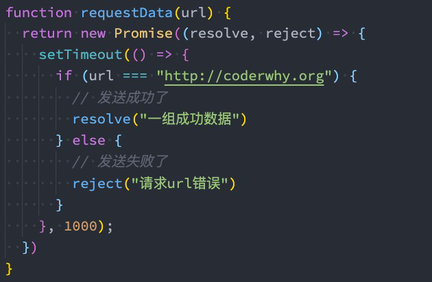
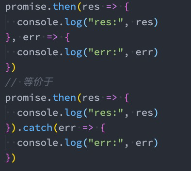
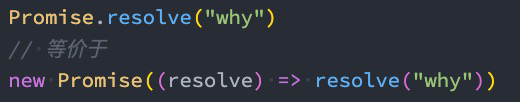
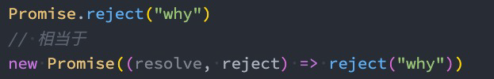
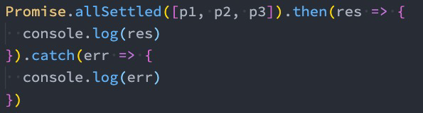

# 1. Promise

```js
function requestData(url) {
  // 模拟网络请求
  setTimeout(() => {
    // 拿到请求的结果
    // url传入的是coderwhy，请求成功
    if(url === 'coderwhy'){
      // 成功
      let names = ["abc", "cba", "nba"]
      return names
    } else { // 否则请求失败
      // 失败
      let errMessage = "请求失败，url错误"
      return errMessage
    }
    
    
  }， 3000)
}

const result = requestData("coderwhy")

// requestData是一个同步函数，你能拿到的返回值是undefined

// 即使setTimeout，result也不会拿到的，requestData已经执行完毕了

// 我们的异步请求，即使有返回值也不会传递到我们的result，它只是网络请求或者setTimeout的返回值，并不是requestData的返回值。

// 解决的办法就是传入回调函数，当我们的setTimeout完成异步函数完成后，调用回调函数将结果返回出去，这样子我们就能拿到setTimeout执行结果。
```

```js
/**
 * 这种回调的方式有很多的弊端:
 *  1> 如果是我们自己封装的requestData,那么我们在封装的时候必须要自己设计好callback名称, 并且使用好
 *  2> 如果我们使用的是别人封装的requestData或者一些第三方库, 那么我们必须去看别人的源码或者文档, 才知道它这个函数需要怎么去获取到结果
 */

// request.js
function requestData(url, successCallback, failtureCallback) {
  // 模拟网络请求
  setTimeout(() => {
    // 拿到请求的结果
    // url传入的是coderwhy, 请求成功
    if (url === "coderwhy") {
      // 成功
      let names = ["abc", "cba", "nba"]
      successCallback(names)
    } else { // 否则请求失败
      // 失败
      let errMessage = "请求失败, url错误"
      failtureCallback(errMessage)
    }
  }, 3000);
}

// main.js
requestData("kobe", (res) => {
  console.log(res)
}, (err) => {
  console.log(err)
})

// 更规范/更好的方案 Promise承诺(规范好了所有的代码编写逻辑)
function requestData2() {
  return "承诺"
}

const chengnuo = requestData2()
```

+ 以前的网络异步请求，用的是callback来获取请求数据：
  + 这就需要我们自己来设计回调函数、回调函数的名称、回调函数的使用等；
  + 对于不同的人、不同的框架设计出来的方案是不同的，那么我们必须耐心去看别人的源码或者文档，以便可以理解它这个函数到底怎么用；对于使用callback的成本比较高。
+ Promise是用于解决回调地狱，同时也形成了一个代码规范，就像承诺一样，规范好了所有代码别写逻辑，按照预设的方法去获取就行，而不需要增加增本去阅读一些请求函数的文档查看具体的回调。

## 1. 什么是Promise呢？

+ Promise是一个类，可以翻译成 承诺、许诺 、期约；所以我们可以直接使用类名调用静态方法
+ 当我们需要给予调用者一个承诺：待会儿我会给你回调数据时，就可以创建一个Promise的对象（new Promise）；
  + 意思就是说，我们设计返回的数据的时候，给到调用者一个Promise对象就行了
+ 在通过new创建Promise对象时，我们需要传入一个回调函数，我们称之为executor
  + 这个回调函数会被立即执行，并且给传入另外两个回调函数resolve、reject；
  + 当我们调用resolve回调函数时，会执行Promise对象的then方法传入的回调函数；
  + 当我们调用reject回调函数时，会执行Promise对象的catch方法传入的回调函数；

```js
// new的过程会执行类里面的构造方法.
// Promise传入回调函数，这个回调函数会被执行，内部还会给回调函数传入一些默认参数resolve，reject
// 传入的这个函数，被称之为executor
const promise = new Promise((resolve，reject) => {
  console.log("promise传入的函数被执行")
})

// 等价于
class Person {
  constructor(callback) {
    const resolve = () => {}
    const reject = () => {}
    // 相当于传入的回调函数，默认会帮助我们把resolve和reject两个函数传入进去
    callback(resolve, reject)
  }
}

const p = new Person(resolve，reject) => {})
```

```js
function foo() {
  // Promise
  return new Promise((resolve, reject) => {
    resolve("success message")
    // reject("failture message")
  })
}

// 这里获得一个promise
const fooPromise = foo()

// then方法会在我们Promise执行resolve函数的时候被回调
// then方法传入的回调函数两个回调函数:
// > 第一个回调函数, 会在Promise执行resolve函数时, 被回调
// > 第二个回调函数, 会在Promise执行reject函数时, 被回调
fooPromise.then((res) => {
  // res会获取到Promise.resolve传入的数据（一般就是网络请求的数据）
  console.log(res)
}, (err) => {
  // res会获取到Promise.reject传入的错误信息
  console.log(err)
})

// // catch方法传入的回调函数, 会在Promise执行reject函数时, 被回调
fooPromise.catch(() => {

})


// 传入的这个函数, 被称之为 executor
// > resolve: 回调函数, 在Promise中成功时, 回调resolve函数
// > reject: 回调函数, 在Promise中失败时, 回调reject函数
// Promise规范了成功失败的时候调用哪个函数。
// const promise = new Promise((resolve, reject) => {
//   // console.log("promise传入的函数被执行了")
//   // resolve()
//   reject()
// })

// promise.then(() => {

// })

// promise.catch(() => {

// })


// 钩子函数: hook
function foo(fn) {
  fn()
}

foo(() => {

})


```

```js
// 简易版本
// 测试发现Promise中必须传入一个回调函数，不然报错
const myPromise = new Promise((resolve, reject) => {
 	resolve(); 
  // reject()
})

myPromise.then(...);
myPromise.catch(...)

//Promise作用作用就是规范了一种联系，
// 当我们成功的时候如何通知出去，调用resolve，然后外部的then就可以被触发（resolve -> then），我么也就知道异步请求成功了，执行成功的操作。
// catch也是同理。
// 这就是Promise规范，建立resolve和外部的then的联系
```

现在我们利用Promise重构一下我们一开始利用网络请求回调的代码

```js
// request.js
function requestData(url,) {
  // 异步请求的代码会被放入到executor中
  return new Promise((resolve, reject) => {
    // new的过程中会执行回调函数的代码，
    
    // 模拟网络请求
    setTimeout(() => {
      // 拿到请求的结果
      // url传入的是coderwhy, 请求成功
      if (url === "coderwhy") {
        // 成功
        let names = ["abc", "cba", "nba"]
        // resolve扮演回调函数，然后把网络请求的数据通过某种方式返回出去。
        resolve(names)
      } else { // 否则请求失败
        // 失败
        let errMessage = "请求失败, url错误"
        reject(errMessage)
      }
    }, 3000);
  })
}

// main.js
const promise = requestData("coderwhy")
promise.then((res) => {
  console.log("请求成功:", res)
}, (err) => {
   console.log("请求失败:", err)
})

// node当中不支持then和catch分开写。例如
promise.then()
promise.catch()

// 可以优化成最上面的，也可以写成链式调用
promise.then().catch()
```

+ Promise就是为了统一我们异步处理的传入回调函数的各种方案。

## 2. Promise的代码结构

+ 以将它划分成三个状态：
  + 待定（pending）: 初始状态，既没有被兑现，也没有被拒绝；
    + 当执行executor中的代码时，处于该状态；
  + 已兑现（fulfilled）: 意味着操作成功完成；
    + 执行了resolve时，处于该状态；
  + 已拒绝（rejected）: 意味着操作失败；
    + 执行了reject时，处于该状态；

```js
function foo(fn) {
    fn()
}
// 传进去的函数回头在里面被调用，就是回调函数
foo(() => {})

// 钩子函数虽然和回调函数差不多
// 但是钩子函数是指windows的消息机制下，捕获消息的时候立即执行
// 回调函数并不能参与消息处理的过程，只是消息捕获结束后才执行的函数
```

```js
// 当没有使用resolve的时候，返回的promise状态一直处于pending

const myPromise = new Promise((resolve, reject) => {
  return '2';
});

console.log(myPromise); // Promise { <pending> }
```

```js
// Promise返回的结果和调用resolve reject有关，return无关
const myPromise = new Promise((resolve, reject) => {
  // resolve('1'); // resolve传入的值，会作为then的第一个回调函数参数
  reject('1'); // 同上，第二个回调函数的活着catch的参数
  return '2';
});

console.log(myPromise); // Promise { '1' } 活着结果为 Promise { <rejected> '1' }

myPromise
  .then((aa) => {
    console.log(aa);
  })
  .catch((err) => {
    console.log(err);  // '1'
  });

```

## 3. Promise重构请求



## 4. Executor

+ Executor,遗嘱执行人的意思

+ Executor是在创建Promise时需要传入的一个回调函数，这个回调函数会被立即执行，并且传入两个参数：

```js
new Promise(() => {
    console.log("Executor代码")
})
```

+ 通常我们会在Executor中确定我们的Promise状态：
  + 通过resolve，可以兑现（fulfilled）Promise的状态，我们也可以称之为已决议（resolved）；
  + 通过reject，可以拒绝（reject）Promise的状态；
+ 这里需要注意：一旦状态被确定下来，Promise的状态会被锁死，该Promise的状态是不可更改的
  + 在我们调用resolve的时候，如果resolve传入的值本身不是一个Promise，那么会将该Promise的状态变成兑现（fulfilled）；
  + 在之后我们去调用reject时，已经不会有任何的响应了（并不是这行代码不会执行，而是无法改变Promise状态）；

```js
const myPromise = new Promise((resolve, reject) => {
  resolve('确定状态为成功，后面无法再更改');
  console.log('这里还会执行');
  reject('前面已经确定状态了，这里已经无法更改，无意义了');
  console.log('这里还会执行');
  return ' return无意义';
});

myPromise
  .then((aa) => {
    console.log(aa);
  })
  .catch((err) => {
    console.log(err);
  });

```

## 5. resolve不同值的区别

+ 情况一：如果resolve传入一个普通的值或者对象，那么这个值会作为then回调的参数；
+ 情况二：如果resolve中传入的是另外一个Promise，那么这个新Promise会决定原Promise的状态：
+ 情况三：如果resolve中传入的是一个对象，并且这个对象有实现then方法，那么会执行该then方法，并且根据then方法的结果来决定Promise的状态：

```js
const promise = new Promise((resolve, reject) => {
    
})


promise.then((res) => {
    
}, (err) => {
    
})

// 等价于

new Promise((resolve, reject) => {
    console.log("------")
    // resolve()
    reject()
}).then(res => {
    console.log('res', res)
}, err => {
    console.log('err', err)
})

```

```js
new Promise(() => {
    // penging状态
    console.log("-----")
    resolve()
    console.log("+++++")
    reject()
}).then(res => {
    console.log('res', res)
}, err => {
    console.log("err", err)
})
// 打印结果:
-----
+++++
res: undefined  // 执行then

// 一旦执行的resolve进入成功状态，调用reject()也不会改变当前状态，反之相同
new Promise(() => {
    // penging状态
    console.log("-----")
    reject()
    resolve()
    console.log("+++++")
}).then(res => {
    console.log('res', res)
}, err => {
    console.log("err", err)
})
// 结果：
-----
+++++
err： 
```

```js
/** 传入一个Promise
 *    那么当前的Promise的状态会由传入的Promise来决定
 *    相当于状态进行了移交
*/
const newPromise = new Promise((resolve, reject) => {
    
})

new Promise((resolve, reject) => {
    resolve(newPromise)
}).then(res => {
    console.log("res", res)
}, err => {
    console.log("err", err)
})

// 此时newPromise回调函数里没有任务，所以一直pending状态
// 加入增加修改状态
const newPromise = new Promise((resolve, reject) => {
    reject("err message")
})
// 结果就是err: err message
```

```js
//传入一个对象, 并且这个对象有实现then方法(并且这个对象是实现了thenable接口)
// 那么也会执行该then方法, 并且又该then方法决定后续状态

// 传入一个对象，这个对象有是实现then方法
new Promise((resolve, reject) => {
    const obj = {
        // resolve会自动执行then方法，会自动传入resolve，reject，然后由这个对象决定状态
        then: function(resolve, reject) {
            
        }
    }
    resolve(obj)
}).then(res => {
    console.log("res", res)
}, err => {
    console.log("err", err)
})
```

```js
/**
 * resolve(参数)
 *  1> 普通的值或者对象  pending -> fulfilled, then中res获取该值
 *  2> 传入一个Promise
 *    那么当前的Promise的状态会由传入的Promise来决定
 *    相当于状态进行了移交
 *  3> 传入一个对象, 并且这个对象有实现then方法(并且这个对象是实现了thenable接口)
 *    那么也会执行该then方法, 并且又该then方法决定后续状态
 */

// 1.传入Promise的特殊情况
// const newPromise = new Promise((resolve, reject) => {
//   // resolve("aaaaaa")
//   reject("err message")
// })

// new Promise((resolve, reject) => {
//   // pending -> fulfilled
//   resolve(newPromise)
// }).then(res => {
//   console.log("res:", res)
// }, err => {
//   console.log("err:", err)
// })

// 2.传入一个对象, 这个兑现有then方法
new Promise((resolve, reject) => {
  // pending -> fulfilled
  const obj = {
    then: function(resolve, reject) {
      // resolve("resolve message")
      reject("reject message")
    }
  }
  resolve(obj)
}).then(res => {
  console.log("res:", res)
}, err => {
  console.log("err:", err)
})

// eatable/runable
const obj = {
  // 实现eat接口 eatable
  eat: function() {

  },
  // 实现run接口 runable
  run: function() {

  }
}

```

+ 大白话：resolve里面嵌套Promise、thenable的话，我们必须确定里面的状态再返回。如果最终出现一个普通值或对象，说明整个流程的Promise都是已兑现的，如果出现失败，说明整个流程是失败的

## 6. then方法-接受两个参数

+ then方法是Promise对象上的一个方法：它其实是放在Promise的原型上的`Promise.prototype.then`
+ then方法接受两个参数：
  + fulfilled的回调函数：当状态变成fulfilled时会回调的函数；
  + reject的回调函数：当状态变成reject时会回调的函数；



```js
console.log(Promise.prototype) // 打印为空是因为可枚举属性设置为false
// class定义类本质上用的构造函数和一系列操作的语法糖
```

```js
class Person {
    constructor(executor) {
        const resolve = () => {
            // resolve被执行就会执行then中的回调函数
            this.callback()
        }
        
        const reject = () => {
            
        }
        
        executor(resolve, reject)
        
    }
    
    then(callback) {
        this.callback = callback
    }
}
```

## 7. then方法-多次调用

+ 一个Promise的then方法是可以被多次调用的：
  + 每次调用我们都可以传入对应的fulfilled回调；
  + 当Promise的状态变成fulfilled的时候，这些回调函数都会被执行；

```js
// 1.同一个Promise可以被多次调用then方法
// 当我们的resolve方法被回调时, 所有的then方法传入的回调函数都会被调用
promise.then(res => {
  console.log("res1:", res)
})

promise.then(res => {
  console.log("res2:", res)
})

promise.then(res => {
  console.log("res3:", res)
})

// 上面三个等价于
promise.then(res => {
  console.log("res1:", res)
  console.log("res2:", res)
  console.log("res3:", res)
})


// 注意和这个是有区别的
promise.then(res => {}).then(res => {})
// 假如第一个then有返回一个prosmise并触发resolve才会执行第二个，两个then处理的还是不是同一个promise
```

## 8. then方法-返回值

+ then方法本身是有返回值的，它的返回值是一个Promise，所以我们可以进行如下的链式调用：
  + 但是then方法返回的Promise到底处于什么样的状态呢？
    + 根据回调函数的返回值决定then的返回值
+ Promise有三种状态，那么这个Promise处于什么状态呢？
  + 当then方法中的回调函数本身在执行的时候，那么它处于pending状态；
  + 当then方法中的回调函数返回一个结果时，那么它处于fulfilled状态，并且会将结果作为resolve的参数；
    + 情况一：返回一个普通的值； 
    + 情况二：返回一个Promise；
    + 情况三：返回一个thenable值；
    + 当then方法抛出一个异常时，那么它处于reject状态；

```js
// Promise有哪些对象方法
// console.log(Object.getOwnPropertyDescriptors(Promise.prototype))

const promise = new Promise((resolve, reject) => {
  resolve("hahaha")
})
```

```js
// 当我们打印一个Promise的时候，能够看到里面会有表示的状态，活着返回值
// 比如返回的结果
const myPromise = new Promise((res, rej) => {
  res('xps');
});
conosole.log(myPromise) // Promise { {name: 'xps'} }     
// 可以看出，本身打印promise也是携带信息的。                         
                                             
myPromise.then(res => {return 'xps'})
// 等价于
myPromise.then(res => {return new Promise((res, rej) => {
	res('xps')
})})                                             

```

```js
const myPromise = new Promise((res, rej) => {
  res('xps');
});

// 所以打印Promise.then
console.log(myPromise.then(res => {return 'xps'})) // Promise { <pending> }
// 思考上面为什么打印的是pending。因为then是一个异步的操作。里面的回调函数会异步调用，当异步还没有执行的时候，打印就是pending
```

```js
// 当我们then有了结果就会传递给链式调用的then中
const myPromise = new Promise((res, rej) => {
  res('1');
});

const thenRes = myPromise
  .then((res) => {
    console.log(res);  // '1'
    return '2';
  })
  .then((res) => {
    console.log(res); // 拿到上一个then的返回值，打印'2'
  });

```

```js
// 2.then方法传入的 "回调函数: 可以有返回值
// 1> 如果我们返回的是一个普通值(数值/字符串/普通对象/undefined), 那么这个普通的值被作为一个新的Promise的resolve值
promise.then(res => {
  return "aaaaaa" // 如果没有返回值，默认是一个undefined
}).then(res => {
    console.log("res", res)
    return "bbbbb"
})

// 等价于
promise.then(res => {
    // 这个证明了then方法本身也是由返回值的，返回值是一个Promise
    return new Promise((resolve) => {
        resolve("aaaaa")
    })
})
```

```js
// Promise有哪些对象方法
// console.log(Object.getOwnPropertyDescriptors(Promise.prototype))

const promise = new Promise((resolve, reject) => {
  resolve("hahaha")
})

// 1.同一个Promise可以被多次调用then方法
// 当我们的resolve方法被回调时, 所有的then方法传入的回调函数都会被调用
promise.then(res => {
  console.log("res1:", res)
})

promise.then(res => {
  console.log("res2:", res)
})

promise.then(res => {
  console.log("res3:", res)
})

// 2.then方法传入的 "回调函数: 可以有返回值
// then方法本身也是有返回值的, 它的返回值是Promise

// 1> 如果我们返回的是一个普通值(数值/字符串/普通对象/undefined), 那么这个普通的值被作为一个新的Promise的resolve值
promise.then(res => {
  return "aaaaaa"
}).then(res => {
  console.log("res:", res)
  return "bbbbbb"
})

// 2> 如果我们返回的是一个Promise
promise.then(res => {
  return new Promise((resolve, reject) => {
    setTimeout(() => {
      resolve(111111)
    }, 3000)
  })
}).then(res => {
  console.log("res:", res)
})

// 3> 如果返回的是一个对象, 并且该对象实现了thenable
promise.then(res => {
  return {
    then: function(resolve, reject) {
      resolve(222222)
    }
  }
}).then(res => {
  console.log("res:", res)
})

```

+ then返回的结果和resolve一样，也是也要确认里面的Promise，再返回。
+ then的返回值的规则和resolve一样。

## 9. catch方法- 多次调用

+ catch方法也是Promise对象上的一个方法：它也是放在Promise的原型上的`Promise.prototype.catch`
+ 一个Promise的catch方法是可以被多次调用的：
  + 每次调用我们都可以传入对应的reject回调；
  + 当Promise的状态变成reject的时候，这些回调函数都会被执行；

```js
const myPromise = new Promise((res, rej) => {

});

myPromise.then(res => {}, rej => {})

// 可以写成
myPromise.then(res => {})
// 缺点，是这样写catch不符合Promise a+规范
myPromise.catch(rej => {})


// 也可以写成,但是catch只能捕获一次异常
myPromise.then().catch()

```

```js
const myPromise = new Promise((res, rej) => {
  rej('1');
});

myPromise
  .then(() => {
    return new Promise((res, rej) => {
      rej('2');
    });
  })
  .catch((res) => {
    console.log(res); // 打印1，2无法捕获
  });
// 可以理解成在整个链式中捕获第一次的异常，剩下的交给后面的catch
```

```js
const promise = new Promise((resolve, reject) => {
    // reject("rejected status")
    // 1. 当我们抛出异常时，也是会调用错误捕获的回调函数的
    throw new Error("rejected status")
})


promise.then(undefined, (err) => {
    console.log("err", err)
})

// 等价于
promise.then(res => {
    
}).catch(err => {
    // 如果第一个promise报出异常就捕获，如果没有等下一个。如果下一个promise抛出异常也会被捕获。
})


```

```js
const promise = new Promise((resolve, reject) => {
    reject("11111")
})

promise.then(res => {
    
}, err => {
    console.log("err", err)
})

// 改成这种写法，假如promise抛出异常，代码会报错
// 因为下面两个是独立的调用，相互之间不会影响，所以第一个then执行完成后，没有捕获异常就会报出错误
// 一般完成一个进程正常退出是0
promise.then (res => {
    
})

// 这种分开写，算是一种语法糖，但是不符合Promise a+的规范
promise.catch(err => {
    
})

```

## 10. catch方法-返回值

+ 事实上catch方法也是会返回一个Promise对象的，所以catch方法后面我们可以继续调用then方法或者catch方法：
  + 下面的代码，后续是catch中的err2打印，还是then中的res打印呢？
  + 答案是res打印，这是因为catch传入的回调在执行完后，默认状态依然会是fulfilled的；
+ 那么如果我们希望后续继续执行catch，那么需要抛出一个异常：

```js
// 4.catch方法的返回值
const promise = new Promise((resolve, reject) => {
  reject("111111")
})

promise.then(res => {
  console.log("res:", res)
}).catch(err => {
  console.log("err:", err)
  // catch返回值的效果和then一样，返回一个Promise，所以后面的then会执行
  return "catch return value"
}).then(res => {
  // 拿到catch返回的Promise，执行
  console.log("res result:", res)
}).catch(err => {
  console.log("err result:", err)
})

```

```js
const promise = new Promise((resolve, reject) => {
  reject("111111")
  console.log('------------');
  throw new Error("22222")
})
// -----
// 11111

const promise = new Promise((resolve, reject) => {
  reject("111111")
  throw new Error("22222")
  console.log('------------');
})


const promise = new Promise((resolve, reject) => {
  // throw 后面的不会再执行，但是抛出异常的优先级，哪个先抛出，哪个优先
  throw new Error("22222")
  reject("111111")
  console.log('------------');
})
// 22222 直接抛出后 就不执行了


promise.catch(err => {
  console.log(err);   
})
```

```JS
// 4.catch方法的返回值
const promise = new Promise((resolve, reject) => {
  reject("111111")
})

promise.then(res => {
  console.log("res:", res)
}).catch(err => {
  console.log("err:", err)
  return "catch return value" // 这里等价于 return newPromise(resolve => resoleve(x)), 所以会被then使用，然后由then接着抛出异常再由下一个catch调用
}).then(res => {
  console.log("res result:", res)
}).catch(err => {
  console.log("err result:", err)
})
```

## 11. finally方法

+ finally是在ES9（ES2018）中新增的一个特性：表示无论Promise对象无论变成fulfilled还是reject状态，最终都会被执行的代码。
+ finally方法是不接收参数的，因为无论前面是fulfilled状态，还是reject状态，它都会执行。
+ Promise a+规范里其实没有finally的。ECMA自己做的扩展。

```js
const promise = new Promise((resolve, reject) => {
  // resolve("resolve message")
  reject("reject message")
})

promise.then(res => {
  console.log("res:", res)
}).catch(err => {
  console.log("err:", err)
}).finally(() => {
  console.log("finally code execute")
})
// finally不接受参数，设计之初就是无论什么状态最终都会被执行
```

## 12. resolve方法

+ **前面我们学习的then、catch、finally方法都属于Promise的实例方法，都是存放在Promise的prototype上的。**

  + 下面我们再来学习一下**Promise的类方法。**

+ 有时候我们已经有一个现成的内容了，希望将其转成Promise来使用，这个时候我们可以使用`Promise.resolve` 方法来完成。

  + `Promise.resolve`的用法相当于new Promise，并且执行resolve操作：

  

+ resolve参数的形态：

  + 情况一：参数是一个普通的值或者对象
  + 情况二：参数本身是Promise
  + 情况三：参数是一个thenable

```js
function foo() {
  return 1
}

// 希望返回一个Promise。想要拿到具体结果，通过then，假如报错可以使用catch
function foo() {
  return Promise.resolve(1)
  // 等啊机遇
  // return new Promise((res) => { return res(1) })
}

const result = foo()
result.then(res => console.log(res) )
```

```js
function foo() {
    const obj = { name: 'why' } 
    //转成promise对象返回出去
    // 方法一：
    return new Promise((resolve) => {
        resolve(obj)
    })
}

foo().then(res => {
    console.log('res', res)
})

// 方法二：
// 1. 普通的值
const promise = Promise.resolve({name: 'why'})
// 等价于
const promise2 = new Promise((resolve, reject) => {
    resolve({name: 'why'})
})

// 2. 传入promise
const promise = new Promise(new Promise((reslove, reject) => {
    resolve('1111')
}))

// 3. thenable
...

// 读取里面
promise.then(res => {
    console.log("res", res)
})

```

## 13. reject方法

+ reject方法类似于resolve方法，只是会将Promise对象的状态设置为reject状态。
+ `Promise.reject`的用法相当于new Promise，只是会调用reject：



+ `Promise.reject`传入的参数无论是什么形态，都会直接作为reject状态的参数传递到catch的。
  + 这里和Promise.resolve的区别，传入什么值都直接返回出去。不关系里面是啥，只要拒绝了就拒绝了。

```js
// 相当于生成一个promise，但是被reject调用了
Promise.reject("reject message")
// 相当于
const promise2 = new Promise((resolve, reject) => {
    reject("reject message")
})

// 注意reject无论传入什么都是一样的
const promise = Promise.reject({
    then: function(resolve, reject) {
        resolve('1111')
    }
})  // 最终结果 err: {tehn: [Fucntion: then]}
// 无论传入什么，都当成普通的直接回调err，打印出来。

// 传入promise都是直接打印出来
const promise = Promise.reject(new Promise (() => {}))
// 结果err: Promise {<pending>}

Promise.then(res => {
    console.log('res', res)
}).catch(err => {
    console.log("err", err)
})

```

## 14. all方法

+ 另外一个类方法是`Promise.all`：
  + 它的作用是将多个Promise包裹在一起形成一个新的Promise；
  + 新的Promise状态由包裹的所有Promise共同决定：
    + 当所有的Promise状态变成fulfilled状态时，新的Promise状态为fulfilled，并且会将所有Promise的返回值组成一个数组；
    + 当有一个Promise状态为reject时，新的Promise状态为reject，并且会将第一个reject的返回值作为参数；

```js
const p1 = new Promise((resolve, reject) => {
    setTimeout(() => {
        resolve(11111)
    }, 1000)
})

const p2 = new Promise((resolve, reject) => {
    setTimeout(() => {
        resolve(22222)
    }, 2000)
})

const p3 = new Promise((resolve, reject) => {
    setTimeout(() => {
        resolve(33333)
    }, 3000)
})

// 需求：所有的Promise都变成fulfilled时，再拿到结果
// 1. 传入一个数组，每个内容都是一个Promise，如果不是就转成Promise，通过调用Promise.resolve()。
//     例如传入的'aaa',就会被调用成Promise.resolve('aaa')。这样返回的所有结果都是统一Promise。规范。

// 2. 返回的也是Promise里面是一个数组保存各个Promise的结果，是写入的Promise数组的顺序

// 3. 意外：在拿到所有结果之前，有一个promise变成了rejected，那么整个promise是rejected

Promise.add([p1, p2, p3, 'aaaa']).then(res => {
    console.log(res) //
}).catch(err => {
    console.log(err)
})

// 返回结果是一个数组，数组内的顺序按照你传入promise的顺序
[11111, 22222, 33333, 'aaaa']
```

## 15. allSettled方法

+ all方法有一个缺陷：当有其中一个Promise变成reject状态时，新Promise就会立即变成对应的reject状态，然后调用catch。这样子你就不知道哪些成功了。也不能获取已经成功的方法。
  + 那么对于resolved的，以及依然处于pending状态的Promise，我们是获取不到对应的结果的；
+ 在ES11（ES2020）中，添加了新的API Promise.allSettled：
  + 该方法会在所有的Promise都有结果（settled），无论是fulfilled，还是reject时，才会有最终的状态；
  + 并且这个Promise的结果一定是fulfilled的；



+ 我们来看一下打印的结果：
  + `allSettled`的结果是一个数组，数组中存放着每一个Promise的结果，并且是对应一个对象的；
  + 这个对象中包含status状态，以及对应的value值；

```js
const p1 = new Promise((resolve, reject) => {
    setTimeout(() => {
        resolve(11111)
    }, 1000)
})

const p2 = new Promise((resolve, reject) => {
    setTimeout(() => {
        reject(22222)
    }, 2000)
})

const p3 = new Promise((resolve, reject) => {
    setTimeout(() => {
        resolve(33333)
    }, 3000)
})

// allSettled等所有都有结果后，调用我们的then
Promise.allSettled([p1,p2,p3]).then(res => {
    console.log(res)
}).catch(err => {
    // allSettled不会来到catch里面
    console.log(err)
})

// 最终返回：会带上状态和结果
[
    {status: 'fufilled', value: 1111},
    {status: 'rejected', reason: 2222},
    {status: 'fulfilled', value: 3333}
]

```

## 16.race方法

+ 如果有一个Promise有了结果，我们就希望决定最终新Promise的状态，那么可以使用race方法：
  + race是竞技、竞赛的意思，表示多个Promise相互竞争，谁先有结果，那么就使用谁的结果；
  + 如果竞赛得到的第一个结果是reject，那么得到的结果是reject

```js
// 创建多个Promise
const p1 = new Promise((resolve, reject) => {
  setTimeout(() => {
    resolve(11111)
  }, 3000);
})

const p2 = new Promise((resolve, reject) => {
  setTimeout(() => {
    reject(22222)
  }, 500);
})

const p3 = new Promise((resolve, reject) => {
  setTimeout(() => {
    resolve(33333)
  }, 1000);
})

// race: 竞技/竞赛
// 只要有一个Promise变成fulfilled状态, 那么就结束
// 意外: 如果竞赛得到的第一个结果
Promise.race([p1, p2, p3]).then(res => {
  console.log("res:", res)
}).catch(err => {
  console.log("err:", err)
})

```

如果竞赛过程中，我想要的就是必须拿到一个结果，而不是拿到一个reject，那么就需要用到any

## 17. any方法

+ any方法是ES12中新增的方法，和race方法是类似的：
  + any方法会等到一个fulfilled状态，才会决定新Promise的状态；
  + 如果所有的Promise都是reject的，那么也会等到所有的Promise都变成rejected状态；
+ 如果所有的Promise都是reject的，那么会报一个`AggregateError`的错误。
  + 内部实现了`reject(new AggregateError(['错误信息']))`
  + 可以通过`err.errors`拿到里面的错误信息

```js
// 创建多个Promise
const p1 = new Promise((resolve, reject) => {
  setTimeout(() => {
    // resolve(11111)
    reject(1111)
  }, 1000);
})

const p2 = new Promise((resolve, reject) => {
  setTimeout(() => {
    reject(22222)
  }, 500);
})

const p3 = new Promise((resolve, reject) => {
  setTimeout(() => {
    // resolve(33333)
    reject(3333)
  }, 3000);
})

// any方法
Promise.any([p1, p2, p3]).then(res => {
  console.log("res:", res)
}).catch(err => {
  console.log("err:", err.errors)
})


```

总结：

+ all和allSettled
  + all只要一个reject，结果就reject。allSettled会等所有结果
+ race和any
  + race只要拿到第一个是reject，结果reject。any会一直等到成功。如果所有都是reject，才会触发catch。

## 18. 什么是Promise

+ 一种异步请求的处理规范，规范好了所有代码别写逻辑，按照预设的方法去获取异步结果。
+ 在js中是一个类。

+ 需要注意的细节：

  ```js
  new Promise(回调函数)
  // 传入的回调函数会被立即执行
  ```

+ Promise的状态一旦确定下来后是不可更改的

# 2. 手写Promise

参考默认的标准

```js
// ES6 ES2015
// https://promisesaplus.com/
```

## 1. 结构涉及

```js
// ES6 ES2015
// https://promisesaplus.com/
const PROMISE_STATUS_PENDING = 'pending'
const PROMISE_STATUS_FULFILLED = 'fulfilled'
const PROMISE_STATUS_REJECTED = 'rejected'

class HYPromise {
  // executor参数用于接收我们传入的回调函数，在这里Promise固定传入(resolve, reject) => {}
  // new一个class的时候，就会执行里面的构造函数constructor
  constructor(executor) {
    // 表示状态
    this.status = PROMISE_STATUS_PENDING
    // 保存值
    this.value = undefined
    this.reason = undefined

    // 当reject状态就不执行resolve
    const resolve = (value) => {
      if (this.status === PROMISE_STATUS_PENDING) {
        this.status = PROMISE_STATUS_FULFILLED
        this.value = value
        console.log("resolve被调用")
      }
    }

    const reject = (reason) => {
      if (this.status === PROMISE_STATUS_PENDING) {
        this.status = PROMISE_STATUS_REJECTED
        this.reason = reason
        console.log("reject被调用")
      }
    }

    // 这里给传入的回调函数传入resolve和reject
    executor(resolve, reject)
  }
}

// new的过程会执行里面的回调函数
const promise = new HYPromise((resolve, reject) => {
  console.log("状态pending")
  resolve(1111)
  reject(2222)
})

promise.then(res => {

}, err => {

})

window.onclick = function() {
  
}

```

## 2. then方法实现

```js
// ES6 ES2015
// https://promisesaplus.com/
const PROMISE_STATUS_PENDING = 'pending'
const PROMISE_STATUS_FULFILLED = 'fulfilled'
const PROMISE_STATUS_REJECTED = 'rejected'

class HYPromise {
  constructor(executor) {
    this.status = PROMISE_STATUS_PENDING
    this.value = undefined
    this.reason = undefined

    const resolve = (value) => {
      if (this.status === PROMISE_STATUS_PENDING) {
        this.status = PROMISE_STATUS_FULFILLED
        // 执行then传进来的回调函数

        // queueMicrotask把函数加入到微任务里面
        // setTimeout把函数放入到宏任务
        queueMicrotask(() => {
          this.value = value
          this.onFulfilled(this.value)
        });
      }
    }

    const reject = (reason) => {
      if (this.status === PROMISE_STATUS_PENDING) {
        this.status = PROMISE_STATUS_REJECTED
        // 执行then传进来的回调函数
        queueMicrotask(() => {
          this.reason = reason
          this.onRejected(this.reason)
        })
      }
    }

    executor(resolve, reject)
  }

  // Promise的方法
  then(onFulfilled, onRejected) {
    this.onFulfilled = onFulfilled
    this.onRejected = onRejected
  }
}

const promise = new HYPromise((resolve, reject) => {
  console.log("状态pending")
  // reject(2222)
  resolve(1111)
})

// 调用then方法
promise.then(res => {
  console.log("res1:", res)
  return 1111
}, err => {
  console.log("err:", err)
}).then(res => {
  console.log("res3:", res)
})

// promise.then(res => {
//   console.log("res2:", res)
// }, err => {
//   console.log("err2:", err)
// })


```

## 3. then方法优化一

```js
```


 