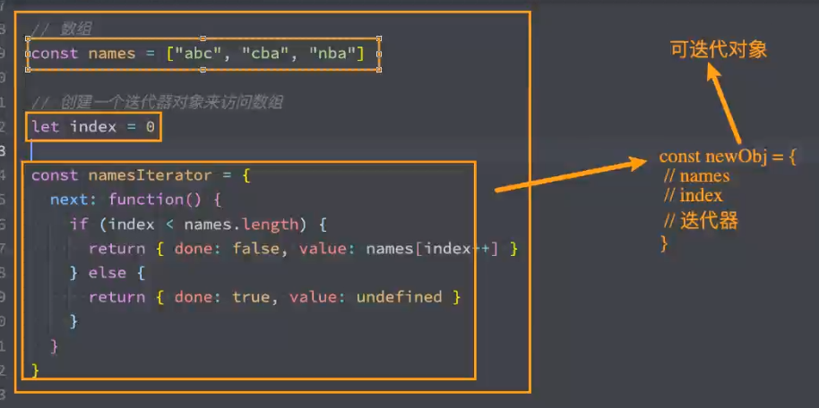
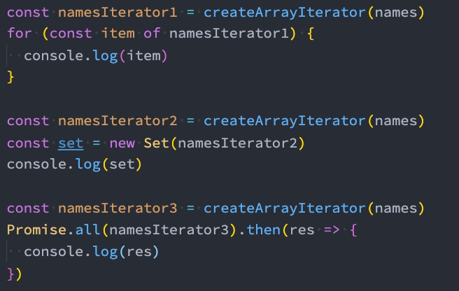

# 21. Iterator-Generator

## 1. 什么是迭代器？

+ 迭代器（iterator），是确使用户可在容器对象（container，例如链表或数组）上遍访的对象，使用该接口无需关心对象的内部实现细节。
  + 其行为像数据库中的光标，迭代器最早出现在1974年设计的CLU编程语言中；
  + 在各种编程语言的实现中，迭代器的实现方式各不相同，但是基本都有迭代器，比如Java、Python等；

**可以理解成迭代器就是一个对象（接口）帮助我们遍历容器对象**。迭代器的行为像C语言创建指针，每执行一次，往后移动移动

+ 从迭代器的定义我们可以看出来，迭代器是帮助我们对某个数据结构进行遍历的对象。
+ 在JavaScript中，迭代器也是一个具体的对象，这个对象需要符合迭代器协议（iterator protocol）：
  + 迭代器协议定义了产生一系列值（无论是有限还是无限个）的标准方式；
  + 那么在js中这个标准就是一个特定的next方法；
    + 迭代器对象里面需要实现一个new函数

+ next方法有如下的要求：
  + 无参数或者一个参数（generator特俗的迭代器）的函数，返回一个应当拥有以下两个属性的对象：
  + done（`boolean`）
    + 如果迭代器可以产生序列中的下一个值，则为false。（这等价于没有指定done 这个属性。）
    + 如果迭代器已将序列迭代完毕，则为true。这种情况下，value 是可选的，如果它依然存在，即为迭代结束之后的默认返回值。
  +  value
    + 迭代器返回的任何JavaScript 值。done 为true 时可省略。

```js
// 编写自己的一个迭代器：需要遵从我们的迭代器协议（iterator protocol）
const iterator = {
  // 1. 需要实现一个next函数。一般是无参的。特殊的迭代器（生成器）是有一个参数的
  next: function () {
    return { done: true, value: 123 };
  },
};
```

```js
// 数组
const names = ['abc', 'cba', 'nba'];

// 创建一个迭代器对象来访问数组
let index = 0;

// 自定义的迭代器
const namesIterator = {
  next: function () {
    if (index < names.length) {
      // 返回一个对象，里面要有done属性和value属性
      return { done: false, value: names[index++] };
    } else {
      // 遍历完会返回一个true，并且数据遍历完最后返回true
      // done: true可以省略
      return { done: true, value: undefined };
    }
  },
}; 

console.log(namesIterator.next());
console.log(namesIterator.next());
console.log(namesIterator.next()); // { done: false, value: "nba" }
console.log(namesIterator.next()); // { done: true, value: undefined }
console.log(namesIterator.next()); // { done: true, value: undefined }
console.log(namesIterator.next()); // { done: true, value: undefined }
console.log(namesIterator.next());
console.log(namesIterator.next());
console.log(namesIterator.next());

// 只有遍历完所有数组内容，之后才返回done: true，并且默认value为undefined

// 注意单词
iterator protocol 迭代器协议
iterable protocol 可迭代器对象
两个是不一样的东西
```

```js
// 生成迭代器的函数
// 给一个数组生成一个迭代器
function createArrayIterator(arr) {
  let index = 0
  return {
    next: function() {
      if (index < arr.length) {
        return { done: false, value: arr[index++] }
      } else {
        return { done: true, value: undefined } 
      }
    }
  }
}

const names = ["abc", "cba", "nba"]
const nums = [10, 22, 33, 12]

const namesIterator = createArrayIterator(names)
console.log(namesIterator.next())
console.log(namesIterator.next())
console.log(namesIterator.next())

const numsIterator = createArrayIterator(nums)
console.log(numsIterator.next())
console.log(numsIterator.next())
console.log(numsIterator.next())
console.log(numsIterator.next())

// 创建一个无限的迭代器
function createNumberIterator() {
  let index = 0
  return {
    next: function() {
      return { done: false, value: index++ }
    }
  }
}

const numberInterator = createNumberIterator()
console.log(numberInterator.next())
console.log(numberInterator.next())
console.log(numberInterator.next())
console.log(numberInterator.next())
console.log(numberInterator.next())
console.log(numberInterator.next())
console.log(numberInterator.next())
console.log(numberInterator.next())
console.log(numberInterator.next())
console.log(numberInterator.next())
console.log(numberInterator.next())
console.log(numberInterator.next())
console.log(numberInterator.next())

```

## 2. 可迭代对象

+  但是上面的代码整体来说看起来是有点奇怪的：
  + 我们获取一个数组的时候，需要自己创建一个index变量，再创建一个所谓的迭代器对象；
  + 事实上我们可以对上面的代码进行进一步的封装，让其变成一个可迭代对象；
  + 就是将我们的数组，还有index，迭代器功能放入到一个对象里。



+ 什么又是可迭代对象呢？
  + 它和迭代器是不同的概念；

    ```tet
    迭代器是一个对象
    符合迭代器协议（iterator protocal），必须实现next函数
    const iterator = {next: function(){return {done.....}}}
    ```

    ```txt
    可迭代对象也是一个对象
    符合可迭代协议（iterable protocal），必须实现@@iterator方法，利用[Symbol.iterator]函数
    const iterableObj = {[Symbol.iterator]: function(return 迭代器)}
    
    可迭代器对象  中可以返回  迭代器对象。
    ```

  + 注意`@@`表示的就是`Symbol.`
  
  + 当一个对象实现了iterable protocol协议时，它就是一个可迭代对象；
  
  + 这个对象的要求是必须实现@@iterator 方法，在代码中我们使用Symbol.iterator 访问该属性；
+ 当我们要问一个问题，我们转成这样的一个东西有什么好处呢？
  + 当一个对象变成一个可迭代对象的时候，进行某些迭代操作，比如`for...of`操作时，其实就会调用它的`@@iterator` 方法；

```js
// 原本我们给数组增加一个转成迭代器的函数
// 数组
const names = ['abc', 'cba', 'nba'];

// 创建一个迭代器对象来访问数组
let index = 0;

const namesIterator = {
  next: function () {
    if (index < names.length) {
      // 返回一个对象，里面要有done属性和value属性
      return { done: false, value: names[index++] };
    } else {
      // 遍历完会返回一个true，并且数据遍历完最后返回true
      // done: true可以省略
      return { done: true, value: undefined };
    }
  },
};

```

现在把上面的所有代码合并成一个对象，这个对象中实现了`[Symbol.iterator]`,并且其返回结果是一个迭代器对象，那么可以叫iterableObj是一个可迭代对象。

```js
// 创建一个可迭代对象来访问数组
const iterableObj = {
  names: ["abc", "cba", "nba"],
  [Symbol.iterator]: function() {
    let index = 0
    // 返回的结果是一个迭代器对象
    return {
      next: () => {
        if (index < this.names.length) {
          return { done: false, value: this.names[index++] }
        } else {
          return { done: true, value: undefined }
        }
      }
    }
  }
}
```

```js
// 创建一个可迭代器对象来访问数组
const iterableObj = {
  names: ["abc", "cba", "nba"],
  [Symbol.iterator]: function() {
    let index = 0
    // 返回一个新的迭代器对象
    return {
      // 注意细节，这里的next函数不能使用next: function() {}，而是使用箭头函数
      next: () => {
        if (index < this.names.length) {
          return { done: false, value: this.names[index++] }
        } else {
          return { done: true, value: undefined }
        }
      }
    }
  }
}

// 问题为什么next必须是箭头函数?
// 因为我们在使用过程中,执行的是
// const xpsIterator = iterableObj[Symbol.iterator]()
// console.log(iterator.next())
// 那么我们的next函数不是箭头函数，this绑定xpsIterator，xpsIterator中没有names属性。会报错
// 而我们的目标是希望this指向iterableObj      
// const xpsIterator = iterableObj[Symbol.iterator]()过程中，函数[Symbol.iterator]的this属性指向了iterableObj      
// 当我们改成箭头函数，this向上查找的时候，会找到[Symbol.iterator]函数中的this，即iterableObj，从而拿到正确的names


// iterableObj对象就是一个可迭代对象
// console.log(iterableObj[Symbol.iterator]) // [Function: [Symbol.iterator]]

// 1.第一次调用iterableObj[Symbol.iterator]函数
// 每次调用都会生成的都是新的迭代器
const iterator = iterableObj[Symbol.iterator]()
console.log(iterator.next())
console.log(iterator.next())
console.log(iterator.next())
console.log(iterator.next())

// // 2.第二次调用iterableObj[Symbol.iterator]函数
const iterator1 = iterableObj[Symbol.iterator]()
console.log(iterator1.next())
console.log(iterator1.next())
console.log(iterator1.next())
console.log(iterator1.next())

// 3.for...of可以遍历的东西必须是一个可迭代对象

// 对象就是不支持for of,因为他不是可迭代的
// const obj = {
//   name: "why",
//   age: 18
// }

// for of其实就是上面iterator1.next()的语法糖,最后获取里面value的值
for (const item of iterableObj) {
  console.log(item)
}

```

+ 在 JavaScript 中，函数内部默认有一个 `this` 属性，它是一个特殊的关键字，代表当前函数的执行上下文中的对象。

  `this` 的值在函数调用时动态确定，取决于函数的调用方式。下面是一些常见的函数调用方式和 `this` 的取值：

## 3. 原生迭代器对象

+ 事实上我们平时创建的很多原生对象已经实现了可迭代协议，会生成一个迭代器对象的：
  + String、Array、Map、Set、arguments对象、NodeList集合；

```js
const names = ["abc", "cba", "nba"] // 本质上new Array()
console.log(names[Symbol.iterator]) // [Function: value]

// const iterator1 = names[Symbol.iterator]()
// console.log(iterator1.next())
// console.log(iterator1.next())
// console.log(iterator1.next())
// console.log(iterator1.next())

for (const item of names) {
  console.log(item)
}

// Map/Set
const set = new Set()
set.add(10)
set.add(100)
set.add(1000)

console.log(set[Symbol.iterator])

for (const item of set) {
  console.log(item)
}

// 函数中arguments也是一个可迭代对象
function foo(x, y, z) {
  console.log(arguments[Symbol.iterator])
  for (const arg of arguments) {
    console.log(arg)
  }
}

foo(10, 20, 30)

```

## 4. 可迭代对象的应用

+ 那么这些东西可以被用在哪里呢？
  + JavaScript中语法：for ...of、展开语法（spread syntax）、yield*（后面讲）、解构赋值（Destructuring_assignment）；
  + 创建一些对象时：new Map([Iterable])、new WeakMap([iterable])、new Set([iterable])、new WeakSet([iterable]);
  + 一些方法的调用：Promise.all(iterable)、Promise.race(iterable)、Array.from(iterable);

```js
// 1.for of场景

// 2.展开语法(spread syntax)
const iterableObj = {
  names: ["abc", "cba", "nba"],
  [Symbol.iterator]: function() {
    let index = 0
    return {
      next: () => {
        if (index < this.names.length) {
          return { done: false, value: this.names[index++] }
        } else {
          return { done: true, value: undefined }
        }
      }
    }
  }
}

const names = ["abc", "cba", "nba"]
const newNames = [...names, ...iterableObj]
console.log(newNames)

const obj = { name: "why", age: 18 }
// for (const item of obj) {

// }

// ES9(ES2018)中新增的一个特性: 不用迭代器，对象也可以使用展开运算符
// newObj不是可迭代对象,但是可以使用展开运算符,因为ES9新增一个针对对象进行了特殊处理而已
const newObj = { ...obj }
console.log(newObj)


// 3.解构语法
const [ name1, name2 ] = names // 迭代器挨个挨个拿到值,然后挨个挨个赋值给到数组里的每一个
// const { name, age } = obj 不一样,也是因为ES9新增的特性

// 4.创建一些其他对象时,根据提示传入可迭代对象
const set1 = new Set(iterableObj)
const set2 = new Set(names)

const arr1 = Array.from(iterableObj)

// 5.Promise.all其实要求传入的就是一个可迭代对象
Promise.all(iterableObj).then(res => {
  console.log(res)
})

```

## 5. 自定义类的迭代

+ 在前面我们看到Array、Set、String、Map等类创建出来的对象都是可迭代对象：
  + 在面向对象开发中，我们可以通过class定义一个自己的类，这个类可以创建很多的对象：
  + 如果我们也希望自己的类创建出来的对象默认是可迭代的，那么在设计类的时候我们就可以添加上`@@iterator`方法；

+ 案例：创建一个classroom的类
  + 教室中有自己的位置、名称、当前教室的学生；
  + 这个教室可以进来新学生（push）；
  + 创建的教室对象是可迭代对象；

```js
// 普通的对象是不可迭代的
// 通过自定义类创建出的对象都可迭代
// 案例: 创建一个教室类, 创建出来的对象都是可迭代对象
class Classroom {
  constructor(address, name, students) {
    this.address = address
    this.name = name
    this.students = students
  }

  entry(newStudent) {
    this.students.push(newStudent)
  }

  [Symbol.iterator]() {
    let index = 0
    return {
      next: () => {
        if (index < this.students.length) {
          return { done: false, value: this.students[index++] }
        } else {
          return { done: true, value: undefined }
        }
      },
      
      // 迭代器停止的时候，会触发return函数，并且要求有固定格式的返回。
      return: () => {
        console.log("迭代器提前终止了~")
        // 要求我们返回这个对象
        return { done: true, value: undefined }
      }
    }
  }
}

const classroom = new Classroom("3幢5楼205", "计算机教室", ["james", "kobe", "curry", "why"])
classroom.entry("lilei")

for (const stu of classroom) {
  console.log(stu)
  // 当我们执行break的时候会在迭代器中执行return
  if (stu === "why") break
}

// 构造函数增加迭代器
function Person() {

}

Person.prototype[Symbol.iterator] = function() {
  
}

```

## 6. 迭代器的中断

+ 迭代器在某些情况下会在没有完全迭代的情况下中断：
  + 比如遍历的过程中通过break、continue、return、throw中断了循环操作；
  + 比如在解构的时候，没有解构所有的值；
+ 那么这个时候我们想要监听中断的话，可以添加return方法：

## 7. 什么是生成器

+ 生成器是ES6中新增的一种函数控制、使用的方案，它可以让我们更加灵活的控制函数什么时候继续执行、暂停执行等。
+ 大白话：希望对函数暂停和继续执行。
+ 平时我们会编写很多的函数，这些函数终止的条件通常是返回值或者发生了异常。
+ **生成器函数也是一个函数，但是和普通的函数有一些区别：**
  + 首先，生成器函数需要在function的后面加一个符号：*****
  + 其次，生成器函数可以通过yield关键字来控制函数的执行流程：
  + 最后，生成器函数的返回值是一个Generator（生成器）：
    + 生成器事实上是一种特殊的迭代器；
    + MDN：Instead, they return a special type of iterator, called a Generator.

```js
// 生成器是一种特殊的迭代器，一种函数控制的方案，控制函数暂停和执行

// 生成器通过生成器函数实现的。

// 普通函数的执行流程
function foo() {
  const value1 = 100
  console.log(value1)

  const value2 = 200
  console.log(value2)

  const value3 = 300
  console.log(value3)
}

foo()

```

```js
// 什么是生成器函数
// function后面带星*，中间多少空格没规定
function* foo() {
  console.log("函数开始执行~")

  const value1 = 100
  console.log("第一段代码:", value1)
  yield console.log('跟在yield后面不换行的表达式会执行')

  const value2 = 200
  console.log("第二段代码:", value2)
  yield

  const value3 = 300
  console.log("第三段代码:", value3)
  yield

  console.log("函数执行结束~")
}

// 直接函数执行时其实时不会执行一行代码的，但是会返回一个生成器对象
foo()

// 调用生成器函数时, 会给我们返回一个生成器对象
// 生成器函数返回值是一个Generator（生成器），生成器事实上是一种特殊的迭代器。所以可调用next
const generator = foo()

// 开始执行第一段代码，执行到yield结束，包括yield携带的语句也会执行
generator.next()

// 开始执行第二端代码
console.log("-------------")
generator.next()
generator.next()
console.log("----------")
generator.next()

generator.next() // 执行完函数体，后续继续next没有代码可执行
generator.next()

// 生成器和迭代器一样，调用next也会有一个固定的返回格式：
// {done:false/true, value: '值'}
console.log(generator.next()) 

```

## 8. 生成器函数执行

+ 我们发现上面的生成器函数foo的执行体压根没有执行，它只是返回了一个生成器对象。
  + 那么我们如何可以让它执行函数中的东西呢？调用next即可；
  + 我们之前学习迭代器时，知道迭代器的next是会有返回值的；
  + 但是我们很多时候不希望next返回的是一个undefined，这个时候我们可以通过yield来返回结果；

```js
// 当遇到yield时候值暂停函数的执行
// 当遇到return时候生成器就停止执行
function* foo() {
  console.log("函数开始执行~")

  const value1 = 100
  console.log("第一段代码:", value1)
  // 把return看成特殊的yield，所以遇到return会结束当前代码片段，return的值作为value的返回值，注意我说的value是迭代器的返回值
  // 并且设置done为true，那么后面的next都不会再执行了，结果为{value: 'undefined', done: true}
  
  // 定义返回的value值，如果没有就undefined，可以表达式或者函数等
  yield value1 // 返回的结果是 {done: false, value: 100 }

  const value2 = 200
  console.log("第二段代码:", value2)
  yield value2

  const value3 = 300
  console.log("第三段代码:", value3)
  yield value3

  console.log("函数执行结束~")
  return "123" // 没有写返回值，默认就是undefined，写了返回值，就会认为i时value的返回值  {done: true, value: '123'}
}

// generator本质上是一个特殊的iterator
const generator = foo()
// 生成器本质也是一个迭代器，所以使用next时，代码会执行，并且会返回一个{value:'值'，done:true/false}
console.log("返回值1:", generator.next()) 
console.log("返回值2:", generator.next())
console.log("返回值3:", generator.next())
console.log("返回值3:", generator.next())

// 打印结果
// 函数开始执行~
// 第一段代码: 100
// 返回值1: { value: 100, done: false }
// 第二段代码: 200
// 返回值2: { value: 200, done: false }
// 第三段代码: 300
// 返回值3: { value: 300, done: false }
// 函数执行结束~
// 返回值3: { value: '123', done: true }

```

## 9. 生成器传递参数-next函数

+ 函数既然可以暂停来分段执行，那么函数应该是可以传递参数的，我们是否可以给每个分段来传递参数呢？
  + 答案是可以的；
  + 我们在调用next函数的时候，可以给它传递参数，那么这个参数会作为上一个yield语句的返回值；
  + 注意：也就是说我们是为本次的函数代码块执行提供了一个值；

+ 大白话：yield的返回值是下一个next调用传入的参数。

```js
function* foo(num) {
  console.log("函数开始执行~")

  const value1 = 100 * num
  console.log("第一段代码:", value1)

  // yield的返回值是下一个next调用传入的参数。
  const n = yield value1

  const value2 = 200 * n
  console.log("第二段代码:", value2)
  const count = yield value2

  const value3 = 300 * count
  console.log("第三段代码:", value3)
  yield value3

  console.log("函数执行结束~")
  return "123"
}

// 生成器上的next方法可以传递参数

// 我们得第一个代码片段想要有参数，可以在一开始调用函数得时候，传入
const generator = foo(5)
// 第一个yield是没有办法传入参数得，因为没有上一个yield得到返回值，所以一开始调用函数得时候传入参数。
console.log(generator.next())
// // 第二段代码, 第二次调用next的时候执行的
// 第二次执行迭代器得时候，这里得参数会赋值给上一次执行得yield得返回值张，并被当前得代码片段所使用
console.log(generator.next(10))
// console.log(generator.next(25))

```

```js
function* foo(num) {
    console.log("函数开始执行~")
  
    const value1 = 100 * num
    console.log("第一段代码:", value1)
  
    // yeild的返回值用于接受下一个next的参数，如果下一个next不传入参数，就会是一个undefined。那个undefined乘以一个数值，就是NaN 
    const n = yield value1
  
    console.log('----', n); // undefined
    const value2 = 200 * n
    console.log("第二段代码:", value2)
    const count = yield value2
  
    const value3 = 300 * count
    console.log("第三段代码:", value3)
    yield value3
  
    console.log("函数执行结束~")
    return "123"
  }
  

  const generator = foo(5)
  console.log(generator.next())
  console.log(generator.next())
```

## 10. 生成器提前结束– return函数

+ 还有一个可以给生成器函数传递参数的方法是通过return函数：
  + return传值后这个生成器函数就会结束，之后调用next不会继续生成值了；

```js
function* foo(num) {
  console.log("函数开始执行~")

  const value1 = 100 * num
  console.log("第一段代码:", value1)
  const n = yield value1

  const value2 = 200 * n
  console.log("第二段代码:", value2)
  const count = yield value2

  const value3 = 300 * count
  console.log("第三段代码:", value3)
  yield value3

  console.log("函数执行结束~")
  return "123"
}

const generator = foo(10)

console.log(generator.next())

// 第二段代码的执行, 使用了return函数，可以传入参数。第二段代码将不执行
// 等价于在第二段代码最前面加了return，就会提前终端生成器函数代码继续执行
// return传入的参数也会作为调用next的返回值 {done: true, value: 15}
console.log(generator.return(15))
console.log(generator.next())
console.log(generator.next())
console.log(generator.next())
console.log(generator.next())
console.log(generator.next())
console.log(generator.next())


/*
函数开始执行~
第一段代码: 1000
{ value: 1000, done: false }
{ value: 15, done: true }
{ value: undefined, done: true }
{ value: undefined, done: true }
{ value: undefined, done: true }
{ value: undefined, done: true }
{ value: undefined, done: true }
{ value: undefined, done: true }
*/
```

## 11. 生成器抛出异常– throw函数

+ 除了给生成器函数内部传递参数之外，也可以给生成器函数内部抛出异常：
  
  + 一般抛出异常，后面代码不会执行。
  
  + 抛出异常后我们可以在生成器函数中捕获异常
    + 捕获异常后，后面的代码就可以继续执行
  + 但是在catch语句中不能继续yield新的值了，但是可以在catch语句外使用yield继续中断函数的执行；

```js
function* foo() {
  console.log("代码开始执行~")

  const value1 = 100
  
  try {
    yield value1
  } catch (error) {
    console.log("捕获到异常情况:", error)
    // 在这里写没什么意义
    yield "abc"
  }
  

  console.log("第二段代码继续执行")
  const value2 = 200
  yield value2

  console.log("第三段代码继续执行")
  const value3 = 300
  yield value3

  console.log("第四段代码继续执行")
  const value4 = 400
  yield value4

  console.log("代码执行结束~")
}

const generator = foo()

const result = generator.next()
// 抛出异常后，会作为上一个yield的返回值。所以捕获异常需要在上一个yield做try catch
generator.throw("error message")
console.log('---', generator.next());
console.log('+++', generator.next());

// 代码开始执行~
// 捕获到异常情况: error message
// 第二段代码继续执行
// --- { value: 200, done: false }
// 第三段代码继续执行
// +++ { value: 300, done: false }

```

## 12. 生成器替代迭代器

+ 我们发现生成器是一种特殊的迭代器，那么在某些情况下我们可以使用生成器来替代迭代器：

```js
// 创建迭代器
function createArrayIterator(arr) {
     let index = 0
  return {
    next: function() {
      if (index < arr.length) {
        return { done: false, value: arr[index++] }
      } else {
        return { done: true, value: undefined }
      }
    }
  } 
}

const names = ["abc", "cba", "nba"]
const namesIterator = createArrayIterator(names)

console.log(namesIterator.next())
console.log(namesIterator.next())
console.log(namesIterator.next())
console.log(namesIterator.next())

```

```js
// 改用生成器替换迭代器
function* createArrayIterator(arr) {
    let index = 0
    
    yield arr[index++] // yield后面的值会作为迭代器next的返回结果的value { done: false, value: "abc" }
    yield arr[index++] // { done: false, value: "cba" }
    yield arr[index++] // { done: false, value: "nba" }
    				   // { done: true, value: undefined }
}

const names = ["abc", "cba", "nba"]
const namesIterator = createArrayIterator(names)

console.log(namesIterator.next())
console.log(namesIterator.next())
console.log(namesIterator.next())
console.log(namesIterator.next())
```

```js
// 如果只是获取数据
function* createArrayIterator(arr) {
	for (const item of arr) {
    yield item
  }
}

```

+ 事实上我们还可以使用yield*来生产一个可迭代对象：
  + 这个时候相当于是一种yield的语法糖，只不过会依次迭代这个可迭代对象，每次迭代其中的一个值；

```js
// yield* 可迭代对象
function* createArrayIterator(arr) {
    // yield* 后面跟上可迭代对象，每一次next会执行一次yield arr[index]
    yield* arr
}

yield* arr可以看作是
for(const item of arr) {yield item}
的语法糖

```

```js
// 2. 创建一个函数，这个函数可以迭代一个返回内的数字
// 10 20
function createRangeIterator(start, end) {
    let index = start
    return {
        next: function() {
            if(index < end) {
                return { done: false, value: index++ }
            }else {
                return { done: true, value: undefined }
            }
        }
    }
}

const rangeIterator = createRangeIterator(10, 20)
console.log(rangeIterator.next())
console.log(rangeIterator.next())
console.log(rangeIterator.next())
console.log(rangeIterator.next())
console.log(rangeIterator.next())

// 改进
function* createRangeIterator(start, end) {
  let index = start
  while (index < end) {
    yield index++
  }
} 

const rangeIterator = createRangeIterator(10, 20)
console.log(rangeIterator.next())
console.log(rangeIterator.next())
console.log(rangeIterator.next())
console.log(rangeIterator.next())
console.log(rangeIterator.next())
```

```js
// 3.class案例
class Classroom {
  constructor(address, name, students) {
    this.address = address
    this.name = name
    this.students = students
  }

  entry(newStudent) {
    this.students.push(newStudent)
  }

  // 其他定义函数的办法
  // foo = function() {}
  foo = () => {
    console.log("foo function")
  }

  
  // [Symbol.iterator] = function*() {
  //   yield* this.students
  // }
  
  // 可以简写成
  
  *[Symbol.iterator]() {
    yield* this.students
  }
}

const classroom = new Classroom("3幢", "1102", ["abc", "cba"])
for (const item of classroom) {
  console.log(item)
}

```

## 13. 对生成器的操作

+ 既然生成器是一个迭代器，那么我们可以对其进行如下的操作：



## 14. 异步处理方案

+ 学完了我们前面的Promise、生成器等，我们目前来看一下异步代码的最终处理方案。
+ 需求：
  + 我们需要向服务器发送网络请求获取数据，一共需要发送三次请求；
  + 第二次的请求url依赖于第一次的结果；
  + 第三次的请求url依赖于第二次的结果；
  + 依次类推；

```js
// 需求: 
// 1> url: why -> res: why
// 2> url: res + "aaa" -> res: whyaaa
// 3> url: res + "bbb" => res: whyaaabbb

// request.js
function requestData(url) {
  // 异步请求的代码会被放入到executor中
  return new Promise((resolve, reject) => {
    // 模拟网络请求
    setTimeout(() => {
      // 拿到请求的结果
      resolve(url)
    }, 2000);
  })
}

```

```js
// 1.第一种方案: 多次回调
// 回调地狱
requestData("why").then(res => {
  requestData(res + "aaa").then(res => {
    requestData(res + "bbb").then(res => {
      console.log(res)
    })
  })
})

```

```js
// 2.第二种方案: Promise中then的返回值来解决
requestData("why").then(res => {
  // requestData返回的是一个Promise
  // then的返回也是一个Promise。then会等requestData返回的Promise出结果之后，再返回。返回的Promise里面一段时候后触发了resolve，那么链式调用then，下一个then就会被执行。
  return requestData(res + "aaa")
}).then(res => {
  return requestData(res + "bbb")
}).then(res => {
  console.log(res)
})

```

```js
// 3.第三种方案: Promise + generator实现
function* getData() {
  // 注意这个requestData的返回值是一个Promise
  // 所以yield requestData最终会将一个Promise返回出去
  // 结果就是{ done: false, value: Promise {<pending>} }
  const res1 = yield requestData("why")
  const res2 = yield requestData(res1 + "aaa")
  const res3 = yield requestData(res2 + "bbb")
  const res4 = yield requestData(res3 + "ccc")
  console.log(res4)
}

// 1> 手动执行生成器函数
const generator = getData()
// next()返回一个{value:...,done:...},然后拿到里面的value也就是返回的Promise,然后then。当Promise里面一定时间后执行resolve，后面的then自动会执行
generator.next().value.then(res => {
  generator.next(res).value.then(res => {
    generator.next(res).value.then(res => {
      generator.next(res)
    })
  })
})

```

```js
// 2> 自己封装了一个自动执行的函数
// 传入一个生成器的函数
function execGenerator(genFn) {
  const generator = genFn()
  function exec(res) {
    const result = generator.next(res)
    if (result.done) {
      return result.value
    }
    result.value.then(res => {
      // 递归
      exec(res)
    })
  }
  exec()
}

execGenerator(getData)
execGenerator(getDepartment)
```

```js
// 3> 第三方包co自动执行
// TJ: co/n(nvm)/commander(coderwhy/vue cli)/express/koa(egg)
// npm inistall co
const co = require('co')
co(getData)

```

```js
// 4.第四种方案: async/await
// 把星变成了async
// yield变成了await
async function getData() {
  const res1 = await requestData("why")
  const res2 = await requestData(res1 + "aaa")
  const res3 = await requestData(res2 + "bbb")
  const res4 = await requestData(res3 + "ccc")
  console.log(res4)
}

getData()

// async await 本质上是生成器和promise的语法糖
```

```js
关于node打印
function b() {
	
}

console.log(b)

class a {

}

console.log(a);

nodejs里的console.log用的是process.stdout.write()实现的
[Function: b]
[class a]

具体看node文档吧
```

## 15. 一道题（重点）

```js
function* foo() {
  console.log(0);

  yield console.log('第一次执行');

  console.log(2);

  yield console.log('第二次执行');
}

const data = foo();
console.log(data.next());
console.log(data.next());
console.log(data.next());

// 当我们执行next的时候，第一次执行，会在遇到第一个yield的时候停止，并且执行完成前面和右边的代码块。也就是意味着会打印 0 和 第一次执行。此时返回的结果 {done:flase, value: undefine}

// 当我们执行第二次next的时候，会在遇到第一个yield的时候停止，并且执行完成前面和右边的代码块。也就是意味着会打印 2 和 第二次执行。此时返回的结果 {done:flase, value: undefine}

// 可以发现，加入我们想要知道是否结束，还需要执行第三次，这样done的值为true
```

```js
// 拓展
async function foo() {
  await bar()
  await fn()
}

// 等价于
function* foo() {
  yield Pormise.resolve(bar())
  yield Pormise.resolve(fn())
}

// 最后执行返回结果就是一个undefined
```


