# 22. await-async-事件循环

async-await本质就是生成器演化过来的

## 1. 异步函数async function

+ async关键字用于声明一个异步函数：
  + async是asynchronous单词的缩写，异步、非同步；
  + sync是synchronous单词的缩写，同步、同时；

+ async异步函数可以有很多中写法：

```js
// 异步函数的基本写法
async function foo1() {}

const foo2 = async () = {}

class Foo {
    async bar() {}
}

```

## 2. 异步函数的执行流程

+ 异步函数的内部代码执行过程和普通的函数是一致的，默认情况下也是会被同步执行。
+ **异步函数有返回值时，和普通函数会有区别（重点）：**
  + 情况一：异步函数也可以有返回值，但是异步函数的返回值会被包裹到Promise.resolve中；
  + 情况二：如果我们的异步函数的返回值是Promise，Promise.resolve的状态会由Promise决定；
  + 情况三：如果我们的异步函数的返回值是一个对象并且实现了thenable，那么会由对象的then方法来决定；
+ 如果我们在async中抛出了异常，那么程序它并不会像普通函数一样报错，而是会作为Promise的reject来传递；
+ 从上面不难看出，async是promise和生成器的语法糖。你可以直接理解成异步函数的返回值，最终会被Promise.resolve包裹，那么情况一二三，遵守的就是Promise.resolve的规则。
+ 异步函数的返回值一定是一个Promise。

```js
async function foo() {
  console.log("foo function start~")

  console.log("内部的代码执行1")
  console.log("内部的代码执行2")
  console.log("内部的代码执行3")

  console.log("foo function end~")
}


console.log("script start")
foo()
console.log("script end")


// 如果异步函数里面都是这种代码就和普通函数一样正常执行
// 默认也是同步执行
// 但是异步函数有返回值的时候，就会有区别

/*
script start
foo function start~
内部的代码执行1    
内部的代码执行2
内部的代码执行3
foo function end~
script end
*/

```

```js
async function foo() { return '1' }

// Promise { '1' }
console.log(foo());

// 异步函数的返回结果一定是一个Promise 

// 所以可以执行then
foo().then(res => {
  console.log(res) // '1'
})
```

```js
// 异步函数有返回值时，和普通函数会有区别：
// 异步函数的返回值是一个Promise，默认也是Promise

async function foo() {
  console.log("foo function start~")

  console.log("中间代码~")

  console.log("foo function end~")

  // 1.返回一个值

  // 2.返回thenable
  // return {
  //   then: function(resolve, reject) {
  //     resolve("hahahah")
  //   }
  // }

  // 3.返回Promise
  return new Promise((resolve, reject) => {
    setTimeout(() => {
      resolve("hehehehe")
    }, 2000)
  })
}

// 异步函数的返回值一定是一个Promise
const promise = foo()
promise.then(res => {
  console.log("promise then function exec:", res)
})

```

```js
function requestData() {
  return new Promise((resolve, reject) => {
    setTimeout(() => {
      // resolve(222)
      reject(1111)
    }, 2000);
  })
}
async function foo() {
  console.log("foo function start~")

  console.log("中间代码~")

  // 异步函数中的异常, 会被作为异步函数返回的Promise的reject值的
  throw new Error("error message")

  console.log("foo function end~")
}

// 异步函数的返回值一定是一个Promise
foo().catch(err => {
  console.log("coderwhy err:", err)
})

console.log("后续还有代码~~~~~")

```


## 3. await关键字

+ async函数另外一个特殊之处就是可以在它内部使用await关键字，而普通函数中是不可以的。
+ await关键字有什么特点呢？
  + 通常使用await是后面会跟上一个表达式，这个表达式会返回一个Promise；
  + 那么await会等到Promise的状态变成fulfilled状态，拿到里面的resolve的结果，之后继续执行异步函数；
+  如果await后面是一个普通的值，那么会直接返回这个值；
+ 如果await后面是一个thenable的对象，那么会根据对象的then方法调用来决定后续的值；
+ 如果await后面的表达式，返回的Promise是reject的状态，那么会将这个reject结果直接作为函数的Promise的reject值；

```js
function foo() {
    await 123
}

// SyntaxError: await is only vaild in async function

// 改正
async function foo() {
    await 123
}

// 一般await跟的是一个表达式，这个表达式返回的是一个Promise
```

```js
async function foo() {
  const res = await 'xps';
  console.log(res);
  return '1';
}

console.log(foo());

// Promise { <pending> }
// xps

// 思考：为什么打印结果是pending？
```

```js
function requestData() {
  return new Promise((resolve, reject) => {
    setTimeout(() => {
      // resolve(222)
      reject(1111)
    }, 2000);
  })
}

async function foo() {
  // await 会等到返回值Promise里面调用resolve,把它的返回值返回给res1
  // await 没有得到结果的时候，后面的代码都不会执行
  // await 可以理解成用来阻塞代码，保证得到Promise后才继续执行
    
  // res1得到await的Promise返回值结果
  const res1 = await requestData()
 
  // 可以想象成后面的代码都是在await requestData().then({后面的代码})
  // then必须等到前面有结果才会执行
  console.log("后面的代码1", res1)
  console.log("后面的代码2")
  console.log("后面的代码3")

  const res2 = await requestData()
  console.log("res2后面的代码", res2)
}

```

```js
const xps = await new Promise((resolve, rej) => { resolve(1) })
console.log('222')

// 可以理解成
new Promise((resolve, rej) => { resolve(1) })
	.then(res => {
  			xps = res;
  			console.log('222')
	})

```

```js
async function foo() {
  // 跟上普通的值会立即返回 
  // const res1 = await 123
    
  // 跟上一个对象，这个对象符合我们的thenable的时候，里面的thenable会被执行
  // const res1 = await {
  //   then: function(resolve, reject) {
  //     resolve("abc")
  //   }
  // }
    
  // 跟上一个Promise对象
  const res1 = await new Promise((resolve) => {
    resolve("why")
  })
  console.log("res1:", res1)
}

```

```js
function requestData() {
  return new Promise((resolve, reject) => {
    setTimeout(() => {
      // resolve(222)
      reject(1111)
    }, 2000);
  })
}

// 3.reject值
async function foo() {
  // await 得到一个reject的值的时候，会作为整个异步函数的返回值
  const res1 = await requestData()
  console.log("res1:", res1)
}

foo().catch(err => {
  console.log("err:", err)
})

```

# 22. 进程和线程

+ 线程和进程是操作系统中的两个概念：
  + 进程（process）：计算机已经运行的程序，是操作系统管理程序的一种方式；
  + 线程（thread）：操作系统能够运行运算调度的最小单位，通常情况下它被包含在进程中；
+ 听起来很抽象，这里还是给出我的解释：
  + 进程：我们可以认为，启动一个应用程序，就会默认启动一个进程（也可能是多个进程）；
  + 线程：每一个进程中，都会启动至少一个线程用来执行程序中的代码，这个线程被称之为主线程；
  + 所以我们也可以说进程是线程的容器；
+ 再用一个形象的例子解释：
  + 操作系统类似于一个大工厂；
  + 工厂中里有很多车间，这个车间就是进程；
  + 每个车间可能有一个以上的工人在工厂，这个工人就是线程；


## 1. 操作系统的工作方式

+ 操作系统是如何做到同时让多个进程（边听歌、边写代码、边查阅资料）同时工作呢？
  + 这是因为CPU的运算速度非常快，它可以快速的在多个进程之间迅速的切换；
  + 当我们进程中的线程获取到时间片时，就可以快速执行我们编写的代码；
  + 对于用户来说是感受不到这种快速的切换的；
+ 你可以在Mac的活动监视器或者Windows的资源管理器中查看到很多进程：

## 2. 浏览器中的JavaScript线程

+ 我们经常会说JavaScript是单线程的，但是JavaScript的线程应该有自己的容器进程：浏览器或者Node。

+ 浏览器是一个进程吗，它里面只有一个线程吗？
  + 目前多数的浏览器其实都是多进程的，当我们打开一个tab页面时就会开启一个新的进程，这是为了防止一个页
    面卡死而造成所有页面无法响应，整个浏览器需要强制退出；
  + 每个进程中又有很多的线程，其中包括执行JavaScript代码的线程；
+ JavaScript的代码执行是在一个单独的线程中执行的：
  + 这就意味着JavaScript的代码，在同一个时刻只能做一件事；
  + 如果这件事是非常耗时的，就意味着当前的线程就会被阻塞；
+ 所以真正耗时的操作，实际上并不是由JavaScript线程在执行的：
  + 浏览器的每个进程是多线程的，那么其他线程可以来完成这个耗时的操作；
  + 比如网络请求、定时器，我们只需要在特性的时候执行应该有的回调即可；

```txt
虽然js是单线程的，但是你在js中执行网络请求或者其他需要耗时的操作，实际上相当于单线程发送一条指令给你的浏览器，最终应该由浏览器其他线程去保存回调函数，并完成网络请求或者计时等耗时任务，浏览器完成耗时操作的时候，将回调函数或者结果放入到事件队列里，然后js线程发现事件队列发现里面有东西的时候就会取出来，然后执行。
js不可能去等到这些耗时操作完成后才继续进行。
```

事件循环维护着一个事件队列，事件队列分为宏任务队列和微任务队列

## 3. 浏览器的事件循环

+ 如果在执行JavaScript代码的过程中，有异步操作呢？
  + 中间我们插入了一个setTimeout的函数调用；
  + 这个函数被放到入调用栈中，执行会立即结束，并不会阻塞后续代码的执行；
  
+ 事件循环

  js线程把耗时操作给到其他线程，其他线程完成耗时操作之后把结果或者回调函数给到存到事件队列里面，js线程会去取事件队列里的东西然后执行，这个闭环的过程就是事件循环。

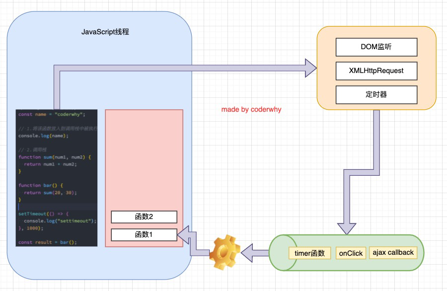

```js

console.log("script start")

// 业务代码
// setTimeout是同步的，里面的内容会被异步执行
setTimeout(function() {

}, 1000)

console.log("后续代码~")


console.log("script end")

```

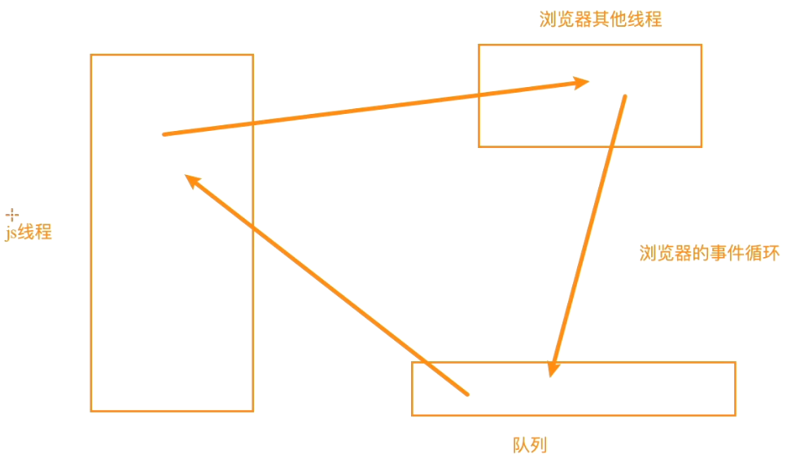

## 4. 宏任务和微任务

+ 但是事件循环中并非只维护着一个队列，事实上是有两个队列：
  + 宏任务队列（macrotask queue）：ajax、setTimeout、setInterval、DOM监听、UI Rendering等
  + 微任务队列（microtask queue）：Promise的then回调、Mutation Observer API、queueMicrotask()等
+ 那么事件循环对于两个队列的优先级是怎么样的呢？
  + 1.main script中的代码优先执行（编写的顶层script代码）；
  + 2.在执行任何一个宏任务之前（不是队列，是一个宏任务），都会先查看微任务队列中是否有任务需要执行
    + **也就是宏任务执行之前，必须保证微任务队列是空的；**
    + 如果不为空，那么就优先执行微任务队列中的任务（回调）；

```JS
setTimeout(() => {
  console.log("setTimeout")
}, 1000)

queueMicrotask(() => {
  console.log("queueMicrotask")
})

Promise.resolve().then(() => {
  console.log("Promise then")
})

// main script 主要脚本，遇到马上执行
function foo() {
  console.log("foo")
}

function bar() {
  console.log("bar")
  foo()
}

bar()

console.log("其他代码")

// bar
// foo
// 其他代码
// queueMicrotask
// Promise then
// setTimeout
```

```js
setTimeout(function () {
  console.log("setTimeout1");
  new Promise(function (resolve) {
    resolve();
  }).then(function () {
    new Promise(function (resolve) {
      resolve();
    }).then(function () {
      console.log("then4");
    });
    console.log("then2");
  });
});

// 注意new Promise会直接直接里面传入的构造函数
// 触发resolve之后，then里面的回调函数会被传入到微任务里面。
new Promise(function (resolve) {
  console.log("promise1");
  resolve();
}).then(function () {
  console.log("then1");
});

setTimeout(function () {
  console.log("setTimeout2");
});

console.log(2);

queueMicrotask(() => {
  console.log("queueMicrotask1")
});

new Promise(function (resolve) {
  resolve();
}).then(function () {
  console.log("then3");
});

// promise1
// 2
// then1
// queueMicrotask1
// then3
// setTimeout1
// then2
// then4
// setTimeout2

```

```js
async function bar() {
  console.log("22222")
  return new Promise((resolve) => {
    resolve()
  })
}

// async默认异步函数的代码不会异步执行，直接按顺序执行。除了在处理await
// 但是里面有await的时候，会等待await后面的函数完成Promise里resolve函数后继续向下执行
async function foo() {
  console.log("111111")

  // await执行
  await bar()

  console.log("33333")
  
  // 上面两行代码可以看成等价于
  //  await bar() {
  //      return new Promise((resolve) => {
  //      	resolve()
  //		}).then(() => console.log("33333"))
  //  }
  // 所以333的部分会加入到微任务里面
    
    
}

// 1. 执行函数foo， 所以第一个打印111111
foo()
console.log("444444")

// 111111
// 2222
// 444444
// 33333

```

```js
async function async1 () {
  console.log('async1 start')
  await async2();
  // 这个会加入到微任务里面
  console.log('async1 end')
}

async function async2 () {
  console.log('async2')
}

console.log('script start')

setTimeout(function () {
  console.log('setTimeout')
}, 0)
 
async1();
 
new Promise (function (resolve) {
  console.log('promise1')
  resolve();
}).then (function () {
  console.log('promise2')
})

console.log('script end')

// script start
// async1 start
// async2
// promise1
// script end
// async1 end
// promise2
// setTimeout

```

```js
Promise.resolve().then(() => {
  console.log(0);
  // 1.直接return一个值 相当于resolve(4)
  // return 4
  return Promise.resolve(4)
}).then((res) => {
  console.log(res)
})

Promise.resolve().then(() => {
  console.log(1);
}).then(() => {
  console.log(2);
}).then(() => {
  console.log(3);
}).then(() => {
  console.log(5);
}).then(() =>{
  console.log(6);
})

// 1.return 4
// 0
// 1
// 4
// 2
// 3
// 5
// 6


```

一开始执行，then放到微任务里，此时第一个Promise放入微任务的代码有打印0和return 4。

然后接着执行下一个Promise，then传入微任务，此时微任务里面再加入一个打印1。加入没有写return意味着默认return undefined。

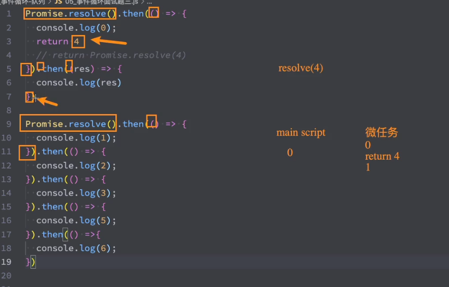

完成第一步后，执行微任务代码，return 4会执行下一个then，打印4的代码加入到微任务里面。

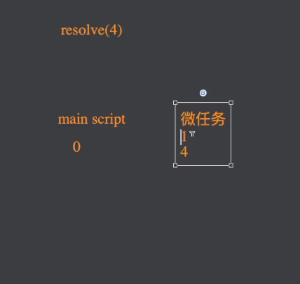

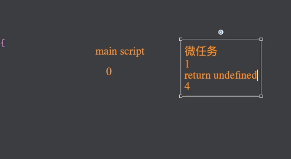

然后执行打印1，默认返回值return undefined。然后触发后面的then出入微任务，把打印2传入进去。依次执行。

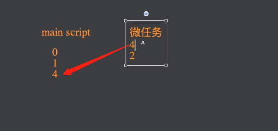

```js
Promise.resolve().then(() => {
  console.log(0);
    
  // 2.return thenable的值,里面的then函数是不会被直接执行，tehable里的then会推到下一次微任务里面执行
  // 总结：当我们是一个thenable的时候，原生的Promise会给我们多加一层微任务。把thenable里面放入到下一个微任务
    
  // 之所以thenable推迟是因为假如thenable出现大量的计算网络请求或者复杂的情况，那么会阻塞，所以决定推迟到下一个微任务中
  return {
    then: function(resolve) {
      // 大量的计算
      resolve(4)
    }
  }

}).then((res) => {
  console.log(res)
})

Promise.resolve().then(() => {
  console.log(1);
}).then(() => {
  console.log(2);
}).then(() => {
  console.log(3);
}).then(() => {
  console.log(5);
}).then(() =>{
  console.log(6);
})

// 0
// 1
// 2
// 4
// 3
// 5
// 6
```

一开始执行

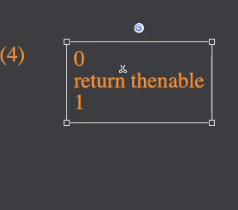

thenable内容会放入到下一次微任务里，所以第一次执行完微任务，变成

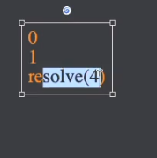

之后执行完0，再1，触发then打印2加入微任务，resolve(4)触发下一个then，打印4加入。

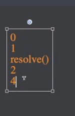

最后就

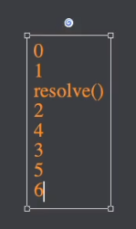

```js
Promise.resolve().then(() => {
  console.log(0);

  // 3.return Promise
  // 不是普通的值, 多加一次微任务
  // Promise.resolve(4), 再加一次微任务
  // 一共多加两次微任务
  return Promise.resolve(4)
}).then((res) => {
  console.log(res)
})

Promise.resolve().then(() => {
  console.log(1);
}).then(() => {
  console.log(2);
}).then(() => {
  console.log(3);
}).then(() => {
  console.log(5);
}).then(() =>{
  console.log(6);
})

// 3.return promise
// 0
// 1
// 2
// 3
// 4
// 5
// 6

// 总结就是thenable会把执行的结果推迟一步
// Promise会再推迟两步
```

## 5. Node的事件循环

+ 浏览器中的EventLoop是根据HTML5定义的规范来实现的，不同的浏览器可能会有不同的实现，而Node中是由libuv实现的。

+ 这里我们来给出一个Node的架构图：
  + 我们会发现libuv中主要维护了一个EventLoop和worker threads（线程池）；
  + EventLoop负责调用系统的一些其他操作：文件的IO、Network、child-processes等
+ libuv是一个多平台的专注于异步IO的库，它最初是为Node开发的，但是现在也被使用到Luvit、Julia、pyuv等其他地方；

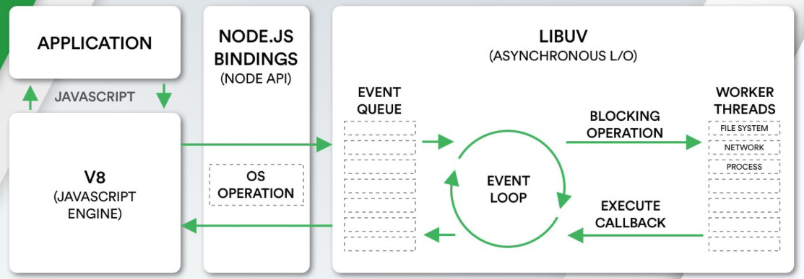

```js
node执行程序
会开启一个线程
node是属于多线程
其中有一个就是js线程->执行js代码
node其他线程会帮助完成一些耗时操作，网络请求、文件读取、(IO操作)

```

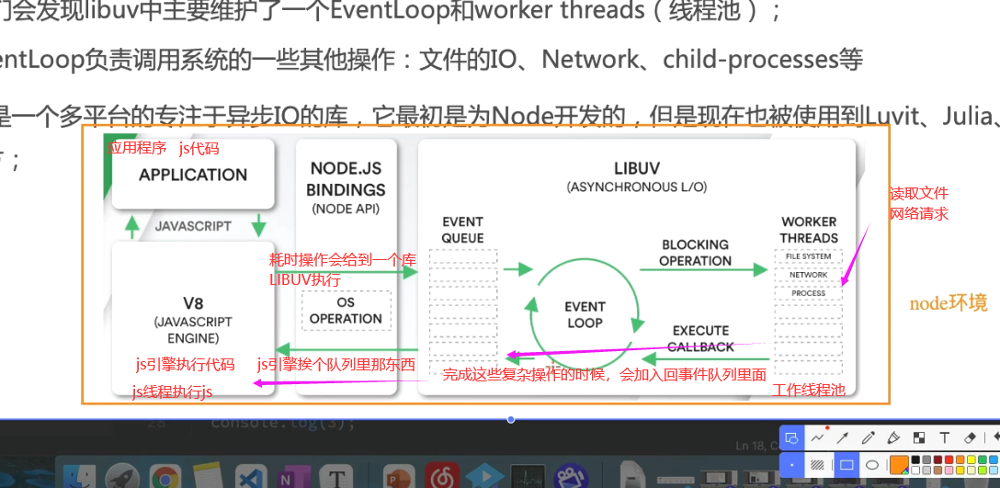

## 6. Node事件循环的阶段

+ 我们最前面就强调过，**事件循环像是一个桥梁**，是连接着应用程序的JavaScript和系统调用之间的通道：

  + 无论是我们的文件IO、数据库、网络IO、定时器、子进程，在完成对应的操作后，都会将对应的结果和回调函
    数放到事件循环（任务队列）中；
  + 事件循环会不断的从任务队列中取出对应的事件（回调函数）来执行；

+ 但是一次完整的事件循环Tick分成很多个阶段：

  + 定时器（Timers）：本阶段执行已经被setTimeout() 和setInterval() 的调度回调函数。
  + 待定回调（Pending Callback）：对某些系统操作（如TCP错误类型）执行回调，比如TCP连接时接收到ECONNREFUSED。

  + idle, prepare：仅系统内部使用。
  + 轮询（Poll）：检索新的I/O 事件；执行与I/O 相关的回调；
  + 检测（check）：setImmediate() 回调函数在这里执行。
  + 关闭的回调函数：一些关闭的回调函数，如：socket.on('close', ...)。

## 7. Node事件循环的阶段图解

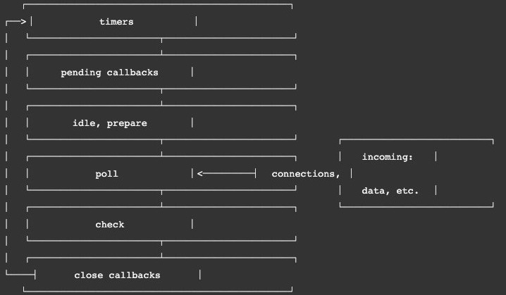


## 8. Node的宏任务和微任务

+ 我们会发现从一次事件循环的Tick来说，Node的事件循环更复杂，它也分为微任务和宏任务：
  + 宏任务（macrotask）：setTimeout、setInterval、IO事件、setImmediate、close事件；
  + 微任务（microtask）：Promise的then回调、process.nextTick、queueMicrotask；

+ 但是，Node中的事件循环不只是微任务队列和宏任务队列：
  + 微任务队列：
    + next tick queue：process.nextTick；
    + other queue：Promise的then回调、queueMicrotask；
  + 宏任务队列：
    + timer queue：setTimeout、setInterval；
    + poll queue：IO事件；
    + check queue：setImmediate；
    + close queue：close事件；


