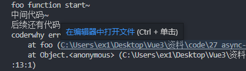
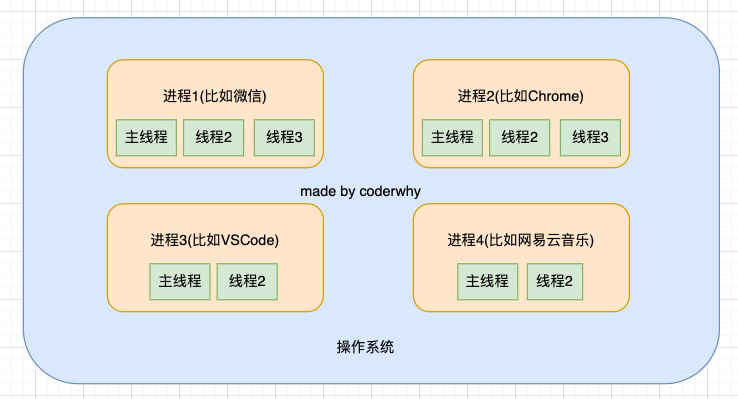

# 22. await-async-事件循环

async-await本质就是生成器演化过来的

## 1. 异步函数async function

+ async关键字用于声明一个异步函数：
  + async是asynchronous单词的缩写，异步、非同步；
  + sync是synchronous单词的缩写，同步、同时；

+ async异步函数可以有很多中写法：

```js
// 异步函数的基本写法
async function foo1() {}

const foo2 = async () = {}

class Foo {
    async bar() {}
}

```

## 2. 异步函数的执行流程

+ 异步函数的内部代码执行过程和普通的函数是一致的，默认情况下也是会被同步执行。
+ 异步函数有返回值时，和普通函数会有区别：
  + 情况一：异步函数也可以有返回值，但是异步函数的返回值会被包裹到Promise.resolve中；
  + 情况二：如果我们的异步函数的返回值是Promise，Promise.resolve的状态会由Promise决定；
  + 情况三：如果我们的异步函数的返回值是一个对象并且实现了thenable，那么会由对象的then方法来决定；
+ 如果我们在async中抛出了异常，那么程序它并不会像普通函数一样报错，而是会作为Promise的reject来传递；

```js
async function foo() {
  console.log("foo function start~")

  console.log("内部的代码执行1")
  console.log("内部的代码执行2")
  console.log("内部的代码执行3")

  console.log("foo function end~")
}


console.log("script start")
foo()
console.log("script end")


// 如果异步函数里面都是这种代码就和普通函数一样正常执行
// 默认也是同步执行
// 但是异步函数有返回值的时候，就会有区别

/*
script start
foo function start~
内部的代码执行1    
内部的代码执行2
内部的代码执行3
foo function end~
script end
*/

```

```js
// 异步函数有返回值时，和普通函数会有区别：
// 异步函数的返回值是一个Promise，默认也是Promise

async function foo() {
  console.log("foo function start~")

  console.log("中间代码~")

  console.log("foo function end~")

  // 1.返回一个值

  // 2.返回thenable
  // return {
  //   then: function(resolve, reject) {
  //     resolve("hahahah")
  //   }
  // }

  // 3.返回Promise
  return new Promise((resolve, reject) => {
    setTimeout(() => {
      resolve("hehehehe")
    }, 2000)
  })
}

// 异步函数的返回值一定是一个Promise
const promise = foo()
promise.then(res => {
  console.log("promise then function exec:", res)
})

```

```js
function requestData() {
  return new Promise((resolve, reject) => {
    setTimeout(() => {
      // resolve(222)
      reject(1111)
    }, 2000);
  })
}
async function foo() {
  console.log("foo function start~")

  console.log("中间代码~")

  // 异步函数中的异常, 会被作为异步函数返回的Promise的reject值的
  throw new Error("error message")

  console.log("foo function end~")
}

// 异步函数的返回值一定是一个Promise
foo().catch(err => {
  console.log("coderwhy err:", err)
})

console.log("后续还有代码~~~~~")

```



## 3. await关键字

+ async函数另外一个特殊之处就是可以在它内部使用await关键字，而普通函数中是不可以的。
+ await关键字有什么特点呢？
  + 通常使用await是后面会跟上一个表达式，这个表达式会返回一个Promise；
  + 那么await会等到Promise的状态变成fulfilled状态，之后继续执行异步函数；
+  如果await后面是一个普通的值，那么会直接返回这个值；
+ 如果await后面是一个thenable的对象，那么会根据对象的then方法调用来决定后续的值；
+ 如果await后面的表达式，返回的Promise是reject的状态，那么会将这个reject结果直接作为函数的Promise的reject值；

```js
function foo() {
    await 123
}

// SyntaxError: await is only vaild in async function

// 改正
async function foo() {
    await 123
}

// 一般await跟的是一个表达式，这个表达式返回的是一个Promise
```

```js
function requestData() {
  return new Promise((resolve, reject) => {
    setTimeout(() => {
      // resolve(222)
      reject(1111)
    }, 2000);
  })
}

async function foo() {
  // await 会等到返回值Promise里面调用resolve,把它的返回值返回给res1
  // await 没有得到结果的时候，后面的代码都不会执行
  // await 可以理解成用来阻塞代码，保证得到Promise后才继续执行
    
  // res1得到await的Promise返回值结果
  const res1 = await requestData()
 
  // 可以想象成后面的代码都是在await requestData().then({后面的代码})
  // then必须等到前面有结果才会执行
  console.log("后面的代码1", res1)
  console.log("后面的代码2")
  console.log("后面的代码3")

  const res2 = await requestData()
  console.log("res2后面的代码", res2)
}

```

```js
async function foo() {
  // 跟上普通的值会立即返回 
  // const res1 = await 123
    
  // 跟上一个对象，这个对象符合我们的thenable的时候，里面的thenable会被执行
  // const res1 = await {
  //   then: function(resolve, reject) {
  //     resolve("abc")
  //   }
  // }
    
  // 跟上一个Promise对象
  const res1 = await new Promise((resolve) => {
    resolve("why")
  })
  console.log("res1:", res1)
}

```

```js
function requestData() {
  return new Promise((resolve, reject) => {
    setTimeout(() => {
      // resolve(222)
      reject(1111)
    }, 2000);
  })
}

// 3.reject值
async function foo() {
  // await 得到一个reject的值的时候，会作为整个异步函数的返回值
  const res1 = await requestData()
  console.log("res1:", res1)
}

foo().catch(err => {
  console.log("err:", err)
})

```

# 22. 进程和线程

+ 线程和进程是操作系统中的两个概念：
  + 进程（process）：计算机已经运行的程序，是操作系统管理程序的一种方式；
  + 线程（thread）：操作系统能够运行运算调度的最小单位，通常情况下它被包含在进程中；
+ 听起来很抽象，这里还是给出我的解释：
  + 进程：我们可以认为，启动一个应用程序，就会默认启动一个进程（也可能是多个进程）；
  + 线程：每一个进程中，都会启动至少一个线程用来执行程序中的代码，这个线程被称之为主线程；
  + 所以我们也可以说进程是线程的容器；
+ 再用一个形象的例子解释：
  + 操作系统类似于一个大工厂；
  + 工厂中里有很多车间，这个车间就是进程；
  + 每个车间可能有一个以上的工人在工厂，这个工人就是线程；



## 1. 操作系统的工作方式

+ 操作系统是如何做到同时让多个进程（边听歌、边写代码、边查阅资料）同时工作呢？
  + 这是因为CPU的运算速度非常快，它可以快速的在多个进程之间迅速的切换；
  + 当我们进程中的线程获取到时间片时，就可以快速执行我们编写的代码；
  + 对于用户来说是感受不到这种快速的切换的；
+ 你可以在Mac的活动监视器或者Windows的资源管理器中查看到很多进程：

## 2. 浏览器中的JavaScript线程

+ 我们经常会说JavaScript是单线程的，但是JavaScript的线程应该有自己的容器进程：浏览器或者Node。

+ 浏览器是一个进程吗，它里面只有一个线程吗？
  + 目前多数的浏览器其实都是多进程的，当我们打开一个tab页面时就会开启一个新的进程，这是为了防止一个页
    面卡死而造成所有页面无法响应，整个浏览器需要强制退出；
  + 每个进程中又有很多的线程，其中包括执行JavaScript代码的线程；
+ JavaScript的代码执行是在一个单独的线程中执行的：
  + 这就意味着JavaScript的代码，在同一个时刻只能做一件事；
  + 如果这件事是非常耗时的，就意味着当前的线程就会被阻塞；
+ 所以真正耗时的操作，实际上并不是由JavaScript线程在执行的：
  + 浏览器的每个进程是多线程的，那么其他线程可以来完成这个耗时的操作；
  + 比如网络请求、定时器，我们只需要在特性的时候执行应该有的回调即可；

```txt
虽然js是单线程的，但是你在js中执行网络请求或者其他需要耗时的操作，实际上相当于单线程发送一条指令给你的浏览器，最终应该由浏览器去完成网络请求或者计时等，浏览器完成耗时操作的时候，然后返回告诉js线程
```

事件循环里有事件队列

## 3. 浏览器的事件循环

+ 如果在执行JavaScript代码的过程中，有异步操作呢？
  + 中间我们插入了一个setTimeout的函数调用；
  + 这个函数被放到入调用栈中，执行会立即结束，并不会阻塞后续代码的执行；

```js
```


