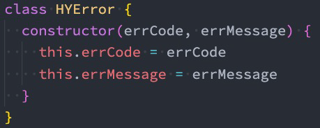
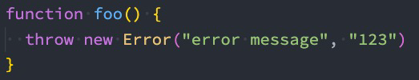
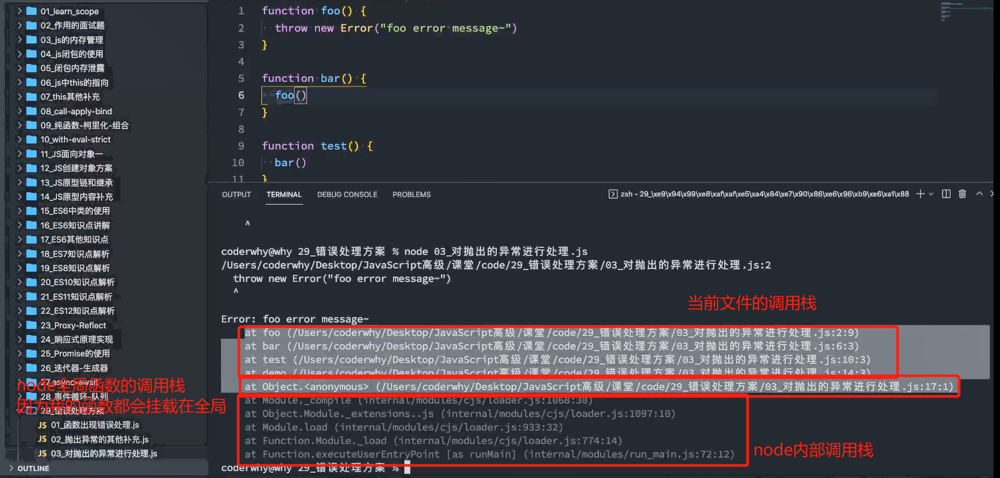
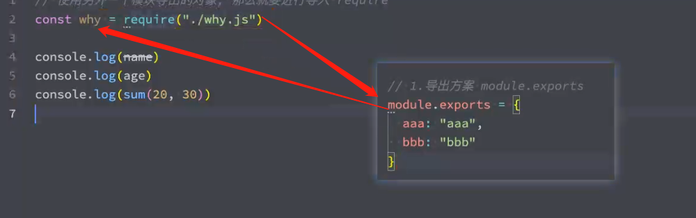
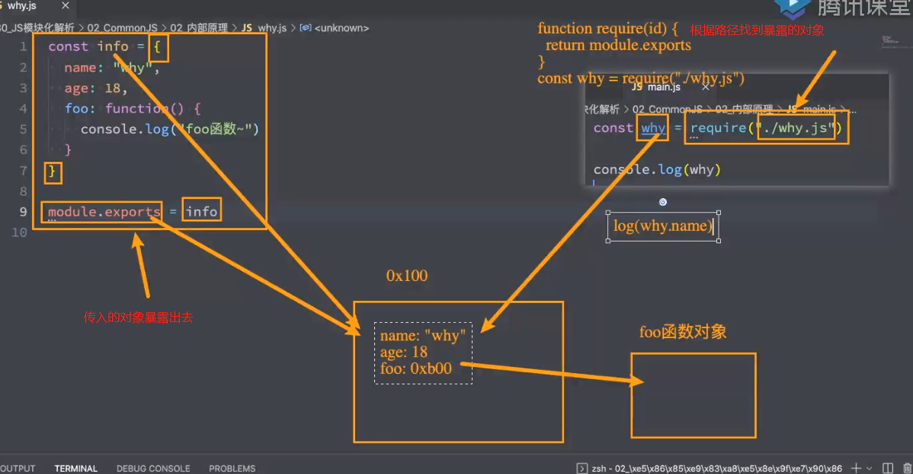

# 24. 异常处理-CommonJS模块化解析

## 1. 错误处理方案

+ 开发中我们会封装一些工具函数，封装之后给别人使用：
  + 在其他人使用的过程中，可能会传递一些参数；
  + 对于函数来说，需要对这些参数进行验证，否则可能得到的是我们不想要的结果；
+ 很多时候我们可能验证到不是希望得到的参数时，就会直接return：
  + 但是return存在很大的弊端：调用者不知道是因为函数内部没有正常执行，还是执行结果就是一个undefined；
  + 事实上，正确的做法应该是如果没有通过某些验证，那么应该让外界知道函数内部报错了；
+ 如何可以让一个函数告知外界自己内部出现了错误呢？
  + 通过throw关键字，抛出一个异常；
+ throw语句：
  + throw语句用于抛出一个用户自定义的异常；
  + 当遇到throw语句时，当前的函数执行会被停止（throw后面的语句不会执行）；
+ 如果我们执行代码，就会报错，拿到错误信息的时候我们可以及时的去修正代码。

```js
/**
 * 如果我们有一个函数, 在调用这个函数时, 如果出现了错误, 那么我们应该是去修复这个错误.
 */

function sum(num1, num2) {
  // 当传入的参数的类型不正确时, 应该告知调用者一个错误
  if (typeof num1 !== "number" || typeof num2 !== "number") {
    // return undefined
    throw "parameters is error type~"
  }

  return num1 + num2
}

// 调用者(如果没有对错误进行处理, 那么程序会直接终止)
// console.log(sum({ name: "why" }, true))
console.log(sum(20, 30))

console.log("后续的代码会继续运行~")

// throw会中断代码运行

```

## 2. throw关键字

+ throw表达式就是在throw后面可以跟上一个表达式来表示具体的异常信息：


+ throw关键字可以跟上哪些类型呢？
  + 基本数据类型：比如number、string、Boolean
  + 对象类型：对象类型可以包含更多的信息
+ 但是每次写这么长的对象又有点麻烦，所以我们可以创建一个类：



```js
// class HYError {
//   constructor(errorCode, errorMessage) {
//     this.errorCode = errorCode
//     this.errorMessage = errorMessage
//   }
// }

function foo(type) {
  console.log("foo函数开始执行")

  if (type === 0) {
    // 1.抛出一个字符串类型(基本的数据类型)
    // throw "error"

    // 2.比较常见的是抛出一个对象类型,对象可以包含更多信息
    // throw { errorCode: -1001, errorMessage: "type不能为0~" }

    // 3.创建类, 并且创建这个类对应的对象
    // throw new HYError(-1001, "type不能为0~")

    // 4.js提供了一个Error
    // const err = new Error("type不能为0")
    // err.name = "why" // 默认Err
    // err.stack = "aaaa" // stack报错出现出现错误的函数的调用栈

    // 5.Error的子类
    const err = new TypeError("当前type类型是错误的~")

    throw err

    // 强调: 如果函数中已经抛出了异常, 那么后续的代码都不会继续执行了
    console.log("foo函数后续的代码")
  }

  console.log("foo函数结束执行")
}

foo(0)

console.log("后续的代码继续执行~")


// 这里就是就会出现函数调用栈
// test出现错误的，就会打印调用它的demo，demo会找到调用它的bar，最终找到bar() 的一整个栈就是函数调用栈
// function test() {
//   console.log("test")
// }

// function demo() {
//   test()
// }

// function bar() {
//   demo()
// }

// bar()

```

## 3. Error类型

+ 事实上，JavaScript已经给我们提供了一个Error类，我们可以直接创建这个类的对象：



+ Error包含三个属性：
  + messsage：创建Error对象时传入的message；
  + `name：Error`的名称，通常和类的名称一致；
  + stack：整个Error的错误信息，包括函数的调用栈，当我们直接打印Error对象时，打印的就是stack；
+ Error有一些自己的子类：
  + RangeError：下标值越界时使用的错误类型；
  + SyntaxError：解析语法错误时使用的错误类型；
  + TypeError：出现类型错误时，使用的错误类型；



## 4. 异常的处理

+ 我们会发现在之前的代码中，一个函数抛出了异常，调用它的时候程序会被强制终止：
  + 这是因为如果我们在调用一个函数时，这个函数抛出了异常，但是我们并没有对这个异常进行处理，那么这个异常会继续传递到上一个函数调用中；
  + 而如果到了最顶层（全局）的代码中依然没有对这个异常的处理代码，这个时候就会报错并且终止程序的运行；
+ 我们先来看一下这段代码的异常传递过程：
  + foo函数在被执行时会抛出异常，也就是我们的bar函数会拿到这个异常
  + 但是bar函数并没有对这个异常进行处理，那么这个异常就会被继续传递到调用bar函数的函数，也就是test函数；
  + 但是test函数依然没有处理，就会继续传递到我们的全局代码逻辑中；
  + 依然没有被处理，这个时候程序会终止执行，后续代码都不会再执行了；

```js
function foo(type) {
  if (type === 0) {
    throw new Error("foo error message~")
  }
}

// 1.第一种是不处理, bar函数会继续将收到的异常直接抛出去
function bar() {
  // try {
  foo(0)
  //   console.log("bar函数后续的继续运行")
  // } catch(err) {
  //   console.log("err:", err.message)
  //   // alert(err.message)
  // } finally {
  //   console.log("finally代码执行~, close操作")
  // }
}

function test() {
  try {
    bar()
  } catch (error) {
    console.log("error:", error)
  }
}

function demo() {
  test()
}


// 两种处理方法:
// 1.第一种是不处理, 那么异常会进一步的抛出, 直到最顶层的调用
// 如果在最顶层也没有对这个异常进行处理, 那么我们的程序就会终止执行, 并且报错
// foo()

// 2.使用try catch来捕获异常

try {
  demo()
} catch (err) {

}

console.log("后续的代码执行~")

```

## 5. 异常捕获

+ 但是很多情况下当出现异常时，我们并不希望程序直接推出，而是希望可以正确的处理异常：
  + 这个时候我们就可以使用try catch
+ 在ES10（ES2019）中，catch后面绑定的error可以省略。
+ 当然，如果有一些必须要执行的代码，我们可以使用finally来执行：
  + finally表示最终一定会被执行的代码结构；
  + 注意：如果try和finally中都有返回值，那么会使用finally当中的返回值；

```js
try {
    // 包裹你认为会出现错误的语句
} catch(err) {
   // 捕获异常进行处理，可以重新执行其他代码等
} finally {
  // 不管有没有错误都会执行
}

```

```js
async function http() {
    try {
        const result = await 网络请求
    }catch(err) {
        // 处理error
    }
}

```

## 6. 什么是模块化

+ 到底什么是模块化、模块化开发呢？
  + 事实上模块化开发最终的目的是将程序划分成一个个小的结构；
  + 这个结构中编写属于自己的逻辑代码，有自己的作用域，不会影响到其他的结构；
  + 这个结构可以将自己希望暴露的变量、函数、对象等导出给其结构使用；
  + 也可以通过某种方式，导入另外结构中的变量、函数、对象等；
+ 上面说提到的结构，就是模块；按照这种结构划分开发程序的过程，就是模块化开发的过程；
+ 无论你多么喜欢JavaScript，以及它现在发展的有多好，它都有很多的缺陷：
  + 比如var定义的变量作用域问题；
  + 比如JavaScript的面向对象并不能像常规面向对象语言一样使用class；
  + 比如JavaScript没有模块化的问题；
+  Brendan Eich本人也多次承认过JavaScript设计之初的缺陷，但是随着JavaScript的发展以及标准化，存在的缺陷问题基
  本都得到了完善。
+ 无论是web、移动端、小程序端、服务器端、桌面应用都被广泛的使用；

```js
// ES5之前，没有模块化最大的问题就是命名冲突，每个文件定义的变量属于全体的，因为每个文件没有自己的作用域

// 利用函数作用域，并立即执行
const moduleA = (function(){
    // 代码...
    
    return {
        // 对象
    }
})()

// 但是moduleA也可能命名冲突
```

## 7. 模块化的历史

+ 在网页开发的早期，Brendan Eich开发JavaScript仅仅作为一种脚本语言，做一些简单的表单验证或动画实现等，那个时
  候代码还是很少的：
  + 这个时候我们只需要讲JavaScript代码写到<script>标签中即可；
  + 并没有必要放到多个文件中来编写；甚至流行：通常来说JavaScript 程序的长度只有一行。
+ 但是随着前端和JavaScript的快速发展，JavaScript代码变得越来越复杂了：
  + ajax的出现，前后端开发分离，意味着后端返回数据后，我们需要通过JavaScript进行前端页面的渲染；
  + SPA的出现，前端页面变得更加复杂：包括前端路由、状态管理等等一系列复杂的需求需要通过JavaScript来实现；
  + 包括Node的实现，JavaScript编写复杂的后端程序，没有模块化是致命的硬伤；
+ 所以，模块化已经是JavaScript一个非常迫切的需求：
  + 但是JavaScript本身，直到ES6（2015）才推出了自己的模块化方案；
  + 在此之前，为了让JavaScript支持模块化，涌现出了很多不同的模块化规范：AMD、CMD、CommonJS等；

## 8. CommonJS规范和Node关系

+ 我们需要知道CommonJS是一个规范，最初提出来是在浏览器以外的地方使用，并且当时被命名为ServerJS，后来为了体现它的广泛性，修改为CommonJS，平时我们也会简称为CJS。
  + Node是CommonJS在服务器端一个具有代表性的实现；
  + Browserify是CommonJS在浏览器中的一种实现；
  + webpack打包工具具备对CommonJS的支持和转换；
+ 所以，Node中对CommonJS进行了支持和实现，让我们在开发node的过程中可以方便的进行模块化开发：
  + 在Node中每一个js文件都是一个单独的模块；
  + 这个模块中包括CommonJS规范的核心变量：exports、module.exports、require；
  + 我们可以使用这些变量来方便的进行模块化开发；
+ 前面我们提到过模块化的核心是导出和导入，Node中对其进行了实现：
  + exports和module.exports可以负责对模块中的内容进行导出；
  + require函数可以帮助我们导入其他模块（自定义模块、系统模块、第三方库模块）中的内容；

```js
// main.js
// 使用另外一个模块导出的对象, 那么就要进行导入 require， 传入文件路径

// 此时why获得module.exports
// const why = require("./why.js")
// console.loh(why.name)


// 可以对对象进行解构
// const { aaa, bbb } = require("./why.js")
const { name, age, sum } = require("./why.js")

// console.log(aaa)
// console.log(bbb)

console.log(name)
console.log(age)
console.log(sum(20, 30))

```

```js
// why.js
const name = "why"
const age = 18

function sum(num1, num2) {
  return num1 + num2
}

// 1.导出方案 module.exports

// module表示我们文件本身的对象
// exports本身也是一个对象
// module.exports本身是一个对象，可以给对象放入一些属性

// 添加一个属性可以
// module.exports.name = name

// 多个
module.exports = {
  // aaa: "hahahahaah",
  // bbb: "bbb"
  name,
  age,
  sum
}

```





```js
// 实现逻辑

const obj = {
    
}
const module.export = obj

function require() {
    return module.export
}

const obj2 = reuqire()

```

## 9. exports导出

+ 注意：exports是一个对象，我们可以在这个对象中添加很多个属性，添加的属性会导出；

```js
exports.name = name;
exports.age = age;
...

```

+ 另外一个文件中可以导入：

```js
const bar = require('./bar')
```

+ 上面这行完成了什么操作呢？理解下面这句话，Node中的模块化一目了然
  + 意味着main中的bar变量等于exports对象；
  + 也就是require通过各种查找方式，最终找到了exports这个对象；
  + 并且将这个exports对象赋值给了bar变量；
  + bar变量就是exports对象了；

```js
// 源码在实现的时候
// 先让
module.exports = {}
// 意味着当前文件其实默认就是有导出一个{}

// 然后让exports也同样指向空对象
exports = module.exports

// 此时给export加东西的时候，间接给到module.exports里面

// export并没有导出，只是指向module.exports相同的地址，然后借由exports导出


// 所以当我们
exprots = {
    ..
}
// 这时指向的不是一个对象，所以不会被导出
```

```js
// 这种代码不会进行导出
exports.name = name
exports.age = age
exports.sum = sum

module.exports = {

}

// module.exports指向一个新对象，和之前不一样，所以里面没有name，age,sum
```

```js
// 最终能导出的一定是module.exports
```

```js
const name = "why"
const age = 18
function sum(num1, num2) {
  return num1 + num2
}

// 源码
// module.exports = {}
// exports = module.exports

// 第二种导出方式
// exports.name = name
// exports.age = age
// exports.sum = sum

// 这种代码不会进行导出
// exports = {
//   name,
//   age,
//   sum
// }

// 这种代码不会进行导出
// exports.name = name
// exports.age = age
// exports.sum = sum

module.exports = {

}

// 最终能导出的一定是module.exports

```

```js
exports存在的意义是为了符合commonJS规范
```


