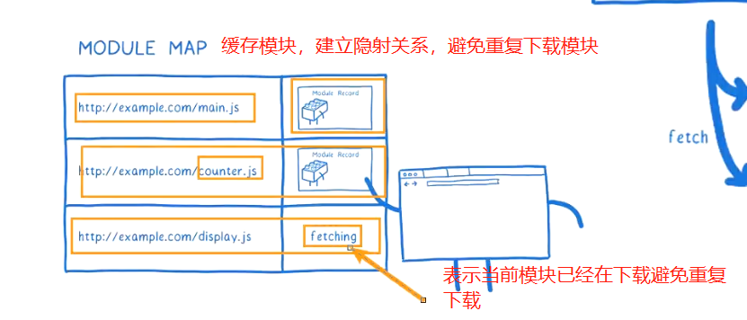

# 25. AMD-CMD-ESModule模块化

## 1. Require细节

+ 我们现在已经知道，require是一个函数，可以帮助我们引入一个文件（模块）中导出的对象。
+ 那么，require的查找规则是怎么样的呢？

```js
https://nodejs.org/dist/latest-v14.x/docs/api/modules.html#modules_all_together
```

```js
导入模块的格式
const XXX = require(X)
```

+ 情况一：X是一个Node核心模块，比如path、http
  + 直接返回核心模块，并且停止查找
+ 情况二：X是以./ 或../ 或/（根目录）开头的
  + 第一步：将X当做一个文件在对应的目录下查找；
    1. 如果有后缀名，按照后缀名的格式查找对应的文件
    2. 如果没有后缀名，会按照如下顺序：
       + 1> 直接查找文件X
       + 2> 查找X.js文件
       + 3> 查找X.json文件
       + 4> 查找X.node文件
  + 第二步：没有找到对应的文件，将X作为一个目录
    + 查找目录下面的index文件
      + 1> 查找X/index.js文件
      + 2> 查找X/index.json文件
      + 3> 查找X/index.node文件
  + 如果没有找到，那么报错：not found
+ 情况三：直接是一个X（没有路径），并且X不是一个核心模块


查找规则是再当前目录下，绝对路径，开始一层层查找里面的node_modules，直到最终没找到才报错

## 2. 模块的加载过程

+ 结论一：模块在被第一次引入时，模块中的js代码会被运行一次

```js
// foo.js

const name = "why"
const age = 18

console.log("foo:", name)
console.log("foo中的代码被运行")

module.exports = {
  name,
  age
}

```

```js
console.log("main.js代码开始运行")

// 只会执行一次
require("./foo")
require("./foo")
require("./foo")

console.log("main.js代码后续运行")


// main.js代码开始运行
// foo:why
// foo中的代码被运行
// main.js代码后续运行

```

图结构：


+ 结论二：模块被多次引入时，会缓存，最终只加载（运行）一次

  + 为什么只会加载运行一次呢？
  + 这是因为每个模块对象module都有一个属性：loaded。

  ```js
  js文件对应一个Module实例，它里面有一个loaded表示是否被加载了
  ```

  + 为false表示还没有加载，为true表示已经加载；

+ 结论三：如果有循环引入，那么加载顺序是什么？

+ 如果出现右图模块的引用关系，那么加载顺序是什么呢？

  + 这个其实是一种数据结构：图结构；
  + 图结构在遍历的过程中，有深度优先搜索（DFS, depth first search）和广度优先搜索（BFS, breadth first search）；
  + Node采用的是深度优先算法：`main -> aaa -> ccc -> ddd -> eee ->bbb`

## 3. CommonJS规范缺点

+ **CommonJS加载模块是同步的：**
  + 同步的意味着只有等到对应的模块加载完毕，当前模块中的内容才能被运行；
  + 这个在服务器不会有什么问题，因为服务器加载的js文件都是本地文件，加载速度非常快；

+ 如果将它应用于浏览器呢？
  + 浏览器加载js文件需要先从服务器将文件下载下来，之后再加载运行；
  + 那么采用同步的就意味着后续的js代码都无法正常运行（会阻塞），即使是一些简单的DOM操作；

+ 所以在浏览器中，我们通常不使用CommonJS规范：
  + 当然在webpack中使用CommonJS是另外一回事；
  + 因为它会将我们的代码转成浏览器可以直接执行的代码；
+ 在早期为了可以在浏览器中使用模块化，通常会采用AMD或CMD：
  + 但是目前一方面现代的浏览器已经支持ES Modules，另一方面借助于webpack等工具可以实现对CommonJS或者ES Module代码的转换
  + AMD和CMD已经使用非常少了，所以这里我们进行简单的演练；

## 4. AMD规范

+ AMD主要是应用于浏览器的一种模块化规范：
  + AMD是Asynchronous Module Definition（异步模块定义）的缩写；
  + **它采用的是异步加载模块**；
  + 事实上AMD的规范还要早于CommonJS，但是CommonJS目前依然在被使用，而AMD使用的较少了；
+ 我们提到过，规范只是定义代码的应该如何去编写，只有有了具体的实现才能被应用：
  + AMD实现的比较常用的库是require.js和curl.js；

## 5. require.js的使用

+ 第一步：下载require.js
  + 下载地址：https://github.com/requirejs/requirejs
  + 找到其中的require.js文件；
+ 第二步：定义HTML的script标签引入require.js和定义入口文件：
  + data-main属性的作用是在加载完src的文件后会加载执行该文件

```js
<script src="./lib/require.js" data-main="./index.js"></script>
```

```js
// index.html

<body>
  
  <script src="./lib/require.js" data-main="./src/main.js"></script>
</body>
```

```js
require.config({
  baseUrl: '',
  paths: {
    foo: "./src/foo",
    bar: "./src/bar"
  }
})

// 拿到模块以后回调函数
require(["foo", "bar"], function(foo) {
  console.log("main:", foo)
})

```

```js
// foo.js
// 导出东西
define(function() {
  const name = "why"
  const age = 18
  function sum(num1, num2) {
    return num1 + num2
  }

  return {
    name,
    age,
    sum
  }
})

```

```js
// bar.js

define(["foo"], function(foo) {
  console.log("--------")
  // require(["foo"], function(foo) {
  //   console.log("bar:", foo)
  // })

  console.log("bar:", foo)
})

```


## 6. CMD规范 

+ CMD规范也是应用于浏览器的一种模块化规范：
  + CMD 是Common Module Definition（通用模块定义）的缩写；
  + 它也采用了异步加载模块，但是它将CommonJS的优点吸收了过来；
  + 但是目前CMD使用也非常少了；
+ CMD也有自己比较优秀的实现方案：
  + `SeaJS`

## 7. `SeaJS`的使用

+ 第一步：下载`SeaJS`
  + 下载地址：https://github.com/seajs/seajs
  + 找到`dist`文件夹下的sea.js
+ 第二步：引入sea.js和使用主入口文件
  + `seajs`是指定主入口文件的

略

## 8. 认识ES Module

+ JavaScript没有模块化一直是它的痛点，所以才会产生我们前面学习的社区规范：CommonJS、AMD、CMD等，
  所以在ES推出自己的模块化系统时，大家也是兴奋异常。
+ ES Module和CommonJS的模块化有一些不同之处：
  + 一方面它使用了import和export关键字；
  + 另一方面它采用编译期的静态分析，并且也加入了动态引用的方式；
+ ES Module模块采用export和import关键字来实现模块化：
  + export负责将模块内的内容导出；
  + import负责从其他模块导入内容；
+ 了解：采用ES Module将自动采用严格模式：use strict

## 9. 案例代码结构组件

+ 这里我在浏览器中演示ES6的模块化开发：

```js
<script src='./module.js' type='module'  ></script>

type属性告知script是模块
```

否则


+ 如果直接在浏览器中运行代码，会报如下错误：


+ 这个在MDN上面有给出解释：
  + `https://developer.mozilla.org/zh-CN/docs/Web/JavaScript/Guide/Modules`
  + 你需要注意本地测试— 如果你通过本地加载Html 文件(比如一个file:// 路径的文件), 你将会遇到CORS 错误，因为`Javascript` 模块安全性需要。
  + 你需要通过一个服务器来测试。
+ 我这里使用的`VSCode`，`VSCode`中有一个插件：Live Server

+ 这个在MDN上面有给出解释：
  + `https://developer.mozilla.org/zh-CN/docs/Web/JavaScript/Guide/Modules`
  + 你需要注意本地测试— 如果你通过本地加载Html 文件(比如一个file:// 路径的文件), 你将会遇到CORS 错误，因为`Javascript`模块安全性需要。

## 10. exports关键字

+ export关键字将一个模块中的变量、函数、类等导出；
+ 我们希望将其他中内容全部导出，它可以有如下的方式：
+ 方式一：在语句声明的前面直接加上export关键字
+ 方式二：将所有需要导出的标识符，放到export后面的{}中
  + 注意：这里的{}里面不是ES6的对象字面量的增强写法，{}也不是表示一个对象的；
  + 所以： export {name: name}，是错误的写法；
+ 方式三：导出时给标识符起一个别名

```js
// 1.第一种方式: export 声明语句
export const name = "why"
export const age = 18

export function foo() {
  console.log("foo function")
}

export class Person {

}

```

```js
// 2.第二种方式: export 导出 和 声明分开
const name = "why"
const age = 18
function foo() {
  console.log("foo function")
}

// 这里的大括号是一个语法，不是对象，不能传入键值对
export {
  name,
  age,
  foo
}

```

```js
// 3.第三种方式: 第二种导出时起别名
export {
  name as fName,
  age as fAge,
  foo as fFoo
}

```

## 11. import关键字

+ import关键字负责从另外一个模块中导入内容
+ 导入内容的方式也有多种：
+ 方式一：import {标识符列表} from '模块'；
  + 注意：这里的{}也不是一个对象，里面只是存放导入的标识符列表内容；
+ 方式二：导入时给标识符起别名
+ 方式三：通过* 将模块功能放到一个模块功能对象（a module object）上

```js
// 导出的代码
// 2.第二种方式: export 导出 和 声明分开
const name = "why"
const age = 18
function foo() {
  console.log("foo function")
}

// 这里的大括号是一个语法，不是对象，不能传入键值对
export {
  name,
  age,
  foo
}


// 导入的代码
// 1.导入方式一: 普通的导入
// 导出的名字是固定的
import { name, age, foo } from "./foo.js"
```

```js
// 3.第三种方式: 第二种导出时起别名
export {
  name as fName,
  age as fAge,
  foo as fFoo
}

// 1.导入方式一: 普通的导入
import { fName, fAge, fFoo } from './foo.js'
```

```js
// 导出的代码
// 2.第二种方式: export 导出 和 声明分开
const name = "why"
const age = 18
function foo() {
  console.log("foo function")
}


// 2.导入方式二: 起别名
// {}不是对象，只是语法而已
import { name as fName, age as fAge, foo as fFoo } from './foo.js'


// 3.导入方式三: 将导出的所有内容放到一个标识符中
import * as foo from './foo.js'

```

## 12. export和import结合使用

+ 补充：export和import可以结合使用

```js
export { sum as barSum } from './bar.js'
```

+ 为什么要这样做呢？
  + 在开发和封装一个功能库时，通常我们希望将暴露的所有接口放到一个文件中；
  + 这样方便指定统一的接口规范，也方便阅读；
  + 这个时候，我们就可以使用export和import结合使用；

```js
// 各个文件模块的集中到index.js导出
// 1.导出方式一:
import { add, sub } from './math.js'
import { timeFormat, priceFormat } from './format.js'

export {
  add,
  sub,
  timeFormat,
  priceFormat
}


// 2.导出方式二:
export { add, sub } from './math.js'
export { timeFormat, priceFormat } from './format.js'

// 3.导出方式三:
export * from './math.js'
export * from './format.js'

```

## 13. default用法

+ 前面我们学习的导出功能都是有名字的导出（named exports）：
  + 在导出export时指定了名字；
  + 在导入import时需要知道具体的名字；
+ 还有一种导出叫做默认导出（default export）
  + 默认导出export时可以不需要指定名字；
  + 在导入时不需要使用{}，并且可以自己来指定名字；
  + 它也方便我们和现有的CommonJS等规范相互操作；
+ 注意：在一个模块中，只能有一个默认导出（default export）；

```js
const name = "why"
const age = 18

const foo = "foo value"

// 1.默认导出的方式一:
export {
  // named export
  name,
  // age as default,
  // foo as default
}

// 2.默认导出的方式二: 常见
export default foo

// 注意: 默认导出只能有一个

```

```js
// 导入语句: 导入的默认的导出
import why from './foo.js'

console.log(why)
```

## 14. import函数

```js
import {} from './XXX'
// 在导入的文件之前，后续的代码是不回执行的

console.log("后续的代码都是不会运行的")
```

我们希望异步解析导入

```js
// import函数返回的结果是一个Promise
// 异步下载代码，交由其他线程执行
import("./foo.js").then(res => {
  console.log("res:", res.name)
})

console.log("后续的代码")

```

### 1. import meta

+ `import.meta`是一个给JavaScript模块暴露特定上下文的元数据属性的对象。
  + 它包含了这个模块的信息，比如说这个模块的URL；
  + 在ES11（ES2020）中新增的特性；

```js
// ES11新增的特性
// meta属性本身也是一个对象: { url: "当前模块所在的路径" }
console.log(import.meta)

```

## 15. ES Module的解析流程

+ ES Module是如何被浏览器解析并且让模块之间可以相互引用的呢？
  `https://hacks.mozilla.org/2018/03/es-modules-a-cartoon-deep-dive/`
+ ES Module的解析过程可以划分为三个阶段：
  + 阶段一：构建（Construction），根据地址查找js文件，并且下载，将其解析成模块记录（Module Record）(一个数据结构)；
  + 阶段二：实例化（Instantiation），对模块记录进行实例化，并且分配内存空间，解析模块的导入和导出语句，把模块指向对应的内存地址。（这个阶段只是解析， 没有完成具体的赋值操作，这个阶段主要解析import和export，在这中间的代码都没有执行）
  + 阶段三：运行（Evaluation），运行代码，计算值，并且将值填充到内存地址中；


### 1. 阶段一：构建阶段




### 2. 阶段二和三：实例化阶段– 求值阶段


导出的模块可以改变内存的值，导入的模块是不能改变的

从上面可以理解到，ESM是同时具有静态分析和动态分析的。

## 16. ESM和CommonJS相互引用

浏览器不支持commonJS，所以不能，node旧版本不支持ES6


```js
npm i webapck webpack-cli
```


```js
// bar.js
const name = "bar"
const age = 100

// es module导出
export {
  name,
  age
}

```

```js
// foo.js
const name = "foo"
const age = 18

// commonjs导出
module.exports = {
  name,
  age
}

```

webpack环境下，可以ESM和CommonJS相互导入


