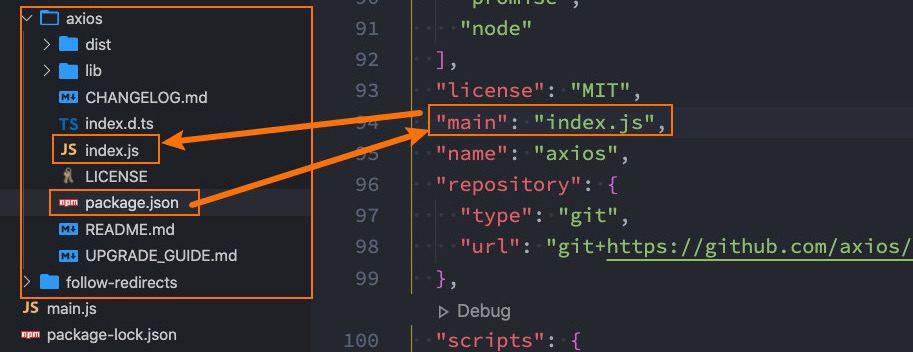

# 26. ESModule和包管理工具（一）

## 1. 包管理工具详解npm、yarn、cnpm、npx

### 1. 代码共享方案

+ 我们已经学习了在JavaScript中可以通过模块化的方式将代码划分成一个个小的结构：
  + 在以后的开发中我们就可以通过模块化的方式来封装自己的代码，并且封装成一个工具；
  + 这个工具我们可以让同事通过导入的方式来使用，甚至你可以分享给世界各地的程序员来使用；
+ 如果我们分享给世界上所有的程序员使用，有哪些方式呢？
+ 方式一：上传到GitHub上、其他程序员通过GitHub下载我们的代码手动的引用；
  + 缺点是大家必须知道你的代码GitHub的地址，并且从GitHub上手动下载；
  + 需要在自己的项目中手动的引用，并且管理相关的依赖；
  + 不需要使用的时候，需要手动来删除相关的依赖；
  + 当遇到版本升级或者切换时，需要重复上面的操作；
+ 显然，上面的方式是有效的，但是这种传统的方式非常麻烦，并且容易出错；
+ 方式二：使用一个专业的工具来管理我们的代码
  + 我们通过工具将代码发布到特定的位置；
  + 其他程序员直接通过工具来安装、升级、删除我们的工具代码；
+ 显然，通过第二种方式我们可以更好的管理自己的工具包，其他人也可以更好的使用我们的工具包。

## 2. 包管理工具npm

+ 包管理工具npm：
  + `Node Package Manager`，也就是Node包管理器；
    p但是目前已经不仅仅是Node包管理器了，在前端项目中我们也在使用它来管理依赖的包；
  + 比如`vue`、`vue-router`、`vuex`、`express`、`koa`、`react`、`react-dom`、`axios`、`babel`、`webpack`等等；
+ 如何下载npm工具呢？
  + npm属于node的一个管理工具，所以我们需要先安装Node；
  + node管理工具：https://nodejs.org/en/
+ npm管理的包可以在哪里查看、搜索呢？
  + https://www.npmjs.org/
  + 这是我们安装相关的npm包的官网；
+ npm管理的包存放在哪里呢？
  + 我们发布自己的包其实是发布到registry（仓库名字）上面的；
  + 当我们安装一个包时其实是从registry上面下载的包；

## 3. npm的配置文件

+ 那么对于一个项目来说，我们如何使用npm来管理这么多包呢？
  + 事实上，我们每一个项目都会有一个对应的配置文件，无论是前端项目（`Vue`、`React`）还是后端项目（Node）；
  + 这个配置文件会记录着你项目的名称、版本号、项目描述等；
  + 也会记录着你项目所依赖的其他库的信息和依赖库的版本号；
+ 这个配置文件就是`package.json`
+ 那么这个配置文件如何得到呢？
  + 方式一：手动从零创建项目，`npm init –y`
  + 方式二：通过脚手架创建项目，脚手架会帮助我们生成`package.json`，并且里面有相关的配置

## 4. 常见的属性

+ **必须填写的属性：name、version**
  + name是项目的名称（不能是中文）；
  + version是当前项目的版本号；
  + description是描述信息，很多时候是作为项目的基本描述；
  + author是作者相关信息（发布时用到）；
  + license是开源协议（发布时用到）；
+ **private属性：**
  + private属性记录当前的项目是否是私有的；
  + 当值为true时，npm是不能发布它的，这是防止私有项目或模块发布出去的方式；

+ **main属性：**
  + 设置程序的入口。
  + 很多人会有疑惑，webpack不是会自动找到程序的入口吗？
    + 这个入口和webpack打包的入口并不冲突；
    + 它是在你发布一个模块的时候会用到的；
    + 比如我们使用axios模块`const axios = require('axios');`
    + 实际上是找到对应的main属性查找文件的；

+ **scripts属性**

  + scripts属性用于配置一些脚本命令，以键值对的形式存在；
  + 配置后我们可以通过npm run 命令的key来执行这个命令；
  + npm start和npm run start的区别是什么？
    + 它们是等价的；
    + 对于常用的start、test、stop、restart可以省略掉run直接通过npm start等方式运行；

+ **dependencies属性**（依赖）

  + dependencies属性是指定无论开发环境还是生成环境都需要依赖的包；
  + 通常是我们项目实际开发用到的一些库模块`vue`、`vuex`、`vue-router`、`react`、`react-dom`、`axios`等等；
  + 与之对应的是`devDependencies`；

+ **devDependencies属性**（开发的依赖）

  + 一些包在生成环境是不需要的，比如webpack、babel等；
  + 这个时候我们会通过npm install webpack --save-dev（ -D），将它安装到devDependencies属性中；

+ **peerDependencies属性**(peer对等的，)

  + 还有一种项目依赖关系是对等依赖，也就是你依赖的一个包，它必须是以另外一个宿主包为前提的；它会检查你时候安装了对应的宿主包。

  + 比如element-plus是依赖于vue3的，ant design是依赖于`react`、`react-dom`；

     所以当你安装element的时候会检查你是否安装了vue，否则会有警告。

## 5. 依赖的版本管理

+ 我们会发现安装的依赖版本出现：^2.0.3或~2.0.3，这是什么意思呢？
+ **npm的包通常需要遵从`semver`版本规范：**
  + semver：https://semver.org/lang/zh-CN/
  + npm semver：https://docs.npmjs.com/misc/semver

+ `semver`版本规范是X.Y.Z
  + X主版本号（major）：当你做了不兼容的API 修改（可能不兼容之前的版本）；
  + Y次版本号（minor）：当你做了向下兼容的功能性新增（新功能增加，但是兼容之前的版本）；
  + Z修订号（patch）：当你做了向下兼容的问题修正（没有新功能，修复了之前版本的bug）；
+ 我们这里解释一下^和~的区别：
  + `^x.y.z`：表示x是保持不变的，y和z永远安装最新的版本；
  + `~x.y.z`：表示x和y保持不变的，z永远安装最新的版本；

+ `package-lock.json`记录你安装的详细版本

