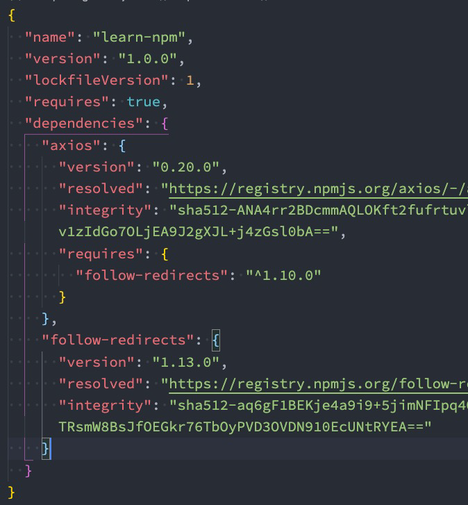
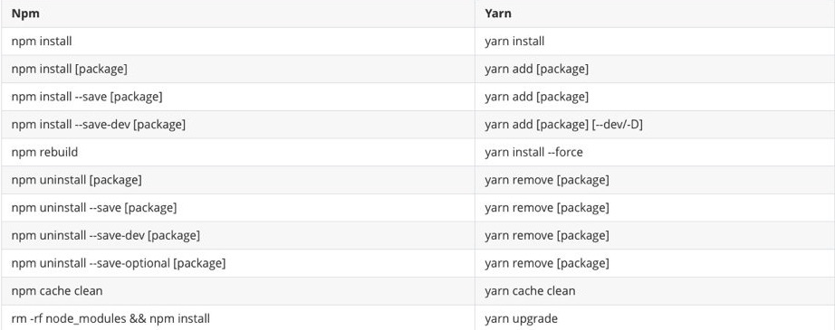
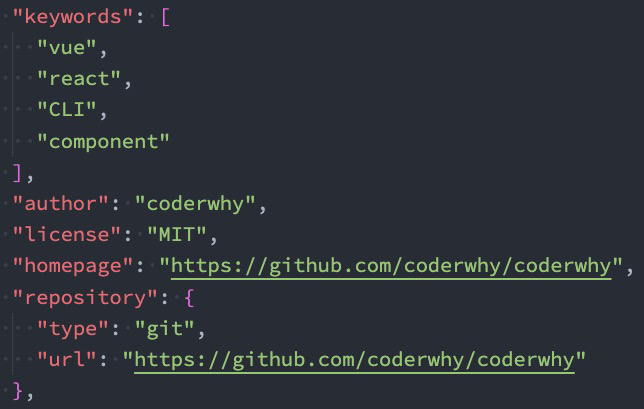

# 27. npm-yarn-npx-发布自己的包

## 1. 常见属性

+ **engines属性**（引擎）
  + engines属性用于指定Node和NPM的版本号；
  + 在安装的过程中，会先检查对应的引擎版本，如果不符合就会报错；
  + 事实上也可以指定所在的操作系统"os" : [ "darwin", "linux" ]，只是很少用到；
+ **browserslist属性**
  + 用于配置打包后的JavaScript浏览器的兼容情况，参考；
  + 否则我们需要手动的添加polyfills来让支持某些语法；
  + 也就是说它是为webpack等打包工具服务的一个属性（这里不是详细讲解webpack等工具的工作原理，所以不再给出详情）；
  + 可以单独建一个文件作为这个的配置
    + 文件名`.browserslistrc`，然后写配置
    + browserlist并不算是package原本的配置文件，但是`browserlist`工具会检测是否有`.browserslistrc`文件，再检测`package.json`文件字段`browserslist`,具体检测顺序看配置工具

## 2. npm install

+ 安装npm包分两种情况：

  + 全局安装（global install）： npm install webpack -g;
  + 项目（局部）安装（local install）： npm install webpack

+ 全局安装

  + 全局安装是直接将某个包安装到全局：
  + 比如yarn的全局安装：

  ```shell
  npm install webapck -g
  ```

+ 但是很多人对全局安装有一些误会：

  + 通常使用npm全局安装的包都是一些工具包：yarn、webpack等；
  + 并不是类似于axios、express、koa等库文件；
  + 所以全局安装了之后并不能让我们在所有的项目中使用axios等库；

## 3. 项目安装

+ 项目安装会在当前目录下生产一个`node_modules`文件夹
+ 局部安装分为开发时依赖和生产时依赖：

```shell
# 安装开发和生产依赖
npm install axios
npm i axios
npm i axios -S

# 开发依赖
npm install webpack --save-dev
npm install webpack -D
npm i webpack –D

# 根据package.json中的依赖包
npm install

```

## 4. npm install 原理

+ 很多同学之前应该已经会了npm install <package>，但是你是否思考过它的内部原理呢？
  + 执行npm install它背后帮助我们完成了什么操作？
  + 我们会发现还有一个成为package-lock.json的文件，它的作用是什么？
  + 从npm5开始，npm支持缓存策略（来自yarn的压力），缓存有什么作用呢？
+ 这是一幅我画出的根据npm install 的原理图：


注意，当我们package.json被修改，导致安装的版本喝lock版本不一致的时候，会重新构建依赖关系，重新仓库下。

```shell
npm get cache
// 查找缓存在的位置
// 里面_cacache就是npm包缓存的位置
// index开头是索引
// content就是压缩包内容
```

## 5. npm install 原理图解析

+ npm install会检测是有package-lock.json文件：
  + 没有lock文件
    + 分析依赖关系，这是因为我们可能包会依赖其他的包，并且多个包之间会产生相同依赖的情况；
    + 从registry仓库中下载压缩包（如果我们设置了镜像，那么会从镜像服务器下载压缩包）；
    + 获取到压缩包后会对压缩包进行缓存（从npm5开始有的）；
    + 将压缩包解压到项目的node_modules文件夹中（前面我们讲过，require的查找顺序会在该包下面查找）
  + 有lock文件
    + 检测lock中包的版本是否和package.json中一致（会按照semver版本规范检测）；
      + 不一致，那么会重新构建依赖关系，直接会走顶层的流程；
    + 一致的情况下，会去优先查找缓存
      + 没有找到，会从registry仓库下载，直接走顶层流程；
    + 查找到，会获取缓存中的压缩文件，并且将压缩文件解压到node_modules文件夹中；

## 6. package-lock.json

+ package-lock.json文件解析：
+ name：项目的名称；
+ version：项目的版本；
+ lockfileVersion：lock文件的版本；
+ requires：使用requires来跟踪模块的依赖关系；
+ dependencies：项目的依赖
  + 当前项目依赖axios，但是axios依赖follow-redireacts；
  + axios中的属性如下：
    + version表示实际安装的axios的版本；
    + resolved用来记录下载的地址，registry仓库中的位置；
    + requires记录当前模块的依赖；
    + integrity用来从缓存中获取索引，再通过索引去获取压缩包文件；



## 7. npm其他命令

+ 我们这里再介绍几个比较常用的：
+ 卸载某个依赖包：

```shell
npm uninstall package

npm uninstall package --save-dev

npm uninstall package -D
```

+ 强制重新build

```shell
npm rebuild
// 重新安装所有依赖
```

+ 清除缓存

```shell
npm cache clean
```

+ npm的命令其实是非常多的：

  + https://docs.npmjs.com/cli-documentation/cli
  + 更多的命令，可以根据需要查阅官方文档

+ ```
  -D开发环境依赖devDependencies， -S生产环境依赖dependencies
  ```

## 8. yarn工具

+ 另一个node包管理工具yarn：
  + yarn是由Facebook、Google、Exponent 和Tilde 联合推出了一个新的JS 包管理工具；
  + yarn 是为了弥补npm 的一些缺陷而出现的；
  + 早期的npm存在很多的缺陷，比如安装依赖速度很慢、版本依赖混乱等等一系列的问题；
  + 虽然从npm5版本开始，进行了很多的升级和改进，但是依然很多人喜欢使用yarn；



+ yarn用yarn.lock管理版本依赖，所以不能同时npm混用。

## 9. cnpm工具

+ 由于一些特殊的原因，某些情况下我们没办法很好的从https://registry.npmjs.org下载下来一些需要的包。
+ 查看npm镜像：

```shell
npm config get registry # npm config get registry
```

+ 我们可以直接设置npm的镜像：

```shell
npm config set registry https://registry.npm.taobao.org
```

+ 但是对于大多数人来说（比如我），并不希望将npm镜像修改了：
  + 第一，不太希望随意修改npm原本从官方下来包的渠道；
  + 第二，担心某天淘宝的镜像挂了或者不维护了，又要改来改去；
+ 这个时候，我们可以使用cnpm，并且将cnpm设置为淘宝的镜像：

```shell
npm install -g cnpm --registry=https://registry.npm.taobao.org

cnpm config get registry # https://r.npm.taobao.org/

```

## 10. npx工具

+ npx是npm5.2之后自带的一个命令。
  + npx的作用非常多，但是比较常见的是使用它来调用项目中的某个模块的指令。
+ 我们以webpack为例：
  + 全局安装的是webpack5.1.3
  + 项目安装的是webpack3.6.0
+ **如果我在终端执行webpack --version使用的是哪一个命令呢？**
  + 显示结果会是webpack 5.1.3，事实上使用的是全局的，为什么呢？
  + 原因非常简单，在当前目录下找不到webpack时(安装的webpack目录在nod_modules，命令在node_modules/.bin/webpack)，就会去全局找，根据全局配置的环境变量查找命令，并且执行命令；
+ 什么是环境变量？
  + 在系统属性->高级里面有，配置path什么什么的。
+ 如何解决这个问题呢？

### 1. 局部命令的执行

+ 那么如何使用项目（局部）的webpack，常见的是两种方式：
  + 方式一：明确查找到node_module下面的webpack
  + 方式二：在scripts定义脚本，来执行webpack；
+ 方式一：在终端中使用如下命令（在项目根目录下）

```shell
./node_modules/.bin/webpack --version
```

+ 方式二：修改package.json中的scripts
  + 会优先找我们的node_modules本地的，然后再全局

```shell
"scripts": {
"webpack": "webpack --version"
}
```

+ 方式三：使用npx

```shell
npx webpack --version
```

+ npx的原理非常简单，它会到当前目录的node_modules/.bin目录下查找对应的命令；


## 11. npm发布自己的包

+ 注册npm账号：
  + https://www.npmjs.com/
  + 选择sign up
+ 在命令行登录：

```shell
npm login
```

+ 修改package.json
+ 发布到npm registry上

```shell
npm publish
```

+ 更新仓库：
  + 1.修改版本号(最好符合semver规范)
  + 2.重新发布

+ 删除发布的包：

```shell
npm unpublish
```

+ 让发布的包过期：


```shell
npm deprecate
```




