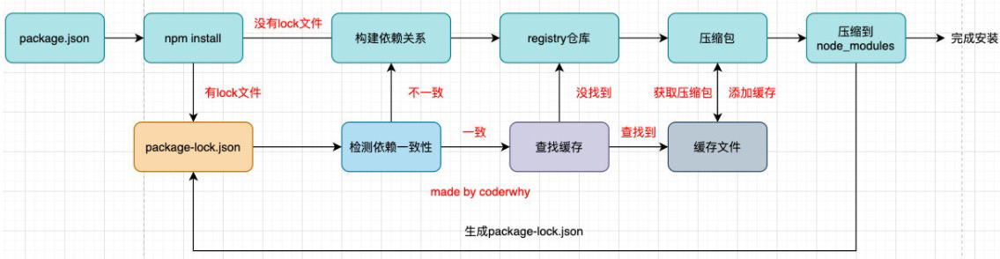

# 27. npm-yarn-npx-发布自己的包

## 1. 常见属性

+ **engines属性**（引擎）
  + engines属性用于指定Node和NPM的版本号；
  + 在安装的过程中，会先检查对应的引擎版本，如果不符合就会报错；
  + 事实上也可以指定所在的操作系统"os" : [ "darwin", "linux" ]，只是很少用到；
+ **browserslist属性**
  + 用于配置打包后的JavaScript浏览器的兼容情况，参考；
  + 否则我们需要手动的添加polyfills来让支持某些语法；
  + 也就是说它是为webpack等打包工具服务的一个属性（这里不是详细讲解webpack等工具的工作原理，所以不再给出详情）；
  + 可以单独建一个文件作为这个的配置
    + 文件名`.browserslistrc`，然后写配置
    + browserlist并不算是package原本的配置文件，但是`browserlist`工具会检测是否有`.browserslistrc`文件，再检测`package.json`文件字段`browserslist`,具体检测顺序看配置工具

## 2. npm install

+ 安装npm包分两种情况：

  + 全局安装（global install）： npm install webpack -g;
  + 项目（局部）安装（local install）： npm install webpack

+ 全局安装

  + 全局安装是直接将某个包安装到全局：
  + 比如yarn的全局安装：

  ```shell
  npm install webapck -g
  ```

+ 但是很多人对全局安装有一些误会：

  + 通常使用npm全局安装的包都是一些工具包：yarn、webpack等；
  + 并不是类似于axios、express、koa等库文件；
  + 所以全局安装了之后并不能让我们在所有的项目中使用axios等库；

## 3. 项目安装

+ 项目安装会在当前目录下生产一个`node_modules`文件夹
+ 局部安装分为开发时依赖和生产时依赖：

```shell
# 安装开发和生产依赖
npm install axios
npm i axios
npm i axios -S

# 开发依赖
npm install webpack --save-dev
npm install webpack -D
npm i webpack –D

# 根据package.json中的依赖包
npm install

```

## 4. npm install 原理

+ 很多同学之前应该已经会了npm install <package>，但是你是否思考过它的内部原理呢？
  + 执行npm install它背后帮助我们完成了什么操作？
  + 我们会发现还有一个成为package-lock.json的文件，它的作用是什么？
  + 从npm5开始，npm支持缓存策略（来自yarn的压力），缓存有什么作用呢？
+ 这是一幅我画出的根据npm install 的原理图：



## 5. npm install 原理图解析

+ npm install会检测是有package-lock.json文件：
  + 没有lock文件
    + 分析依赖关系，这是因为我们可能包会依赖其他的包，并且多个包之间会产生相同依赖的情况；
    + 从registry仓库中下载压缩包（如果我们设置了镜像，那么会从镜像服务器下载压缩包）；
    + 获取到压缩包后会对压缩包进行缓存（从npm5开始有的）；
    + 将压缩包解压到项目的node_modules文件夹中（前面我们讲过，require的查找顺序会在该包下面查找）
  + 有lock文件
    + 检测lock中包的版本是否和package.json中一致（会按照semver版本规范检测）；
      + 不一致，那么会重新构建依赖关系，直接会走顶层的流程；
    + 一致的情况下，会去优先查找缓存
      + 没有找到，会从registry仓库下载，直接走顶层流程；
    + 查找到，会获取缓存中的压缩文件，并且将压缩文件解压到node_modules文件夹中；


