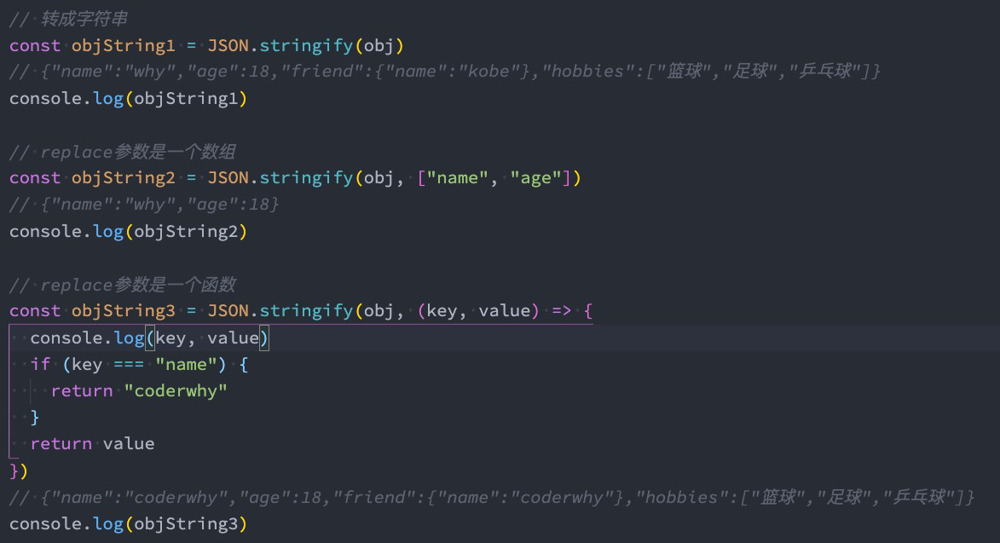
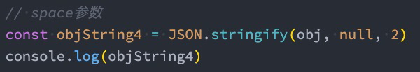
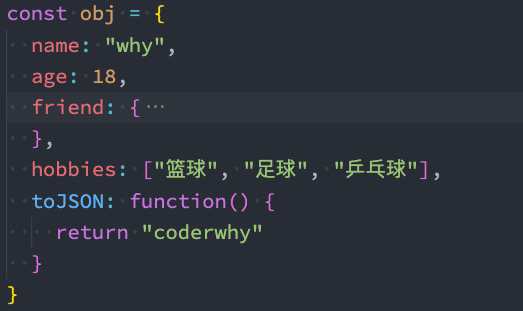
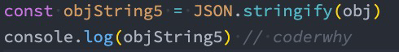
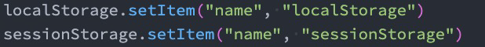
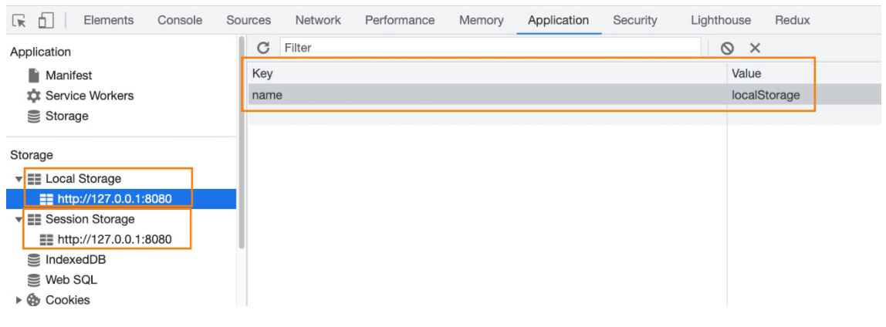

# 28. JSON-Storage-Indexed DB

## 1. JSON的由来

+ 在目前的开发中，JSON是一种非常重要的**数据格式**，它并不是编程语言，而是一种可以在服务器和客户端之间传输的数据格式。
+ JSON的全称是JavaScript Object Notation（JavaScript对象符号）：
  + JSON是由`Douglas Crockford`构想和设计的一种轻量级资料交换格式，算是JavaScript的一个子集；
  + 但是虽然JSON被提出来的时候是主要应用JavaScript中，但是目前已经独立于编程语言，可以在各个编程语言中使用；
  + 很多编程语言都实现了将JSON转成对应模型的方式；
+ 其他的传输格式：
  + XML：在早期的网络传输中主要是使用XML来进行数据交换的，但是这种格式在解析、传输等各方面都弱于JSON，所以目前已经很
    少在被使用了；
  + `Protobuf`：另外一个在网络传输中目前已经越来越多使用的传输格式是`protobuf`，但是直到2021年的3.x版本才支持JavaScript，所
    以目前在前端使用的较少；

+ 目前JSON被使用的场景也越来越多：
  + 网络数据的传输JSON数据；
  + 项目的某些配置文件；小程序配置。
  + 非关系型数据库（NoSQL）将`json`作为存储格式；

## 2. JSON基本语法

+ JSON的顶层支持三种类型的值：

  + 简单值：数字（Number）、字符串（String，不支持单引号）、布尔类型（Boolean）、null类型；不支持undefined值

  ```json
  123
  ```

  + 对象值：由key、value组成，key是字符串类型，并且必须添加双引号，值可以是简单值、对象值、数组值；

  ```js
  {
    "name": "why",
    "age": 18,
    "friend": {
      "name": "kobe"
    },
    "hobbies": ["篮球", "足球"]
  }
  
  ```

  + 数组值：数组的值可以是简单值、对象值、数组值；

  ```json
  [
      123,
      "abc",
      {
          "name": "kobe"
      }
  ]
  ```

  + json不能写注释
  + 最后不能写逗号

## 3. JSON序列化

+ 某些情况下我们希望将JavaScript中的复杂类型转化成JSON格式的字符串，这样方便对其进行处理：
  + 比如我们希望将一个对象保存到`localStorage`中；
  + 但是如果我们直接存放一个对象，这个对象会被转化成[object Object] 格式的字符串，并不是我们想要的结果；

```json
const obj = {
  name: "why",
  age: 18,
  friends: {
    name: "kobe"
  },
  hobbies: ["篮球", "足球"]
}

// 将obj转成JSON格式的字符串
const objString = JSON.stringify(obj)

console.log(objString);
// {"name":"why","age":18,"friends":{"name":"kobe"},"hobbies":["篮球","足球"]}

// 将对象数据存储localStorage
// 假如第二个参数传入的是对象类型会转成string
// 对象类型转字符串会变成"[object Object]"
// 为什么打印时这个？
/**
 * 因为在我们对象将要被表示为文本的时候，或者隐式转成字符串的时候，就会调用toString，如果对象没有定义这个方法，就会原型链上找Object对象的toString方法，然后返回的格式"[object type]".type就是表示这个对象的类型
 * 解决的办法就是先进行对象序列化
 */
localStorage.setItem("obj", objString)

const jsonString = localStorage.getItem("obj")

// 将JSON格式的字符串转回对象
const info = JSON.parse(jsonString)
console.log(info)

```

## 4. JSON序列化方法

+ 在ES5中引用了JSON全局对象，该对象有两个常用的方法：
  + stringify方法：将JavaScript类型转成对应的JSON字符串；
  + parse方法：解析JSON字符串，转回对应的JavaScript类型；
+ 那么上面的代码我们可以通过如下的方法来使用：

### 1. Stringify的参数replace

+ `JSON.stringify()` 方法将一个JavaScript 对象或值转换为JSON 字符串：
  + 如果指定了一个replacer 函数，则可以选择性地替换值；
  + 如果指定的replacer 是数组，则可选择性地仅包含数组指定的属性；



### 2. Stringify的参数space

+ 当然，它还可以跟上第三个参数space：



+ 如果对象本身包含toJSON方法，那么会直接使用toJSON方法的结果：





```js
const obj = {
  name: "why",
  age: 18,
  friends: {
    name: "kobe"
  },
  hobbies: ["篮球", "足球"],
  // toJSON: function() {
  //   return "123456"
  // }
}

// 需求: 将上面的对象转成JSON字符串
// 1.直接转化
const jsonString1 = JSON.stringify(obj)
console.log(jsonString1)

// 2.stringify第二个参数replacer
// 2.1. 传入数组: 设定哪些是需要转换,指定要转换的，其他的不要了
const jsonString2 = JSON.stringify(obj, ["name", "friends"])
console.log(jsonString2)
// {"name":"why","friends":{"name":"kobe"}}

// 2.2. 传入回调函数:
// 每个键值对转化的时候，会进行回调函数
const jsonString3 = JSON.stringify(obj, (key, value) => {
  if (key === "age") {
    return value + 1
  }
  return value
})
console.log(jsonString3)
// 可以发现age+1了
// {"name":"why","age":19,"friends":{"name":"kobe"},"hobbies":["篮球","足球"]}

// 3.stringify第三参数 space
// 控制转化的缩进
const jsonString4 = JSON.stringify(obj, null, "---")
console.log(jsonString4)
/**
 * {
---"name": "why",
---"age": 18,
---"friends": {
------"name": "kobe"
---},
---"hobbies": [
------"篮球",
------"足球"
---]
}
*/
```

```js
const obj = {
  name: "why",
  age: 18,
  friends: {
    name: "kobe"
  },
  hobbies: ["篮球", "足球"],
    
  // 假如我们的对象里面有tojson的方法，那么最终转化都是return出来的"123456"
  toJSON: function() {
    return "123456"
  }
}

const jsonString1 = JSON.stringify(obj)
console.log(jsonString1) // "123456"

```

### 3. parse方法

+ `JSON.parse()` 方法用来解析JSON字符串，构造由字符串描述的JavaScript值或对象。
  + 提供可选的reviver 函数用以在返回之前对所得到的对象执行变换(操作)。

```js
const JSONString = '{"name":"why","age":19,"friends":{"name":"kobe"},"hobbies":["篮球","足球"]}'

const info = JSON.parse(JSONString, (key, value) => {
  if (key === "age") {
    return value - 1
  }
  return value
})
console.log(info)

```

## 5. 使用JSON序列化深拷贝

+ 另外我们生成的新对象和之前的对象并不是同一个对象：
  + 相当于是进行了一次深拷贝；
+ 注意：这种方法它对函数是无能为力的
  + 创建出来的info中是没有foo函数的，这是因为stringify并不会对函数进行处理；
  + json不支持转化函数和保存函数
  + 我们后续会讲解如何编写深拷贝的工具函数，那么这样就可以对函数的拷贝进行处理了；

```js
const obj = {
  name: "why",
  age: 18,
  friends: {
    name: "kobe"
  },
  hobbies: ["篮球", "足球"],
  foo: function() {
    console.log("foo function")
  }
}

// 将obj对象的内容放到info变量中
// 1.引用赋值
const info = obj
obj.age = 100
console.log(info.age) // 被改了  100

// 2.浅拷贝
const info2 = { ...obj }
obj.age = 1000
console.log(info2.age) // 100

obj.friends.name = "james"
console.log(info2.friends.name) // james

// 3.stringify和parse来实现
const jsonString = JSON.stringify(obj)
console.log(jsonString) 
// {"name":"why","age":1000,"friends":{"name":"james"},"hobbies":["篮球","足球"]}
const info3 = JSON.parse(jsonString)
obj.friends.name = "curry"
console.log(info3.friends.name) // james
console.log(info3)
// {
//  age: 1000
//  friends: {name: 'james'}
//  hobbies: (2) ['篮球', '足球']
//  name: "why"
//}
```

## 6. 认识Storage

+ WebStorage主要提供了一种机制，可以让浏览器提供一种比cookie更直观的key、value存储方式：
  + localStorage：本地存储，提供的是一种永久性的存储方法，在关闭掉网页重新打开时，存储的内容依然保留；
  + sessionStorage：会话存储，提供的是本次会话的存储，在关闭掉会话时，存储的内容会被清除；





### 1. localStorage和sessionStorage的区别

+ 我们会发现localStorage和sessionStorage看起来非常的相似。
+ 那么它们有什么区别呢？
  + 验证一：关闭网页后重新打开，localStorage会保留，而sessionStorage会被删除；
  + 验证二：在页面内实现跳转，localStorage会保留，sessionStorage也会保留；
  + 验证三：在页面外实现跳转（打开新的网页），localStorage会保留，sessionStorage不会被保留；


### 2. Storage常见的方法和属性

+ Storage有如下的属性和方法：
+ 属性：
  + `Storage.length`：只读属性
    + 返回一个整数，表示存储在Storage对象中的数据项数量；
+ 方法：
  + `Storage.key()`：该方法接受一个数值n作为参数，返回存储中的第n个key名称；
  + `Storage.getItem()`：该方法接受一个key作为参数，并且返回key对应的value；
  + `Storage.setItem()`：该方法接受一个key和value，并且将会把key和value添加到存储中。
    + 如果key存储，则更新其对应的值；
  + `Storage.removeItem()`：该方法接受一个key作为参数，并把该key从存储中删除；
  + `Storage.clear()`：该方法的作用是清空存储中的所有key；


