# 29. Cookie-BOM-DOM

## 1. 认识 Cookie

- Cookie（复数形态 Cookies），又称为“小甜饼”。类型为“小型文本文件，某些网站为了辨别用户身份而存储在用户本地终端（Client Side）上的数据。
  - 浏览器会在特定的情况下携带上 cookie 来发送请求，我们可以通过 cookie 来获取一些信息；
- Cookie 总是保存在客户端中，按在客户端中的存储位置，Cookie 可以分为内存 Cookie 和硬盘 Cookie。
  - 内存 Cookie 由浏览器维护，保存在内存中，浏览器关闭时 Cookie 就会消失，其存在时间是短暂的；
  - 硬盘 Cookie 保存在硬盘中，有一个过期时间，用户手动清理或者过期时间到时，才会被清理；
- 如果判断一个 cookie 是内存 cookie 还是硬盘 cookie 呢？
- 没有设置过期时间，默认情况下 cookie 是内存 cookie，在关闭浏览器时会自动删除；
- 有设置过期时间，并且过期时间不为 0 或者负数的 cookie，是硬盘 cookie，需要手动或者到期时，才会删除；
- **Cookie 往往是由服务器设置的，然后在浏览器发送下一次请求的时候会带上去 Cookie 过去**
- 服务器设置得 Cookie 会在响应头得 Set-Cookie 中显示,实际会存到硬盘里，只是不设置过期时间，显示过期时间是会话。

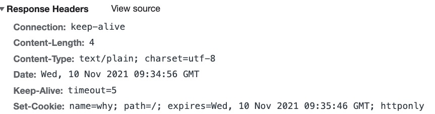

- 上面就是服务器的响应头，里面的 Set-Cookie 就是用于进行我们的 Cookies 的设置。

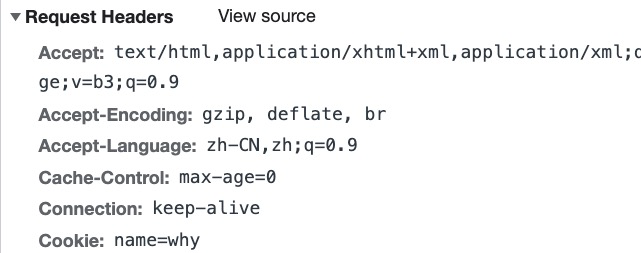

- 浏览器请求的时候就会自动携带上我们的 Cookie。

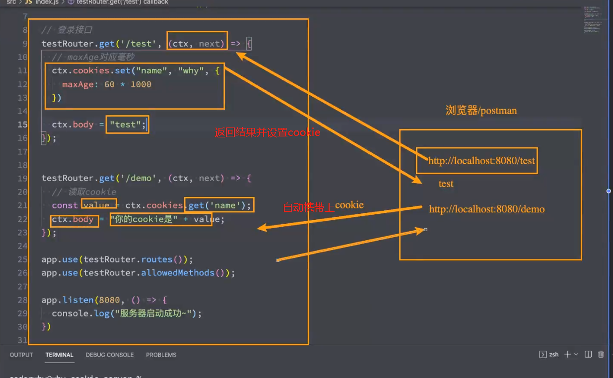

```js
const Koa = require('koa');
const Router = require('koa-router');

const app = new Koa();

const testRouter = new Router();

// 登录接口
testRouter.get('/test', (ctx, next) => {
  // maxAge对应毫秒
  ctx.cookies.set('name', 'why', {
    maxAge: 60 * 1000, // 60秒过期
    httpOnly: false,
  });

  ctx.body = 'test';
});

testRouter.get('/demo', (ctx, next) => {
  // 读取cookie
  const value = ctx.cookies.get('name');
  ctx.body = '你的cookie是' + value;
});

app.use(testRouter.routes());
app.use(testRouter.allowedMethods());

app.listen(8000, () => {
  console.log('服务器启动成功~');
});
```

### 1. cookie 常见的属性

- cookie 的生命周期：

  - 默认情况下的 cookie 是内存 cookie，也称之为会话 cookie，也就是在浏览器关闭时会自动被删除；
  - 我们可以通过设置 expires 或者 max-age 来设置过期的时间；
    - expires：设置的是 Date.toUTCString()，设置格式是;expires=date-in-GMTString-format；
    - max-age：设置过期的秒钟，;max-age=max-age-in-seconds (例如一年为 60*60*24\*365)；

- cookie 的作用域：（允许 cookie 发送给哪些 URL）

  - Domain：指定哪些主机可以接受 cookie

    - 如果不指定，那么默认是 origin，不包括子域名。相当于制定了完整的地址，除了这个地址，其他子域名等都不行
    - 如果指定 Domain，则包含子域名。例如，如果设置 Domain=mozilla.org，则 Cookie 也包含在子域名中（如 developer.mozilla.org）。

  - Path：指定主机下哪些路径可以接受 cookie

    - 不设置意味着子路径都可以，设置了那么只有在这个子路径下的路径可以携带 cookie

    - 例如，设置 Path=/docs，则以下地址都会匹配：
      - /docs
      - /docs/Web/
      - /docs/Web/HTTP

  - HttpOnly：如果设置了这个属性为 true，前端没有办法访问和修改这个 cookie 的，这是为了防止跨站脚本攻击 XSS。
  - Secure `/sɪˈkjʊə(r)/`：设置为 true 的时候，指定只能通过 Https 协议传输时，cookie 次啊会附加到请求中。防止不安全请求泄露 cookie。
  - SameSite：用于控制 cookie 的跨站请求策略，助防止跨站请求伪造（CSRF）攻击。SameSite 不会影响前端修改 cookie 权限，影响的是 cookie 的发送行为。
    - Strict：只有请求来自同一站点，浏览器才会携带。
    - Lax：可以理解成站点 A 中（a 链接、window.open）打开站点 B，GET 请求中携带了站点 A 的 cookie。
    - None：所有请求带上

### 2. 客户端设置 cookie

- 这个学的不仔细

- js 直接设置和获取 cookie
  - cookie 在我们的 document 里面

```js
// 我们js是获取不到服务器设置的cookie
// 但是我们可以获取我们js代码自己设置的cookie
console.log(document.cookie);

// 假如我们想要把cookie删除怎么办，注意我们的cookie必须在http-only为false情况下，客户端才能修改，为true的情况下你修改不了
document.cookie = 'name=why;max-age=0';
```

- 这个 cookie 会在会话关闭时被删除掉；

```js

```

- 设置 cookie，同时设置过期时间（默认单位是**秒钟**）

```js
document.cookie = 'name=coderwhy;max-age=10';
```

- 总结：服务器设置 cookie 后，
  1. cookie 将附加到每一次的 http 请求中（这样子会浪费用户的流量）。
  2. 发送请求的时候在 headers 中是明文传输的，存在一定的风险。
  3. 大小限制：4kb
  4. cookie 验证登陆，浏览器请求会携带 cookie，但是其他客户端比如 ios、安卓之类的进行请求服务器的时候可能需要手动携带，比较麻烦。

## 2. 认识 BOM（浏览器对象模型）

- JavaScript 有一个非常重要的运行环境就是浏览器，而且浏览器本身又作为一个应用程序需要对其本身进行操作，所以通常浏览器会有对
  应的对象模型（BOM，Browser Object Model）。
  - 我们可以将 BOM 看成是连接 JavaScript 脚本与浏览器窗口的桥梁
  - 说白了就是可以操作浏览器的 api

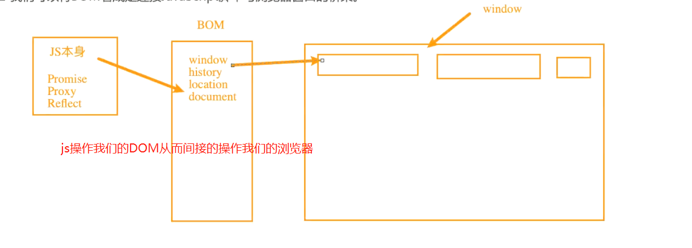

- BOM 主要包括一下的对象模型：
  - window：包括全局属性、方法，控制浏览器窗口相关的属性、方法；
  - location：浏览器连接到的对象的位置（URL）；
  - history：操作浏览器的历史；
  - document：当前窗口操作文档的对象；
- **window 对象在浏览器中有两个身份：**
  - 身份一：**全局对象**。
    - 我们知道 ECMAScript 其实是有一个全局对象的，这个全局对象在 Node 中是 global；
    - 在浏览器中就是 window 对象；
  - 身份二：**浏览器窗口对象**。
    - 作为浏览器窗口时，提供了对浏览器操作的相关的 API；

## 3. Window 全局对象

- 在浏览器中，window 对象就是之前经常提到的全局对象，也就是我们之前提到过 GO 对象：
  - 比如在全局通过 var 声明的变量，会被添加到 GO 中，也就是会被添加到 window 上；
  - 比如 window 默认给我们提供了全局的函数和类：setTimeout、Math、Date、Object 等；
- 通过 var 声明的变量，全局提供的类和方法：

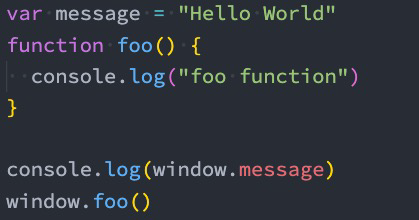

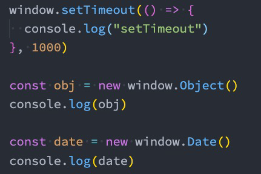

```js
var message = 'Coderwhy';
var age = 18;

// window可以省略
window.setTimeout(() => {
  console.log('setTimeout');
}, 2000);

const obj = new window.Date();
console.log(obj);
```

- 这些用法是我们之前讲过的，并且也是作为 JavaScript 语言本身所拥有的一些特性。
  - 那么接下来我们来看一下作为窗口对象，它拥有哪些特性。

## 4. Window 窗口对象

- 事实上 window 对象上肩负的重担是非常大的：
  - 第一：包含大量的属性，localStorage、console、location、history、screenX、scrollX 等等（大概 60+个属性）；
  - 第二：包含大量的方法，alert、close、scrollTo、open 等等（大概 40+个方法）；
  - 第三：包含大量的事件，focus、blur、load、hashchange 等等（大概 30+个事件）；
  - 第四：包含从 EventTarget 继承过来的方法，addEventListener、removeEventListener、dispatchEvent 方法；

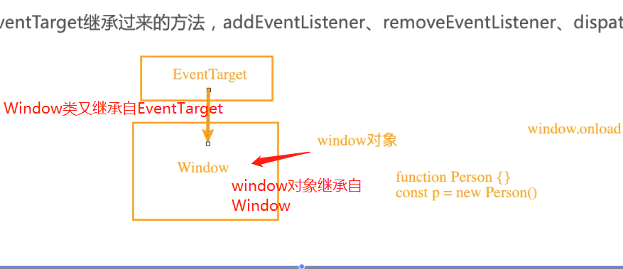

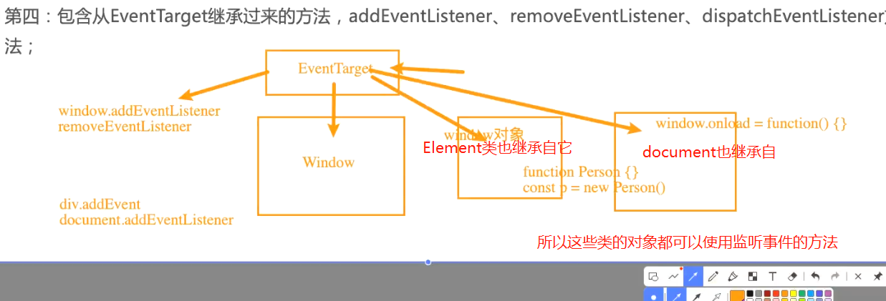

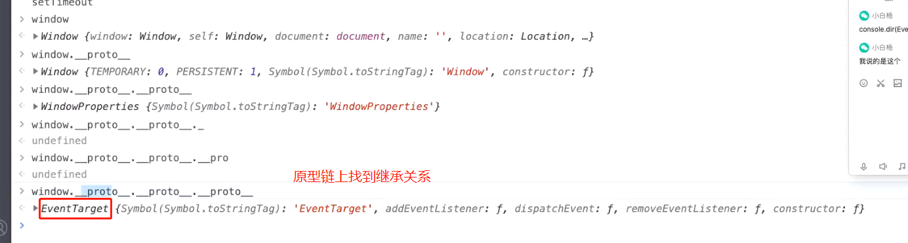

- 那么这些大量的属性、方法、事件在哪里查看呢？
  - MDN 文档：https://developer.mozilla.org/zh-CN/docs/Web/API/Window
- 查看 MDN 文档时，我们会发现有很多不同的符号，这里我解释一下是什么意思：
  - 删除符号：表示这个 API 已经废弃，不推荐继续使用了；
  - 点踩符号：表示这个 API 不属于 W3C 规范，某些浏览器有实现（所以兼容性的问题）；
  - 实验符号：该 API 是实验性特性，以后可能会修改，并且存在兼容性问题；

## 5. window 常见的属性

- 我们来看一下常见的 window 属性：

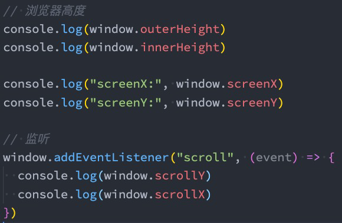

```js
// 1.常见的属性
// 距离左边多少
console.log(window.screenX);
// 窗口距离上边多少
console.log(window.screenY);

window.addEventListener('scroll', () => {
  // 滚动的距离
  console.log(window.scrollX, window.scrollY);
});

// 整个窗口的高度
console.log(window.outerHeight);
// 实际我们能看见的高度，比如开了开发者模式在下面，可以看见的内容高度就不一样了
console.log(window.innerHeight);
```

## 6. window 常见的方法

```js
// 2.常见的方法
const scrollBtn = document.querySelector('#scroll');
scrollBtn.onclick = function () {
  //   // 1.scrollTo
  // window.scrollTo({ top: 2000 })
  //   // 2.close
  //   // window.close()
  //   // 3.open
  //   window.open("http://www.baidu.com", "_self")
};
```

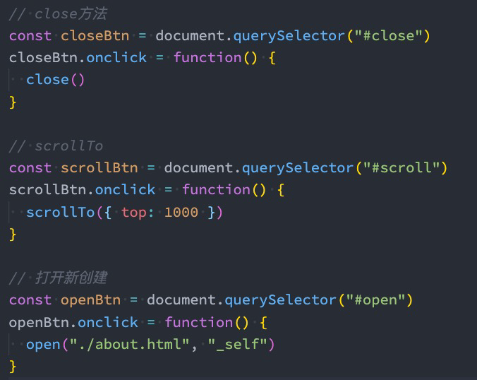

## 7. window 常见的事件

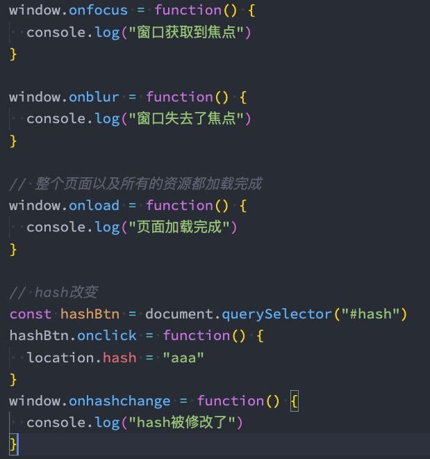

```js
// 3.常见的事件
window.onload = function () {
  console.log('window窗口加载完毕~');
};

window.onfocus = function () {
  console.log('window窗口获取焦点~');
};

window.onblur = function () {
  console.log('window窗口失去焦点~');
};

const hashChangeBtn = document.querySelector('#hashchange');
hashChangeBtn.onclick = function () {
  location.hash = 'aaaa';
};
window.onhashchange = function () {
  console.log('hash发生了改变');
};
```

## 8. EventTarget

- Window 继承自 EventTarget，所以会继承其中的属性和方法：
  - addEventListener：注册某个事件类型以及事件处理函数；
  - removeEventListener：移除某个事件类型以及事件处理函数；
  - dispatchEvent：派发某个事件类型到 EventTarget 上
  - 默认事件监听：
    https://developer.mozilla.org/zh-CN/docs/Web/Events

```js
const clickHandler = () => {
  console.log('window发生了点击');
};

window.addEventListener('click', clickHandler);
window.removeEventListener('click', clickHandler);
```

```js
// 监听coderwhy事件
window.addEventListener('coderwhy', () => {
  console.log('监听到了coderwhy事件');
});

// 派发事件，传入一个事件
window.dispatchEvent(new Event('coderwhy'));

// 可以用在事件总线上
```

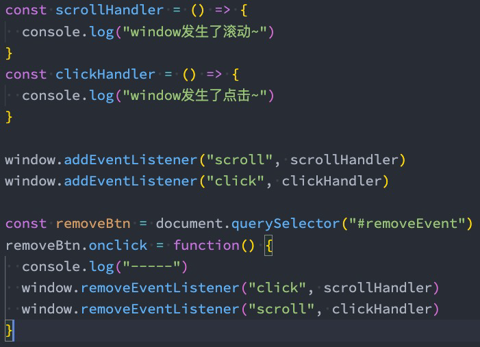

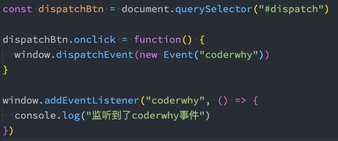

## 9. Location 对象常见的属性

- Location 对象用于表示 window 上当前链接到的 URL 信息。

- 常见的属性有哪些呢？

  - href: 当前 window 对应的超链接 URL, 整个 URL；
  - protocol: 当前的协议；
  - host: 主机地址；
  - hostname: 主机地址(不带端口)；
  - port: 端口；
  - pathname: 路径；
  - search: 查询字符串；`?name=why&age=18`
    - 在我们的 URL 中叫 query，location 中叫 search
  - hash: 哈希值；
    - URL 中叫 fragment
  - username：URL 中的 username（很多浏览器已经禁用）
  - password：URL 中的 password（很多浏览器已经禁用）；

  - origin：就是我们的协议加上主机地址就是我们的源

## 10. Location 对象常见的方法

- 我们会发现 location 其实是 URL 的一个抽象实现：

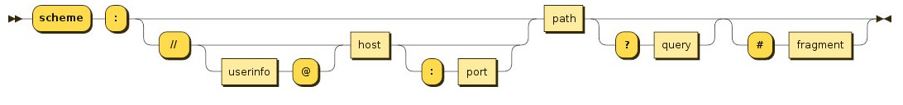

```js
console.log(window.location);

// 当前的完整的url地址
console.log(location.href);

// 协议protocol
console.log(location.protocol);

// 几个方法
// 打开新地址
location.assign('http://www.baidu.com');
// 跳新地址
location.href = 'http://www.baidu.com';

// 替代原地址，就不能回退
location.replace('http://www.baidu.com');
// 重新加载网页，false会检查缓存，true直接强制
location.reload(false);
```

- location 有如下常用的方法：
  - assign：赋值一个新的 URL，并且跳转到该 URL 中；
  - replace：打开一个新的 URL，并且跳转到该 URL 中（不同的是不会在浏览记录中留下之前的记录）；
  - reload：重新加载页面，可以传入一个 Boolean 类型；

## 11. history 对象常见属性和方法

- history 对象允许我们访问浏览器曾经的会话历史记录。
  - 有两个属性：
    - length：会话中的记录条数；
    - state：当前保留的状态值；
- 有五个方法：
  - back()：返回上一页，等价于 history.go(-1)；
  - forward()：前进下一页，等价于 history.go(1)；
  - go()：加载历史中的某一页；go(-2)回退两个
  - pushState()：打开一个指定的地址；内部不会刷新，只是改变 url。
  - replaceState()：打开一个新的地址，并且使用 replace；

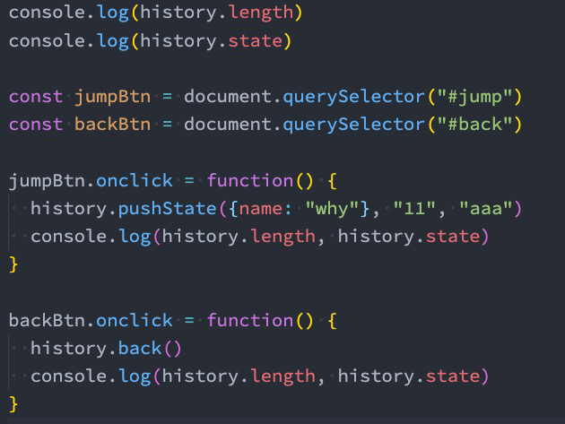

```js
const jumpBtn = document.querySelector('#jump');

jumpBtn.onclick = function () {
  // location.href = "./demo.html"

  // 跳转(不刷新网页)，第一个参数就是state，第二个参数name，一些浏览器不支持该功能，第三个就是要修改的路由
  // 打印history.state的时候，就会打印pushSate传入的state对象
  history.pushState({ name: 'coderwhy' }, '', '/detail');

  // history.replaceState({name: "coderwhy"}, "", "/detail")
};
```

```html
<button id="scroll">滚动一下</button>
<button id="hashchange">改变hash</button>

<button id="jump">跳转新页面</button>
```
