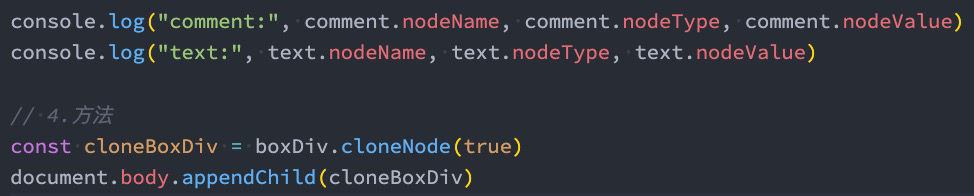

# 30. DOM 操作架构-浏览器事件

## 0. 面试题-参数作用域

```js
var x = 0;

// 当函数的参数有默认值时, 会形成一个新的作用域, 这个作用域用于保存参数的值
function foo(
  x,
  y = function () {
    x = 3;
    console.log(x);
  }
) {
  console.log(x);
  var x = 2;
  console.log(x);
  y();
  console.log(x);
}

foo();
console.log(x);

undefined;
2;
3;
2;
0;
```

- 分析：

  1. 这里主要第一点就是当参数中有一个存在默认值的时候，就会与其他参数构成一个参数作用域。这个作用域里会包裹函数作用域，如果没有都没有默认参数，就会与函数作用域合并在一起。

  - 多以`y=function(){...}`中，y 中的 x 与外部的 x 在同一个作用域，所以会修改参数 x。

  2. 关于 x 的变量提升，在函数中，执行到了 x 才会进行创建赋值。所以：

  ```js
  function foo(x = 1) {
    console.log(x);
    var x = 2;
  }

  foo(); // 1

  // ---------
  function foo(x = 1) {
    var x = 2;
    console.log(x);
  }

  foo(); // 2

  // 可以记忆成就近原则吧
  function foo(x) {
    console.log(x);
    x = 2;
  }

  foo(); // undefined

  // -----------
  function foo(x = 1) {
    console.log(x);
    x = 2; // 这个x被限定在函数作用域中
  }

  foo();

  console.log(x); // 未定义
  ```

- 拓展

```js
console.log(x);
var x = 1;
// var定义的变量会先提升
```

```js
console.log(x);
x = 1;
// x未定义先

console.log(x);
let x = 1;
// x未定义先
```

```js
console.log(x);
var x=1
function x() {

}
// 函数作用域提升大于变量提升

[Function: x]
```

```js
console.log(x);
x = 1;
// 会报错，因为执行到x=1的时候才会定义变量，然后赋值
```

```js
console.log(x);
var x = 1;
// 有var的时候定义变量提升，然后执行到才赋值。所以结果为undefined
```

```js
// 1.
function foo(x = 2) {
  var x = 1;
  console.log(x);
}
foo(); // 1

// 2.
function foo() {
  console.log(x);
  var x = 1;
}
foo(); // undefined

// 3.
function foo(x = 2) {
  console.log(x);
  var x = 1;
}
foo(); //3

4;
function foo(x) {
  console.log(x);
  var x = 1;
}

foo(); // undefined

// 能够从上面分析出来,我们的变量查找，优先就近，就近没有定义的，就找参数，之后查找变量提升。
```

## 1. 认识 DOM 和架构

- 浏览器是用来展示网页的，而网页中最重要的就是里面各种的标签元素，JavaScript 很多时候是需要操作这些元素的。
  - JavaScript 如何操作元素呢？通过 Document Object Model（DOM，文档对象模型）。
  - DOM 给我们提供了一系列的模型和对象，让我们可以方便的来操作 Web 页面。


## 2. EventTarget

- 因为继承自`EventTarget`，所以也可以使用 EventTarget 的方法：

```js
document.addEventListener('click', () => {
  console.log('document被点击');
});

const divEl = document.querySelector('#box');
const spanEl = document.querySelector('.content');

divEl.addEventListener('click', () => {
  console.log('div元素被点击');
});

spanEl.addEventListener('click', () => {
  console.log('span元素被点击');
});
```

```html
<!DOCTYPE html>
<html lang="en">
  <head>
    <meta charset="UTF-8" />
    <meta http-equiv="X-UA-Compatible" content="IE=edge" />
    <meta name="viewport" content="width=device-width, initial-scale=1.0" />
    <title>Document</title>
    <style>
      #box {
        width: 200px;
        height: 200px;
        background-color: red;
      }

      .content {
        width: 100px;
        height: 100px;
        display: inline-block;
        background-color: blue;
      }
    </style>
  </head>
  <body>
    <div id="box" class="abc why" age="18">
      <span name="why" class="content">span元素</span>
      <!-- 哈哈哈 -->
      <strong></strong>
      <a href="#"></a>
    </div>
    <div></div>

    <h2 name="title">标题</h2>
    <button>切换标题</button>

    <script src="./XXXXX.js"></script>
  </body>
</html>
```


## 3. Node 节点

- 所有的 DOM 节点类型都继承自 Node 接口。
  - https://developer.mozilla.org/zh-CN/docs/Web/API/Node
- Node 有几个非常重要的属性：
  - `nodeName`：node 节点的名称。HTML 不区分大小写。
  - `nodeType`：可以区分节点的类型。直接查节点类型的常量。
  - `nodeValue`：node 节点的值；
  - `childNodes`：所有的子节点；

```js
const divEl = document.querySelector('#box');
const spanEl = document.querySelector('.content');

// 常见的属性
console.log(divEl.nodeName, spanEl.nodeName); // DIV SPAN
console.log(divEl.nodeType, spanEl.nodeType); // 1 1
console.log(divEl.nodeValue, spanEl.nodeValue);

// childNodes
const spanChildNodes = spanEl.childNodes;
const textNode = spanChildNodes[0];
console.log(textNode.nodeValue);

// 常见的方法
const strongEl = document.createElement('strong');
strongEl.textContent = '我是strong元素';
divEl.appendChild(strongEl);

// 注意事项: document对象有方法appendChild方法，但是浏览器限制了你直接使用
document.body.appendChild(strongEl);
```




## 4. Document

- Document 节点表示的整个载入的网页，我们来看一下常见的属性和方法：

```js
// 常见的属性
console.log(document.body);
console.log(document.title);
document.title = 'Hello World';

console.log(document.head);
console.log(document.children[0]);

console.log(window.location);
console.log(document.location); // 浏览器认为URL也是document的一部分
console.log(window.location === document.location);

// 常见的方法
// 创建元素
const imageEl = document.createElement('img');
const imageEl2 = new HTMLImageElement();

// 获取元素
const divEl1 = document.getElementById('box');
const divEl2 = document.getElementsByTagName('div');
const divEl3 = document.getElementsByName('title');
const divEl4 = document.querySelector('.content'); // 获取第一个
const divEl5 = document.querySelectorAll('.content'); // 获取全部
```


## 5. Element

- 我们平时创建的 div、p、span 等元素在 DOM 中表示为 Element 元素，我们来看一下常见的属性和方法：

```js
const divEl = document.querySelector('#box');

// 常见的属性
console.log(divEl.id);
console.log(divEl.tagName);
console.log(divEl.children);
console.log(divEl.className);
console.log(divEl.classList);
console.log(divEl.clientWidth);
console.log(divEl.clientHeight);
console.log(divEl.offsetLeft);
console.log(divEl.offsetTop);

// 常见的方法
const value = divEl.getAttribute('age');
console.log(value);
divEl.setAttribute('height', 1.88);
```


## 6. 认识事件监听

- 前面我们讲到了 JavaScript 脚本和浏览器之间交互时，浏览器给我们提供的 BOM、DOM 等一些对象模型。
  - 事实上还有一种需要和浏览器经常交互的事情就是事件监听：
  - 浏览器在某个时刻可能会发生一些事件，比如鼠标点击、移动、滚动、获取、失去焦点、输入内容等等一系列
    的事件；
- 我们需要以某种方式（代码）来对其进行响应，进行一些事件的处理；
  - 在 Web 当中，事件在浏览器窗口中被触发，并且通过绑定到某些元素上或者浏览器窗口本身，那么我们就可以
    给这些元素或者 window 窗口来绑定事件的处理程序，来对事件进行监听。
    - 给这些元素或者 window 窗口来绑定事件的过程，就叫事件监听。
- 如何进行事件监听呢？
  - 事件监听方式一：在 script 中直接监听；
  - 事件监听方式二：通过元素的 on 来监听事件；
  - 事件监听方式三：通过 EventTarget 中的 addEventListener 来监听；

```html
// 在script中直接监听； // event.html .box { width: 200px; height: 200px;
background-color: red; } // 1.
<div class="box" onclick="console.log('div元素被点击')"></div>

// 2.
<div class="box" onclick="divClick()"></div>

function divClick() { console.log("div元素被点击2") }
```

```js
// 通过元素的on来监听事件；
const divEl = document.querySelector(".box")、

// onclick属于element属性。定义属性后面的会覆盖前面的。
divEl.onclick = function() {
  console.log("div元素被点击3")
}

// 2. 通过EventTarget中的addEventListener来监听；

// 有点可以添加多次监听事件，且不会覆盖，然后也不会覆盖属性
divEl.addEventListener("click", () => {
  console.log("div元素被点击4")
})
divEl.addEventListener("click", () => {
  console.log("div元素被点击5")
})
divEl.addEventListener("click", () => {
  console.log("div元素被点击6")
})

```

## 7. 认识事件流的由来

- 事实上对于事件有一个概念叫做事件流，为什么会产生事件流呢？
  - 我们可以想到一个问题：当我们在浏览器上对着一个元素点击时，你点击的不仅仅是这个元素本身；
  - 这是因为我们的 HTML 元素是存在父子元素叠加层级的；
  - 比如一个 span 元素是放在 div 元素上的，div 元素是放在 body 元素上的，body 元素是放在 html 元素上的；

```html

```

```js

```

## 8. 事件冒泡和事件捕获

- 我们会发现默认情况下事件是从最内层的 span 向外依次传递的顺序，这个顺序我们称之为事件冒泡（Event
  Bubble）。
  - 事实上，还有另外一种监听事件流的方式就是从外层到内层（body -> span），这种称之为事件捕获（Event
    Capture）；
  - 为什么会产生两种不同的处理流呢？
    - 这是因为早期浏览器开发时，不管是 IE 还是 Netscape 公司都发现了这个问题，但是他们采用了完全相反的事
      件流来对事件进行了传递；
    - IE 采用了事件冒泡的方式，Netscape 采用了事件捕获的方式；
- 那么我们如何去监听事件捕获的过程呢？
