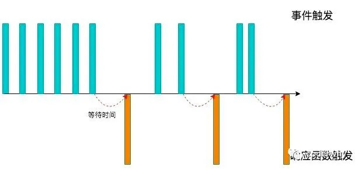
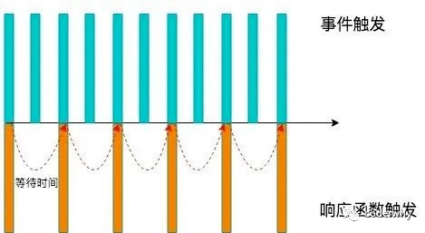

# 31. 手写防抖、节流函数实现

## 1. 认识防抖和节流函数

- 防抖和节流的概念其实最早并不是出现在软件工程中，防抖是出现在电子元件中，节流出现在流体流动中
  - 而 JavaScript 是事件驱动的，大量的操作会触发事件，加入到事件队列中处理。
  - 而对于某些频繁的事件处理会造成性能的损耗，我们就可以通过防抖和节流来限制事件频繁的发生；
- 防抖和节流函数目前已经是前端实际开发中两个非常重要的函数，也是面试经常被问到的面试题。
- 但是很多前端开发者面对这两个功能，有点摸不着头脑：
  - 某些开发者根本无法区分防抖和节流有什么区别（面试经常会被问到）；
  - 某些开发者可以区分，但是不知道如何应用；
  - 某些开发者会通过一些第三方库来使用，但是不知道内部原理，更不会编写；

## 2. 认识防抖 debounce 函数

- 我们用一副图来理解一下它的过程：
  - 当事件触发时，相应的函数并不会立即触发，而是会等待一定的时间；
  - 当事件密集触发时，函数的触发会被频繁的推迟；
  - 只有等待了一段时间也没有事件触发，才会真正的执行响应函数；

- 防抖的应用场景很多：
  - 输入框中频繁的输入内容，搜索或者提交信息；
  - 频繁的点击按钮，触发某个事件；
  - 监听浏览器滚动事件，完成某些特定操作；
  - 用户缩放浏览器的 resize 事件；

## 3. 防抖函数的案例

- 我们都遇到过这样的场景，在某个搜索框中输入自己想要搜索的内容：
- 比如想要搜索一个 MacBook：
  - 当我输入 m 时，为了更好的用户体验，通常会出现对应的联想内容，这些联想内容通常是保存在服务器的，所以需要一次网络请求；
  - 当继续输入 ma 时，再次发送网络请求；
    - 那么 macBook 一共需要发送 7 次网络请求；
    - 这大大损耗我们整个系统的性能，无论是前端的事件处理，还是对于服务器的压力;
- 但是我们需要这么多次的网络请求吗？

  - 不需要，正确的做法应该是在合适的情况下再发送网络请求；
  - 比如如果用户快速的输入一个 macBook，那么只是发送一次网络请求；
  - 比如如果用户是输入一个 m 想了一会儿，这个时候 m 确实应该发送一次网络请求；
  - 也就是我们应该监听用户在某个时间，比如 500ms 内，没有再次触发时间时，再发送网络请求;

- 这就是防抖的操作：只有在某个时间内，没有再次触发某个函数时，才真正的调用这个函数；

## 4. 认识节流 throttle 函数

- 我们用一副图来理解一下节流的过程
  - 当事件触发时，会执行这个事件的响应函数；
  - 如果这个事件会被频繁触发，那么节流函数会按照一定的频率来执行函数；
  - 不管在这个中间有多少次触发这个事件，执行函数的频繁总是固定的；

- 节流的应用场景：
  - 监听页面的滚动事件；
  - 鼠标移动事件；
  - 用户频繁点击按钮操作；
  - 游戏中的一些设计；

## 5. 防抖（Debounce）节流（Throttle）

+ 防抖：事件停止触发后，延迟一段时间执行。（搜索栏）
+ 节流：固定时间间隔内执行一次。（下拉滚动）
