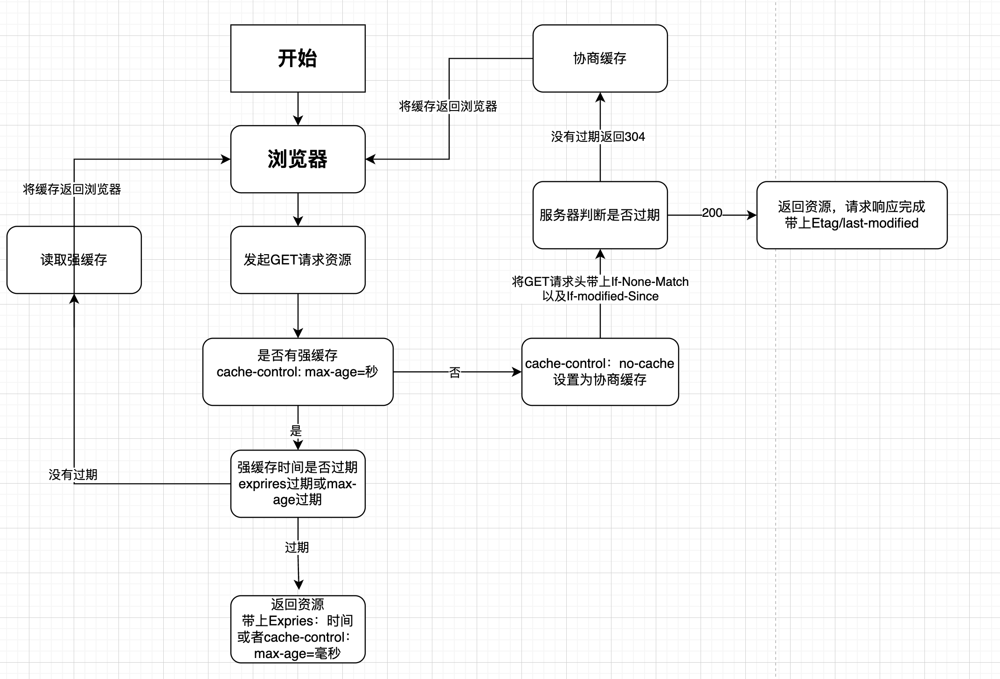

```http
https://www.bilibili.com/video/BV1Jr4y1v7Nc?p=2&vd_source=38069f1a94e1b6f6325abbdc7549927d
```

# Http缓存

http缓存一般分为**强缓存**和**协商缓存**。

## 强缓存

对于强缓存而言，如果浏览器判断所请求的目标资源有效命中，则可直接从强制缓存中返回请求响应，无需与服务器进行任何通信。

```http
access-control-allow-origin: *
age 734978
content-length: 40830
content-type: image/jpeh
cache-control: max-age=31536000
r: Web, 14 Fed 2021 12:23L42 GMT
```

expires是HTTP1.0协议中声明的用来控制缓存失效日期的时间戳字段，由服务器端指定后通过响应头告知浏览器，浏览器在接受到带有该字段的响应体后进行缓存。指定过期明确的时间。

```js
res.writeHead(200, {
  Expires: new Date('2024-3-30 12:12:12').toUTCString()
})
```

expires指定的时间会和客户端本地的时间判断是否过期。严重依赖客户端本地时间，具有局限性，从HTTP1.1开始新增加了`cache-control`字段，单位为秒，更加精准控制过期时间。

```js
res.writeHead(200, {
  // 5秒后过期
  'Cache-Control': 'max-age=5'
})
```

### cache-control其他配置

```text
cache-control: no-cache/no-store

no-cache：进行协商缓存，不会判断强制缓存是否过期，而是直接与服务器协商来验证缓存的有效性，若缓存为过期，则使用本地缓存。等价于max-age=0

no-store：不实用任何缓存策略
```

```text
private：只能被浏览器缓存，默认值

public：可以被浏览器缓存、也可以被代理服务器缓存

例：
Cache-Control: public, max-age=310
```

```text
max-age：客户端过期时长

s-maxage：代理服务器过期时长（只在pubilc下有效）

Cache-Control: public, max-age: 6,s-maxage: 6
```

+ 一般使用Cache-Control就够了，向下兼容才会使用expires。
+ 强缓存的优先级是高于协商缓存。

## 协商缓存

协商缓存就是在使用本地缓存之前，需要**向服务器发起一次GET请求**，与之协商当前浏览器保存的本地缓存是否已经过期。

客户端无法知道缓存是否过期，需要请求一次，向服务器确认有效的协商缓存。而这次请求中，携带的响应头里有`if-modified-since`，这个属性的值来自于上次响应的`last-modified`。浏览器在请求时，会自动将上一次的`last-modified`赋值给`ifmodified-since`。

服务器会根据根据`if-modified-since`与资源最新时间比较，然后时间相同，返回304，表示缓存可用，不行就把新资源返回。

```js
// 1. 首先要先设置为协商缓存
cache-control: no-cache
// 2. 设置last-modified，不设置no-cache，只设置last-modified，浏览器会误认为是强制缓存(可能)
```

```js
const { mtime } = fs.statSync('xxxx')

const ifModifiedSince = req.headers['if-modified-since'] 
if ( ifModifiedSince == mtime.toUTCString() ) {
  // 缓存生效
  res.status = 304
  res.end()
  return
}

const data = fs.readFileSync('xxx')

res.setHeader('Cache-Control', 'no-cache')
res.setHeader('last-modified', mtime.toUTCString())
res.end(data)
```

+ modified：修改的

```http
// 协商缓存命中，返回的结果就是
Status Code: 304 Not Modified。

304表示缓存有效重定向到本地缓存
200表示再次请求响应状态码，返回新的资源
```

### last-modified不足

+ 一般根据资源的最后修改时间戳进行判断，时间戳的变化就会导致协商缓存不想等（比如名字改了又改回去），造成浪费
+ 时间戳的精准单位是秒。对于毫秒的无法验证缓存有效性，没有及时更新资源，导致使用缓存的bug。

### Etag

+ 为了弥补时间戳的不足，HTTP1.1补充了Etag头信息，即实体标签（Entity Tag）
+ 根据资源进行哈希运算生存一个字符串（哈希值）,只要文件内容存在差异，对应Etag标签值就会不同。因此可以对文件的变化更精准的感知。
+ 因为Etag更精准感知文件变化，所以优先级比`last-modified`更高。
+ 上一次的请求返回的Etag值，会作为下一次`if-None-Match`的值，进行请求。

```http
// 请求
If-Modified-Since: .....
If-None-Match: "xxxxxxx"

// 响应
Content-Type: Image/jpeg
Etag: 'xxx'
Last-Modified: xxx
```

+ 若缓存有效，则响应304

```shell
// node可以使用etag包生存etag
npm i etag
```

```js
const etag = require('etag')

const data = fs.readFileSync('xxxx')

const etagContent = etag(data)

const ifNoneMatch = req.headers['if-none-match']

if ( ifNoneMatch === etagContent ) {
  res.statusCode = 304
  res.end()
  return
}

res.setHeader('Cache-Control', 'no-cache')
res.setHeader('etag', etagContent)
rs.end(data)
```

### Etag不足

+ cache-control可以替代expires强缓存设置。但是etag不可以，只能作为last-modified的补充。
+ 生存Etag需要一定的计算开销，文件越大，计算量越大，开销越大。如果频繁请求，反复计算，也会影响性能。
+ Etag分为强验证，必须保证每个字节都相同，弱验证，则根据资源部份属性生存哈希值，那么精准度就会下降。有效性验证的成功率降低。

## 缓存策略

+ html应当及时发生修改及时更新。使用协商缓存
+ 图片可以使用强缓存，但是时间不能太久 max-age = 86400
+ style.css可以强缓存和文件指纹结合使用，样式文件改变的时候，增加样式文件的版本号修改，或者文件名指纹修改，直接会请求信文件。一般可以设置一年缓存。毕竟文件改了， 名称改了，不会去请求旧的缓存。
+ js可以同上。

### 注意事项

+ 拆分源码，分包加载
  + 这样只需要加载修改的源码就够了，增加效率。
+ 隐私资源避免中间代理的缓存，设置private。
+ 不同资源设置成不同的URL。
+ 文件资源的层次结构也会对指定缓存策略一定影响。

## 图

+ etag是last-modified的补充，可以一起传到服务器作为判断。




