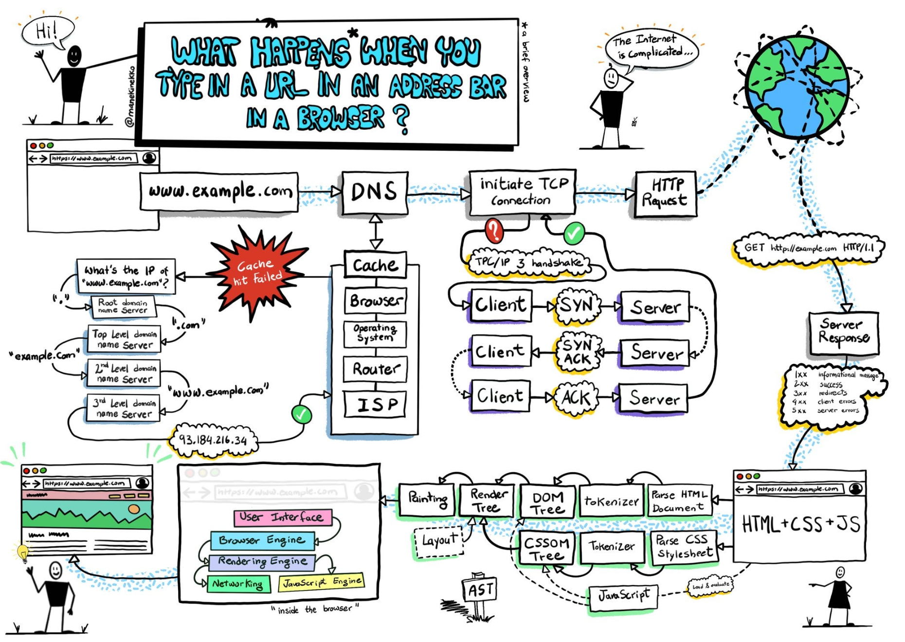
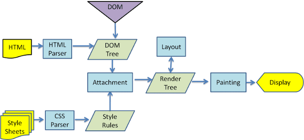

## 0. 浏览器输入一个 URL 并 enter 时，到底发生了什么？



### 1. DNS（Domain Name System）服务器解析过程

- 域名系统，见名知意，把域名地址解析成 主机 IP 地址，这个过程称之为 DNS 解析（域名系统解析）
- **缓存查找过程：**

  - **浏览器缓存**：⾸先，浏览器会检查它的缓存中是否有这个域名的记录，因为之前访问过的⽹址的解析结果可能会被存储在浏览器缓存中。

  - **操作系统缓存**：如果浏览器缓存中没有找到，浏览器会询问操作系统，因为操作系统也可能有⾃⼰的 DNS 缓存。

  - **路由器缓存**：如果操作系统中也没有找到，请求会发送到本地⽹络的路由器，它同样可能有⾃⼰的 DNS 缓存。

  - **ISP（ Internet service provider ）缓存 **：如果以上都没有缓存记录，请求最终会发送到你的**互联⽹服务提供商（ISP）**，它们通常会有更⼤范围的 DNS 缓存。

- **DNS 递归解析：**

  - 如果所有本地缓存查找都失败，DNS 查询就变成了⼀个递归查询过程，涉及到多个 DNS 服务器：

  - **递归解析器**（如 ISP 的 DNS）向根域名服务器发起查询。（递归解析器代理用户查询，向权威服务器获取结果，缓存来自权威服务器的结果、响应任意域名的查询请求。）

  - **根域名服务器**：⾸先，你的 DNS 查询会被发送到根域名服务器。根服务器是最⾼级别的 DNS 服务器，负责重定向到负责管理顶级域名（如.com、.net 等）的顶级域名服务器。（根域名服务器根据结尾的域名返回对应的顶级域名服务器给递归解析器）

  - **顶级域名服务器（TLD 服务器）**：根服务器会告诉你的 ISP（互联网服务供应商） 的 DNS 服务器去查询哪个顶级域名服务器来找到 .com 域的信息。这个服务器掌握所有 .com 域名及其相应服务器的信息。（递归解析器通过顶级域名服务器拿到权威域名服务器）

  - **权威域名服务器**：⼀旦你的 DNS 查询到达了正确的顶级域名服务器，它会进⼀步定向到负责 example.com 的权威服务器。权威服务器有该域名对应的具体 IP 地址。

- **IP 地址的获取：**

  - 最终，权威域名服务器会提供 www.example.com域名对应的IP地址，这个信息会被发送回⽤户的电脑。

### 2. TCP/HTTP 请求

- TCP (Transmission Control Protocol, 传输控制协议)，TCP 是⼀种⾯向连接的协议，⽤于在⽹络中的两个端点之间建⽴可靠的会话。

- TCP 连接建⽴过程，通常称为三次握⼿（TCP 3-way handshake）：

  - SYN**（**Synchronize**）**：（发起同步请求）

    - 客户端发送⼀个 SYN 包到服务器以初始化⼀个连接。

    - 客户端设置⼀个随机的序列号（Seq），告诉服务器它准备开始发送数据。

    - 序列号不仅仅是在握⼿期间使⽤的，后续传输数据也会⽤到，⽤来保证数据的完整性和顺序。

  - SYN-ACK**（**Synchronize-Acknowledgment**）**：

    - 服务器接收到客户端的 SYN 包后，会发送⼀个 SYN-ACK 包作为响应。

    - 服务器同样设置⼀个随机的序列号，并将客户端的序列号加⼀，发送回给客户端，确认已经收到了客户端的同步请求（+1 表示服务器确认收到）。

  - ACK**（**Acknowledgment**）**：

    - 客户端收到服务器的 SYN-ACK 后，发送⼀个 ACK 包作为回应。

    - 这个 ACK 包将服务器的序列号加⼀，并可能包含客户端准备发送的数据的开始部分（⽐如 HTTP 请求⾏ GET /HTTP/1.1 和请求头，这个被称之为 TCP 快速打开）。

    - 此时，TCP 连接已经建⽴，双⽅可以开始数据传输。

### 2.1 为什么需要三次握手？（两次可以吗？）

- **确认双方的收发能力**（第三次可以检查客户端的接收能力）

- **初始序列号同步**

  - 客户端会发送自己的处事序列号发送给服务器，服务器会根据客户端的序列号加 1，同时生成自己的初始序列号一起发送客户端

  1. **客户端 → 服务器**：`SYN`（`seq=1000`）。（1000 是客户端序列号）
  2. **服务器 → 客户端**：`SYN-ACK`（`seq=5000`, `ack=1001`）。（5000 是服务端序列号）
  3. **客户端 → 服务器**：`ACK`（`ack=5001`）。

  4. 后续通信
     - 客户端发送数据：`seq=1001`, `seq=1001+数据长度`, ...
     - 服务器发送数据：`seq=5001`, `seq=5001+数据长度`

  - 实现可靠传输（排序、去重、流量控制、确认重传）。

- **防止历史连接初始化**

  - 如果网络比较差，客户端发送多次 SYN 包，两次握手下，意味着每次得到 SYN 包都直接建立连接，但是对于客户端得到的 SYN-ACK 不对的话，还要发送取消连接，相当于服务器建立了多个无效连接，同时客户端还要发送取消连接，都是一种资源浪费。

### 3. 发送 HTTP 请求

- HTTP (Hypertext Transfer Protocol, 超⽂本传输协议)，它是建⽴在 TCP 连接之上的应⽤层协议。

- **客户端请求**：

  - ⼀旦 TCP 连接建⽴，客户端（通常是 Web 浏览器）就可以通过这个连接发送⼀个 HTTP 请求到服务器。

  - 这个请求包含了⽅法（GET、POST 等）、URI（统⼀资源标识符）和协议版本，以及可能包含的请求头和请求体。

- **服务器响应：**
- 服务器接收到 HTTP 请求后，会处理这个请求并返回⼀个 HTTP 响应。

  - 响应通常包括⼀个状态码（如 200 表示成功，404 表示未找到），响应头，以及任何响应内容（如请求的 HTML ⽂件）。

- **TCP 为 HTTP 提供了⼀个可靠的通道，确保数据正确、完整地从服务器传输到客户端。**

### 4. 浏览器渲染过程

> 浏览器内核指的是浏览器的排版引擎。
>
> 排版引擎（layout engine），也称为浏览器引擎（browser engine）、⻚⾯渲染引擎（rendering engine）或样版引擎。
>
> ⽹⻚下载下来后，就是由我们的渲染引擎来帮助我们解析的。
>
> https://web.dev/articles/howbrowserswork?hl=zh-cn#css2_visual_model



**解析⼀：HTML 解析过程**

- 因为默认情况下服务器会给浏览器返回 index.html ⽂件，所以解析 HTML 是所有步骤的开始。
- 解析 HTML，会构建 DOM Tree

**解析⼆：⽣成 CSS 规则**

- **浏览器在开始解析前，会启动一个预解析的线程（预加载扫描器），率先下载 HTML 中的外部 CSS 文件和 外部的 JS 文件**（在解析的过程中就会提前启动一个扫描器，把 css、js 文件下载起来）
- css 的解析是在单独的预解析线程处理，所以 css 的下载和解析都不会阻塞 HTML 解析，最终生成 CSSOM（CSS Object Model，CSS 对象模型）
- js 的解析，在 HTML 遇到 script 时候开始，会阻塞 HTML 的解析

**解析三：构建 Render Tree**

- link 元素不会阻塞 DOM Tree 的构建过程，但是会阻塞 Render Tree 的构建过程，这是因为 Render Tree 在构建时，需要对应的 CSSOM Tree
- Render Tree 和 DOM Tree 并不是⼀⼀对应的关系，⽐如对于 display 为 none 的元素，压根不会出现在 render tree 中

**解析四 ：布局（layout）和绘制（Paint）**

- 根据渲染树，去掉不需要显示的部分，得到了 Layout 布局树，然后进行绘制。

- 在渲染树（Render Tree）上运⾏布局（Layout）以计算每个节点的⼏何体
- 渲染树会表示显示哪些节点以及其他样式，但是不表示每个节点的尺⼨、位置等信息；
- 布局是确定呈现树中所有节点的宽度、⾼度和位置信息；
- 在绘制阶段，浏览器将布局阶段计算的每个 frame（骨架）转为屏幕上实际的像素点；
- 包括将元素的可⻅部分进⾏绘制，⽐如⽂本、颜⾊、边框、阴影、替换元素（⽐如 img）

### 5. 回流（reflow、重排）和重绘（repaint）

- 第⼀次确定节点的⼤⼩和位置，称之为布局（layout）
- 之后对节点的⼤⼩、位置修改重新计算称之为回流：

  - ⽐如 DOM 结构发⽣改变（添加新的节点或者移除节点）；
  - ⽐如改变了布局（修改了 width、height、padding、font-size 等值）
  - ⽐如窗⼝ resize（修改了窗⼝的尺⼨等）
  - ⽐如调⽤ getComputedStyle ⽅法获取尺⼨、位置信息；（调用这个方法也会触发 reflow）

- 第⼀次渲染内容称之为绘制（paint）。
- 之后重新渲染称之为重绘。

  - ⽐如修改背景⾊、⽂字颜⾊、边框颜⾊、样式等；
  - ⽐如修改阴影，box-shadow、text-shadow 等；
  - ⽐如修改背景图像：background-image 等

- **回流⼀定会引起重绘，所以回流是⼀件很消耗性能的事情**
  - 修改样式时尽量⼀次性修改
  - 尽量避免频繁的操作 DOM
  - 尽量避免通过 getComputedStyle 获取尺⼨、位置等信息；
    - 频繁调⽤ getComputedStyle 可以导致回流，因为浏览器需要提供准确的计算值。
  - 对某些元素使⽤ position 的 absolute 或者 fixed
    - 并不是不会引起回流，⽽是开销相对较⼩，不会对其他元素造成影响。

### 6. composite 合成

- CompositingLayer（新的合成层）：在特定情况下，可以创建新的合成层，并且新的图层可以利用 GPU 来加速绘制也可以提供性能。
- 默认情况下，标准流中的内容都是被绘制在同⼀个图层（Layer）中的；
- ⽽⼀些特殊的属性，会创建⼀个新的合成层（ CompositingLayer ），并且新的图层可以利⽤ GPU 来加速绘制；
  - 因为每个合成层都是单独渲染的；
  - 因此绘制的过程，可以将布局后的元素绘制到多个合成图层中。（以此提升性能）
- 哪些属性可以形成新的合成层呢？
  - 3D transforms
  - video、canvas、iframe
  - opacity 动画转换时；
  - position: fixed
  - will-change：⼀个实验性的属性，提前告诉浏览器元素可能发⽣哪些变化；
  - animation 或 transition 设置了 opacity、transform；
- 分层确实可以提⾼性能，但是它以内存管理为代价，因此不应作为 web 性能优化策略的⼀部分过度使⽤。

### 7. 总结

在⽤户在浏览器中输⼊⼀个 URL，并且按下 enter 键时，⾥⾯包含了⾮常多的技术细节。

第⼀，DNS 解析：

- ⽤户输⼊的 URL 通常会是⼀个域名地址，直接通过域名是⽆法找到服务器的，因为服务器本质上是⼀套拥有 IP 地址的主机。

- 我们需要通过 DNS 服务器来解析域名，并且获取 IP 地址。

- DNS 会查找缓存，缓存的查找包括浏览器缓存、操作系统缓存、路由器缓存、ISP 缓存，如果在缓存中找到就可以使⽤对应的 IP 地址去连接主机。

- 如果缓存查找失败，我们需要通过 DNS 递归解析，解析过程包括根域名服务器、顶级域名服务器、权威域名服务器。

- 最终找到 IP 地址，就可以通过该 IP 地址去连接服务器，并且 IP 地址信息会被发送回⽤户的电脑，缓存起来。

第⼆，TCP 连接：

- 虽然我们是发送的 HTTP 请求，但是 HTTP 协议是应⽤层协议，它是建⽴在 TCP 传输层协议之上的，所以我们需要先进⾏ TCP 连接。

- TCP 的连接会经常三次握⼿，客户端发送 SYN 包，服务器接收到后返回⼀个 SYN-ACK 包，客户端再次发送⼀个 ACK 包，完成握⼿过程。

- 此时 TCP 连接建⽴完成，双⽅就可以开始传输数据了。

第三，HTTP 请求：

- ⼀旦 TCP 建⽴连接成功，客户端就可以通过这个链接发送 HTTP 请求，包括请求⽅法、URI、协议版本、请求头、请求体。

- 服务器收到 HTTP 请求后，会处理这个请求，并且返回⼀个 HTTP 响应。

- HTTP 响应包括状态码、响应头、响应内容，我们这⾥请求的通常是 index.html ⽂件。

第四，HTML 解析和 CSS 解析：

- 浏览器在获取到 index.html 后可以开始对⽂档进⾏解析。

- 包括 HTML 解析来构建 DOM Tree，在这个过程中它会遇到 CSS ⽂件和 JS ⽂件。

- 遇到 CSS 和 JS ⽂件会继续向服务器发送 HTTP 请求，并且下载 CSS、JS ⽂件。

- 之后对 CSS ⽂件进⾏解析，解析出对应的 CSSOM（CSS Object Model）。JS ⽂件会由 JavaScript 引擎来执⾏，我们后续可以再讨论。

第五，渲染 render、布局 layout、绘制 paint：

- DOM Tree 和 CSSOM 可以共同来构建 Render Tree。

- 之后会在 Render Tree 上运⾏布局 layout 计算每个阶段的⼏何体。

- 再由浏览器将每个阶段绘制 paint 到屏幕上的像素点。

第六，composite 合成：

- 这⾥还有⼀个优化的⼿段是将元素绘制到多个合成图层中。

- 默认情况下，标准流中的内容是被绘制到同⼀个图层（Layer）中的。

- 我们可以通过⼀些特定的⽅法来创建新的合成层（CompositingLayer），新的图层可以利⽤ GPU 来加速绘制。

- ⽐如我们通过 3D Transforms/video/canvas/iframe/position: fixed/will-change 等

- 但是分层确实可以提供性能，但是它是以内存管理为代价的。

这样⽤户最终就看到了我们屏幕上显示的⽹⻚。当然这个过程中还有更多的细节，包括重绘、回流的问题，包括 JavaScript 的执⾏过程、JavaScript 引擎（⽐如 V8 引擎）等知识，我这边也可以继续进⾏扩展讨论。

## 1. 将 JavaScript ⽂件防⽌在 HTML ⽂档的不同位置（如头部和尾部）对加载和执⾏的影响。

- 这个主要考察 JavaScript 的下载和执⾏会阻塞 DOM Tree 的构建，另外你在回答的时候可以主动引出 defer、async，显示你知识⾯的深度和⼴度。

- 通常在开发中，JavaScript 元素的编写位置我们会放在头部或者尾部，它们是会有区别的。

- 情况⼀：普通 JavaScript 放在头部

  - 当 JavaScript ⽂件放置在⽂档的头部时，浏览器在解析 HTML 到达 <script>标签时会暂停，进⾏脚本的下载和执⾏。

  - 这意味着，直到 JavaScript 执⾏完成，⻚⾯的其余部分（如 HTML 和 CSS）才会继续加载。

  - 这种做法通常会导致可⻅的延迟，尤其是当脚本⽂件较⼤或⽹络条件较差时。

  - 另外如果涉及到 DOM 元素操作，因为 DOM 还没有构建完成，所以操作 DOM 可能会失败，也需要慎重操作。

- 情况⼆：普通 JavaScript 放到尾部

  - 将 JavaScript 放在⻚⾯底部是⼀种常⻅的做法，以提⾼⻚⾯的加载速度。

  - 这样，浏览器可以先加载⻚⾯的所有 HTML 和 CSS 内容，使⽤户尽快看到⻚⾯的结构和样式，⽽脚本将在⻚⾯的内容完全加载之后才开始下载和执⾏。

  - 这种⽅法通常可以提⾼⾸次渲染时间和⽤户感知的加载速度。

  - 当 JavaScript 放置在⻚⾯的底部时，它将在⼤部分或全部 DOM 元素已经加载后执⾏，从⽽减少了因 DOM 元素尚未加载⽽导致的错误。

- 我们可以结合前⾯学习 defer 和 async 来回答：

  - 为了进⼀步提升性能，现代的开发实践中常常利⽤ async 和 defer 属性。

  - defer 属性让脚本的下载与 DOM 解析同步进⾏，但延迟到整个⻚⾯解析完成后再执⾏。

  - async 属性允许浏览器异步下载脚本，⽽不阻塞 DOM 的解析，脚本会在下载完后⽴即执⾏。

  - 这两种属性都有助于优化加载时间和⽤户体验，选择使⽤哪⼀种取决于脚本的具体作⽤和需求。

## 2. 解释CSS⽂件是如何被浏览器解析并应⽤到⽹⻚上的

+ **下载CSS⽂件：**当浏览器遇到⼀个 `<link>`标签或 @import 指令引⽤的CSS⽂件时，它会⾸先下载这个⽂件。

+ **解析CSS：**下载完成后，浏览器会解析CSS⽂件内容，将CSS代码转换成浏览器可以理解和使⽤的结构。
  + 这⼀结构通常称为CSS对象模型（CSSOM）；

+ **构建渲染树：**当DOM和CSSOM都构建完毕后，浏览器将这两者结合起来形成渲染树。
  + 渲染树只包含实际要渲染的节点，并且每个节点都有相应的CSS样式信息。

+ **布局layout：**⼀旦渲染树构建完成，浏览器会进⾏布局。
  + 在这个过程中，浏览器会计算每个节点的确切位置和⼤⼩。布局的结果依赖于渲染树中的节点以及它们的样式。

+ **绘制Paint：**布局完成后，下⼀步是绘制，即浏览器将渲染树中的每个节点转换为屏幕上的实际像素。
  + 这包括绘制⽂本、颜⾊、图像、边框等视觉效果。

+ **合成Composite：**某些元素可能需要在单独的层上进⾏绘制和合成。
  + 独的合成层通常⽤于优化性能，特别是在动画和⾼频变化的元素上，因为它们可以在不影响⻚⾯其他部分的情况下独⽴更新。

---

## 0. 技巧

```js
// 通过dir的方式可以打印html对象
// 因为浏览器控制台会对html对象展示做一个转化
console.dir(document);
```

## 2. 概念

- 事实上解析 HTML 生成的 DOM 树（Document Object Model）和 CSS 树（Css Object Model）都是对象属性。目的方便 js 对象 DOM 进行操作
- 渲染其实就是拿到 HTML 字符串，通过层层操作，变成每个位置的像素点信息渲染到屏幕
- **光栅化（Rasterization）** 是计算机图形学中将 **矢量图形（如几何形状、文字）转换为像素（位图）** 的过程

## 3. Css 代码处理

为了提高解析效率，浏览器在开始解析前，会启动一个预解析的线程，率先下载 HTML 中的外部 CSS 文件和 外部的 JS 文件。

## 4. 浏览器是如何渲染页面的？

当浏览器的网络线程收到 HTML 文档后，会产生一个渲染任务，并将其传递给渲染主线程的消息队列。

在事件循环机制的作用下，渲染主线程取出消息队列中的渲染任务，开启渲染流程。

---

整个渲染流程分为多个阶段，分别是： HTML 解析、样式计算、布局、分层、绘制、分块、光栅化、画

每个阶段都有明确的输入输出，上一个阶段的输出会成为下一个阶段的输入。

这样，整个渲染流程就形成了一套组织严密的生产流水线。

---

渲染的第一步是**解析 HTML**。（得到 DOM 树和 CSS 树）

解析过程中遇到 CSS 解析 CSS，遇到 JS 执行 JS。为了提高解析效率，**浏览器在开始解析前，会启动一个预解析的线程，率先下载 HTML 中的外部 CSS 文件和 外部的 JS 文件。**

如果主线程解析到`link`位置，此时外部的 CSS 文件还没有下载解析好，主线程不会等待，继续解析后续的 HTML。这是因为**下载和解析 CSS 的工作是在预解析线程中进行的**。这就是 CSS 不会阻塞 HTML 解析的根本原因（解析 HTML 和解析 CSS 是分开在不同线程的）。如果解析完成 Css，就会合并到主线程中。

利用预解析 CSS 的目的是为了提高渲染效率。（所以即使 css 文件下载失败了，也能看到页面 DOM 结构）

如果主线程解析到`script`位置，会停止解析 HTML，转而等待 JS 文件下载好，并将全局代码解析执行完成后，才能继续解析 HTML。这是因为 JS 代码的执行过程可能会修改当前的 DOM 树，所以 DOM 树的生成必须暂停。这就是 JS 会阻塞 HTML 解析的根本原因。

第一步完成后，会得到 DOM 树和 CSSOM 树，浏览器的默认样式、内部样式、外部样式、行内样式均会包含在 CSSOM 树中。

---

渲染的下一步是**样式计算**。（得到有样式的 DOM 树）

主线程会遍历得到的 DOM 树，依次为树中的每个节点计算出它最终的样式，称之为 Computed Style。

在这一过程中，很多预设值会变成绝对值，比如`red`会变成`rgb(255,0,0)`；相对单位会变成绝对单位，比如`em`会变成`px`

这一步完成后，会得到一棵带有样式的 DOM 树。

---

接下来是**布局**，布局完成后会得到布局树。

布局阶段会依次遍历 DOM 树的每一个节点，计算每个节点的几何信息。例如节点的宽高、相对包含块的位置。

大部分时候，DOM 树和布局树并非一一对应。

比如`display:none`的节点没有几何信息，因此不会生成到布局树；又比如使用了伪元素选择器，虽然 DOM 树中不存在这些伪元素节点，但它们拥有几何信息，所以会生成到布局树中。还有匿名行盒、匿名块盒等等都会导致 DOM 树和布局树无法一一对应。

---

下一步是**分层**

主线程会使用一套复杂的策略对整个布局树中进行分层。

分层的好处在于，将来某一个层改变后，仅会对该层进行后续处理，从而提升效率。

滚动条、堆叠上下文、transform、opacity 等样式都会或多或少的影响分层结果，也可以通过`will-change`属性更大程度的影响分层结果。

---

再下一步是**绘制**

主线程会为每个层单独产生绘制指令集，用于描述这一层的内容该如何画出来。

---

完成绘制后，主线程将每个图层的绘制信息提交给合成线程，剩余工作将由合成线程完成。

合成线程首先对每个图层进行分块，将其划分为更多的小区域。

它会从线程池中拿取多个线程来完成分块工作。

---

分块完成后，进入**光栅化**阶段。

合成线程会将块信息交给 GPU 进程，以极高的速度完成光栅化。

GPU 进程会开启多个线程来完成光栅化，并且优先处理靠近视口区域的块。

光栅化的结果，就是一块一块的位图

---

最后一个阶段就是**画**了

合成线程拿到每个层、每个块的位图后，生成一个个「指引（quad）」信息。

指引会标识出每个位图应该画到屏幕的哪个位置，以及会考虑到旋转、缩放等变形。

变形发生在合成线程，与渲染主线程无关，这就是`transform`效率高的本质原因。

合成线程会把 quad 提交给 GPU 进程，由 GPU 进程产生系统调用，提交给 GPU 硬件，完成最终的屏幕成像。

## 什么是 reflow？

reflow 的本质就是重新计算 layout 树。

当进行了会影响布局树的操作后，需要重新计算布局树，会引发 layout。

为了避免连续的多次操作导致布局树反复计算，浏览器会合并这些操作，当 JS 代码全部完成后再进行统一计算。所以，改动属性造成的 reflow 是异步完成的。

也同样因为如此，当 JS 获取布局属性时，就可能造成无法获取到最新的布局信息。

浏览器在反复权衡下，最终决定获取属性立即 reflow。

## 什么是 repaint？

repaint 的本质就是重新根据分层信息计算了绘制指令。

当改动了可见样式后，就需要重新计算，会引发 repaint。

由于元素的布局信息也属于可见样式，所以 reflow 一定会引起 repaint。

## 为什么 transform 的效率高？

因为 transform 既不会影响布局也不会影响绘制指令，它影响的只是渲染流程的最后一个「draw」阶段

由于 draw 阶段在合成线程中，所以 transform 的变化几乎不会影响渲染主线程。反之，渲染主线程无论如何忙碌，也不会影响 transform 的变化。
