```https
https://bytedance.larkoffice.com/file/LU06bKDAkoRekaxxUm4cPqRGnOe
```

## 网站基本组成及漏洞定义

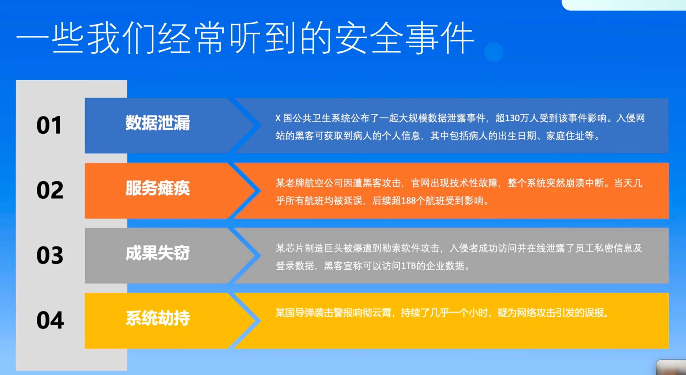

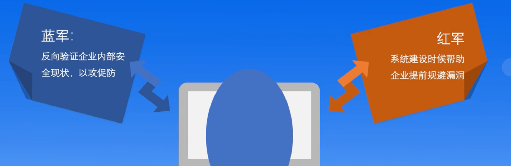

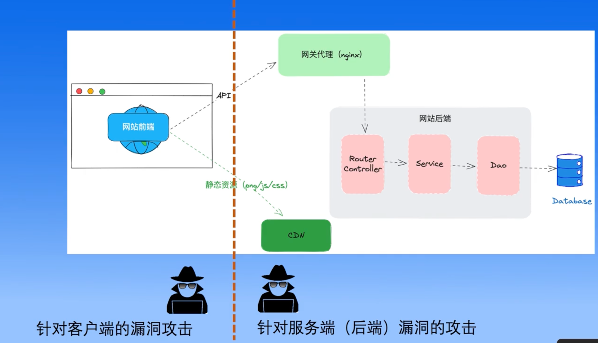

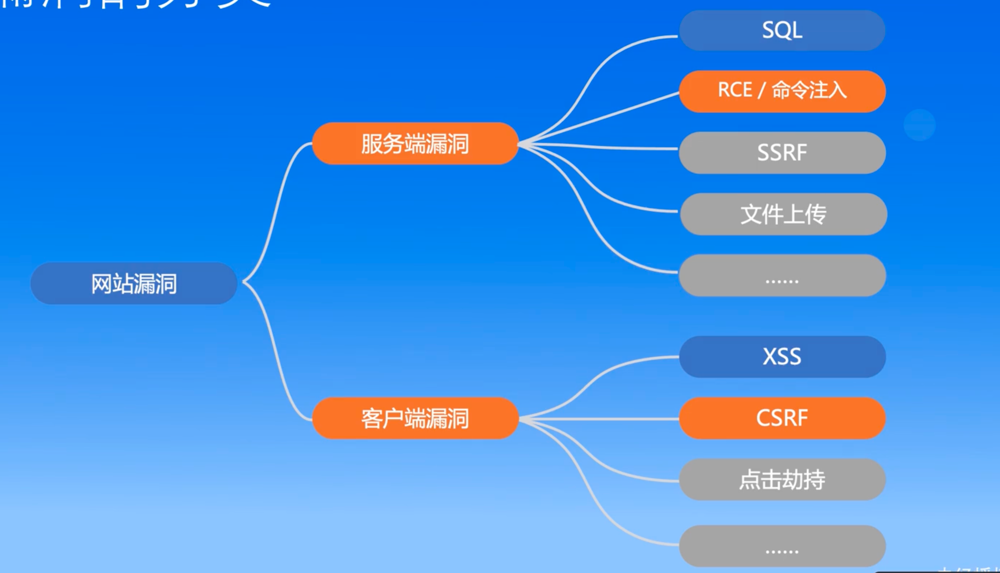

## 服务端漏洞介绍

### 第三方组件漏洞

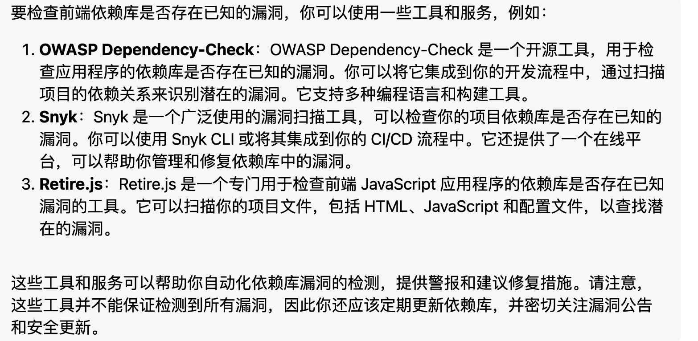

### SQL注入


举个例子就是：动态的sql语句拼接变量的时候，变量本身就是一个sql语句字符串，导致执行了意料之外的sql语句。

orm框架本身存在安全性。

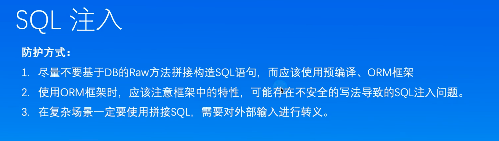

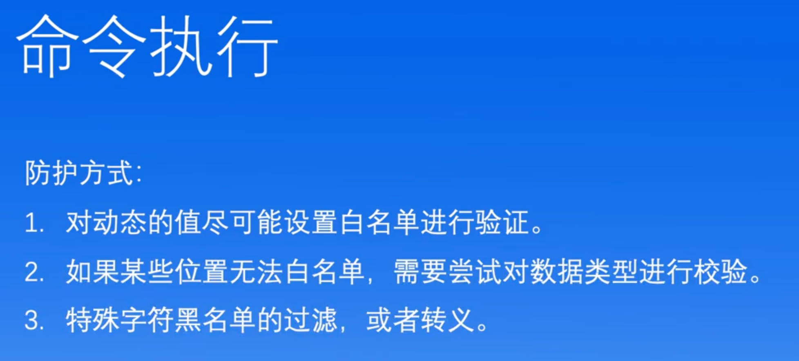

### 越权漏洞

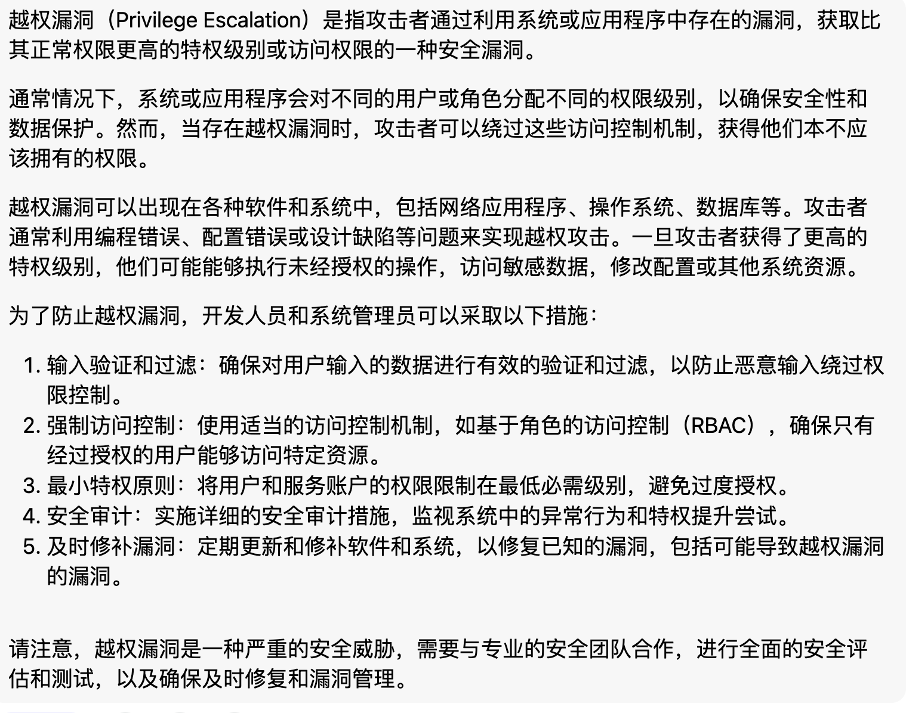

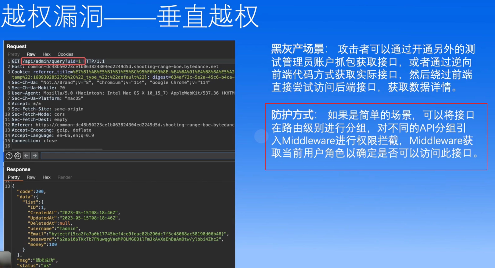

### SSRF（服务端请求伪造）

SSRF（Server-Side Request Forgery），即**服务端请求伪造**，是一种由攻击者构造形成由服务端发起请求的一个安全漏洞。一般情况下，**SSRF 攻击的目标是从外网无法访问的内部系统。**

SSRF 形成的原因大都是由于服务端提供了从其他服务器应用获取数据的功能且没有对目标地址做过滤与限制。比如从指定 URL 地址获取网页文本内容，加载指定地址的图片，下载等等。攻击者可根据程序流程，使用应用所在服务器发出攻击者想发出的 http 请求，利用该漏洞来探测生产网中的服务，可以将攻击者直接代理进内网中，可以让攻击者绕过网络访问控制，可以下载未授权的文件，可以直接访问内网，甚至能够获取服务器凭证。

SSRF 带来的危害有：

- 可以对外网、服务器所在内网、本地进行端口扫描，获取一些服务的 banner 信息;
- 攻击运行在内网或本地的应用程序（比如溢出）;
- 对内网 web 应用进行指纹识别，通过访问默认文件实现;
- 攻击内外网的 web 应用，主要是使用 get 参数就可以实现的攻击（比如 struts2，sqli 等）;
- 利用 file 协议读取本地文件等。

通用的解决方案有：

1. 过滤返回信息。验证远程服务器对请求的响应是比较容易的方法。如果 web 应用是去获取某一种类型的文件，那么在把返回结果展示给用户之前先验证返回的信息是否符合标准；
2. 统一错误信息，避免用户可以根据错误信息来判断远端服务器的端口状态；
3. 限制请求的端口为 http 常用的端口，比如 80, 443, 8080, 8090；
4. 白名单内网 ip。避免应用被用来获取获取内网数据，攻击内网；
5. 禁用不需要的协议。仅仅允许 http 和 https 请求。可以防止类似于file:///,gopher://,ftp:// 等引起的问题。

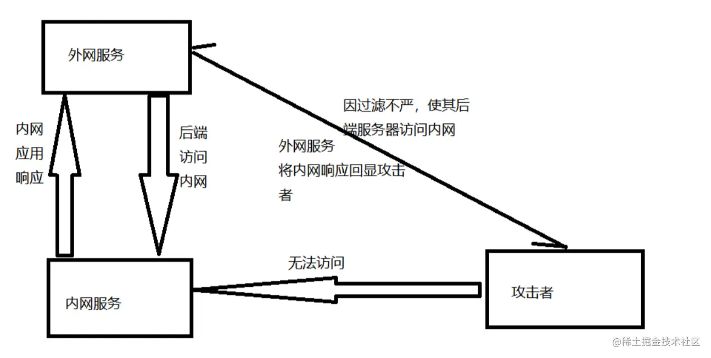

大白话就是，攻击者利用外网服务器进行请求伪造，然后外网服务器访问内网过程中泄露信息

### 文件上传 漏洞

+ 解释性语言，上传脚本，假如执行，造成的漏洞
+ 为了访问快点，我们会部署CDN，用户上传恶意文件图片，进行宣传推广，达到薅羊毛的效果。

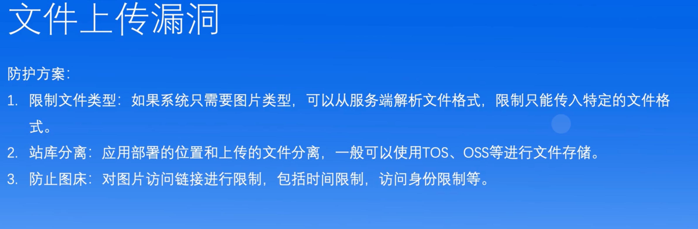

## 客户端漏洞

客户端的漏洞往往依赖服务端修复

### 开放重定向

说白了，指定跳回的网站如果是恶意网站的话，携带关键信息回去后，存在泄露信息风险

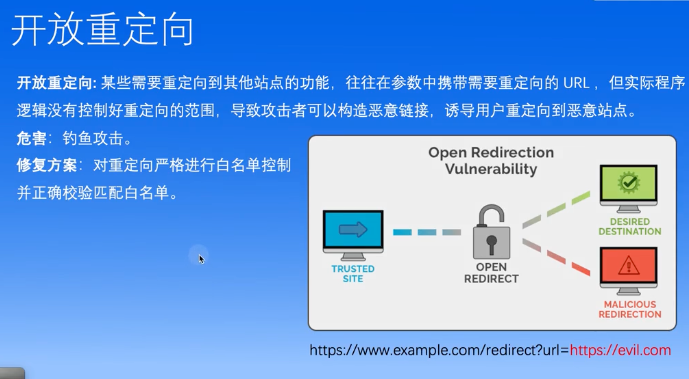

### XSS（跨站脚本攻击）

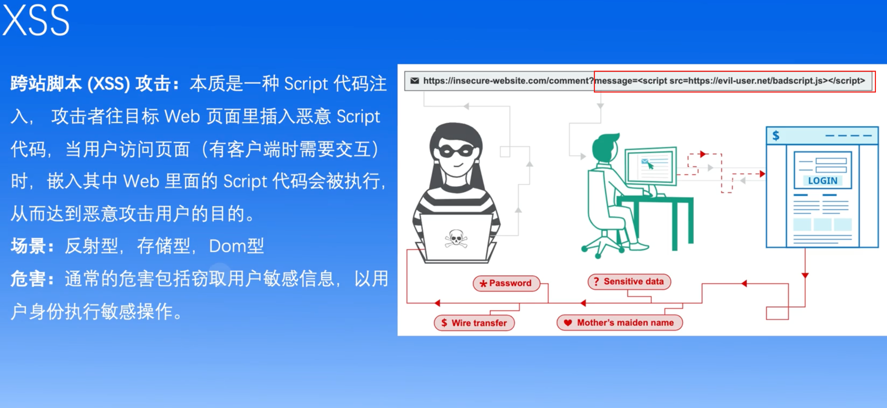

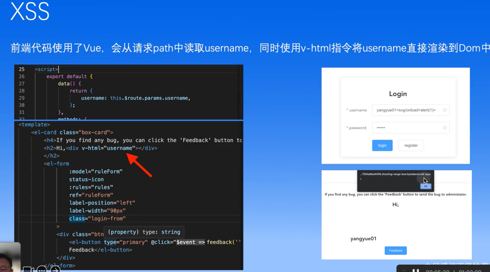

### CSRF


