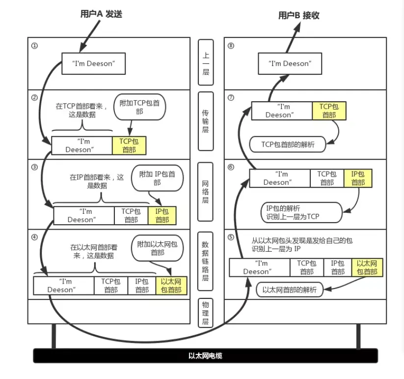
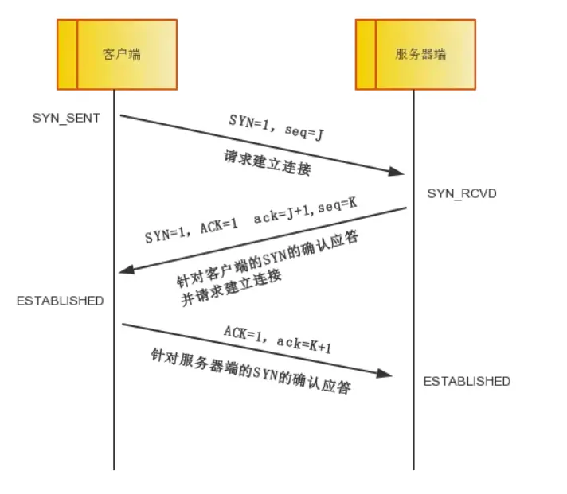
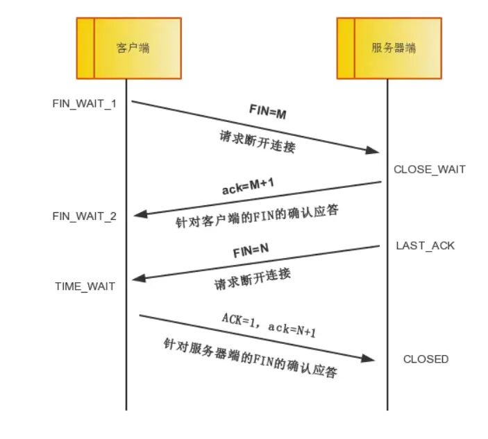

+ https默认端口好443，http端口号80
+ **套接字socket**就是**ip地址**拼上**端口号**

+ TCP是全双工的，TCP三次握手后，客户端和服务端可以互发信息。
+ TCP 提供面向有连接的通信传输，面向有连接是指在传送数据之前必须先建立连接，数据传送完成后要释放连接。



## 问题一：TCP三次握手（重点）

## 一些概念

+ SYN，ACK，FIN标识，默认0，即关闭，1表示开启
  + ACK和ack是有区别的。ACK表示TCP首部标识位，ack表示头部的确认号Acknowledge number。一般两者一起携带，ACK =1，ack = seq + 1
+ synchronzation 【*/*ˌsɪŋkrənaɪˈzeɪʃ(ə)n*/*】同步的
  + SYN：表示TCP中表示客户端想和服务端数据同步。
+ sequence【*/*ˈsiːkwəns*/*】顺序
  + seq：报文里携带了SYN、还有Sequence序号（随机生成），后续作为判断的初始值
  + Sequence Number：序列号
+ acknowledgment，确认
  + ack：拿到需要确认的报文中seq，并加1作为确认号发出。
+ FIN： finish 完成，TCP中表示完成数据发送，想要断开
+ RST：连接复位。重制



+ **第一次握手：**客户端主动发起请求，将SYN设为1，表示想要进行同步，然后生成一个随机的序列号值seq，保存在TCP首部。指明想要连接的服务器端口号，将数据包发送到服务器，客户端进入 SYN_SENT 状态，等待服务器确认

+ **第二次握手：**服务器收到数据包，SYN、ACK设为1，拿到客户端发送的序列号加一，设为ack的值，然后根据服务器IP端口等，生成一个序列号seq。然后发送，进入 SYN_RCVD 状态
+ **第三次握手：**客户端收到数据包，进行检查，没有问题，就会返回ACK、同理，拿到服务器返回的seq，加一作为ack的值，发送。服务器收到后，检查成功就算连接成功。两端进入 ESTABLISHED（建立）。

+ 两端就可以互相传输数据
+ 前两次握手，一进一出，已经能够确认客户端和服务端都有接受和发送的能力。第三次为了客户端去确认服务端建立连接的可靠性。

## 问题二：为什么需要三次握手？

**为什么需要三次握手？为什么不能两次握手？**

假如没有三次握手，意味着服务器收到客户端的SYN同步信息后，发送ACK确认后，直接进去连接状态。如果没有网络阻塞之类的还好。能够正常传输。

但是如果存在某个连接在某个网络节点长时间滞留，客户端认为该连接失效，重新发送新的连接请求。之后旧的连接传输到服务器，服务器并不知道这是失效的，发送ACK，就进入连接状态，客户端不会理睬这个过时的响应，也不会为由旧的连接请求建立的运输连接，发送数据，服务端缺什么也不知道，一直建立连接等待数据，就造成了服务端的浪费。

因此我们需要第三次握手，由客户端去确认服务端接收到建立连接的请求的可靠性。

本质上三次握手的目的就是为了在不可靠的网络进行可靠的传输。

**避免重复建立链接**

## 问题三：TCP四次挥手？



+ TCP是全双工的，客户端和服务端都可以主动申请断开连接。这也意味着两边的关闭是需要单独进行的。假设客户端主动申请关闭。
+ **第一次挥手：**客户端设置FIN=1，序列号seq，发送服务端。客户端主动请求关闭，说明客户端的数据已经发送完了，不在发送数据，进入FIN_WAIT_1。

+ **第二次挥手：**服务端收到后，返回ACK，ack，表示确认客户端关闭，此时服务端还可以继续发送没发送完的数据。
+ **第三次挥手：**服务端发完数据，就可以发送FIN，表示服务端关闭连接。
+ **第四次挥手：**客户端收到服务端的关闭请求，返回ACK，ack表示确认，服务端收到后就关闭。客户端进入TIME_WAIT状态，然后等待2MSL后，没有收到其他回复，就关闭。

## 问题四：为什么连接的时候是三次握手，关闭的时候却是四次握手？

三次握手才可以阻止重复历史连接的初始化（主要原因）：三次握手就够了，前两次检验两端的有效性，包括接受能力，最后一次检验建立连接的可靠性。如果是旧历史，就会发送RST给服务端，中止旧的。进而减少资源浪费。并且带三次握手保证了双发的初始序列号都被确认。

- 三次握手才可以阻止重复历史连接的初始化（主要原因）
- 三次握手才可以同步双方的初始序列号
- 三次握手才可以避免资源浪费

四次挥手，是因为TCP是全双工，两端都可以发送数据，因此都需要单独关闭。每一端都要主动发出关闭，并接受另一端的确认。

## 问题五：为什么要等2MSL？

+ msl表示报文段在网络中生成的最大时间单位。

+ **保证TCP协议的全双工连接能够可靠关闭**，因为网络的不确定性和不可靠性，最后一次挥手，一端没有收到你的关闭确认，就会重新发送请求关闭，而这时候，你已经关闭了，无法作出应答，另一段就会一直发送请求关闭。因此需要等待，保证另一段能拿到响应，正确关闭，然后自己再closed。
+ **保证这次连接的重复数据段从网络中消失**，假如我们客户端马上关闭，再马上申请建立TCP连接，可能会出现新连接和旧连接报文相同，而在之前，网络中可能还存在旧的数据滞留，并正在前往另一段，这时候，新旧连接都发到了服务端，就存在脏数据。

```http
https://juejin.cn/post/6844904070000410631?searchId=20240319130755DA7CB638470B8C9777E6

还没总结的：
https://www.zhihu.com/question/429915921/answer/2682855827

https://www.bilibili.com/video/BV1kV411j7hA/?spm_id_from=333.337.search-card.all.click&vd_source=38069f1a94e1b6f6325abbdc7549927d

https://www.bilibili.com/video/BV18h41187Ep/?spm_id_from=333.337.search-card.all.click&vd_source=38069f1a94e1b6f6325abbdc7549927d

https://www.bilibili.com/video/BV1Fx421k7ND/?spm_id_from=333.337.search-card.all.click&vd_source=38069f1a94e1b6f6325abbdc7549927d
```


