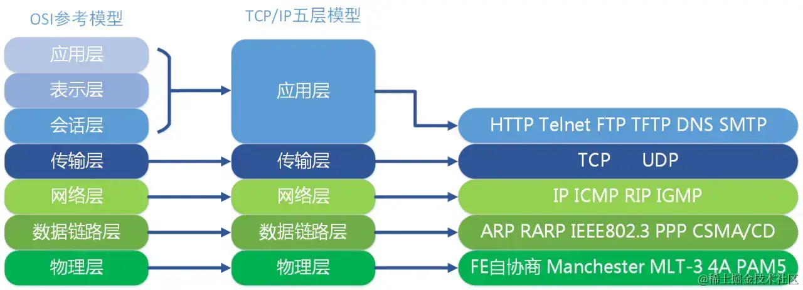

```http
https://juejin.cn/post/7313758022486310951
```

## 1. HTTP是什么？

+ 超文本传输协议
+ 超文本：比普通文本更复杂的数据，可以是图片、图片、音频结合体
+ 传输：从某处传递信息到另一处
+ 协议：规范
+ 总结：就是计算机里将文字、图片等传递到另一处的规范

## 2. HTTP特点

**无状态、无连接、可靠传输、灵活可拓展。**

+ 无状态：两端都不会保存对方的信息，互不认识。
+ 无连接：HTTP1.1之前，传输完成数据之后，就会断开，HTTP1.1之后可以建立长连接。
+ 可靠传输：HTTP基于TCP/IP的协议，TCP本事是可靠安全传输协议。
+ 灵活可拓展：增加了请求方法、状态码，而且支持Content-Type传输其他数据类型

## 3. HTTP报文哪些组成

+ HTTP报文一般分为请求报文和响应报文

**请求报文**

`请求报文`一共由`请求行`、`请求头`、`空行`、`请求体`四部分组成；

- `请求行`中包括了`请求方法`、`请求地址`、`HTTP协议版本号`等信息；
- `请求头`中包括了许多由`key: value`（键值对）组成的`请求附加信息`；（比如Date、If-None-match、Content-type......）
- `空行`就是`没有任何信息的空行`，协议中规定请求头和请求主体间必须用一个空行隔开，用来`区分`请求头与请求体，因为请求头都是`key:value`的格式，当解析遇到空行时，服务端就知道下一个不再是请求头部分，就该当作请求体来解析了；(用来上下分割)
- `请求体`就是我们发起请求时的一些`参数信息`，一般只有在`非get`请求中才需要`请求体`；

**响应报文**

`响应报文`一共由`响应行（状态行）`、`响应头`、`空行`、`响应体`四部分组成；

- `响应行`中包括了`HTTP协议版本号`、`请求状态码`、`状态码的英文符号`；
- `响应头`和请求头类似，都是以`key: value`的形式存在，是响应返回的一些`附加信息`；
- `空行`的作用就是在`响应头`和`响应体`之间做区分用的；
- `响应体`就是服务端真正想要返回给客户端的内容了；

两者区别不是很大。

## 4. HTTP请求方法

`GET`：获取资源

`POST`：一般用来提交数据，用于创建。（也可以修改）

`HEAD`：只获取响应结果的`响应头`；

`PUT`：一般修改数据。（也可以创建数据）

`DELETE`：一般用来`删除`某些资源；

`OPTIONS`：一般作为`CORS`的预检请求，查看`是否可以跨域`；

`TRACE`：一般用来获取服务器收到的`请求信息`，多用于`诊断或测试`；

`CONNECT`：用于建立隧道连接，比如`客户端和代理服务器`之间建立一条TCP连接，从而实现代理服务器的建立；

## 5. GET、POST区别

+ 约定俗称：一般GET请求资源，POST新增修改资源
+ 缓存：GET请求会涉及到HTTP缓存，POST一般不缓存（但是可以通过代理服务器缓存）
+ 参数：GET参数拼接在URL地址之后。POST放在请求体里。GET有大小限制，POST没有
+ 编码角度：GET只在url上传参，POST支持更多的编码类型
+ 效率角度：GET请求产生一个TCP包，而POST产生了两个TCP包，POST请求会比GET第一点

## 为什么POST会发送两次TCP包？

正常情况下，POST请求会发生一次TCP包，但是当你在页面发起一个跨域请求的时候，在浏览器会在正式的POST请求前发送一个 OPTIONS 方法预检请求（不携带实际数据），坚持是否支持跨域

## GET请求为什么有长度限制？

HTTP规范是不限制的，但是浏览器，服务器读取有限制

## OPTIONS请求

一般在对`非同域`的地址发送请求时，浏览器会先发送`OPTIONS（预检）`请求，来查看服务端`是否支持跨域请求`，如果不同意，就会停止发送请求，如果同意跨域（响应码100），才会继续发送请求。

## 常见的头

一般分为四大类：

+ `通用字段`：响应头和请求头都可以出现；
+ `请求字段`：请求头用的；
+ `响应字段`：响应头用的；
+ `实体字段`：描述body的额外信息；

**常见的头**

+ `HOST`：客户端域名、ip地址
  + 属于`请求字段`，是HTTP1.1中要求`必须出现`的字段，如果没有该字段，就是一个`错误的报文`，该字段告诉服务器`该请求由哪个主机来处理`，值是一个`域名`或者`ip地址`；
+ `User-Agent`：描述客户端
  + 属于`请求字段`，它使用一个`字符串`来描述发起HTTP请求的客户端，服务器可以根据它来返回最合适此浏览器显示的页面；

+ `Date`：报文创建时间
  + 属于`通用字段`，但是通常出现在`响应头`中，表示HTTP报文`创建的时间`，客户端可以使用这个时间搭配其他字段`决定缓存策略`；
+ `Server`：属于`响应字段`，它告诉客户端正在使用提供Web服务的`软件名称`和`版本号`；
+ `Content-Length`：属于`实体字段`，表示报文里`请求体或响应体`的长度，服务器看到该字段，就知道后续有多少数据，直接进行接收；
+ `Accept`：属于`请求字段`，浏览器能够处理的内容类型；
+ `Accept-Charset`：属于`请求字段`，浏览器能够显示的字符集；
+ `Accept-Encoding`：属于`请求字段`，浏览器能够处理的压缩编码
+ `Accept-Language`：属于`请求字段`，浏览器当前设置的语言；
+ `Connection`：属于`通用字段`，浏览器与服务器之间连接的类型；
+ `Cookie`：属于`请求字段`，当前页面设置的任何Cookie；
+ `Referer`：属于`请求字段`，发出请求的页面的URL；
+ `Content-Type`：属于`实体字段`，表示服务器返回数据类型的MIME类型；
+ `Expires`：属于`实体字段`，表示缓存过期时间；
+ `Cache-Control`属于`通用字段`，用于控制缓存策略；

## 常见的Content-Type

**Content-Type：type/subtype ;parameter**

+ type：主类型
+ subtype：子类型
+ parameter：可选参数

**常见的值**

+ `application/x-www-form-urlencoded`：请求发送过程中会对数据进行`序列化处理`，以键值对形式（`key1=value1&key2=value2`）的方式发送到服务器,如果是中文或特殊字符如"/"、","、“:" 等会自动进行URL转码；
+ `multipart/form-data`：用于表单中进行`文件上传`；
+ `application/json`：请求体内容是`json格式`的字符串

## HTTP状态码

+ `1xx`：提示信息，表示目前是`协议处理`的`中间状态`，还有后续的操作；
+ `2xx`：表示成功，报文已经被`成功接收`并且`正确处理`；'
+ `3xx`：表示重定向，资源位置发生变动，需要客户端`重新发起请求`；
+ `4xx`：表示客户端错误，`请求报文有误`，服务端`无法处理`；
+ `5xx`：表示服务端错误，服务器在处理请求时，`内部发生了错误`；

+ 404：请求的资源不存在，服务器找不到

## TCP

**TCP协议**是一种**面向连接的**、**可靠传输的**、**基于字节流的**、**全双工**传输层通信协议。

+ **面向连接：**使用`TCP协议`之前，必须先进行`TCP连接`，也就是我们常说的`三次握手`，数据传输完毕之后，关闭已经建立的`TCP连接`，也就是我们常说的`四次挥手`，它的连接`只能`有`两个端点`，也就是说，它的连接是`一对一的`。
+ **全双工通信：**`全双工通信`指的就是通信双方都具有`接收`和`发送`信息的能力。
+ **可靠性：**一对一连接的。会将数据分段，然后进行编号，每次发生携带序列号，服务端收到后，返回ACK确认，服务端拿到确认消息，继续发送后面的，依次类推。`编号机制`和`确认应答`机制，才不会导致`数据混乱`或是`数据丢失`，才保证了TCP协议传输的`可靠性`。
+ **基于字节流：**`TCP`是将一条用户消息根据滑动窗口的字节大小，拆分成多个`TCP`报文段（`TCP将数据看作一连串字节流`）；
+ **滑动窗口：**因为普通的`发送`和`应答`太浪费时间，一次只能发送`一组数据`，等到这组数据的应答返回时，才能`继续发送下一组`，因此`滑动窗口`出现了，滑动窗口的出现就是允许一次发送`多组数据`，然后`返回一个ACK`就`继续发送下一组`数据。
  + 滑动窗口的大小是通过`TCP协议头部的“窗口大小” 字段`，来进行控制的；
  + 操作系统为了维护滑动窗口，开辟`发送缓冲区`，记录了哪些数据没有应答，应答之后才会从缓冲区删掉；
  + 总结：
+ **流量控制：**接受带你通过设置窗口字段告诉发送端，目前接受缓冲区的容量，从而控制流量。
+ **拥塞控制：**没看。

## UDP

`UDP`是一个`无连接的`、`不可靠的`、`面向报文`的`传输层通信协议`；

没看

## TCP和UDP的对比

+ `TCP`更加安全可靠，`UDP`不可靠；
+ `TCP`只支持1对1，`UDP`可支持1对多和1对1
+ `TCP`发送数据之前需要连接，`UDP`则不需要，因此TCP`效率不如`UDP；
+ `TCP`首部开销大，`最小20`字节，`最大60`字节，`UDP`首部开销小，仅有`8字节`；
+ `TCP`面向字节流，可将报文拆分成多段进行发送，而`UDP`面向报文，不可拆分报文；
+ `TCP`拥有拥塞控制、流量控制等手段，而`UDP`没有这些手段，不会降低发送效率

`TCP`的优点在于它是`安全可靠的`，因此在一些以安全为重的场景下，TCP无疑是最好的；

`UDP`的优点在于它`效率非常高`，因此在一些以效率为重的场景下，即使发生丢包也没什么太大影响的场景下，UDP的优势就会非常明显；

## TCP/IP协议是什么？

传输层的协议蔟，代表了一系列传输层的协议。例如HTTP、UDP等。

## 单工通信、半双工通信、双工通信

+ `单工通信`就是指通信双方`只有有一方发送数据`，`另一方负责接收数据`；
+ `半双工通信`就是指通信双方`都具有发送和接收数据的能力`，但是不能同时进行，比如A在发送数据时，B只能接收，不能发送；
+ `全双工通信`就是指双方`都具有发送和接收数据的能力`，并且`可以同时进行`；

## 队头阻塞

每一次发送，都要等前一次确认才能发送，如果很久，就变成阻塞。

`TCP协议`是`可靠的`，所以它必须等到前一个数据`传输完成`，并且`接收到接收端发回的响应`，才会继续发送下一个数据，如果前一个数据丢包了，那就要`等待重传`，否则后面的数据都需要排队，也就是说，把TCP连接看成一个队列，只要队头的不动，后面的都别想动。

这种机制保证了`TCP协议的安全可靠性`，但是也会影响性能问题。

## HTTP1.0

+ Expires
+ 默认不持久连接，每次请求都需要`建立连接`，请求完毕就会`断开连接`，但是通过设置`Connection: keep-alive（默认为close）`，可以实现长连接；
+ 支持请求方法少。
+ 不支持断点续传
+ 队头阻塞

## HTTP1.1

+ 默认持久连接
+ 丰富请求方法
+ 新增状态码
+ cache-control
+ 断点续传
+ 管道机制：在一个TCP连接中，HTTP请求可以并行发送，不需要等待上一个请求结果，再发送下一个，但是服务器必须按照客户端请求先后顺序响应，以便客户端拿到正确顺序的响应结果。
+ 头部开销变大：header增加了新内容

## HTTP2（HTTP2对比HTTP1多了什么？）

+ 之前都是ASCII变化，改为二进制数据，这样子客户端可以对请求内容，拆分不同的编号二进制帧（Frame），然后发给服务端，服务端完奶茶拼接，得到完整信息。然后响应也一样，用二进制帧，客户端拼接，拿到结果
  + HTTP1.1头是文本，数据内容可以是文本也可以是二进制，HTTP2统一为二进制
+ 多路复用：指的是单个物理连接上可以传输多个独立的数据流。将数据拆分为二进制帧，就可以同时发送，不需要按照顺序，多个流同时传输。这样可以解决队头阻塞的问题。
+ 头部信息压缩：客户端和服务端会维护一个头部信息表，记录头部信息，并且有对应的索引，下次发起请求带上索引就行。
  +  双发各自第一次发送请求/或确认的时候需要带上头部信息，之后发送数据，只需要带上对方表保存的索引信息就行。
+ 服务器主动推送：允许服务器主动发送数据
+ 数据流：因为数据传输不在有序，因此每个数据流会有一个唯一编号。

## HTTP3（没看完）

http3基于udp的设计的，之前的http是基于TCP，所以获得了udp的优点，节省，快速，同时兼具TCP的可靠性。

## 解决队头阻塞

+ HTTP1.1 使用管道，多个请求并行。但是响应必须按照顺序。所以对响应会造成队头阻塞。
+ HTTP2放弃管道，改用二进制帧传输，利用编号和帧分组拼装，意味着可以同时发送，即使是TCP网络还是会丢包，需要等待重传。
+ HTTP3，改用UDP

## 计算机网络模型

+ `应用层`：直接为应用进程提供服务，应用层协议定义的是应用进程间通讯和交互的规则，不同的应用有着不同的应用层协议；
+ `表示层`：数据格式化、加密、解密；
+ `会话层`：建立、维护、管理会话连接；
+ `传输层`：提供端对端的连接；
+ `网络层`：IP寻址和路由选择；
+ `数据链路层`：在网络层和物理层之间，负责向网络层提供服务；
+ `物理层`：通过光缆、无线电波等方式连接组网，传输比特流；




# 还没解决的问题

## 隧道连接？


## TCP滑动窗口是啥？


## 流量控制和拥塞控制的区别是什么？


## HTTP3没看


# 一些概念

## 幂等

多次执行同样的计算，和执行一次该计算，结果是一样的。多次请求，和一次请求的结果，是一样的


