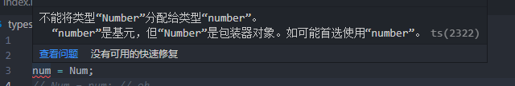

# typescript

## 1. 开始

```npm
npm i -g typescript

npm i -g ts-node

// 依赖运行包
npm i -g tslib @types/node

// 创建
tsc --init

```

```js
npm install -g nodemon

```

## 2. 基本数据类型（基本类型注解）

```typescript
// 基本数据类型
let str: string = 'sen';
let num: number = 24;
let bool: boolean =false;
let u: undefined = undefined;
let n: null = null;
let obj: object = {x:1}
let big: bigint = 100n
let sym: symbol = Symbol('me')

```

+ 可以发现类型都是**小写**

+ 默认情况下`null`和`undefined`是所有类型的子类型。所以即使有类型限制，但实际开发中没有判断`undefined`和`null`的情况，因为`tsconfig.jsoon`指定了`"strictNullChecks": true`；所以`null`和`undefined`只能赋值给`void`和各自类型
+ `number`和`bigint`都表示数字，但是不兼容（ts 2322错误）

## 3. Array

```js
// 定义数组的方式
// 1. 两种方式
let arr: string[] = ['1', '2']
let arr2: Array<string> = ['1', '2']

// 2. 定义联合类型数组

// 表示数组内容可以存放string 和 number
let arr3:(number | string)[]
arr3 = [1, 'b']

// 定义指定对象成员数组
interface Arrobj {
    name: string,
    age: number
}

let arr4: Arrobj[] = [{name:'sen', age: 18}]

```

+ `[]`前面的类型表示限制的内容具体类型

## 4. 函数

```js
// 1. 函数声明
// 设置参数为number，返回值为number
function sum(x:number, y: number):number {
    return x + y
}

// 2. 函数表达式
// 可以对传入函数参数，返回值进行类型限制
let mySum:(x:number, y:number) => number
mySum = function(x:number, y: number): number {
    return x + y
}

// 3. 用接口定义函数类型
interface SearchFunc {
    (source: string, subSrring: string): boolean
}

// 4. 可选参数
// 使用?表示可选
function buildName(firstName: string, lastName?: string) {
    if(lastName) {
        return firstName + '' + lastName;
    } else {
        return firstName;
    }
}

let tomcat = buildName('Tom', 'Cat')
let tom = buildName("Tom")

// 5. 使用参数默认值
function buildName2(firstName: string, lastName: string = 'cat') {
    return firstName + '' + lastName
}
let tomcat2 = buildName2('Tom', 'Cat')
let tom2 = buildName2('Tom')

// 6. 剩余参数
function push(array: any[], ...items: any[]) {
    items.forEach(function(item) {
        array.push(item);
    });
}
let a = []
push(a, 1, 2 ,3)

```

### 1. 函数重载

+ 函数重载：函数名一样，允许根据不同类型的输入，返回不同类型的结果

```js
// 例子
function add(x, y) {
    return x + y
}

add(1, 2) // 3
add('1', '2') // '12'
// 根据不同的类型的参数来调用同一个函数，该函数会根据不同的参数而返回不同的类型的调用结果。

```

+ 在ts中使用函数重载（方法重载）
  + 函数重载是使用相同名称喝不同参数数量或类型创建多个方法的一种能力。
  + ts中给一个函数定义多个函数类型来进行函数重载，编译器会根据这个列表判断喝处理函数的调用

```js
// 重构上面的add
// 1. 在ts中我们不希望参数隐式具有any类型
tyep Combinadble = string | number

function add(a:Combinable, b:Combinable) {
    if(typeof a === 'string' || typeof b === 'string') {
        return a.toString() + b.toString()
    }
    return a + b
}
const result = add('1', '2')
result.split('') // 由于存在返回值可能是number的情况，number是没有split的方法

// 再重构，编译器会根据情况选择对应的函数方法，虽然名字一样，但是会做判断，然后选择对应内容执行。
type Types = number | string
function add(a:number,b:number):number;
function add(a: string, b: string): string;
function add(a: string, b: number): string;
function add(a: number, b: string): string;
function add(a:Types, b:Types) {
  if (typeof a === 'string' || typeof b === 'string') {
    return a.toString() + b.toString();
  }
  return a + b;
}
const result = add('Semlinker', ' Kakuqo');
result.split(' ');

```

## 5. Tuple（元组）

+ 数组一般保存的是用类型的值
+ 元组保存的不同类型的值
  + 元组的特性可以限制**数组元素的个数和类型**。可以用来实现多值返回
  + 元组就是一个一直元素熟练和每一个元素类型的数组
  + 如果你都不确定就用`any[]`
  + 元组可以通过下标的方式解构赋值
  + 在类型后面加多一个`?`表示可选。（函数可选参数，写在参数后面）
  + 可以使用剩余元素

```typescript
// 1. 定义元组，要求个数为2，第一个必须是string，第二个是number
let x: [string, number]

x = ['sen', 18]
x = [18, 'sen'] // 第一个应string，第二个number
x = ['sen', 18, 18] // 只允许两个

// 2. 元组支持解构
let temp:[number, string]=[18, 'sen']
// 按顺序解构，不能超过元组的元素个数
let [id, myname] = temp
console.log(id, myname)

// 3. 可选元素
// 在类型的后面加?
let optionalTuple: [string, boolean?]
optionalTuple=['sen', true]
optionalTuple=['kobe']

// 4. 拓展，可以用元组表示三维坐标系和二维坐标系，没有传z就是二维

// 5. 使用剩余元素，格式...X 
// X表示的就是数组类型
// 剩余元素表示元素是开发的,可以有0至多个额外元素
type RestTupleType = [number, ...string[]]

// 6. 只读元组
// 在类型前面加上readonly,表示只读
// 针对的是元素,如果你直接修改整个数组没有报错,因为数组不是只读,里面的元素才是只读
let point:readonly [number, number]
point = [1, 1]
console.log(point)
// 对整个数组修改只是改变了引用,对元素没有任何操作
point = [2, 2]
console.log(point)

// 警告,因为元素只读
point[1] = 3

```

## 6. void

+ void表示没有任何类型（或没有返回值），和其他类型是平等关系，不能直接赋值
  + 虽然定义void表示没有返回值，但是结果得到的就是undefined。但是不能将`void`替换成`undefined`
+ 但是`strictNullChecks`为`false`，可以赋值`null`和`undefined`

```typescript
function fun(): undefined {
  console.log("this is TypeScript");
};
fun(); // Error

```

## 7. never

+ 表示那些不存在的值的类型
  + 异常
  + 死循环

+ never和null、undefined一样，没有子类型，且一般可以赋值给任何类型
+ `never`可以赋值给`nver`类型，但是any不行

```typescript
// 1. 异常
function err(msg: string): never {
    throw new Error(msg)
}

// 2. 死循环
function loopForever(): never {
    while (true) { }
}

// 3. never赋值
let a: never
let b: never
let c: any

a = 1 //Error
a = b //ok
a = c // error
a = (() => { throw new Error("异常"); })(); // OK
a = (() => { while (true) { } })(); // OK

```

+ never可以用于保证我们写类型更安全的代码

```js
type Foo = string | number;

function controlFlowAnalysisWithNever(foo: Foo) {
  if (typeof foo === "string") {
    // 这里 foo 被收窄为 string 类型
  } else if (typeof foo === "number") {
    // 这里 foo 被收窄为 number 类型
  } else {
    // foo 在这里是 never
    const check: never = foo;
  }
}

// 假如后来有人修改
type Foo = string | number | boolean;
// 最后never得到boolean的时候会警告我们需要完全遍历其他类型
```

## 8. any

+ TypeScript中任何类型都可以被归为any类型。
+ any类型则允许被赋值为任意类型。
+ any类型任何属性都是允许被访问，允许调用任何办法。
+ **变量如果在声明的时候，未指定其类型，那么它会被识别为任意值类型**

## 9. unknown

+ unknown与any一样，所有类型可以分配给unknown；
+ 任何类型的值可以赋值给`any`，同时`any`类型的值也可以赋值给任何类型。`unknown` 任何类型的值都可以赋值给它，但它只能赋值给`unknown`和`any`

```typescript
// unkonwn赋值给any
let notSure: unknown = 4;
let uncertain: any = notSure; // OK

// any赋值给unknown
let notSure1: any = 4;
let uncertain1: unknown = notSure; // OK
let foo:number = notSure1 // unknown不可以赋值给其他类型

// any可以赋值给任何类型
let notSure2: any = 4;
let bar: string = notSure2

console.log(bar);

```

## 10. 大小写

+ 原始类型number、string、symbol有对应的包装器对象Number、Boolean、Symbol类型（暂时称之为对象类型）。
+ 但是包装器对象不能赋值给对应数据类型



## 11. object、Object和{}

+ 小写`object`表示所有非原始类型，即number、string、symbol不能赋值给object类型。严格模式下`null`和`undefined`类型也不能赋值给oject。
+ 大写`Object`代表所有拥有`toString`、`hasOwnProperty`方法的类型，所以所有基本原始类型、非原始类型都可以赋值给`Object`。严格模式下，`null`和`undefined`类型不能赋值Object

+ 可以看出`Object`是`obejct`的父类型，同时也是`object`的子类型。
+ 官网文档说小object可以替代Object，但是两者并不等价,因为基本类型不能赋值`object`.`Obejct`更宽泛。

+ `{}`和`Object`都表示原始类型的集合，在严格模式下`null`和`undefined`类型不能赋值`{}`

```typescript
type a = object extends Object ? true : false; // true
type b = Object extends object ? true : false; // true

```

## 12. 类型推断

+ 会根据初始化值进行推断类型
+ 根据参数类型推断返回类型
+ 没有初始化就推断成any

## 13. 类型断言

+ ts是静态类型，所以往往对运行时的逻辑无能为力，就会出现一个警告。
+ 类型断言：仅作用在类型层面的强制类型转换

```typescript
// 1. 使用<>类型断言
let value: any = "sen";
// <类型>转换类型的变量
let strLength: number = (<string>value).length;

// 2. as
// 变量 as 转换的类型
let strLength1: number = (value as string).length;

```

## 14. 非空断言

+ 使用`!`用于断言操作对象是非`null`和`undefined`类型
+ 格式`x!`。

```typescript
let a: null | undefined | string;
// a.toString() // Error
a!.toString() // ok

```

## 15. 确定赋值断言

```js
let a: number;
let b:number = a

// 编译过程后出现错误，因为ts希望我们初始化值之后，变量才被使用
```

```typescript
let x: number;
// 初始化x
initialize();

// 由于初始化是在运行阶段才能，静态编译阶段就报错了
// Variable 'x' is used before being assigned.(2454)
console.log(2 * x); // Error
function initialize() {
  x = 10;
}

// 但是实际上我们在使用x前，我们已经初始化了
// 在实例属性或者定义变量声明的时候使用!表示明确后续会被赋值。 避免这种错误
// 格式x！
// 这样子x就会明确它后续会被赋值
let x! : number

```

## 16. 字面量类型

+ 字面量不仅可以表示值，还可以表示类型，即所谓的字面量类型。
+ TS支持3种字面量类型：字符串字面量类型、数字字面量类型、布尔字面量类型，对应的字符串字面量、数字字面量、布尔字面量分别拥有与其值一样的字面量类型。（意思是值必须和字面量一样才能被赋值）

```typescript
let a: "sen" = "sen";
// a = 'xu' // error
let b: 1 = 1;
let c: true = true;

let d: string;
// a本事也是string类型。但是d是string类型，但是不一定内容等价于a的字面量类型
d = a;

```

## 17. 字符串、数字、布尔类型字面量类型

+ 定义字符串字面量类型作为变量的类型，作用不大，但更多的时候用于联合类型。这样可以限制参数或变量为指定的具体的字符串。增加可读性保证类型。

## 18. let const

```typescript
// 因为我们cosnt是不可变的，所以推断类型为字面量类型'sen'
const str = 'sen' // str: 'sen'

// 因为let定义的变量是可变的，所以ts会对赋值的字面量类型进行一个类型拓宽推断为父类型string
let str2 = 'sen' // str: srting

```

## 19. 类型拓宽（Type Widening）

```typescript
// 1. 
// str根据内容推断类型至少是'sen',然后再字面量类型类型拓宽为其父类型string
let str = 'sen'

// 函数参数
// 如果有默认参数，会根据类型推断比如
function foo (str = 'sen'):string {
    return str
}
// 因为有默认值，所以是可选类型，并且参数是可改变的，所以进行类型拓宽
// str推断为str ?: string | undefined

```

```typescript
// 因为const是常量，所以不会再改变，所以推断基本类型的时候，没有进行类型拓宽
// 结果str:'sen'
const str = 'sen'

// 由于let定义的变量是可以被改变的，所以可以被类型拓宽
let str2 = str

```

+ 如果我们想要限制类型拓宽，就要使用显示注解

```typescript
const a:'sen' = 'sen'
// 即使使用了let定义，但是a明确为'sen'，所以b推断也为明确的类型'sen'
let b = a  // b:'sen'

// 区别
const a = 'sen'
const b = a // b:string

```

+ `null`和`undefined`的类型进行拓宽，通过`let`、`var`定义的类型如果满足未显示声明类型注解且被赋予`null`或`undefined`值，则推断为类型是`any`
  + 严格模式下，null和undefined不会拓宽成`any`

```typescript
let x = null // 类型 x:any
let y = undefined // 类型 y:any

const z = null // 类型 z:null

let anyFun = (param = null) => param // 形参 param:any

```

案例分析

```typescript
// 创建用于获取坐标的值的函数
interface Vector3 {
  x: number;
  y: number;
  z: number;
}

function getComponent(vector: Vector3, axis: "x" | "y" | "z") {
  return vector[axis];
}

// 使用
let x = "x";
let vec = { x: 10, y: 20, z: 30 };
// 因为定义x使用let，所以类型推断出为string，类型“string”的参数不能赋给字面量类型“"x" | "y" | "z"”的参数。所以报错
getComponent(vec, x); // Error

// 升级
const x = 'x'
let vec = {x: 10, y:20, z:30}
getComponent(vec, x);


```

```typescript
// 在没有更多的上下文的情况下，ts往往对类型推断会存在不明确
const arr = ['x', 1]

// 类型推断的可能性
arr: ('x' | 1)[]
	 ['x', 1]
	 [string, number]
	 readonly [string, number]
	 (string | number)[]
	 readonly (string | number)[]
	 [any, any]
	 any[]

```

+ 使用const定义对象的时候

```js
// js代码
const obj1 = { 
  x: 1,
}; 

obj1.x = 6; 
obj1.x = '6';

obj1.y = 8;
obj1.name = 'semlinker';

// 修改obj1的x是不会报错的

```

```typescript
// ts代码
// 我们使用const定义obj1的时候，推断类型为{readonly x:1},甚至{x: number}，{[key:string]:number}或者object类型等，然后类型拓宽算法会视obj内部的属性为let声明的变量，最终推断obj1:{x:number}。
const obj = { 
  x: 1,
};

obj.x = 6; // OK 


// Type '"6"' is not assignable to type 'number'.
obj.x = '6'; // Error

// Property 'y' does not exist on type '{ x: number; }'.
obj.y = 8; // Error

// Property 'name' does not exist on type '{ x: number; }'.
obj.name = 'semlinker'; // Error

```

+ TypeScript 试图在具体性和灵活性之间取得平衡。它需要推断一个足够具体的类型来捕获错误，但又不能推断出错误的类型。它通过属性的初始化值来推断属性的类型，当然有几种方法可以覆盖 TypeScript 的默认行为。一种是提供显式类型注释：

```typescript
const obj: {x:1 | 3 | 5} = {
    x : 1
}

```

+ 另一种方法是使用 const 断言。不要将其与 let 和 const 混淆，后者在值空间中引入符号。这是一个纯粹的类型级构造。让我们来看看以下变量的不同推断类型：

```typescript
// Type is { x: number; y: number; }
const obj1 = { 
  x: 1, 
  y: 2 
}; 

// Type is { x: 1; y: number; }
const obj2 = {
  x: 1 as const,
  y: 2,
}; 

// Type is { readonly x: 1; readonly y: 2; }
const obj3 = {
  x: 1, 
  y: 2 
} as const;

```

+ 当你在一个值之后使用 const 断言时，TypeScript 将为它推断出最窄的类型，没有拓宽。对于真正的常量，这通常是你想要的。当然你也可以对数组使用 const 断言：

```typescript
// Type is number[]
const arr1 = [1,2,3]

// Type is readonly [1,2,3]
const arr2 = [1,2,3] as const 

```

## 20. 类型缩小（Type Narrowing）

+ 变量的类型由一个宽泛的集合缩小到相对较小、明确的集合--类型缩小

```typescript
// ts会根据上下文进行更精确的类型推断

// 案例一：
{
  let func = (anything: any) => {
    if (typeof anything === 'string') {
      return anything; // 类型是 string 
    } else if (typeof anything === 'number') {
      return anything; // 类型是 number
    }
    return null;
  };
}

// 案例二：
// 我们也可以通过字面量类型等值判断（===）或其他控制流语句（包括但不限于 if、三目运算符、switch 分支）将联合类型收敛为更具体的类型，如下代码所示：
{
  type Goods = 'pen' | 'pencil' |'ruler';
  const getPenCost = (item: 'pen') => 2;
  const getPencilCost = (item: 'pencil') => 4;
  const getRulerCost = (item: 'ruler') => 6;
  const getCost = (item: Goods) =>  {
    if (item === 'pen') {
      return getPenCost(item); // item => 'pen'
    } else if (item === 'pencil') {
      return getPencilCost(item); // item => 'pencil'
    } else {
      return getRulerCost(item); // item => 'ruler'
    }
  }
}

// ts擅长根据上下文进行推断类型，但是也会存在错误
// 1. 中type null 结果为"object
const el = document.getElementById("foo"); // Type is HTMLElement | null
if (typeof el === "object") {
  el; // Type is HTMLElement | null
}

// 2. 空字符串和0也会被认为是false
function foo(x?: number | string | null) {
  if (!x) {
    x; // Type is string | number | null | undefined\
  }
}

```

+ 缩小的方法

```typescript
// ”标签联合“(”可辨识联合“)在它们上放置一个明确的 “标签”：
interface UploadEvent {
  type: "upload";
  filename: string;
  contents: string;
}

interface DownloadEvent {
  type: "download";
  filename: string;
}

type AppEvent = UploadEvent | DownloadEvent;

function handleEvent(e: AppEvent) {
  switch (e.type) {
    case "download":
      e; // Type is DownloadEvent 
      break;
    case "upload":
      e; // Type is UploadEvent 
      break;
  }
}

```

## 21. 联合类型

+ 联合类型表示取值可以为多种类型中的一种，使用 `|` 分隔每个类型。
  + 平时可以指定字面量类型，约束取值为其中一个

## 22. 交叉类型

+ 交叉类型是将多个类型合并为一个类型。这让我们可以把现有的多种类型叠加到一起成为一种新类型，它包含了所需的所有类型的特性，使用`&`定义交叉类型。

```typescript
type Useless = string & number;
let c: Useless  // 推断 c: never

// 能够同时满足string和number类型是不存在的，所以我们把原始类型、字面量类型、函数类型等原子类型合并成交叉类型是没有任何用处的。所以最终不存在的类型，只能归类为never

```

+ 交叉类型真正的用武之地就是将多个接口类型合并成一个类型，从而实现等同接口继承的效果，也就是所谓的合并接口类型，如下代码所示：

```typescript
type IntersectionType = { id: number; name: string; } & { age: number };
const mixed: IntersectionType = {
  id: 1,
  name: 'name',
  age: 18
}

// mixed此时的类型为{ id: number; name: string; age: number; }
// 少一个属性也不行。
```

+ 问题：如果联合的多个接口类型存在同名属性会怎么样？

```typescript
  type IntersectionTypeConfict = { id: number; name: string; } 
  & { age: number; name: number; };
  const mixedConflict: IntersectionTypeConfict = {
    id: 1,
    name: 2, // ts(2322) 错误，'number' 类型不能赋给 'never' 类型
    age: 2
  };

// 如果同名属性的类型不兼容，比如上面示例中两个接口类型同名的 name 属性类型一个是 number，另一个是 string，合并后，name 属性的类型就是 number 和 string 两个原子类型的交叉类型，即 never

```

```typescript
  type IntersectionTypeConfict = { id: number; name: 2; } 
  & { age: number; name: number; };

  let mixedConflict: IntersectionTypeConfict = {
    id: 1,
    name: 2, // ok
    age: 2
  };
  mixedConflict = {
    id: 1,
    name: 22, // '22' 类型不能赋给 '2' 类型
    age: 2
  };
//如一个是 number，另一个是 number 的子类型、数字字面量类型，合并后 name 属性的类型就是两者中的子类型。

```

+ 那么如果同名属性是非基本数据类型的话

```typescript
interface A {
  x:{d:true},
}
interface B {
  x:{e:string},
}
interface C {
  x:{f:number},
}
type ABC = A & B & C
let abc:ABC = {
  x:{
    d:true,
    e:'',
    f:666
  }
}

// 说明相同成员的不同内容合并一起
```

## 23. 接口（interfaces）

+ 在面向对象语言中，接口（Interfaces）是一个很重要的概念，它是对行为的抽象，而具体如何行动需要由类（classes）去实现（implement）。
+ TypeScript 中的接口是一个非常灵活的概念，除了可用于[对类的一部分行为进行抽象]以外，也常用于对「对象的形状（Shape）」进行描述。
  + 约束定义的变量必须和接口保持一致。
    + 定义的变量比接口少一些多一些属性是不允许的
  + 接口一般首字母大写。

```typescript
interface Person {
    name: string;
    age: number;
}

let tom: Person = {
    name: 'Tom',
    age: 25
};

// 约束了 tom 的形状必须和接口 Person 一致。
```

### 1. 可读 | 只读属性

+ 只读属性用于限制只能在对象刚刚创建的时候修改其值。
  + TypeScript 还提供了 `ReadonlyArray<T>` 类型，它与 `Array<T>` 相似，只是把所有可变方法去掉了，因此可以确保数组创建后再也不能被修改。

```typescript
interface Person {
  readonly name: string;
  age?: number;
}

let person: Person = {
  name:'sen'
}

person.name = 'a' //无法分配到 "name" ，因为它是只读属性。ts(2540)

```

```typescript
let a: number[] = [1, 2, 3, 4];
let ro: ReadonlyArray<number> = a;
ro[0] = 12; // error!
ro.push(5); // error!
ro.length = 100; // error!
a = ro; // error!

```

## 2. 任意属性

+ 可以使用**索引签名**表示还可以运行其他的任意属性
  + **一旦定义了任意属性，那么确定属性和可选属性的类型都必须是它的类型的子集**
  + 一个接口只能定义一个任意属性。如果接口中有多个类型的属性，则可以再任意属性中使用联合类型。

```typescript
interface Person {
  // 必选类型
  name: string;
  // 可选类型
  age?: number;
  // 任意类型
  [propName: string]: any;
}

let tom: Person = {
  name: 'Tom',
  gender: 'male'
};

let tom2: Person = {
  name: 'Tom'
  // 任意类型也可以不定义，类似可选类型
};

```

```typescript
interface Person {
  name: string;
  age?: number;  // 类型“number”的属性“age”不能赋给“string”索引类型“string”。ts(2411)
  [propName: string]: string;
}

let tom: Person = {
  name: 'Tom',
  age: 25,
  gender: 'male'
};

// index.ts(3,5): error TS2411: Property 'age' of type 'number' is not assignable to string index type 'string'.
// index.ts(7,5): error TS2322: Type '{ [x: string]: string | number; name: string; age: number; gender: string; }' is not assignable to type 'Person'.
//   Index signatures are incompatible.
//     Type 'string | number' is not assignable to type 'string'.
//       Type 'number' is not assignable to type 'string'.


// 规定可选类型和必选类型必须是任意类型的子集
// 任意类型的属性是string，但是可选属性的类型是number，number不是string的子属性，所以报错

```

```typescript
interface Person {
  name: string;
  age?: number; // 这里真实的类型应该为：number | undefined,undefined是原始类型的子类型
  [propName: string]: string | number | undefined;
}

let tom: Person = {
  name: 'Tom',
  age: 25,
  gender: 'male'
};

```

## 3. 鸭子辨型法

```typescript
interface labeledObj {
  key:string
}

let a:labeledObj = {
  key: 'key',
  value: 1
}

// 不能将类型“{ key: string; value: number; }”分配给类型“labeledObj”。
// 对象文字可以只指定已知属性，并且“value”不在类型“labeledObj”中。ts(2322)


// 总结：我们定义的变量的内容必须严格按照接口类型

```

+ 那么鸭子类型是怎么回事？

``` typescript
interface labeledObj {
  key:string
}

let sen = {
  key:'sen',
  value: 1
}

let a:labeledObj = sen

console.log(a)

// 不难发现我们sen的类型为{key: string; value: number }、
// 并将该类型赋值给了类型为labeledObj的a
// 显然sen的内容是不符labeledObj的接口类型要求的，

```


```typescript
interface LabeledValue {
  label: string;
}
function printLabel(labeledObj: LabeledValue) {
  console.log(labeledObj.label);
}
let myObj = { size: 10, label: "Size 10 Object" };


printLabel(myObj); // OK


printLabel({ size: 10, label: "Size 10 Object" }); // Error

```

+ 定义的`myObj`显然不符合我们接口`LabeledValue`，但是当你作为参数传入`labeledObj`


笔记链接

```http
https://juejin.cn/post/7018805943710253086
```

联系题目-未作

```http
https://github.com/semlinker/awesome-typescript/issues
```


https://juejin.cn/post/6876240277208563720


https://juejin.cn/post/7066745410194243597

https://juejin.cn/post/6870843175146258445#heading-3

https://juejin.cn/post/6844903892979810312

https://juejin.cn/post/6844903775203753991

https://juejin.cn/post/7036689189567463432

https://juejin.cn/post/6876240277208563720

https://juejin.cn/post/7073272212077150238

https://juejin.cn/post/6844903999074729997

https://juejin.cn/post/7031787942691471396

https://juejin.cn/post/7077536309804859428

https://juejin.cn/post/6844903863791648782

https://juejin.cn/post/6871752423577223176

https://juejin.cn/post/6961012856573657095

https://juejin.cn/post/6844903619188391950

https://juejin.cn/post/6926794697553739784

https://juejin.cn/post/7012496703488000037

https://juejin.cn/post/6952696734078369828

https://juejin.cn/post/7095547569777934367

https://juejin.cn/post/7064351631072526350

https://juejin.cn/post/6844904184894980104

https://juejin.cn/post/6905539198107942919

https://juejin.cn/post/7066964816107143198

https://juejin.cn/post/6994102811218673700

https://juejin.cn/post/6844904144235413512

https://juejin.cn/post/6999280101556748295

https://juejin.cn/post/6844903693226082318

https://juejin.cn/post/6844903896637259784

https://juejin.cn/post/6844904111603744776

https://juejin.cn/post/7026947170683076621

https://juejin.cn/post/7068081327857205261

https://juejin.cn/post/7088304364078497800

https://juejin.cn/post/6999504062634819615

https://juejin.cn/post/6987997506768470052

https://juejin.cn/post/6989868554644357127

https://juejin.cn/post/6970841540776329224

https://juejin.cn/post/6844903849166110728

https://juejin.cn/post/6872111128135073806

https://juejin.cn/post/6844904034302705671

https://juejin.cn/post/6844903848553742350

https://juejin.cn/post/6844903796997357582

https://juejin.cn/post/6952696734078369828