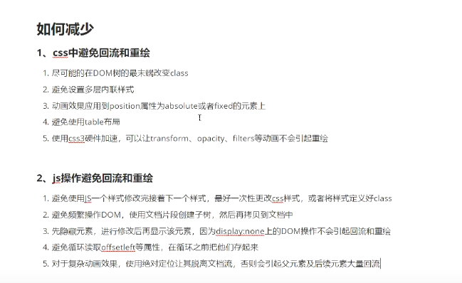

|               | 服务器传递  | 数据有效期     | 路径的概念              | 作用域           | 大小   |
| ------------- | ------ | --------- | ------------------ | ------------- | ---- |
| cookie        | 来回传递   | 可以设置数据有效期 | 可以限制cookie只属于某个路径下 | 同源窗口中都是共享     | 4kb  |
| localStorage  | 仅在本地保存 | 长期保存      | 无                  | 同源窗口中都是共享的    |      |
| seeionStorage | 仅在本地保存 | 关闭后失效     | 无                  | 不在不同的浏览器窗口中共享 |      |

为什么使用cookie？

因为HTTP是无状态协议，

## 1. map和forEach的区别

map返回新值

forEach修改原来的数组

## 2. 什么是面向对象

面向对象就是对显示世界理解和抽象的方法，是一种编程思想。

