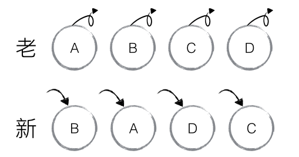
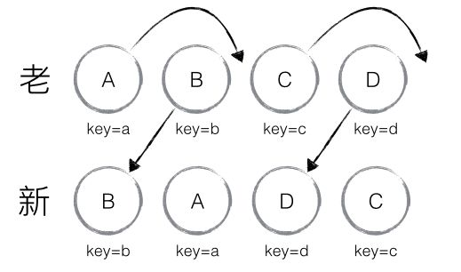

## 1. react hook的使用

https://juejin.cn/post/6864438643727433741

## 2. 如何理解fiber

https://zhuanlan.zhihu.com/p/26027085

https://zhuanlan.zhihu.com/p/443469229

## 3. react diff

+ tree diff：DOM节点夸层级的操作不做优化，（react进行对DOM tree的同层比较），针对DOM tree层级的策略
  + react认为DOM节点跨层级的移动操作少到可以忽略不计
  + 在这个策略下只进行添加和删除操作

+ component diff：对于同一个类的组件，会生成相似的树形结构，对于不同类的组件，生成不同的树形结构，这是针对conponent层级的策略；
  + 在这个策略下只进行添加和删除操作
  + 可以通过`shouldComponentUpdata()`
+ element diff：对于同一级的子节点，拥有同层唯一的key值，来做删除、插入、移动的操作，这是针对element层级的策略；
  + 提供了三种节点操作：**INSERT_MARKUP**（插入）、**MOVE_EXISTING**（移动）和 **REMOVE_NODE**（删除）。
    + **INSERT_MARKUP**，新的 component 类型不在老集合里， 即是全新的节点，需要对新节点执行插入操作。
    + **MOVE_EXISTING**，在老集合有新 component 类型，且 element 是可更新的类型，generateComponentChildren 已调用 receiveComponent，这种情况下 prevChild=nextChild，就需要做移动操作，可以复用以前的 DOM 节点。
    + **REMOVE_NODE**，老 component 类型，在新集合里也有，但对应的 element 不同则不能直接复用和更新，需要执行删除操作，或者老 component 不在新集合里的，也需要执行删除操作。

例子：不带key

+ 对比节点的时候：B != A,删除B，添加A，以此类推

例子：带key

+ 通过key发现新老集合中的节点位置，此时React给出diff结果B D不做任何挫折（新的节点在老节点原来位置前面不移动），A C移动。
  + 首先对新老节点循环遍历，通过唯一的key可以判断新老集合是否存在相同的节点：
  + 相同节点进行移动操作的时候，比较index，如果新节点比老节点靠前，则不移动，否则不执行该操作。
  + 

## 4. ts

+ 默认情况下 `null` 和 `undefined` 是所有类型的子类型。 就是说你可以把 `null` 和 `undefined` 赋值给其他类型。
  + 如果你在tsconfig.json指定了`"strictNullChecks":true` ，`null` 和 `undefined` 只能赋值给 `void` 和它们各自的类型。
+ 然`number`和`bigint`都表示数字，但是这两个类型不兼容。

https://juejin.cn/post/7018805943710253086#heading-15

## 1. 还没看

https://www.wenjiangs.com/doc/ym0tcejf

https://juejin.cn/post/6864438643727433741#heading-4

https://juejin.cn/post/6844903516826255373

https://juejin.cn/search?query=localStrorge%E5%92%8Ccookie

https://segmentfault.com/a/1190000002723469

https://xiaochen1024.com/courseware/60b1b2f6cf10a4003b634718/60b1b581cf10a4003b63472c

https://www.jianshu.com/p/4b165fecf157

https://blog.csdn.net/weixin_40482816/article/details/114140909

https://blog.csdn.net/wangyucui123/article/details/81038840?spm=1001.2101.3001.6661.1&utm_medium=distribute.pc_relevant_t0.none-task-blog-2%7Edefault%7ECTRLIST%7Edefault-1.pc_relevant_default&depth_1-utm_source=distribute.pc_relevant_t0.none-task-blog-2%7Edefault%7ECTRLIST%7Edefault-1.pc_relevant_default&utm_relevant_index=1